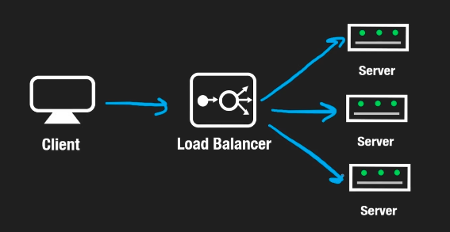
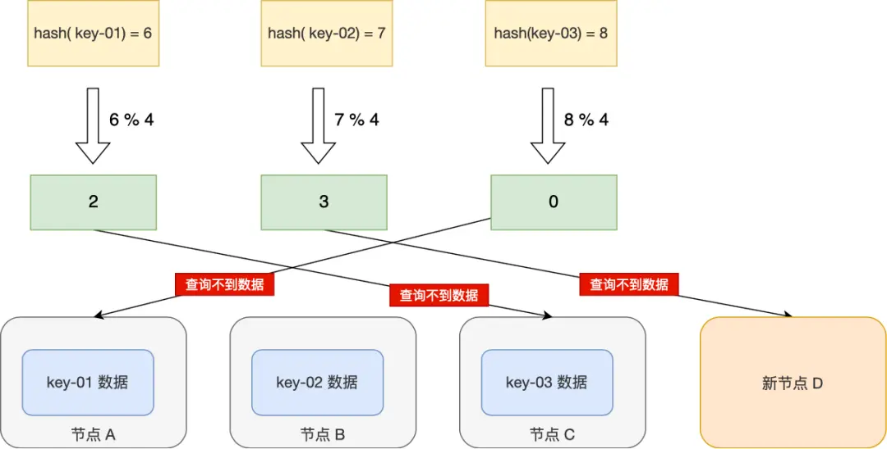
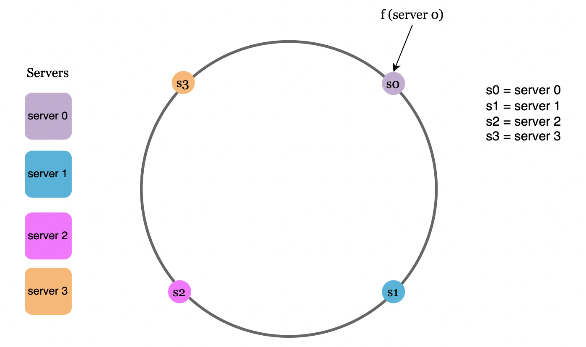
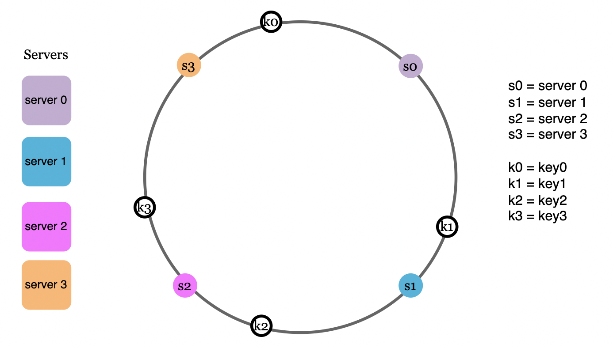
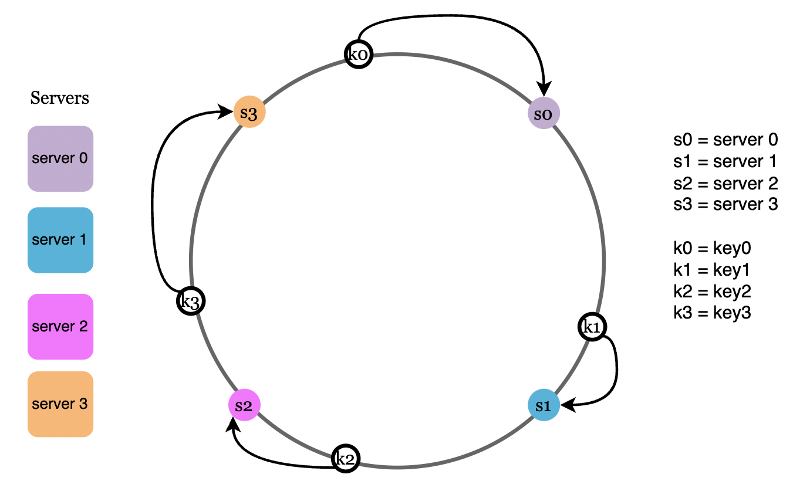
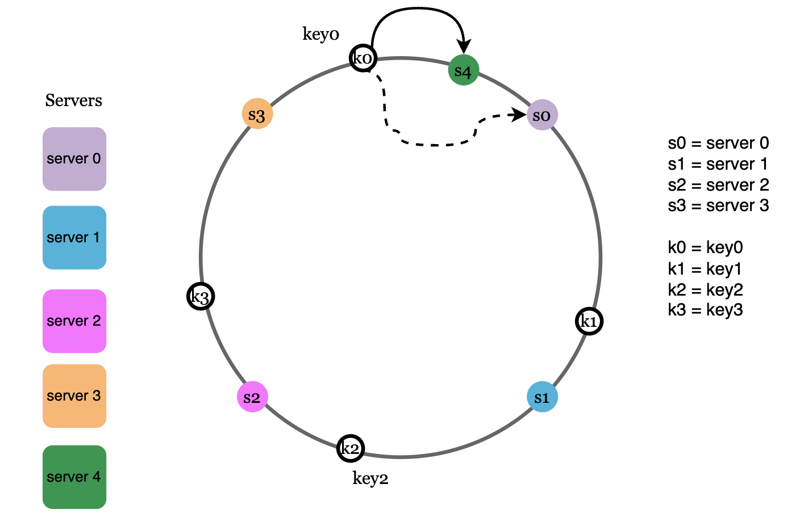
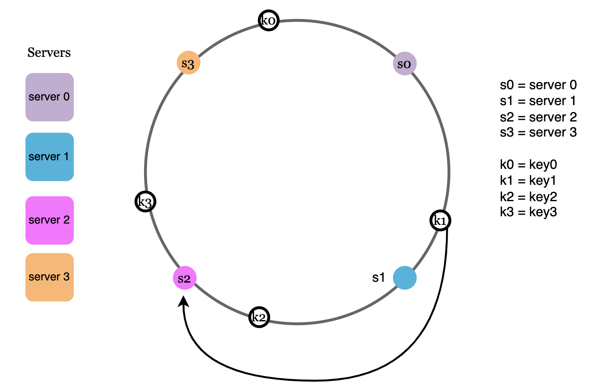
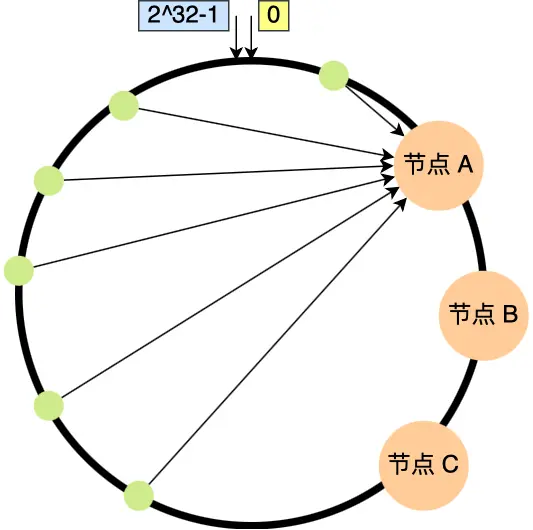
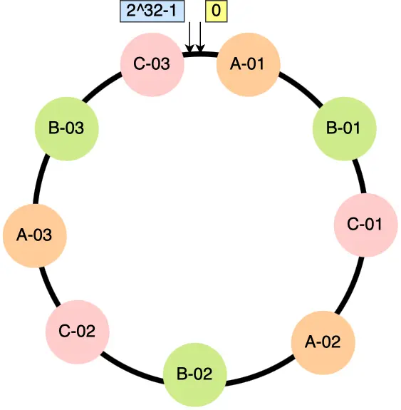

# 14. 一致性哈希

**一致性哈希(Consistent Hashing)** 是一种分布式算法，主要用于解决节点数量变化（如扩容或缩容）时的高效负载均衡问题，同时尽量减少数据迁移。它广泛应用于分布式存储系统（如 HDFS、Amazon Dynamo）、分布式缓存（如 Redis 集群）、负载均衡系统以及其他需要动态扩展的分布式架构场景。

## 负载均衡算法

在介绍一致性哈希之前，我们首先需要了解其背景及其所解决的问题。

在实际的分布式系统中，单台服务器的性能往往无法满足业务需求，因此通常采用多台服务器组成集群以对外提供服务。在这种架构下，如何高效地分配客户端请求至不同节点成为一个重要的问题。

这一问题本质上属于“负载均衡问题”。为解决这一问题，业界提出了多种负载均衡算法，不同算法对应不同的分配策略和业务场景。

例如，最简单的方式是通过**轮询**策略将外界的请求依次转发至各节点。例如，若集群包含三个节点，且有三个请求到达，则每个节点分别处理一个请求，从而实现请求分配。

对于硬件配置存在差异的节点，可以引入**加权轮询**算法，通过设置权重值，使硬件性能更高的节点承担更多请求。这种方式适用于所有节点存储数据完全相同的场景，因为无论访问哪个节点，都能获得所需数据。

然而，在分布式系统中，由于数据通常是水平切分的，各节点存储的数据各不相同，此时上述算法不再适用。为了确保请求能够被路由至正确的节点，我们需要设计一种能够映射数据到特定节点的负载均衡算法。

## 哈希算法

哈希算法是一种常见的选择，因为同一关键字经过哈希运算后总是生成相同的值，因此能够将特定数据映射至唯一节点。例如，使用公式 `hash(key) % N`，其中 `N` 为节点数，可以确定某个 `key` 应该存储到哪个节点。

假设我们有一个包含 A、B、C 三个节点的分布式 KV 缓存系统。通过 `hash(key) % 3` 公式，可以将 key-01、key-02 和 key-03 分别映射到节点 A、B 和 C。如：

|        | key | hash(key) % 3 |
| :----: | :-: | :-----------: |
| key-01 |  6  |       0       |
| key-02 |  7  |       1       |
| key-03 |  8  |       2       |

这种方法可以使请求均匀分布到所有服务器。然而，当有新服务器加入或现有服务器移除时，上述公式的结果会发生很大变化，导致大量请求被重新分配到不同的服务器。

例如服务器从 3 个扩容到 4 个，取模运算中的基数发生改变，从而导致数据的大规模迁移。如下图所示，key-01 从节点 A 转移到节点 C，可能造成部分查询无法返回正确结果。

|        | key | hash(key) % 4 |
| :----: | :-: | :-----------: |
| key-01 |  6  |       2       |
| key-02 |  7  |       3       |
| key-03 |  8  |       0       |

在最坏情况下，所有数据都需要重新映射至新的节点，迁移规模可达 `O(M)`，其中 `M` 是数据总量。这种高昂的迁移成本使得简单的哈希算法难以满足分布式系统对动态扩容和缩容的需求。

## 一致性哈希的基本思想

为了解决这个问题，一致性哈希应运而生。它在 1997 年由麻省理工学院的 Karger 等人在论文 _"Consistent Hashing and Random Trees: Distributed Caching Protocols for Relieving Hot Spots on the World Wide Web"_ 中首次提出。

一致性哈希的核心思想是：固定哈希值的范围为 `2^32`，将哈希算法的所有可能键空间可视化为一个首尾相连的环，称为**哈希环**（Hash Ring）。

一致性哈希算法包括以下 3 步：

1. **节点映射**

通过相同的哈希函数，我们可以基于服务器的 IP 地址或名称，将服务器映射到哈希环上：

2. **数据映射**

类似地，客户端请求的哈希值也会映射到哈希环上的某个位置：

3. **确定服务器**

要确定某个请求由哪个服务器处理，我们从请求的哈希值出发，沿顺时针方向找到第一个服务器的哈希值：
要确定某个数据存放在哪个服务器上，数据将按顺时针方向定位到第一个大于或等于其哈希值的节点。例如，节点 k0 按顺时针方向映射至节点 s0。

### 添加服务器

当添加新服务器时，通过该方法，只有一部分请求会重新分配到新的服务器。

如图中，当新增节点 s4 时，只有顺时针方向上第一个节点 k0 的数据需要从 s0 搬移到 s4 ，而其他节点的数据映射关系保持不变。

### 移除服务器

同样地，当移除某个服务器时，也只有一部分请求会被重新分配到其他服务器。

如图中，当移除节点 s1 时，只有节点 k1 的数据需要从 s1 搬移到 s2 ，而其他节点的数据映射关系保持不变。

通过这种方式，一致性哈希算法显著降低了扩容或缩容时的数据迁移量。

## 虚拟节点的引入

- 问题 1：使用基本方法，哈希分区可能在服务器之间分布不均；
- 问题 2：由于哈希分区不均，可能导致请求负载也分布不均；

例如，若节点 A、B 和 C 的位置集中在哈希环的一侧，则大量请求会集中到节点 A。

为了解决上述问题，我们可以在哈希环上为每台服务器映射多个虚拟节点（Virtual Nodes），从而为每台服务器分配多个分区：

具体而言，每个真实节点对应多个虚拟节点，这些虚拟节点分布在哈希环上，并将虚拟节点映射到实际节点。例如，为每个真实节点生成 3 个虚拟节点：

- A-01、A-02、A-03 对应节点 A；
- B-01、B-02、B-03 对应节点 B；
- C-01、C-02、C-03 对应节点 C。

引入虚拟节点后，原本哈希环上只有 3 个节点的情况，就会变成有 9 个虚拟节点映射到哈希环上，哈希环上的节点数量多了 3 倍。这时候，如果有访问请求寻址到「A-01」这个虚拟节点，接着再通过「A-01」虚拟节点找到真实节点 A，这样请求就能访问到真实节点 A 了。

通过虚拟节点的引入，节点在哈希环上的分布更加均匀，大大提高了系统的负载均衡能力。

虚拟节点的数量越多，请求的分布越均匀。

实验表明，创建 100-200 个虚拟节点时，标准偏差可以控制在 5-10% 的范围内。

此外，虚拟节点还提升了系统的稳定性。例如，当节点 A 被移除时，对应的虚拟节点被顺时针相邻的多个节点分担，避免了单点压力骤增。

## 一致性哈希的优势

- 在重新平衡（Rebalancing）时，只有极少数的键需要重新分配。
- 数据均匀分布，易于水平扩展。
- 热点问题得到缓解，例如对于名人相关数据的频繁访问，由于数据的均匀分布，负载不会集中到单一服务器。

## 一致性哈希的实际应用

以下是一些一致性哈希的真实案例：

- **Amazon DynamoDB** 的分区组件
- **Cassandra** 的数据分区
- **Discord** 的聊天应用程序
- **Akamai CDN**
- **Maglev** 网络负载均衡器

## 总结

一致性哈希算法通过构建哈希环，实现了存储节点和数据的映射，相比传统哈希算法，其在节点扩容或缩容时的数据迁移量大大减少。然而，原始算法可能存在节点分布不均的问题，通过引入虚拟节点，不仅解决了负载不均问题，还增强了系统的稳定性，使其成为适用于动态分布式系统的理想负载均衡算法。
