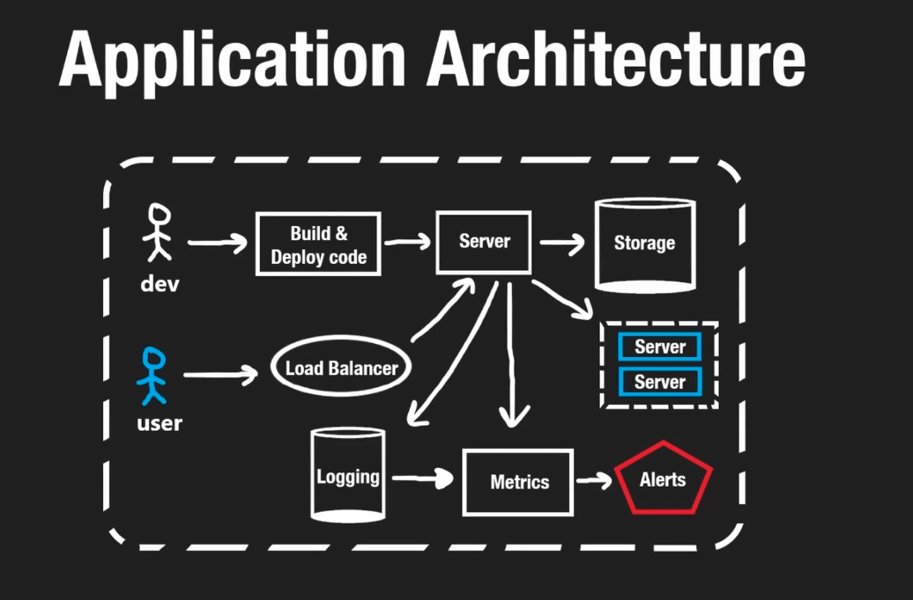

# 2. 应用程序架构

在本文中，我们将高层次地概述一个生产级应用程序的架构。这将为后续内容打下基础，帮助我们深入了解每个组件的细节。

在生产环境中的应用程序架构中，各种组件协同工作以创建一个健壮的系统。虽然这里我们会对这些组件进行简单介绍，但在后续章节中，我们将详细探讨每个组件。

---

## 从开发者的视角

从开发者的视角出发，可以更容易理解应用程序架构。开发者编写代码后将其**部署**到一个**服务器**上。这里我们暂且定义**服务器**为处理来自其他计算机请求的计算机。服务器需要**持久性存储**来保存应用程序的数据。尽管服务器可能内置存储设备，但其存储容量通常有限，因此服务器会通过**网络**与外部存储系统（例如数据库或云存储）进行通信。

---

## 从用户的视角

用户通常是通过网页浏览器发出请求的人。在这种情况下，网页浏览器就是向服务器发出请求的**客户端**。

当用户希望使用一个前端功能时，服务器会响应所需的 JavaScript/HTML/CSS 代码，这些代码会被编译并展示给用户。但是，如果用户数量激增，单一服务器可能无法同时处理所有请求。这时，瓶颈可能会出现在服务器的 RAM 或 CPU 上。为了在处理多个用户请求时保持性能，我们需要对服务器进行扩展。

---

## 扩展服务器

为了处理更多请求，一个简单的方法是增加服务器的 RAM 或升级拥有更多核心和更高频率的 CPU。然而，每台计算机的升级都是有限度的。对同一台计算机进行升级被称为**垂直扩展**（vertical scaling）。

另一种方法是部署多台服务器运行同一套代码，并将用户请求分配到这些服务器中。这样，所有用户不会同时访问一台服务器，保证每台服务器的响应速度。同时，如果某台服务器宕机，我们可以将流量引导至其他服务器。这种方法被称为**水平扩展**（horizontal scaling）。

通常，在大型系统中我们更倾向于水平扩展，因为它更强大，并且可以使用普通硬件（价格相对便宜的标准硬件）实现。然而，水平扩展也需要更多的工程设计，因为我们需要确保服务器之间能够相互通信，并且用户请求能够均匀分配。

对于简单的应用程序而言，垂直扩展可能足够且实现更容易。例如，亚马逊 Prime Video 的某些服务就从微服务架构迁移回了单体架构【[来源](https://www.primevideotech.com/video-streaming/scaling-up-the-prime-video-audio-video-monitoring-service-and-reducing-costs-by-90)】。

> 但如果有多台服务器，如何决定用户的请求分配给哪台服务器呢？这就需要**负载均衡器**（load balancer）。负载均衡器会将传入的请求均匀分配到一组服务器中。

此外，还需要注意，服务器通常并非孤立存在。它们很可能通过 API 与外部服务器交互。例如，`google.com` 网站通过 API 与 Stripe 等服务进行通信。

---

## 日志与指标

服务器通常有**日志服务**，用于记录所有活动。这些日志可以写入到同一台服务器，但为了提高可靠性，日志通常会写到另一台外部服务器。

日志为开发者提供了请求执行情况的记录，例如是否有错误发生，或服务器崩溃前发生了什么。但是，日志无法提供完整的系统信息。例如，如果 RAM 成为了服务器的瓶颈，或者 CPU 资源限制了请求的处理效率，我们需要一个**指标服务**（metrics service）。指标服务会从服务器环境中的不同来源收集数据，例如 CPU 使用率、网络流量等，帮助开发者了解服务器行为并识别潜在瓶颈。

---

## 警报（Alerts）

作为开发者，我们并不希望一直检查指标是否有异常行为。这类似于每隔几分钟检查一次手机是否有新通知。更理想的方法是收到推送通知。当某个指标未达到预期目标时，可以设置警报以通知开发者。例如，如果 100% 的用户请求都成功响应，我们可以设置一个警报，当成功率下降到 95% 时收到通知。

---

上述内容是一个初步介绍，而应用程序架构的内容远不止于此。例如，这些组件是如何相互通信的？它们需要遵守什么协议？这些协议是否有优化的可能？这些组件很可能分布在不同的计算机上，因此需要通过网络进行交互。我们将在后续章节中详细讨论这些问题。
