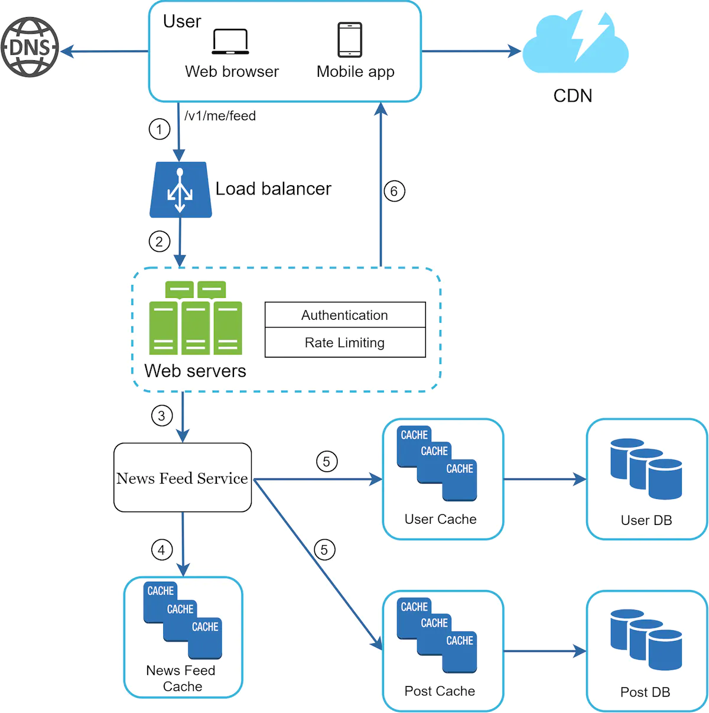

# 1. 系统设计面试框架

系统设计面试常常让人感到压力山大。

当别人花费数十年时间才设计出一个流行的系统时，你怎么可能在短短一小时内设计出一个？

- 面试的重点在于问题解决的过程，而非你最终给出的解决方案。
- 目标是展示你的设计能力，捍卫你的选择，并能建设性地回应反馈。

系统设计面试的真正目的是什么？

- 它不仅仅是为了评估一个人的技术设计能力。
- 它还涉及到评估协作能力、在压力下工作的能力、处理模糊问题的能力以及提问的技巧。
- 识别潜在的“红旗”——如过度设计、狭隘思维、固执等。

## 高效系统设计面试的四个步骤

尽管每场面试都可能有所不同，但任何系统设计面试都应涵盖以下几个步骤。

### 第一步：理解问题并明确设计范围

在充分理解问题之前，切勿急于给出答案。
实际上，这可能是一个“红旗”信号——在没有彻底理解需求的情况下给出的回答。

避免急于提出解决方案。通过提问来澄清需求和假设。

作为工程师，我们有时会有一种冲动，想要直接解决一个难题，但这往往会导致错误的系统设计。

在获取了答案（或被要求自己做出假设）后，将这些信息写在白板上，以免遗忘。

要问哪些问题？——目的是准确理解需求。以下是一些示例问题：

- 我们需要设计哪些具体的功能？
- 产品的用户数量是多少？
- 公司预计在未来 3、6 或 12 个月内的扩展规模如何？
- 公司的技术栈是什么？是否可以利用现有服务来简化设计？

例如，假设你需要设计一个新闻推送功能。以下是一个示例对话：

- 候选人：是针对移动端、网页端，还是两者都要设计？
- 面试官：两者都要。
- 候选人：最重要的功能是什么？
- 面试官：能够发布帖子并查看朋友的新闻推送。
- 候选人：推送是如何排序的？是按时间顺序排序，还是基于例如来自亲近朋友的帖子的权重？
- 面试官：为了简化设计，假设帖子按时间顺序排序。
- 候选人：每个用户最多有多少个朋友？
- 面试官：5000 个。
- 候选人：流量有多大？
- 面试官：每天 1000 万活跃用户（DAU）。
- 候选人：推送中包含媒体文件吗？比如图片或视频？
- 面试官：可以包含媒体文件，包括视频和图片。

### 第二步：提出高层设计并获得认可

此步骤的目标是提出一个高层设计，并与面试官进行协作。

- 提出蓝图并寻求反馈。许多优秀的面试官会让候选人参与设计过程。
- 在白板上绘制出关键组件——客户端、API、Web 服务器、数据存储、缓存、CDN、消息队列等。
- 进行粗略的估算，评估蓝图是否符合规模要求。如果需要进行这类估算，务必提前与面试官确认。

你可以通过一些具体的用例来进一步完善设计，这有助于揭示一些潜在的边界情况。

是否需要包含 API 架构和数据库设计？这取决于问题。对于大规模系统，可能这些细节会显得过于基础。
与面试官沟通，明确该如何处理。

例如——设计新闻推送功能。

高层功能：

- 推送发布——用户创建帖子并将其写入缓存/数据库，然后该帖子会出现在其他新闻推送中。
- 新闻推送构建——新闻推送通过按时间顺序聚合朋友的帖子来构建。

示例图 - 推送发布：

示例图 - 新闻推送构建：

### 第三步：深入设计

到目前为止，你应该已经达成了以下目标：

- 达成对整体目标和功能的共识；
- 草拟了高层设计蓝图；
- 收到了关于高层设计的反馈；
- 确定了需要深入研究的具体领域。

在这个阶段，你应该与面试官一起确定最应该关注哪些组件。

可能需要深入探讨的内容包括：

- 高层设计；
- 系统性能特性；
- 在大多数情况下，深入了解某些系统组件的细节。

可以深入研究的细节包括：

- 对于 URL 缩短器——哈希函数，如何将长 URL 转换为短 URL；
- 对于聊天系统——减少延迟并支持在线/离线状态。

时间管理非常重要——不要过度关注那些无法展示你设计能力的细节。例如，过多讨论 Facebook 的 EdgeRank 算法就无法展现你的设计技能。

深度探讨设计示例 - 推送发布：

深度探讨设计示例 - 新闻推送构建：

### 第四步：总结

此时，面试官可能会提出后续问题，或者给你自由讨论任何你想讨论的内容。

可以遵循以下几个方向：

- 识别系统瓶颈并讨论改进方法。没有设计是完美的，总有可以改进的地方。
- 回顾你的设计。
- 故障模式——例如服务器故障、网络丢失等。
- 操作问题——如监控、警报和系统部署。
- 为支持下一个扩展规模，可能需要做出哪些改变？例如从 100 万用户扩展到 1000 万用户。
- 提出其他优化建议。

应做的：

- 请求澄清，切勿假设自己的假设是正确的；
- 理解问题的需求；
- 没有“标准”或“完美”的答案。小公司和大公司的解决方案有所不同；
- 向面试官阐明你的思考过程；
- 提出多种方案；
- 达成蓝图共识后，优先设计最关键的组件；
- 与面试官分享你的想法，他们应与你合作。

不应做的：

- 对常见面试问题没有准备；
- 没有充分理解需求便匆忙提出解决方案；
- 刚开始时不要在单一组件上过度深入，先从高层设计开始；
- 如果卡住了，可以请求提示；
- 沟通，而不是默默思考。

### 各步骤的时间分配

45 分钟的时间并不足以详细覆盖每个设计细节。

以下是各步骤的大致时间分配：

- 理解问题并明确设计范围——3-10 分钟；
- 提出高层设计并获得认可——10-15 分钟；
- 深入设计——10-25 分钟；
- 总结——3-5 分钟
