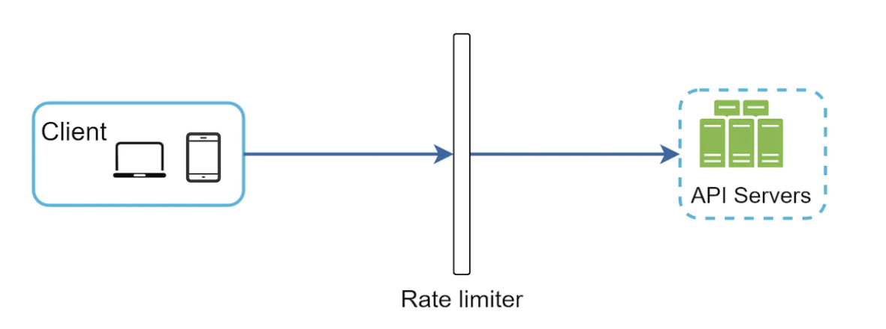
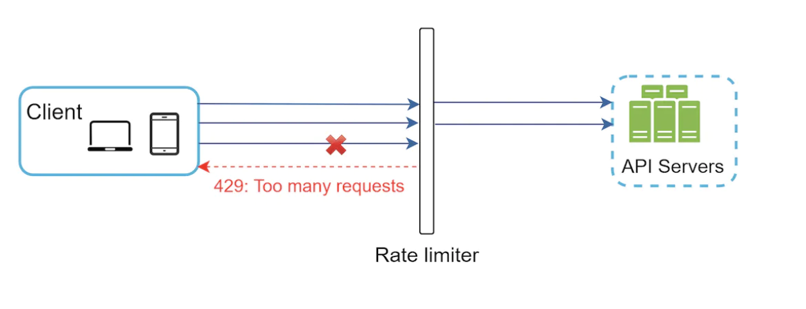
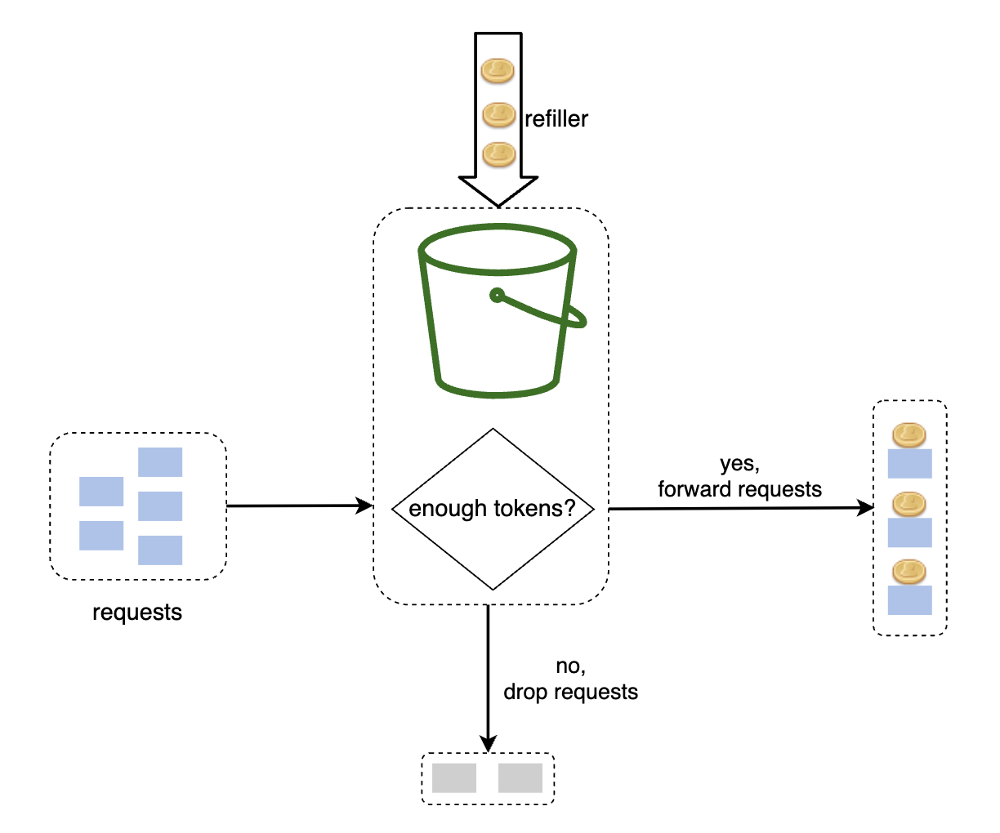
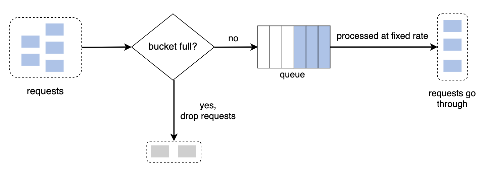
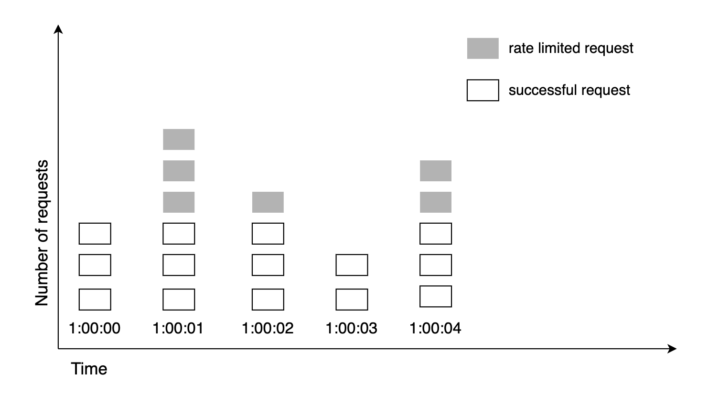
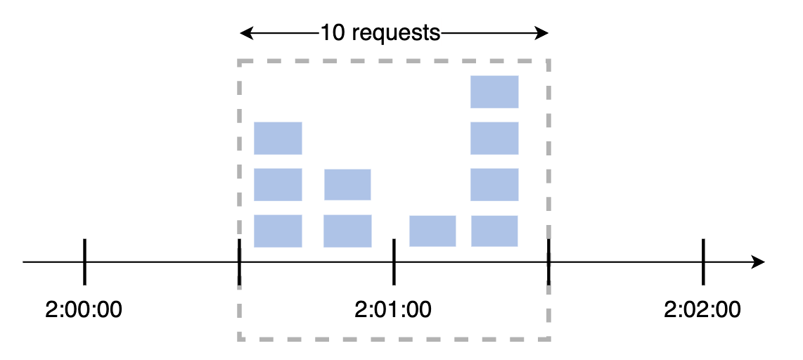
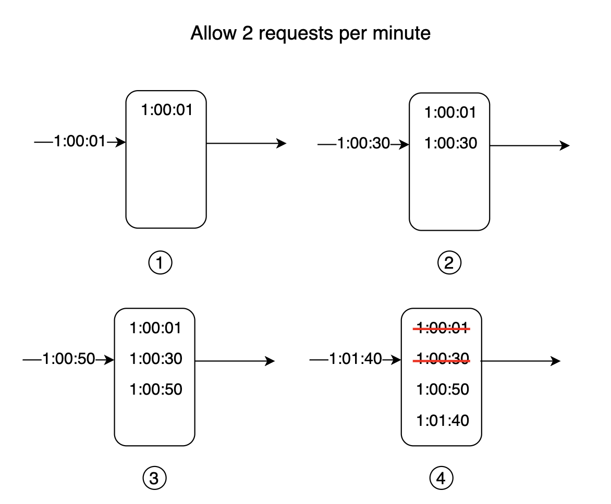
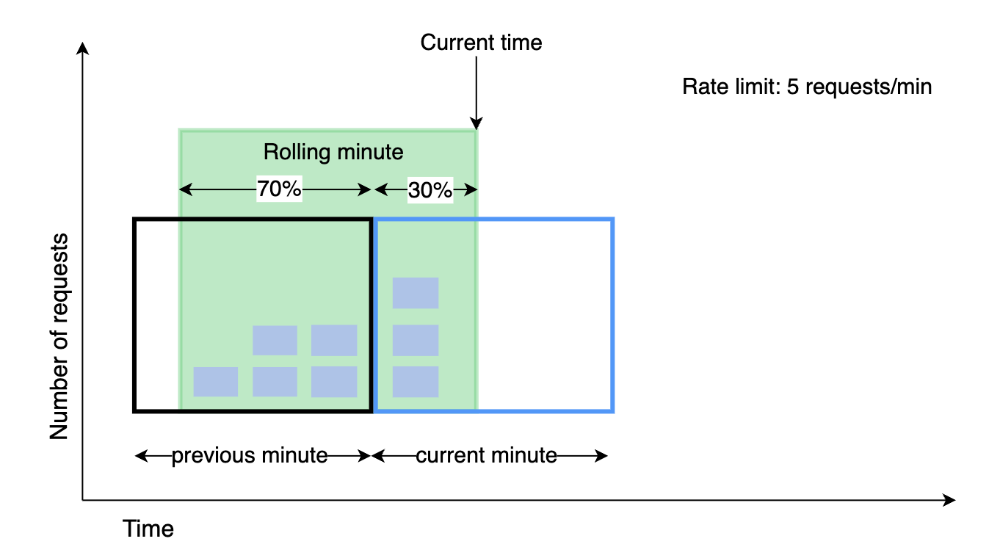
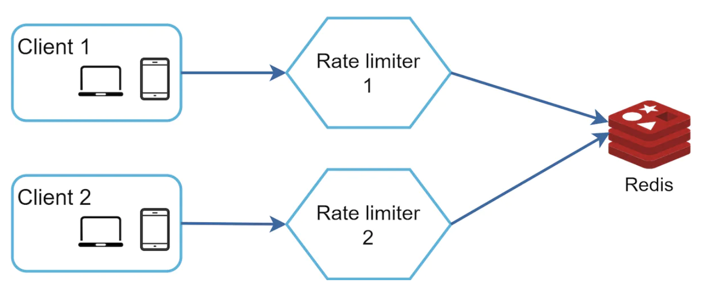

# 4. 设计速率限制器

在分布式系统中，速率限制器的目的是控制客户端发送到给定服务器的流量速率。

它控制在指定时间段内允许的最大请求次数。如果请求数量超过阈值，额外的请求将被速率限制器丢弃。

示例：

- 用户每秒最多可以发布 2 条帖子。
- 同一 IP 每天最多可以创建 10 个账户。
- 每周最多可以领取 10 次奖励。

几乎所有的 API 都有某种速率限制 —— 例如，Twitter 每 3 小时最多允许发布 300 条推文。

使用速率限制器的好处是什么？

- 防止拒绝服务攻击（DoS）。
- 降低成本 —— 为低优先级的 API 分配更少的服务器资源。此外，可能会有下游依赖按调用次数收费，例如支付、检索健康记录等。
- 防止服务器过载。

## 第一步：理解问题并明确设计范围

实现速率限制器的方法有很多，每种方法都有其优缺点。

示例：候选人和面试官的对话：

- **候选人**: 我们要设计哪种类型的速率限制器？客户端还是服务器端？
- **面试官**: 服务器端。
- **候选人**: 速率限制器是基于 IP、用户 ID 还是其他方式来限制 API 请求的？
- **面试官**: 系统应该足够灵活，支持不同的限流规则。
- **候选人**: 系统的规模有多大？是初创公司还是大公司？
- **面试官**: 它应该能够处理大量的请求。
- **候选人**: 系统会在分布式环境中工作吗？
- **面试官**: 是的。
- **候选人**: 它应该是一个独立的服务还是一个库？
- **面试官**: 由你决定。
- **候选人**: 我们需要通知被限制的用户吗？
- **面试官**: 是的。

需求总结：

- 精确地限制超出请求
- 低延迟且尽可能少的内存占用
- 分布式速率限制
- 异常处理
- 高容错性 —— 如果缓存服务器宕机，速率限制器仍应继续运行。

## 第二步：提出高层设计并获得认可

为了简单起见，我们采用一个简单的客户端-服务器模型。

### 速率限制器放在哪里？

它可以在客户端、服务器端或作为中间件实现。

客户端端 —— 不可靠，因为客户端请求很容易被恶意用户伪造。我们也可能无法控制客户端的实现。

服务器端：


作为客户端与服务器之间的中间件：



其工作原理，假设每秒允许 2 次请求：



在云微服务中，速率限制通常在 API 网关中实现。
该服务支持速率限制、SSL 终止、身份验证、IP 白名单、静态内容服务等。

那么，速率限制器应该在哪实现？在服务器端还是 API 网关中？

这取决于几个因素：

- 当前技术栈 —— 如果你在服务器端实现，那么你的编程语言应该足够支持这一功能。
- 如果在服务器端实现，你可以控制速率限制算法。
- 如果你已经有了 API 网关，那么也可以在其中添加速率限制器。
- 自建速率限制器需要时间。如果你没有足够的资源，可以考虑使用现成的第三方解决方案。

### 速率限制算法

速率限制有多种算法，每种算法都有其优缺点。

一些常见的算法：令牌桶（Token Bucket）、漏桶（Leaking Bucket）、固定窗口计数器（Fixed Window Counter）、滑动窗口日志（Sliding Window Log）、滑动窗口计数器（Sliding Window Counter）。

### 令牌桶算法

简单、易理解，且被许多知名公司广泛使用。亚马逊和 Stripe 就使用该算法对其 API 进行限流。


其工作原理如下：

- 有一个容量预定义的容器
- 令牌按周期放入桶中
- 桶满时，不再放入令牌
- 每个请求消耗一个令牌
- 如果没有令牌，请求将被丢弃



该算法有两个参数：

- 桶大小 —— 桶中允许的最大令牌数
- 令牌放入速率 —— 每秒放入桶中的令牌数量

我们需要多少个桶？—— 这取决于需求：

- 如果需要支持每秒 3 条推文、每秒 5 条帖子等，可能需要为不同的 API 端点配置不同的桶。
- 如果需要支持基于 IP 的限流，可能需要为每个 IP 配置不同的桶。
- 如果需要全局设置每秒最多 10k 次请求，则可以使用单一全局桶。

优点：

- 实现简单
- 内存效率高
- 速率限制仅在持续高流量时启动。如果桶大小较大，只要流量短暂激增，算法也能有效支持。

缺点：

- 参数调整可能比较困难

### 漏桶算法

与令牌桶算法类似，但请求是以固定速率处理的。

其工作原理：

- 当请求到达时，系统检查队列是否已满。如果没有满，请求被添加到队列中；如果已满，请求将被丢弃。
- 请求会按固定时间间隔从队列中取出并处理。



参数：

- 桶大小 —— 即队列大小，表示有多少请求会被保留，以便按固定间隔处理。
- 流出速率 —— 每个固定间隔内处理的请求数。

Shopify 就使用漏桶算法进行速率限制。

优点：

- 内存效率高
- 按固定时间间隔处理请求。适用于需要稳定流量输出的场景。

缺点：

- 流量激增可能会填满队列，导致较早的请求被丢弃，最近的请求会受到速率限制。
- 参数调整可能比较困难。

### 固定窗口计数器算法

其工作原理：

- 时间被划分为固定的窗口，并为每个窗口设置一个计数器。
- 每个请求都会使计数器递增。
- 一旦计数器达到阈值，当前窗口内的后续请求将被丢弃。



这个方法的一个主要问题是，流量的高峰期可能会导致在边缘窗口内有更多请求通过，从而突破允许的请求次数：



优点：

- 内存效率高
- 容易理解
- 在某些用例中，时间窗口结束时重置配额适用

缺点：

- 流量激增可能导致给定时间窗口内的请求超过限额

### 滑动窗口日志算法

为了解决前面算法的问题，我们可以使用滑动时间窗口来替代固定窗口。

其工作原理：

- 算法会跟踪请求的时间戳。时间戳数据通常保存在缓存中，例如 Redis 的有序集合。
- 当请求到达时，移除过时的时间戳。
- 将新请求的时间戳添加到日志中。
- 如果日志的大小等于或小于阈值，则允许请求，否则拒绝请求。

注意，在这个例子中，第 3 个请求被拒绝，但时间戳仍然记录在日志中：



优点：

- 速率限制精度非常高

缺点：

- 内存占用非常高

### 滑动窗口计数器算法

这是一种将固定窗口算法与滑动窗口日志算法相结合的混合方法。



其工作原理：

- 为每个时间窗口维护一个计数器。每个请求到达时，计数器递增。
- 计算滑动窗口计数器 = `prev_window * prev_window_overlap + curr_window * curr_window_overlap`（如上图所示）
- 如果计数器超过阈值，则拒绝请求，否则接受请求。

优点：

- 平滑流量波动，因为速率是基于前一个时间窗口的平均速率
- 内存效率高

缺点：

- 速率限制不非常精确，因为它基于重叠部分。但实验表明，只有大约 0.003% 的请求被不准确地接受。

### 高层架构

我们将使用内存缓存，因为它比数据库更高效，适合存储速率限制桶——例如 Redis。


其工作原理：

- 客户端向速率限制中间件发送请求
- 速率限制器从相应的桶中获取计数器，并检查请求是否被允许
- 如果请求被允许，它将到达 API 服务器

## 第三步：深入设计

高层设计中未解答的问题：

- 速率限制规则如何创建？
- 如何处理被速率限制的请求？

接下来我们将探讨这些话题及其他相关问题。

### 速率限制规则

以下是 Lyft 用于每天 5 次营销消息的速率限制规则示例：


另一个示例，设置每分钟最大登录尝试次数：


此类规则通常写在配置文件中并保存在磁盘上。

### 超过速率限制

当请求被速率限制时，返回 429（请求过多）错误代码。

在某些情况下，被速率限制的请求可以被排队，以便稍后处理。

我们还可以包含一些额外的 HTTP 头部，为客户端提供更多的元数据：

```
X-Ratelimit-Remaining: 当前时间窗口内允许的剩余请求次数。
X-Ratelimit-Limit: 客户端在每个时间窗口内可以发送的最大请求次数。
X-Ratelimit-Retry-After: 客户端需要等待多少秒才能在不受限的情况下再次发起请求。
```

### 详细设计


- 规则保存在磁盘上，工作进程会定期将它们加载到内存缓存中。
- 速率限制中间件拦截客户端请求。
- 中间件从缓存中加载规则，同时从 Redis 缓存中获取计数器。
- 如果请求被允许，它将继续传递到 API 服务器。如果不允许，则返回 429 HTTP 状态代码。然后，请求要么被丢弃，要么被排队。

### 分布式环境中的速率限制器

我们如何在多个服务器中扩展速率限制？

需要考虑几个挑战：

- 竞争条件
- 同步

在竞争条件的情况下，当多个实例修改计数器时，可能无法正确更新计数器：


锁是解决此问题的常见方法，但代价较高。
另外，我们可以使用 Lua 脚本或 Redis 有序集合来解决竞争条件。

如果我们在应用程序内存中维护用户信息，那么速率限制器是有状态的，并且我们需要使用粘性会话，以确保来自同一用户的请求由同一个速率限制器实例处理。


为了解决这个问题，我们可以使用集中式数据存储（例如 Redis），这样速率限制器实例就是无状态的。



### 性能优化

作为速率限制器的性能优化，我们可以采取以下两项措施：

- 多数据中心架构 —— 使得用户与地理位置较近的实例交互。
- 使用最终一致性作为同步模型，避免过度锁定。

### 监控

速率限制器部署后，我们需要监控其效果。

为此，我们需要跟踪：

- 速率限制算法是否有效
- 速率限制规则是否有效

如果丢弃了太多请求，我们可能需要调整一些规则或算法参数。

## 第四步：总结

我们讨论了几种速率限制算法：

- 令牌桶 —— 适合支持流量突发。
- 漏桶 —— 适合确保向下游服务传输稳定的请求流。
- 固定窗口 —— 适合处理时间被明确划分的特定用例。
- 滑动窗口日志 —— 适合在内存占用较高的情况下实现高精度速率限制。
- 滑动窗口计数器 —— 适合在不需要 100% 精度的情况下，实现低内存占用的速率限制。

如果时间允许，可以讨论以下额外话题：

- 硬性 vs. 软性速率限制：
  - 硬性：请求不能超过指定的阈值；
  - 软性：请求可以在限定时间内超过阈值。
- 在不同层次进行速率限制：
  - L7（应用层）
  - L3（网络层）
- 客户端侧措施以避免被速率限制：
  - 客户端缓存以避免过多的调用；
  - 理解限制，避免在短时间内发送过多请求；
  - 优雅地处理因被速率限制而产生的异常；
  - 添加足够的退避和重试逻辑。
