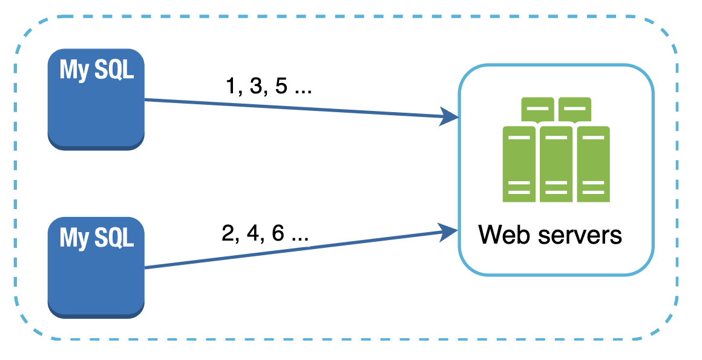

# 7. 设计分布式唯一 ID 生成器

我们需要设计一个兼容分布式系统的唯一 ID 生成器。

使用具有 `auto_increment` 的主键在此场景下不可行，因为在多个数据库服务器之间生成 ID 会导致高延迟。

## 第一步：理解问题并明确设计范围

- **候选人**：唯一 ID 应该具备哪些特性？  
  **面试官**：需要唯一且可排序。
- **候选人**：每条记录的 ID 是否递增 1？  
  **面试官**：ID 按时间递增，但不一定按 1 递增。
- **候选人**：ID 是否仅包含数字？  
  **面试官**：是。
- **候选人**：对 ID 的长度有什么要求？  
  **面试官**：64 字节。
- **候选人**：系统规模如何？  
  **面试官**：需要每秒生成 10,000 个 ID。

## 第二步：提出高层设计并获得认可

我们将考虑以下选项：

- 多主复制
- 全球唯一标识符（UUID）
- Ticket Server
- Twitter 的 Snowflake 方法

### 多主复制



这种方法利用数据库的 `auto_increment` 功能，但步长为 K，其中 K 是服务器的数量。

虽然这种方式解决了可扩展性问题（ID 生成限制在单个服务器内），但引入了其他挑战：

- 难以扩展到多个数据中心。
- 跨服务器的 ID 无法按时间递增。
- 添加或移除服务器会破坏此机制。

### UUID

UUID 是一个 128 字节的唯一标识符。

全球范围内发生 UUID 冲突的概率极低。

示例 UUID：`09c93e62-50b4-468d-bf8a-c07e1040bfb2`

**优点**：

- 可以在多个服务器上独立生成，无需同步或协调。
- 易于扩展。

**缺点**：

- ID 长度为 128 字节，不满足我们的要求。
- ID 不随时间递增。
- ID 可能包含非数字字符。

### Ticket Server

Ticket Server 是一个用于在多个服务之间生成唯一主键的集中式服务器：


**优点**：

- 生成的 ID 是数值类型。
- 实现简单，适用于中小型应用。

**缺点**：

- 存在单点故障风险。
- 需要额外的网络调用，增加延迟。

### Twitter 的 Snowflake 方法

Twitter 的 Snowflake 符合我们的设计需求，因为它按时间排序、为 64 字节，并且可以在每个服务器中独立生成。


各部分的详细结构：

- **符号位**（Sign bit）：占 1 位，始终为 0，保留以供未来使用。
- **时间戳**（Timestamp）：占 41 位，表示自纪元时间（或自定义纪元时间）以来的毫秒数，最大支持 69 年。
- **数据中心 ID**（Datacenter ID）：占 5 位，最多支持 32 个数据中心。
- **机器 ID**（Machine ID）：占 5 位，最多支持每个数据中心 32 台机器。
- **序列号**（Sequence Number）：占 12 位，每生成一个 ID，序列号递增。每毫秒重置为 0。

## 第三步：深入设计

我们将使用 Twitter 的 Snowflake 算法，因为它最符合我们的需求。

数据中心 ID 和机器 ID 在启动时确定，其他部分在运行时生成。

### 系统架构

一个分布式唯一 ID 生成器的系统架构可以设计如下：

1. **逻辑结构**

   - **生成器层**：分布在不同数据中心和机器上的 ID 生成器实例，基于 Twitter 的 Snowflake 算法运行。
   - **协调层**：用于管理生成器实例的初始化（例如分配数据中心和机器 ID）。
   - **持久化层**（可选）：记录已生成的 ID 或用作日志审计。

2. **物理架构**
   - **多数据中心部署**：使用多个数据中心，每个中心运行独立的生成器节点。
   - **负载均衡**：通过 DNS 或负载均衡器将请求分发到各生成器节点。
   - **容错机制**：每个数据中心包含备用节点，某台机器故障后，其他机器自动接管其工作。

### 扩展性（Scalability）

1. **水平扩展**：

   - Snowflake 的设计允许通过增加数据中心或机器节点轻松扩展。每个数据中心最多支持 32 台机器，序列号支持每毫秒生成 4096 个 ID。
   - 如果需要更高并发，可以调整字段长度。例如，将数据中心 ID 和机器 ID 位数减少，从而增加序列号的范围。

2. **性能优化**：
   - **批量生成**：对于每次请求生成多个 ID 的需求，可以采用批处理策略，在一个网络请求中生成并返回多个 ID。
   - **缓存**：在机器内部缓存时间戳等常用数据，减少重复计算。

### 高可用性（High Availability）

1. **去中心化架构**：

   - Snowflake 的独立运行特性消除了中心化依赖，避免单点故障。

2. **时钟同步机制**：

   - 使用网络时间协议（NTP）定期校准机器时钟，确保不同机器的时间一致。
   - 若时钟偏移发生，生成器可触发“回退序列”策略或暂停服务，避免重复生成 ID。

3. **容灾机制**：

   - 在每个数据中心设置冗余节点，启用主备切换。
   - 数据中心之间配置跨区域同步，通过健康检查快速切换到备用数据中心。

4. **监控与报警**：
   - 实时监控生成器的健康状态（如时钟偏移、资源利用率、生成速度等）。
   - 配置报警系统，一旦发现故障（例如 ID 重复或生成速度下降），及时响应。

### 技术细节和扩展

1. **ID 格式的自定义**：

   - 对于某些业务场景，可以增加业务标识符（如用户类型或区域 ID），并将其编码到生成的 ID 中。
   - 例如，可以将 Snowflake 的结构调整为：`业务标识符（4 位）+ 时间戳（40 位）+ 数据中心 ID（5 位）+ 机器 ID（5 位）+ 序列号（10 位）`。

2. **存储与查询优化**：

   - 尽管 ID 生成不需要直接存储，审计或日志分析场景可能需要记录生成的 ID。可使用分布式存储系统（如 Cassandra 或 Elasticsearch）高效存储和查询。

3. **数据隔离与安全性**：
   - 对生成的 ID 加密或签名，防止恶意用户推测或篡改生成逻辑。

### 具体最佳实践

以下是一个简单的 Snowflake 算法实现，使用 Python 编写：

```python
import time
import threading

class Snowflake:
    def __init__(self, machine_id):
        """
        初始化 Snowflake ID 生成器。
        参数：
        - machine_id: 当前机器的唯一标识符（假定为 0-31 范围内的整数）
        """
        self.epoch = 1609459200000  # 自定义纪元时间（2021-01-01 00:00:00 UTC）
        self.machine_id = machine_id  # 分配给当前机器的唯一 ID，占用 5 位（最多支持 32 台机器）
        self.sequence = 0  # 毫秒内的序列号，占用 12 位（每毫秒最多生成 4096 个 ID）
        self.last_timestamp = -1  # 记录上次生成 ID 的时间戳，用于判断是否同一毫秒
        self.lock = threading.Lock()  # 确保多线程环境下的线程安全

    def _get_timestamp(self):
        """
        获取当前时间戳（以毫秒为单位）。
        返回：
        - 当前时间戳（整数）
        """
        return int(time.time() * 1000)

    def _wait_next_millisecond(self, last_timestamp):
        """
        等待到下一毫秒，确保时间戳递增。
        参数：
        - last_timestamp: 上次生成 ID 时的时间戳
        返回：
        - 新的时间戳
        """
        timestamp = self._get_timestamp()
        while timestamp <= last_timestamp:  # 若当前时间未超过上次时间，则等待
            timestamp = self._get_timestamp()
        return timestamp

    def get_next_id(self):
        """
        生成下一个唯一 ID。
        返回：
        - 64 位整数 ID
        """
        with self.lock:  # 加锁，确保线程安全
            timestamp = self._get_timestamp()  # 获取当前时间戳

            if timestamp < self.last_timestamp:
                # 若发现时钟回拨，使用上次的时间戳，继续生成序列号，避免生成重复 ID
                timestamp = self.last_timestamp

            if timestamp == self.last_timestamp:
                # 同一毫秒内，自增序列号
                self.sequence = (self.sequence + 1) & 0xFFF  # 0xFFF = 4095，用于限制序列号最大值
                if self.sequence == 0:
                    # 如果序列号溢出（达到 4096），等待到下一毫秒
                    timestamp = self._wait_next_millisecond(self.last_timestamp)
            else:
                # 不同毫秒内，序列号重置为 0
                self.sequence = 0

            # 更新记录的时间戳
            self.last_timestamp = timestamp

            # 按照 Snowflake 格式生成 64 位 ID
            # 1. 时间戳部分 (41 bits): (timestamp - epoch)
            # 2. 机器 ID 部分 (10 bits): machine_id
            # 3. 序列号部分 (12 bits): sequence
            return ((timestamp - self.epoch) << 22) | (self.machine_id << 12) | self.sequence
```

## 第四步：总结

我们探索了多种生成唯一 ID 的方法，最终选择了 Snowflake，因为它最能满足我们的需求。

Snowflake 方法是分布式唯一 ID 生成器的绝佳选择，具有可扩展性、高性能和高可用性。在实际部署中，通过合理的架构设计和补充机制（如时钟同步、容灾策略），可以进一步提高系统的可靠性和可扩展性。
