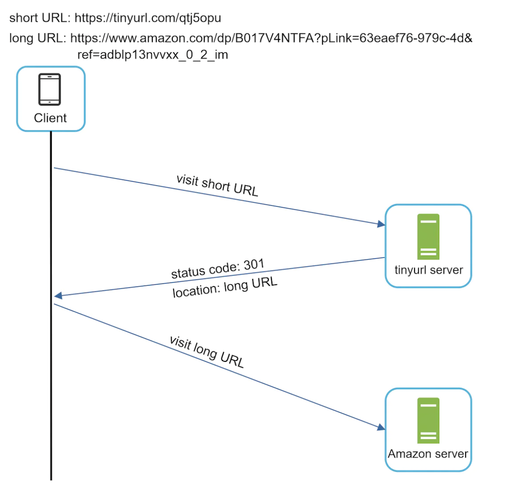
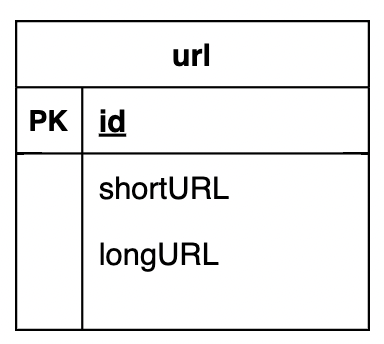
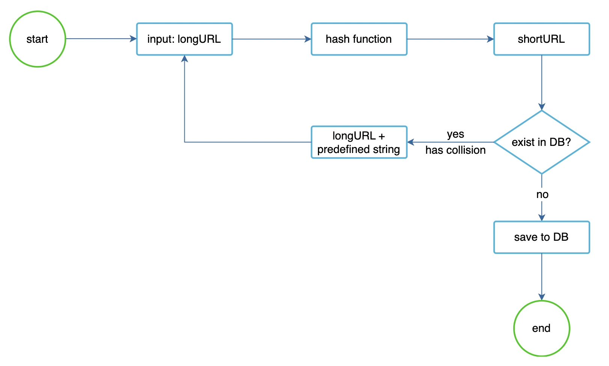
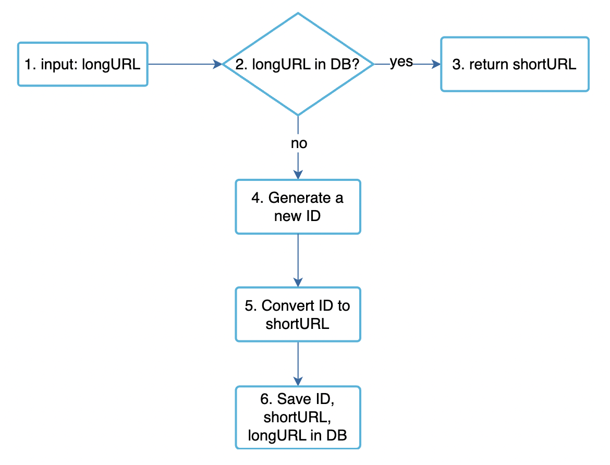
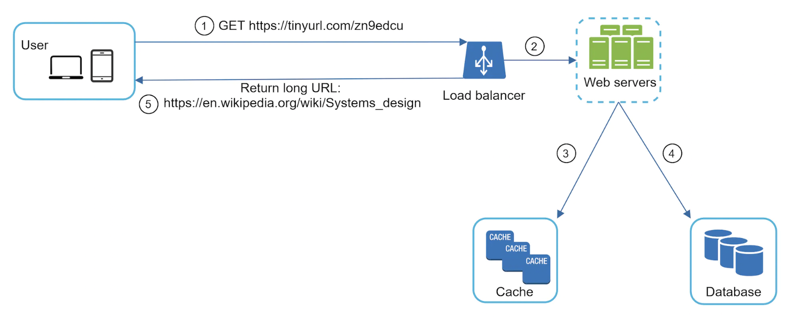

# 8. 设计 TinyUrl 系统

这是一个经典的系统设计问题：设计一个类似 TinyURL 的 URL 短链接服务。

## 第一步：理解问题并明确设计范围

- **候选人**：URL 短链接服务如何工作？
- **面试官**：给定 URL `https://www.systeminterview.com/q=chatsystem&c=loggedin&v=v3&l=long` 和别名 `https://tinyurl.com/y7keocwj`，通过访问别名，最终可以跳转到原始 URL。

- **候选人**：服务的流量有多大？
- **面试官**：每天生成 1 亿条短链接。

- **候选人**：短链接的长度有多短？
- **面试官**：越短越好。

- **候选人**：短链接支持哪些字符？
- **面试官**：数字和字母。

- **候选人**：短链接是否支持更新或删除？
- **面试官**：为了简化设计，我们假设短链接不可更新或删除。

### 其他非功能需求

- 高可用性
- 可扩展性
- 容错能力

### 粗略计算

- **每天生成的短链接数量**：1 亿条，即每秒约 1200 条。
- **读写比例**：假设读写比为 10:1，则每秒大约 12000 次读取。
- **支持 10 年的存储量**：总计需要支持约 3650 亿条记录。
- **平均 URL 长度**：100 字符。
- **10 年的存储需求**：约 36.5 TB。

## 第二步：提出高层设计并获得认可

### API 设计

设计一个 REST API，包含以下两个端点：

1. `POST api/v1/data/shorten`  
   接收长链接并返回短链接。

2. `GET api/v1/shortURL`  
   根据短链接返回对应的长链接，用于 HTTP 重定向。

### URL 重定向

流程如下：

#### 301 和 302 状态码的区别：

- **301（永久重定向）**：表示 URL 永久指向新 URL，浏览器会在后续调用中绕过 tinyurl 服务。
- **302（临时重定向）**：表示 URL 暂时移动到新 URL，浏览器不会在后续调用中绕过 tinyurl 服务。

**选择建议**：

- 如果希望减轻服务器负担，选择 301。
- 如果需要分析数据（如点击率），选择 302。

**实现方式**：  
最简单的重定向方法是使用内存中的哈希表存储 `<shortURL, longURL>` 映射。

### URL 缩短

实现 URL 缩短需要找到合适的哈希函数，它应支持将长链接映射为短链接，并能逆向映射回原始链接。  
更多细节将在详细设计中讨论。

## 第三步：深入设计

### 数据模型

简单实现可以使用内存中的哈希表，但存在以下问题：

1. 内存不足。
2. 数据在服务器重启后无法持久化。

改进方案：使用简单的关系型数据库表。  
示例表结构如下：

### 哈希函数

短链接字符集为 `[0-9a-zA-Z]`，共 62 种字符。

为了支持 3650 亿条记录，计算哈希值最小长度：

- 解方程 `62^n >= 3650 亿`，得出 `n=7`，可支持约 3.5 万亿条记录。

#### 哈希实现方式

1. **基于哈希 + 冲突检测**  
   使用 MD-5 或 SHA256 截取前 7 个字符。若冲突，则在输入字符串中加入填充再重新计算。

   示例冲突检测机制：

   

   **问题**：每次需查询数据库以检测冲突，可通过布隆过滤器优化。

2. **基于 Base62 编码**  
   直接将唯一 ID 转换为所需的 62 进制字符串。

**两种方式的比较**：

<!-- prettier-ignore -->
| 哈希 + 冲突检测| Base62 编码     |
|--------------|----------------|
| 短链接长度固定| 短链接长度不固定，随 ID 增大|
| 不需要唯一 ID 生成器| 依赖唯一 ID 生成器|
| 可能存在冲突，需要额外处理| 不存在冲突，因为 ID 唯一|
| 无法直接推断下一个短链接，有助于提高安全性| 可以推断下一个短链接（如 ID 递增），可能存在安全风险|

### URL 缩短流程

为了简化服务，我们选择使用 Base62 编码。  
完整流程如下：

在分布式环境下，可使用 Twitter 的 Snowflake 算法生成唯一 ID。

### URL 重定向流程

为提高读取性能，引入缓存：

**具体步骤**：

1. 用户点击短链接。
2. 负载均衡器将请求转发到某个服务实例。
3. 若短链接存在于缓存中，直接返回长链接。
4. 若缓存中未命中，则从数据库获取长链接并存入缓存；若数据库中未找到，则返回“短链接不存在”错误。

## 第四步：总结

我们讨论了以下内容：

1. API 设计。
2. 数据模型。
3. 哈希函数。
4. URL 缩短。
5. URL 重定向。

### 额外讨论点

- **速率限制**：引入速率限制器，防止恶意用户过多请求短链接。
- **Web 服务器扩展**：由于服务无状态，可通过增加服务实例轻松扩展。
- **数据库扩展**：常见方法包括数据复制和分片。
- **分析功能**：集成分析功能，提供点击次数等商业洞察。
- **高可用性与一致性**：分布式系统的核心需求。
