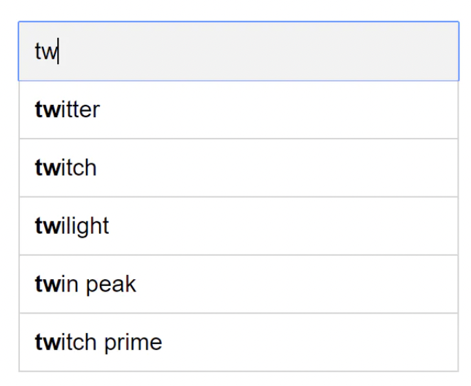
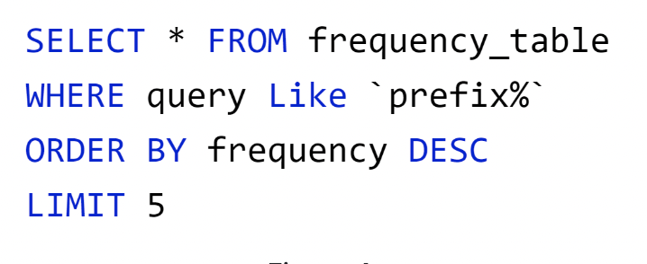
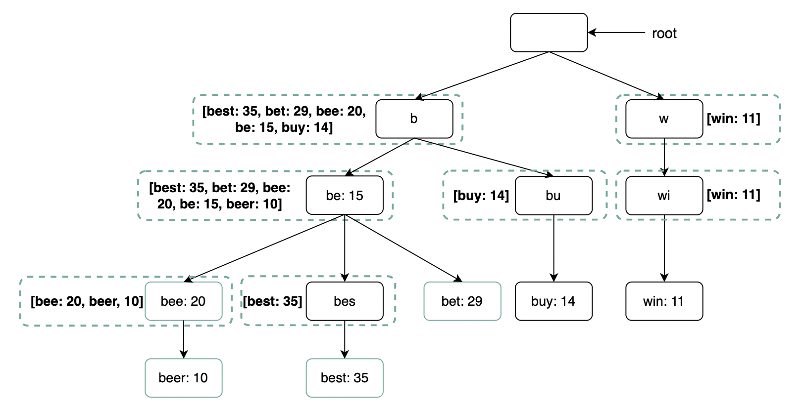
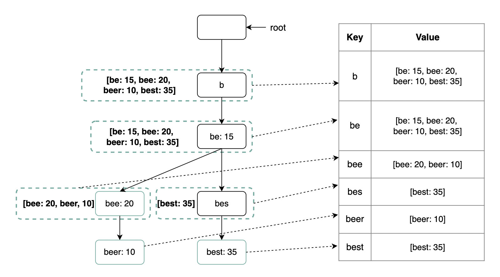

# 13. 设计搜索自动补全系统

搜索自动补全是许多平台（如 Amazon、Google 等）提供的功能。当你在搜索栏中输入内容时，它会根据输入建议可能的查询：

## 第一步：理解问题并确定设计范围

- **候选人**：匹配是否仅支持搜索词开头？例如中间位置是否支持？
- **面试官**：仅支持开头匹配。

- **候选人**：系统应该返回多少个自动补全建议？
- **面试官**：5 个。

- **候选人**：系统如何选择建议？
- **面试官**：根据历史查询频率的流行度确定。

- **候选人**：系统是否支持拼写检查？
- **面试官**：不支持拼写检查或自动更正。

- **候选人**：搜索查询是英语吗？
- **面试官**：是，如果有时间，可以讨论多语言支持。

- **候选人**：是否支持大小写和特殊字符？
- **面试官**：假设所有查询使用小写字符。

- **候选人**：有多少用户使用产品？
- **面试官**：每日活跃用户为 1000 万（10mil DAU）。

### 非功能性需求

- **快速响应时间**：一篇关于 Facebook 自动补全的文章中提到，建议应在最多 100 毫秒延迟内返回，以避免卡顿。
- **相关性**：自动补全建议应与搜索词相关。
- **排序**：建议按流行度排序。
- **可扩展性**：系统可以处理高流量。
- **高可用性**：即使系统部分失效，也应保持运行。

### 粗略估算

- 假设我们有 1000 万每日活跃用户。
- 平均每人每天执行 10 次搜索。  
  1000 万 × 10 = 1 亿次搜索/天 = `1 亿 ÷ 86400 ≈ 1200` 次搜索/秒。
- 平均每次搜索由 4 个单词组成，每个单词平均 5 个字符：`1200 × 20 = 24000` QPS（每秒查询次数）。峰值 QPS = 48000。
- 每天 20% 的查询是新的：1 亿 × 20% = 2000 万新搜索 × 每条 20 字节 = 400 MB 新数据/天。

## 第二步：提出高层设计并获得认可

从高层来看，系统有两个主要组件：

1. **数据收集服务**：收集用户输入查询并实时聚合。
2. **查询服务**：根据搜索查询返回排名前 5 的建议。

### 数据收集服务

数据收集服务负责维护一个频率表：

### 查询服务

给定如上的频率表，查询服务负责根据频率列返回排名前 5 的建议：

查询数据集可以通过以下 SQL 查询实现：

这种方法对于小型数据集是可接受的，但对于大型数据集则不切实际。

## 第三步：深入设计

在这一部分，我们将深入探讨一些组件，以改进初始的高层设计。

### Trie 数据结构

我们在高层设计中使用了关系型数据库，但为了实现更优的解决方案，需要使用适合的数据结构。

我们可以使用 Trie（前缀树）来快速检索字符串前缀。

- Trie 是一种类树数据结构。
- 根节点表示空字符串。
- 每个节点有 26 个子节点，分别代表可能的下一个字符。为了节省空间，不存储空链接。
- 每个节点表示一个单词或前缀。
- 对于本问题，除了存储字符串外，还需要在每个叶子节点中存储频率。

实现该算法需要：

1. 首先找到表示前缀的节点（时间复杂度为 `O(p)`，其中 `p` 为前缀长度）。
2. 遍历子树以找到所有叶子节点（时间复杂度为 `O(c)`，其中 `c` 为总子节点数）。
3. 按频率对检索到的子节点进行排序（时间复杂度为 `O(c log c)`）。

这个算法可行，但在最坏情况下需要遍历整个 Trie，我们可以进一步优化。

#### 限制前缀最大长度

我们可以利用用户很少使用非常长的搜索词这一事实，将前缀长度限制为 50 个字符。

这可以将时间复杂度从 `O(p) + O(c) + O(c log c)` 降至 `O(1) + O(c) + O(c log c)`。

#### 在每个节点缓存热门搜索查询

为了避免遍历整个 Trie，可以在每个节点缓存访问频率最高的前 k 个词：

这将时间复杂度降为 `O(1)`，因为热门搜索词已被缓存。代价是相比传统 Trie，需要占用更多空间。

---

### 数据收集服务

在前面的设计中，当用户输入搜索词时，数据会实时更新。然而，在大规模系统中这并不现实，原因包括：

- 每天有数十亿次查询。
- 一旦构建了 Trie，热门建议通常不会频繁变化。

因此，我们改为根据分析数据异步更新 Trie：

分析日志包含与搜索词相关的原始数据及时间戳：

聚合器的职责是将分析数据映射为合适的格式，并对记录进行聚合。

聚合频率取决于自动补全功能的使用场景：

- 如果需要实时更新数据（如 Twitter 搜索），可每 30 分钟聚合一次。
- 如果不需要实时更新数据（如 Google 搜索），可以每周聚合一次。

每周聚合数据示例：

Workers 的职责是基于聚合数据构建 Trie 数据结构，并将其存储到数据库中。

Trie 缓存将 Trie 加载到内存中以实现快速读取，缓存每周从数据库中获取快照。

Trie 数据库是持久化存储，可以有两种实现方案：

- 文档存储（如 MongoDB）：可以定期构建 Trie，序列化后存储到数据库。
- 键值存储（如 DynamoDB）：可以将 Trie 存储为哈希表格式。

---

### 查询服务

查询服务从 Trie 缓存中获取热门建议，或者在缓存未命中时从 Trie 数据库中获取：

查询服务的一些附加优化：

- **客户端使用 AJAX 请求**：防止浏览器刷新页面。
- **数据采样**：避免记录所有请求，可采样部分请求以减少日志量。
- **浏览器缓存**：由于自动补全建议不常变化，可利用浏览器缓存避免额外的后端调用。

例如，Google 搜索在浏览器中缓存搜索结果 1 小时：

---

### Trie 操作

下面我们简要回顾一下常见的 Trie 操作。

#### 创建

Workers 使用分析日志收集的聚合数据创建 Trie。

#### 更新

对于更新，可以选择以下两种方式：

1. **不更新 Trie，而是重建它**：如果不需要实时建议，这是可接受的。
2. **直接更新单个节点**：通常避免此方法，因为速度较慢。更新单个节点需要同时更新所有父节点，以更新缓存的建议：

#### 删除

为了避免展示仇恨内容或其他不希望展示的内容，可以在 Trie 缓存和 API 服务器之间添加过滤层：

数据库会异步更新以移除仇恨内容。

---

### 扩展存储

当 Trie 无法完全存储在单台服务器上时，需要设计分片机制。

一种方法是根据字母表分片，例如：`a-m` 放在一个分片，`n-z` 放在另一个分片。

这种方法分布不均，因为字母 `a` 的使用频率远高于 `x`。

为解决此问题，可以引入专门的分片映射器，该映射器根据搜索词的分布制定智能分片算法：

## 第四步：总结

其他需要讨论的点：

- **如何支持多语言**：在 Trie 节点中存储 Unicode 字符，而不是 ASCII。
- **如果不同国家的热门搜索词不同怎么办**：可以为每个国家构建不同的 Trie，并利用 CDN 提升响应速度。
- **如何支持热门（实时）搜索查询**：当前设计不支持此功能，改进设计以支持该功能超出了本文范围。一些可能的解决方案包括：
  - 通过分片减少工作数据集。
  - 修改排序模型，为最近的搜索查询赋予更高权重。
  - 数据可能以流的形式到达，可以使用过滤器和 MapReduce 技术（如 Hadoop、Apache Spark、Apache Storm、Apache Kafka）进行处理。
