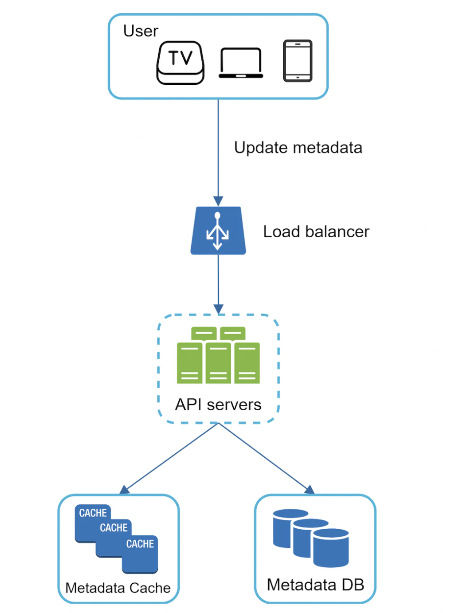
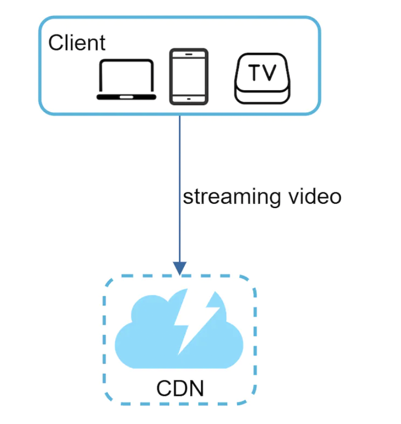
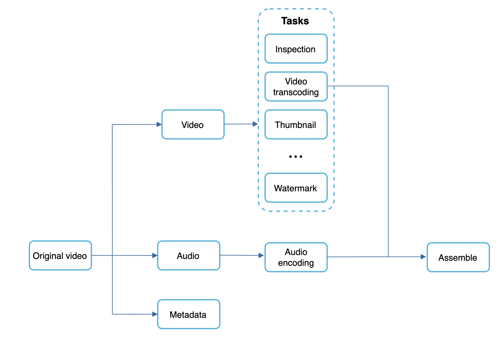
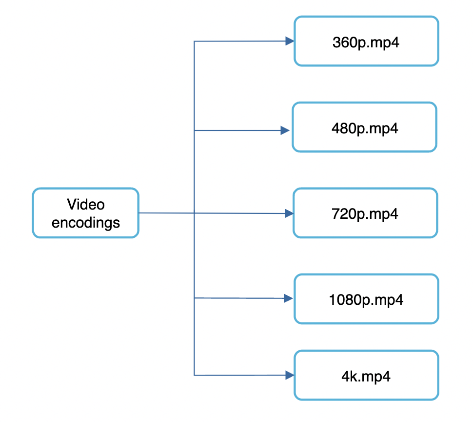
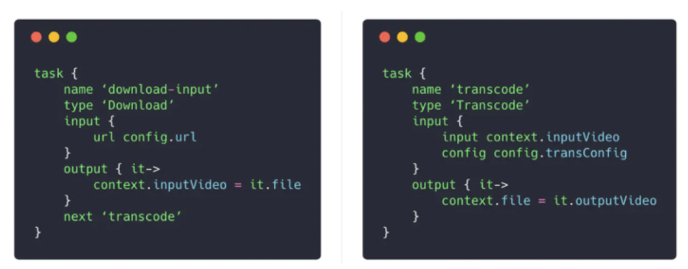
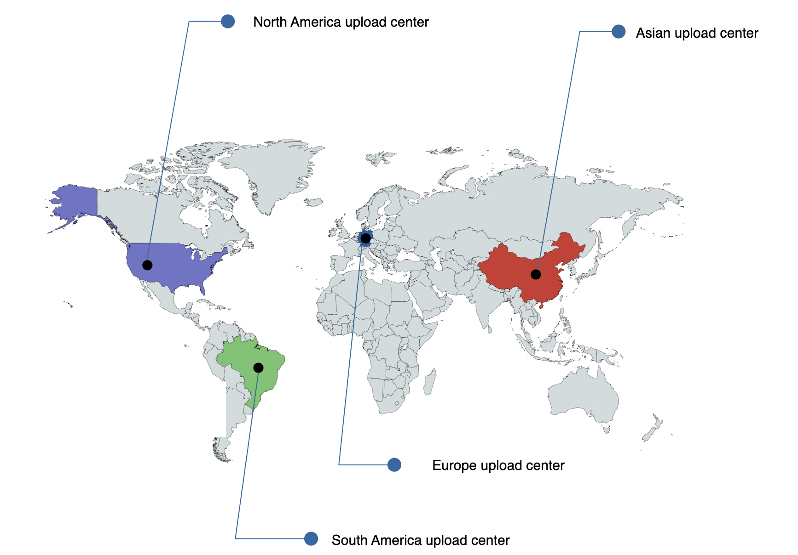
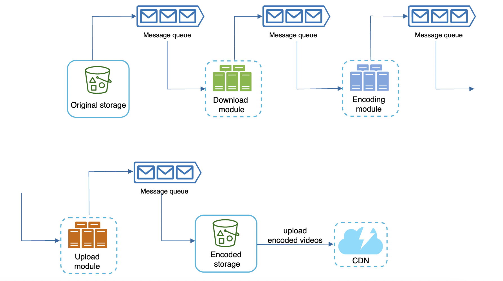

# 14. 设计 YouTube

下面我们将讨论如何设计一个类似 YouTube 的视频分享平台，其解决方案也适用于 Netflix、Hulu 等服务的设计。

## 第一步：理解问题并确定设计范围

- **候选人**：哪些功能是重要的？
- **面试官**：上传视频 + 观看视频

- **候选人**：需要支持哪些客户端？
- **面试官**：移动应用、网页应用、智能电视

- **候选人**：我们每天的活跃用户数（DAU）是多少？
- **面试官**：500 万

- **候选人**：用户平均每天在 YouTube 上花费的时间是多少？
- **面试官**：30 分钟

- **候选人**：是否需要支持国际用户？
- **面试官**：是的

- **候选人**：需要支持哪些视频分辨率？
- **面试官**：大部分的分辨率

- **候选人**：是否需要加密？
- **面试官**：是的

- **候选人**：对视频文件大小有何要求？
- **面试官**：最大文件大小为 1GB

- **候选人**：是否可以使用 Google、Amazon 或 Microsoft 的现有云基础设施？
- **面试官**：可以，从头开始构建所有功能并不实际。

### 非功能性需求

- 快速上传视频
- 流畅的视频播放
- 支持更改视频质量
- 降低基础设施成本
- 高可用性、可扩展性和可靠性
- 支持的客户端：网页、移动设备和智能电视

### 粗略估算

- 假设产品有 500 万日活跃用户
- 每位用户每天观看 5 个视频
- 10% 的用户每天上传 1 个视频
- 平均视频大小为 300MB
- 每日存储需求：500 万 × 10% × 300MB = 150TB
- CDN 成本（假设每 GB 0.02 美元）：500 万 × 5 个视频 × 0.3GB × 0.02 美元 = 每日 15 万美元

## 第二步：提出高层设计并获得认可

正如之前讨论的，我们不会从头构建所有功能，因为：

- 在系统设计面试中，选择合适的技术比解释其工作原理更重要。
- 构建基于 CDN 的可扩展二进制存储非常复杂且昂贵，即使是大型科技公司也不会从头构建所有功能。例如，Netflix 使用 AWS，而 Facebook 使用 Akamai 的 CDN。

以下是我们高层系统设计的示意图：

- **客户端**：用户可通过网页、移动设备和智能电视观看 YouTube。
- **CDN**：视频存储在 CDN 中。
- **API 服务器**：除视频流以外的所有请求都通过 API 服务器处理，包括 Feed 推荐、生成视频 URL、更新元数据数据库和缓存、用户注册等。

接下来，我们将深入探讨视频流和视频上传的高层设计。

### 视频上传流程

这是上传视频和更新视频元数据的整体架构图：

- 用户可以上传视频及视频元数据
- 用户也可以在支持的客户端上观看视频，负载均衡器将请求均匀分发到 API 服务器，除视频流外，所有用户请求都经过 API 服务器：

- **转码/编码服务器（Transcoding/encoding servers）**：将视频转换为适合不同设备和带宽的各种格式（如 MPEG、HLS 等）

- **转码后存储（Transcoded storage）**：存储转码结果文件，使用二进制存储系统存储实际视频
- 视频缓存到 CDN 中，点击播放时会从最近的 CDN 服务器流式传输视频
- **完成队列（Completion queue）**：存储有关视频转码结果的事件
- **完成处理器（Completion handler）**：一组从完成队列中提取事件数据并更新元数据缓存和数据库的工作程序
- **元数据数据库（Metadata DB）**：分片和复制以满足性能和可用性要求
- **元数据缓存（Metadata cache）**：缓存视频元数据和用户对象以提高性能

这是视频上传流程：

1. 视频上传到原始存储
2. 转码服务器从存储中获取视频并开始转码
3. 转码完成后并行执行两步操作：
   - 将转码视频发送到转码存储并分发到 CDN
   - 将转码完成事件排入完成队列，工作程序提取事件并更新元数据数据库和缓存
4. API 服务器通知用户上传完成

这是元数据更新流程，元数据包括视频 URL、大小、分辨率、格式等信息。

- 文件上传过程中，用户发送请求更新视频元数据（文件名、大小、格式等）
- API 服务器更新元数据数据库和缓存

---

### 视频流流程

当用户在 YouTube 上观看视频时，他们不会一次性下载完整视频，而是边下载边播放，这种方法称为流式传输。流数据从最近的 CDN 服务器提供，以实现最低延迟。

一些流行的流媒体协议包括：

- **MPEG-DASH**：动态自适应 HTTP 流媒体协议
- **Apple HLS**：HTTP 实时流媒体
- **Microsoft Smooth Streaming**
- **Adobe HTTP 动态流媒体（HDS）**

无需详细了解这些协议的技术细节，但需要理解不同的协议支持不同的视频编码和播放方式，我们需要选择适合使用场景的流媒体协议。

## 第三步：深入设计

在这一部分，我们将深入探讨视频上传和视频流的流程。

### 视频转码

视频转码之所以重要，有以下几点原因：

- 原始视频会占用大量存储空间。
- 许多浏览器对视频的类型有一定限制，将视频编码以确保兼容性非常重要。
- 为了提供良好的用户体验，需要为网络良好的用户提供高清（HD）视频，而为网络较差的用户提供低质量格式。
- 网络条件可能会变化，特别是在移动设备上，因此，需要能够在运行时自动切换视频格式以确保流畅的用户体验。

大多数转码格式由两个部分组成：

- **容器**：存放视频文件的框架，通常通过文件扩展名识别，例如 `.avi`、`.mov`、`.mp4`。
- **编码器**：用于压缩和解压视频的算法，这些算法在保持质量的同时减少视频大小。常见的编码器包括 H.264、VP9、HEVC。

---

### 有向无环图模型

视频转码需要大量计算资源，并且耗时较长。此外，不同创作者上传的视频可能有所不同：有些提供缩略图，有些没有；有些是高清的，有些不是。

为了支持视频处理流水线、开发定制化以及高并行性，我们采用了 DAG（Directed Acyclic Graph）模型：

对视频文件执行以下任务：

- 检查视频，确保质量良好且没有损坏。
- 对视频进行编码以支持不同的分辨率、编码器、比特率等。
- 如果用户未指定缩略图，则自动生成。
- 添加水印——根据创作者的要求在视频上叠加图像。

---

### 视频转码架构

#### 预处理器（Preprocessor）

预处理器的职责包括：

- **视频分割**：将视频按图片组（GOP）对齐分割，即将视频安排为独立播放的块组。
- **缓存**：将中间步骤存储在持久存储中，以便在失败时重试。
- **DAG 生成**：根据程序员指定的配置文件生成 DAG。

以下是一个包含两个步骤的 DAG 配置示例：

#### DAG 调度器（DAG Scheduler）

DAG 调度器将 DAG 分为任务阶段，并将其放入由资源管理器管理的任务队列：

在这个示例中，视频被分为视频、音频和元数据阶段，并行处理。

#### 资源管理器（Resource manager）

资源管理器负责优化资源分配。

- **任务队列**：一个优先级任务队列，存储待执行任务。
- **工作队列**：存储可用 workers 和 worker 利用率信息的队列。
- **运行队列**：包含当前运行任务及其分配的 workers 信息。

**工作流程**：

1. 任务调度器从队列中获取最高优先级任务。
2. 调度器获取最优任务 worker 来执行任务。
3. 调度器指示 workers 开始任务。
4. 调度器将 workers 绑定到任务，并将任务/workers 信息放入运行队列。
5. 任务完成后，调度器从运行队列中移除任务。

#### 任务 workers（Task workers）

workers 负责执行 DAG 中的任务。不同 worker 负责不同任务，可以独立扩展。

#### 临时存储（Temporary storage）

不同类型的数据使用不同的存储系统。例如，临时图像、视频、音频存储在 Blob 存储中，元数据存储在内存缓存中，因为数据体积较小。

处理完成后，数据将被释放。

#### 编码后的视频（Encoded video）

DAG 的最终输出。例如，`funny_720p.mp4`。

---

### 系统优化

以下是一些关于速度、安全性和成本节约的优化方案：

#### 速度优化 - 并行视频上传

通过 GOP 对齐将视频上传分为独立单元：

这样可以在上传失败时快速恢复。视频文件的分割由客户端完成。

#### 速度优化 - 将上传中心靠近用户

可以通过利用 CDN 实现。

#### 速度优化 - 全面并行化

我们可以构建松耦合系统，启用高并行性。

目前，组件依赖前置组件的输出：

引入消息队列后，组件可以在事件可用时独立执行任务：

#### 安全优化 - 预签名上传 URL

为防止未经授权的用户上传视频，我们引入预签名上传 URL：

**工作流程**：

1. 客户端向 API 服务器请求上传 URL。
2. API 服务器生成 URL 并返回给客户端。
3. 客户端使用该 URL 上传视频。

#### 安全优化 - 保护视频内容

为防止创作者的原创内容被盗，可以引入以下安全选项：

- 数字版权管理（DRM）系统：如 Apple FairPlay、Google Widevine、Microsoft PlayReady。
- AES 加密：可以加密视频并配置授权策略，在播放时解密。
- 可视水印：在视频上叠加包含标识信息（如公司名称）的图像。

#### 成本节约优化

CDN 成本较高，因为视频播放符合长尾分布（少数热门视频访问频繁，其余视频较少访问），我们可以对热门视频使用 CDN，而将其他视频存储在高容量存储服务器中：

其他节约方案包括：

- 不需要为不受欢迎的视频存储多种编码版本，短视频可以按需编码。
- 某些视频仅在特定地区流行，可以避免在所有地区分发。
- 自建 CDN：对于像 Netflix 这样的大型流媒体公司来说是可行的。

---

### 错误处理

在大规模系统中，错误是不可避免的。为了构建容错系统，我们需要优雅地处理错误并从中恢复。

常见错误类型包括：

- **可恢复错误**：通过重试几次可以缓解。如果重试失败，会向客户端返回适当的错误代码。
- **不可恢复错误**：系统停止运行相关任务，并向客户端返回适当的错误代码。

其他典型错误及解决方案：

- 上传错误：重试几次。
- 视频分割错误：如果旧客户端不支持 GOP 对齐，则将整个视频传输到服务器。
- 转码错误：重试。
- 预处理错误：重新生成 DAG。
- DAG 调度器错误：重试调度。
- 资源管理器队列故障：使用副本。
- 任务工作者故障：在不同工作者上重试任务。
- API 服务器故障：无状态，可将请求重定向到其他服务器。
- 元数据数据库/缓存服务器故障：跨多个节点复制数据。
- 主节点故障：提升一个从节点为主节点。
- 从节点故障：如果从节点故障，可以使用另一个从节点进行读取并启动新的从节点实例。

## 第四步：总结

其他讨论点：

- **扩展 API 层**：API 层是无状态的，可以轻松横向扩展。
- **扩展数据库**：通过复制和分片实现。
- **直播流**：我们的系统并未设计用于直播流，但共享一些相似性，例如上传、编码、流式传输。主要区别在于：

  - 直播流对延迟有更高的要求，可能需要不同的流式传输协议。
  - 对并行性的需求较低，因为小数据块已经实时处理。
  - 不同的错误处理方式，例如在超时后需要停止重试。

- **视频下架**：需要移除违反版权、色情或其他非法行为的视频，可以在上传流程中或根据用户举报移除。
