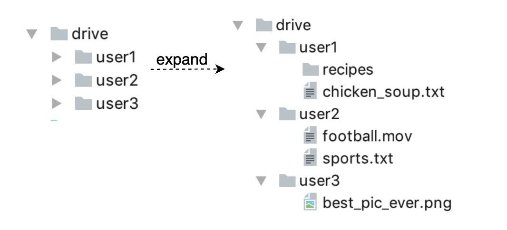
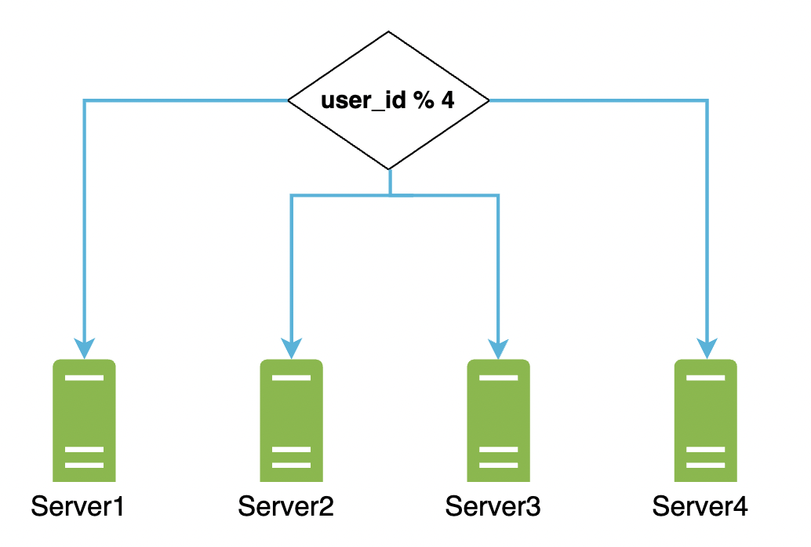
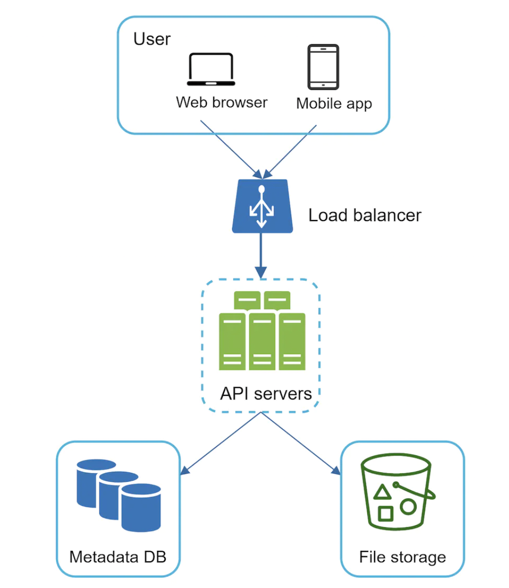
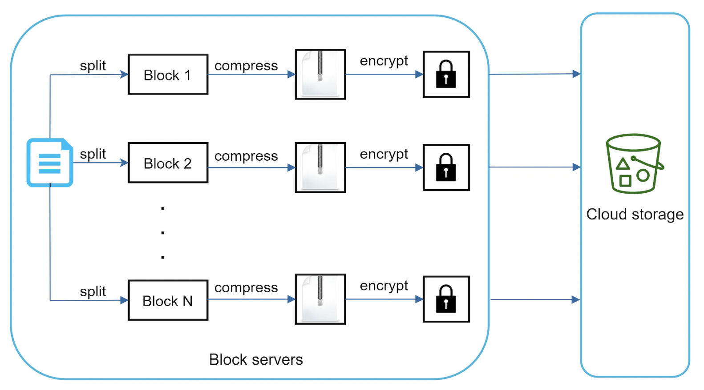
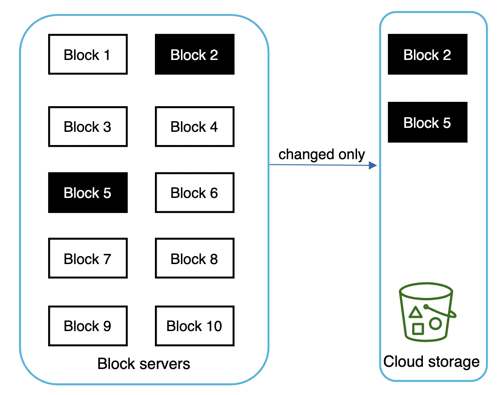
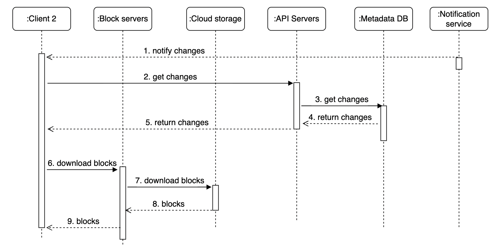

# 15. 设计 Google Drive

Google Drive 是一种云文件存储产品，帮助您将文档、视频等存储在云端。

您可以从任何设备访问它，并与朋友和家人共享。

## 第一步：理解问题并确定设计范围

- **候选人**：最重要的功能是什么？
- **面试官**：上传/下载文件、文件同步和通知功能。
- **候选人**：是移动端还是网页端？
- **面试官**：两者都需要支持。
- **候选人**：支持哪些文件格式？
- **面试官**：支持任何文件类型。
- **候选人**：文件需要加密吗？
- **面试官**：是的，存储中的文件需要加密。
- **候选人**：是否有文件大小限制？
- **面试官**：是的，文件大小限制为 10 GB。
- **候选人**：应用的用户量有多少？
- **面试官**：每天活跃用户（DAU）为 1000 万。

我们关注的功能包括：

- 上传文件
- 下载文件
- 跨设备同步文件
- 查看文件修订历史
- 与朋友共享文件
- 文件被编辑/删除/共享时发送通知

不讨论的功能：

- 协作编辑

非功能性需求：

- **可靠性**：数据丢失是不可接受的。
- **同步速度**：快速的同步速度。
- **带宽使用**：如果应用消耗过多网络流量或电量，用户会不满。
- **可扩展性**：需要处理大量流量。
- **高可用性**：即使部分服务宕机，用户仍然应能使用系统。

### 粗略估算

- 假设有 5000 万注册用户，日活跃用户（DAU）为 1000 万。
- 用户可获得 10 GB 免费存储空间。
- 用户每天上传 2 个文件，平均文件大小为 500 KB。
- 读写比为 1:1。
- 总分配空间：50M 用户 \* 10GB = 500 PB
- 上传 API 的每秒请求数（QPS）：1000 万用户 \* 2 文件 / 24 小时 / 3600 秒 ≈ 240
- 峰值 QPS：480

## 第二步：提出高层设计并获得认可

这次我们将采用不同的方法——从单一服务器开始设计，并逐步扩展。

我们将从以下内容开始：

- 一个用于上传和下载文件的 Web 服务器。
- 一个用于跟踪元数据的数据库，包括用户数据、登录信息、文件信息等。
- 一个存储系统，用于存储文件。

示例存储系统如下：



### 接口设计 (APIs)

上传文件：

```
https://api.example.com/files/upload?uploadType=resumable
```

该端点用于上传文件，支持简单上传和断点续传（用于大文件）。  
断点续传通过获取上传 URL 并监控上传状态实现，如果中断，可以恢复上传。

下载文件：

```
https://api.example.com/files/download
```

参数指定要下载的文件：

```
{
    "path": "/recipes/soup/best_soup.txt"
}
```

获取文件修订历史：

```
https://api.example.com/files/list_revisions
```

参数：

- 文件路径，用于检索修订历史。
- 返回的最大修订数量。

所有接口需要身份验证，并使用 HTTPS。

---

### 从单一服务器扩展

随着文件上传量的增加，存储服务器的容量会被耗尽。

一种扩展存储服务器的方法是实现分片——每个用户的数据存储在单独的服务器上：



这解决了存储容量问题，但数据丢失仍然是一个潜在风险。

一个不错的解决方案是使用现成的解决方案，比如 Amazon S3，它支持同一区域和跨区域的复制：


其他改进点：

- **负载均衡**：确保将网络流量均匀分配到 Web 服务器副本上。
- **增加 Web 服务器数量**：有了负载均衡器，可以通过添加更多服务器轻松扩展 Web 服务器层。
- **元数据数据库**：将数据库从服务器中移出，避免单点故障。可以设置复制和分片以满足可扩展性需求。
- **文件存储**：使用 Amazon S3 作为存储系统。为确保可用性和耐用性，文件会复制到两个独立的地理区域。

更新后的设计如下：



---

### 同步冲突

当用户量足够大时，同步冲突不可避免。

我们可以应用“先修改者优先”的策略：


发生冲突时，会生成文件的第二版本，用户可以自行合并：


---

### 高层设计


设计细节：

- 用户通过浏览器或移动应用使用系统。
- **块服务器**：将文件上传到云存储。块存储技术允许将大文件拆分为块并存储在后端存储中。例如，Dropbox 将块大小设置为 4MB。
- **云存储**：将拆分为多个块的文件存储在云存储中。
- **冷存储**：存储不活跃文件（不常访问的文件）。
- **负载均衡器**：将请求均匀分配给 API 服务器。
- **API 服务器**：负责上传文件以外的所有操作，包括身份验证、用户资料管理和更新文件元数据等。
- **元数据数据库**：存储上传到云存储的文件的元数据。
- **元数据缓存**：缓存部分元数据以快速检索。
- **通知服务**：发布/订阅系统，在文件更新/编辑/删除时通知用户，以便他们拉取最新更改。
- **离线备份队列**：用于为离线用户排队文件更改，当他们重新上线时可以同步。

## 第三步：深入设计

我们将探讨以下内容：

- 块服务器
- 元数据数据库
- 上传/下载流程
- 通知服务
- 节省存储空间
- 故障处理

### 块服务器

对于大型文件，每次更新时发送整个文件是不现实的，因为会消耗大量带宽。

我们将探讨两种优化方式：

- **增量同步**：一旦文件被修改，仅将修改的块发送到块服务器，而不是整个文件。
- **压缩**：对块应用压缩可以显著减少数据大小。不同的文件类型适合不同的算法，例如，对于文本文件，可以使用 gzip/bzip2。

除了将文件分块，块服务器还在存储文件之前对其进行加密：



增量同步示例：



---

### 高一致性需求

我们的系统需要**强一致性**，因为向不同用户展示文件的不同版本是不可接受的。

这主要在使用缓存时成为问题，尤其是元数据缓存。  
为了保持强一致性，我们需要：

- 确保缓存主节点与副本保持一致。
- 在数据库写入时使缓存失效。

对于数据库，只要使用支持 ACID 的关系型数据库，通常可以保证强一致性。

---

### 元数据数据库

以下是元数据数据库的简化表结构（仅显示关键字段）：


- **用户表**：包含用户的基本信息，例如用户名、电子邮件、个人资料照片等。
- **设备表**：存储设备信息。Push_id 用于发送推送通知。每个用户可以有多个设备。
- **命名空间表**：用户的根目录。
- **文件表**：存储与文件相关的所有信息。
- **文件版本表**：存储文件的版本历史。已有字段是只读的，以保持文件完整性。
- **块表**：存储与文件块相关的所有信息。可以通过连接正确版本的所有块来重建文件版本。

---

### 上传流程


在上述流程中，有两个请求并行发送：更新文件元数据和将文件上传到云存储。

**添加文件元数据：**

- 客户端 1 发送请求更新文件元数据。
- 新的文件元数据被存储，并将上传状态设置为“pending”（待定）。
- 通知服务被告知新文件正在上传。
- 通知服务通知相关客户端文件上传状态。

**将文件上传到云存储：**

- 客户端 1 将文件内容上传到块服务器。
- 块服务器将文件分块、压缩、加密并上传到云存储。
- 文件上传完成后，触发上传完成回调。请求发送到 API 服务器。
- 在元数据数据库中将文件状态更改为“uploaded”（已上传）。
- 通知服务收到文件上传事件，并通知客户端 2 新文件已上传。

---

### 下载流程

当文件在其他地方被添加或编辑时，会触发下载流程。客户端通过以下方式获取通知：

- **在线**时接收通知。
- **离线**时，变更被缓存，直到用户上线。

一旦客户端收到变更通知，它会请求文件元数据并下载块以重建文件：



- 通知服务告知客户端 2 文件变更。
- 客户端 2 从 API 服务器获取元数据。
- API 服务器从元数据数据库获取元数据。
- 客户端 2 收到元数据。
- 收到元数据后，客户端向块服务器发送请求下载块。
- 块服务器从云存储下载块并转发给客户端。

---

### 通知服务

通知服务使文件变更能够实时传达给客户端。

客户端可以通过以下方式与通知服务通信：

- **长轮询**（例如 Dropbox 使用这种方式）。
- **WebSocket**：通信是持久的、双向的。

这两种方式都很好，但我们选择长轮询，因为：

- 通知服务的通信不是双向的。服务器向客户端发送信息，而不是相反。
- WebSocket 适用于实时双向通信。而对于 Google Drive，通知发送的频率并不高。

在长轮询中，客户端向服务器发送请求，请求保持打开状态，直到接收到变更或超时。  
之后，客户端发送后续请求以获取下一批变更。

---

### 节省存储空间

为了支持文件版本历史并确保可靠性，多个文件版本会存储在多个数据中心。

存储空间可能很快被填满。可以采用以下三种技术节省存储空间：

- **数据块去重**：如果两个块具有相同的哈希值，只需存储一次。
- **采用智能备份策略**：对最大版本历史设置限制，并将频繁的编辑合并为单个版本。
- **将不常访问的数据移动到冷存储**：例如，Amazon S3 Glacier 是一个很好的选择，比 Amazon S3 便宜得多。

---

### 故障处理

一些典型的故障及其解决方法：

- **负载均衡器故障**：如果负载均衡器失败，备用负载均衡器会激活并接管流量。
- **块服务器故障**：如果块服务器失败，其他副本接管流量并完成任务。
- **云存储故障**：S3 存储桶会在不同区域间复制。如果一个区域失败，流量会重定向到另一个区域。
- **API 服务器故障**：负载均衡器将流量重定向到其他服务实例。
- **元数据缓存故障**：元数据缓存服务器有多个副本。如果一个节点宕机，其他节点仍然可用。
- **元数据数据库故障**：如果主节点宕机，将其中一个从节点提升为主节点。如果从节点宕机，使用其他节点进行读取操作。
- **通知服务故障**：如果长轮询连接丢失，客户端重新连接到其他服务副本，但数百万客户端的重新连接可能需要一些时间。
- **离线备份队列故障**：队列有多个副本。如果一个队列失败，消费者需要重新订阅备用队列。

## 第四步：总结

我们的 Google Drive 系统设计的特性一览：

- 强一致性
- 低网络带宽占用
- 快速同步

我们的设计包含两种流程——文件上传和文件同步。

如果有时间，还可以讨论替代设计方案，因为没有完美的设计。例如，可以直接将块上传到云存储，而不是通过块服务器。

这种方法比我们的方案更快，但也有一些缺点：

- 分块、压缩、加密需要在不同平台（Android、iOS、Web）上实现。
- 客户端可能会被黑客攻击，因此在客户端实现加密并不理想。

另一个有趣的讨论是将在线/离线逻辑移到单独的服务中，这样其他服务可以重用它来实现有趣的功能。
