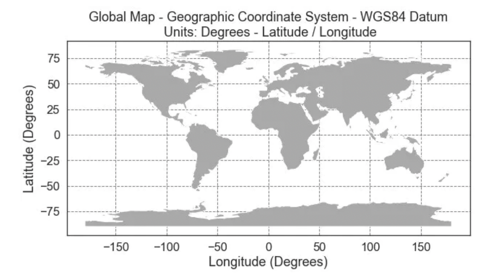
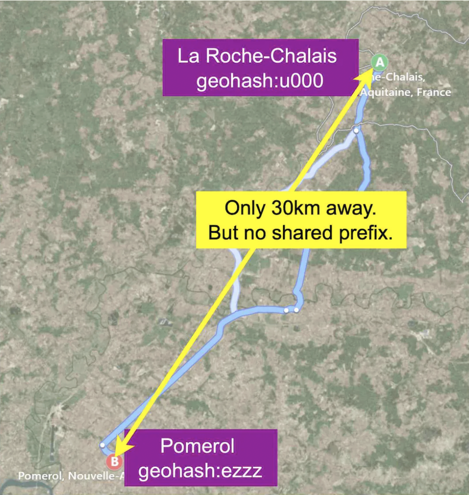

# 16. 设计附近服务

附近服务使您能够发现附近的地点，如餐馆、酒店、剧院等。

## 第一步：理解问题并确定设计范围

以下是一些理解问题的示例问题：

- **候选人**: 用户可以指定搜索半径吗？如果在搜索区域内没有足够的商户怎么办？
- **面试官**: 我们只关心某个特定区域内的商户。如果时间允许，我们可以讨论增强功能。
- **候选人**: 最大半径是多少？我可以假设是 20 公里吗？
- **面试官**: 是的，这是一个合理的假设。
- **候选人**: 用户可以通过 UI 更改搜索半径吗？
- **面试官**: 是的，假设我们提供以下选项：0.5 公里、1 公里、2 公里、5 公里、20 公里。
- **候选人**: 商户信息如何修改？我们需要实时反映这些变化吗？
- **面试官**: 商户老板可以添加/删除/更新商户。假设变更将在第二天传播。
- **候选人**: 当用户移动时，我们如何处理搜索结果？
- **面试官**: 假设我们不需要不断更新页面，因为用户的移动速度较慢。

### 功能要求

- 基于用户位置返回所有商户
- 商户老板可以添加/删除/更新商户，信息不会实时反映。
- 顾客可以查看商户的详细信息。

### 非功能性要求

- 低延迟 - 用户应能快速看到附近的商户
- 数据隐私 - 位置数据属于敏感信息，我们应考虑如何遵守相关法规
- 高可用性和可扩展性要求 - 我们应确保系统能够处理高峰时段密集地区的流量激增

### 粗略计算

- 假设每天有 1 亿活跃用户和 2 亿商户
- 搜索 QPS = 1 亿 \* 5（每天的平均搜索次数）/ 10^5（一天的秒数）= 5000

## 第二步：提出高层设计并获得批准

### API 设计

我们将采用 RESTful API 规范来设计简化版的 API。

```
GET /v1/search/nearby
```

此端点根据搜索条件返回商户，支持分页。

请求参数 - 纬度、经度、半径

示例响应：

```
{
  "total": 10,
  "businesses":[{商户对象}]
}
```

此端点返回渲染搜索结果页面所需的所有内容，但用户可能需要更多关于特定商户的详细信息，可以通过其他端点获取。

以下是我们需要的一些其他商户 API：

- `GET /v1/businesses/{:id}`- 返回商户详细信息
- `POST /v1/businesses`- 创建新商户
- `PUT /v1/businesses/{:id}`- 更新商户详细信息
- `DELETE /v1/businesses/{:id}`- 删除商户

### 数据模型

在这个问题中，读取量很高，因为这些功能通常会被频繁使用：

- 搜索附近的商户
- 查看商户的详细信息

另一方面，写入量较低，因为我们很少更改商户信息。因此，对于读多写少的工作流，关系型数据库如 MySQL 是理想的选择。

在模式方面，我们需要一个主`business`表来存储商户信息：


我们还需要一个地理索引表，以便高效处理空间操作。稍后我们将在介绍地理哈希的概念时讨论该表。

### 高层设计

以下是系统的高层概述：


- 负载均衡器自动将流量分配到多个服务。公司通常提供一个单一的 DNS 入口，内部根据 URL 路径将 API 调用路由到相应的服务。
- 基于位置的服务（LBS）- 读密集型、无状态服务，负责处理附近商户的读请求
- 商户服务 - 支持商户的 CRUD 操作
- 数据库集群 - 存储商户信息并进行复制以扩展读取。这样可能导致 LBS 读取商户信息时出现一些不一致，但在我们的用例中这不是问题。
- 商户服务和 LBS 的可扩展性 - 由于这两个服务是无状态的，我们可以轻松地水平扩展它们

### 获取附近商户的算法

在实际应用中，可以使用地理空间数据库，如 Redis 中的 Geohash 或带有 PostGIS 扩展的 Postgres。

让我们探讨一下这些数据库如何工作，以及对于此类问题还存在哪些替代算法。

### 二维搜索

解决此问题的最直观和朴素的方法是围绕某人画一个圆圈，并获取圆圈半径内的所有商户：


这可以很容易地转化为一个 SQL 查询：

```
SELECT business_id, latitude, longitude
FROM business
WHERE (latitude BETWEEN {:my_lat} - radius AND {:my_lat} + radius) AND
      (longitude BETWEEN {:my_long} - radius AND {:my_long} + radius)
```

此查询效率不高，因为我们需要查询整个表。另一种选择是在经度和纬度列上建立索引，但这不会大幅提高性能。

这是因为无论我们是否按经度或纬度索引，仍然需要后续筛选大量数据：


然而，我们可以建立二维索引，并且有不同的方法来实现这一点：


我们将讨论紫色高亮的几个方法——地理哈希、四叉树和 Google S2 是最常见的方式。

### 均匀划分网格

另一种选择是将世界划分为小网格：



这种方法的主要缺陷是商户分布不均，因为许多商户集中在纽约，而撒哈拉沙漠几乎没有商户。

### Geohash（地理哈希）

Geohash 类似于前面的方法，但它将世界递归地划分为越来越小的网格，每两个比特对应一个单独的象限：


Geohash 通常以 base32 表示。以下是 Google 总部的 Geohash 示例：

```
1001 10110 01001 10000 11011 11010 (二进制base32) → 9q9hvu (base32)
```

它支持 12 级精度，但对于我们的用例，我们只需要 6 级精度：


Geohash 使我们能够通过 Geohash 的子字符串快速定位邻近区域：


然而，Geohash 的一个问题是，某些非常接近的地方可能没有共享前缀，因为它们位于赤道或经线的不同两侧：



另一个问题是，两个非常接近的商户可能没有共享前缀，因为它们位于不同的象限：


通过获取相邻的 Geohash 而不仅仅是用户的 Geohash，可以缓解这个问题。

使用 Geohash 的一个好处是我们可以用它来轻松实现当查询中获取的商户不足时增加搜索半径的额外功能：


可以通过删除目标 Geohash 的最后一个字母来增加半径。

### 四叉树

四叉树是一种数据结构，根据业务需求递归地细分象限，直到达到需要的深度：


这是一个内存中的解决方案，无法轻易地在数据库中实现。

它的概念结构如下：


构建四叉树的伪代码示例如下：

```
public void buildQuadtree(TreeNode node) {
    if (countNumberOfBusinessesInCurrentGrid(node) > 100) {
        node.subdivide();
        for (TreeNode child : node.getChildren()) {
            buildQuadtree(child);
        }
    }
}
```

在叶节点中，我们存储：

- 用于标识象限尺寸的左上角和右下角坐标
- 该网格中的商户 ID 列表

在内部节点中，我们存储：

- 象限的左上角和右下角坐标
- 4 个指向子节点的指针

根据书中的计算，表示四叉树所需的总内存约为 1.7GB，假设我们处理 2 亿个商户。

因此，四叉树可以存储在单个服务器的内存中，尽管我们当然可以复制它以实现冗余和负载均衡。

如果采用这种方法，需要考虑的一个问题是服务器启动时间可能需要几分钟，直到四叉树构建完成

。

### S2 Geometry

Google S2 是另一种用来处理此类问题的库，具有很好的性能和高精度。我们可以通过 Google S2 库将地球分成固定数量的区域，从而快速查找附近的商户。

## 第三步：设计深入分析

让我们深入探讨设计中的一些关键领域。

### 数据库扩展

如果商户表无法容纳在单个服务器实例中，可以通过分片来扩展商户表。

GeoHash 表可以通过两列来表示：


由于数据量不大，我们无需对 GeoHash 表进行分片。我们已经计算过，构建一个四叉树大约需要 1.7GB，而 GeoHash 的空间使用量类似。

但是，我们可以通过复制该表来扩展读取负载。

### 缓存

在使用缓存之前，我们应该问问自己是否真的有必要。在我们的情况下，工作负载是以读取为主，且数据可以容纳在单个服务器中，因此这种数据非常适合缓存。

选择缓存键时我们需要小心。位置坐标不是一个好的缓存键，因为它们经常变化并且可能不准确。

使用 GeoHash 是一个更合适的缓存键。

以下是我们如何查询某个 GeoHash 中所有商户的示例：

```
SELECT business_id FROM geohash_index WHERE geohash LIKE `{:geohash}%`
```

以下是将数据缓存到 Redis 的示例代码：

```
public List<String> getNearbyBusinessIds(String geohash) {
    String cacheKey = hash(geohash);
    List<string> listOfBusinessIds = Redis.get(cacheKey);
    if (listOfBusinessIDs  == null) {
        listOfBusinessIds = Run the select SQL query above;
        Cache.set(cacheKey, listOfBusinessIds, "1d");
    }
    return listOfBusinessIds;
}
```

我们可以缓存所有支持的精度数据，精度并不多，比如 `geohash_4, geohash_5, geohash_6`。

正如我们已经讨论过的，存储要求不高，完全可以放入单个 Redis 服务器，但我们也可以为冗余和扩展读取量而进行复制。

我们甚至可以将多个 Redis 副本部署在不同的数据中心。

我们还可以缓存 `business_id -> business_data`，因为用户可能会频繁查询相同热门餐厅的详情。

### 区域和可用区

我们可以在全球部署多个 LBS 服务实例，让用户查询离他们最近的实例，从而减少延迟。


这还使我们能够在全球范围内均匀分配流量。这也可能是为了遵守某些数据隐私法规定所需的。

### 后续问题 - 按类型或时间过滤商户

一旦商户被过滤，结果集会变得很小，因此可以在内存中进行数据过滤。

### 最终设计图


- 客户端尝试定位离其位置 500 米以内的餐馆
- 负载均衡器将请求转发给 LBS
- LBS 将半径映射到长度为 6 的 GeoHash
- LBS 计算相邻的 GeoHash 并将它们添加到列表中
- 对于每个 GeoHash，LBS 调用 Redis 服务器获取相应的商户 ID，可以并行处理。
- 最后，LBS 填充商户 ID，过滤结果并返回给用户
- 与商户相关的 API 与 LBS 分开，转交给商户服务，商户服务在查询数据库之前会首先检查缓存中的读请求
- 商户更新通过定期作业处理，更新 GeoHash 存储

## 第四步：总结

我们讨论了一些有趣的主题：

- 讨论了几种索引选项 - 2D 搜索、均匀划分网格、GeoHash、四叉树、Google S2
- 在深入分析部分讨论了缓存、复制、分片、跨数据中心部署等话题
