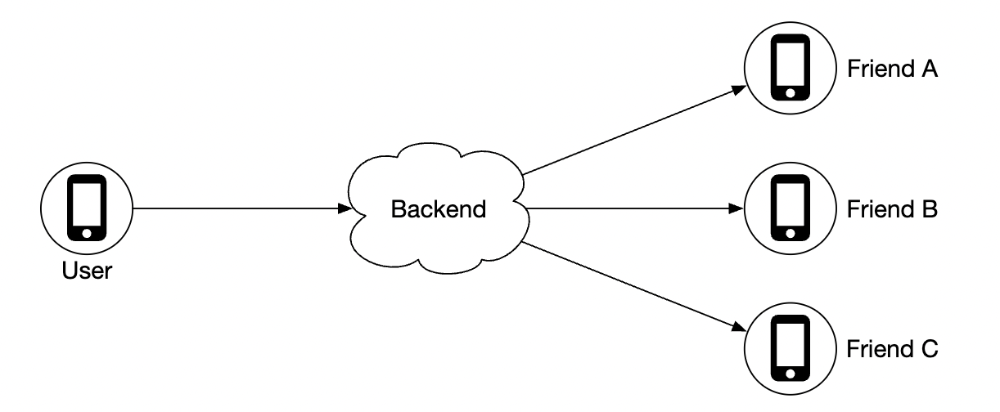
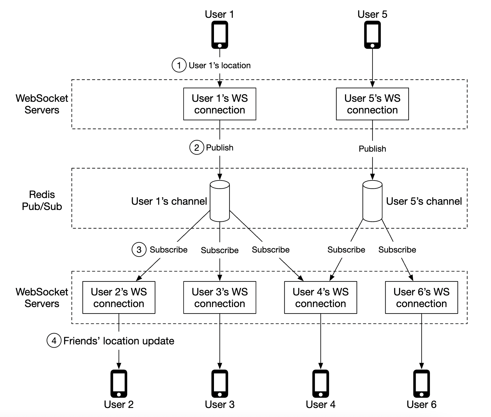
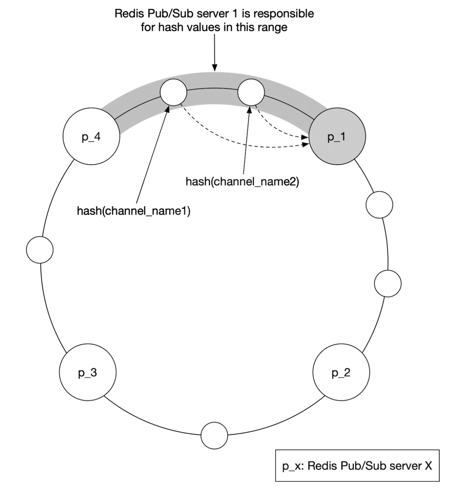
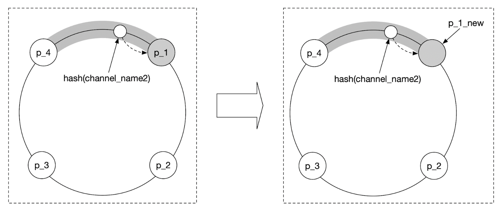

# 17. 设计附近的朋友

本章重点设计一个可扩展的后端系统，用于支持一个应用程序，用户可以分享自己的位置并发现附近的朋友。

与“邻近”章节的主要区别在于，在本问题中，位置是不断变化的，而在“邻近”章节中，商业地址大致保持不变。

## 第一步：理解问题并确定设计范围

一些引导面试的问题：

- **候选人**: “附近”的地理距离是多少？
- **面试官**: 5 英里，这个数字应该是可配置的。
- **候选人**: 距离是按直线距离计算，还是考虑如河流等障碍物？
- **面试官**: 是的，这是一个合理的假设。
- **候选人**: 应用有多少用户？
- **面试官**: 10 亿用户，其中 10%使用附近朋友功能。
- **候选人**: 我们需要存储位置历史吗？
- **面试官**: 是的，这对于例如机器学习可能有价值。
- **候选人**: 我们可以假设不活跃的朋友会在 10 分钟后从功能中消失吗？
- **面试官**: 是的。
- **候选人**: 我们需要担心 GDPR 等隐私法规吗？
- **面试官**: 不，为了简化设计不考虑这个问题。

### 功能需求

- 用户应能够在移动应用中看到附近的朋友。每个朋友都有一个距离和时间戳，表示位置何时更新。
- 附近朋友列表应每隔几秒更新一次。

### 非功能需求

- **低延迟** - 重要的是接收位置更新时没有太大的延迟。
- **可靠性** - 偶尔丢失数据点是可以接受的，但系统应保持一般可用。
- **最终一致性** - 位置数据存储不需要强一致性。不同副本之间的几秒延迟在接收位置数据时是可以接受的。

### 粗略估算

一些用来确定潜在规模的估算：

- 附近的朋友是指 5 英里半径内的朋友。
- 位置刷新间隔为 30 秒。由于人类步行速度较慢，因此不需要过于频繁地更新位置。
- 平均每天有 1 亿用户使用该功能，10%的用户同时在线，即 1000 万用户。
- 平均每个用户有 400 个朋友，所有朋友都在使用附近朋友功能。
- 应用每页显示 20 个附近的朋友。
- 位置更新 QPS = 1000 万 / 30 == ~34 万次更新每秒。

## 第二步：提出高层设计并获得认同

在探讨 API 和数据模型设计之前，我们首先要研究我们将使用的通信协议，因为它比传统的请求-响应通信模型要少见。

### 高层设计

从高层来看，我们希望建立有效的消息传递机制，以便在同行之间传递信息。虽然可以通过点对点协议实现，但这对于一个网络连接不稳定、功耗要求严格的移动应用并不实际。

一个更实际的方式是使用共享的后端作为一个向朋友扩展的机制：

后端做什么？

- 接收所有活跃用户的位置信息更新。
- 对每个位置更新，查找所有应该接收该信息的活跃用户，并将其转发给他们。
- 如果朋友之间的距离超出了配置的阈值，则不转发位置信息。

这听起来很简单，但挑战在于如何设计一个能应对我们所面临的规模的系统。

我们先从一个简单的设计开始，并在深入探讨时讨论更先进的方法：

- 负载均衡器将流量分发到 REST API 服务器和双向 WebSocket 服务器。
- REST API 服务器处理辅助任务，如管理朋友、更新个人资料等。
- WebSocket 服务器是有状态的，它将位置更新请求转发到相应的客户端。它还负责初始化时为移动客户端提供附近朋友的位置数据（稍后会详细讨论）。
- Redis 位置缓存用于存储每个活跃用户的最新位置数据。缓存中的每条记录都有 TTL。当 TTL 过期时，用户将不再活跃，并且他们的数据将从缓存中删除。
- 用户数据库存储用户和朋友数据。可以使用关系型数据库或 NoSQL 数据库来存储这些数据。
- 位置历史数据库存储用户位置数据的历史记录，这些数据不一定直接用于附近朋友功能，而是用于跟踪分析目的的历史数据。
- Redis 的 pub/sub 用于作为轻量级的消息总线，为每个用户的频道提供位置更新。

在上面的示例中，WebSocket 服务器订阅它们所连接用户的频道，并在收到位置更新时，将其转发给适当的用户。

### 定期位置更新

定期位置更新的流程如下：

- 移动客户端将位置更新发送到负载均衡器。
- 负载均衡器将位置更新转发到 WebSocket 服务器的持久连接。
- WebSocket 服务器将位置数据保存到位置历史数据库。
- 位置数据在位置缓存中更新。WebSocket 服务器还将在内存中保存位置数据，以便后续计算该用户的距离。
- WebSocket 服务器通过 Redis pub/sub 发布位置数据到该用户的频道。
- Redis pubsub 将位置更新广播到所有订阅该用户频道的服务器，即负责该用户朋友的服务器。
- 订阅的 WebSocket 服务器收到位置更新，计算哪些用户应该接收到该更新，并将其发送。

以下是相同流程的更详细版本：

平均而言，将转发 40 次位置更新，因为每个用户平均有 400 个朋友，其中 10%在任何时候都在线。

### API 设计

我们需要支持的 WebSocket 操作：

- **定期位置更新** - 用户将位置数据发送到 WebSocket 服务器。
- **客户端接收位置更新** - 服务器将朋友位置数据和时间戳发送给客户端。
- **WebSocket 客户端初始化** - 客户端发送用户位置，服务器返回附近朋友的位置数据。
- **订阅新朋友** - WebSocket 服务器向移动客户端发送朋友 ID，客户端应开始跟踪该朋友（例如，当朋友首次上线时）。
- **取消订阅朋友** - WebSocket 服务器向移动客户端发送朋友 ID，客户端应取消订阅（例如，朋友下线时）。

HTTP API - 用于处理辅助任务的传统请求/响应负载。

### 数据模型

- 位置缓存将存储`user_id`和`lat,long,timestamp`之间的映射。Redis 非常适合用于这个缓存，因为我们只关心当前的位置，并且它支持 TTL 过期，这对于我们的用例至关重要。
- 位置历史表存储相同的数据，但以关系表的形式存储，包含上述四列。可以使用 Cassandra 来存储这些数据，因为它针对写密集型负载进行了优化。

## 第三步：深入设计

让我们讨论如何扩展高层设计，以便在我们目标的规模下运行。

### 每个组件的扩展性如何？

- **API 服务器** - 可以通过自动扩展组和复制服务器实例轻松扩展。
- **WebSocket 服务器** - 我们可以轻松扩展 WebSocket 服务器，但需要确保在关闭服务器时优雅地关闭现有连接。例如，我们可以将服务器标记为“排空”状态，停止将连接发送到该服务器，最终将其从服务器池中移除。
- **客户端初始化** - 当客户端首次连接到服务器时，它将获取用户的朋友，订阅他们的 Redis pub/sub 频道，从缓存中获取他们的位置，最后将其转发给客户端。
- **用户数据库** - 我们可以根据`user_id`对数据库进行分片。也可以通过专门的服务和 API 暴露用户/朋友数据，由专门的团队管理。
- **位置缓存** - 我们可以通过启动多个 Redis 节点来轻松分片缓存。此外，TTL 对最大内存使用量做了限制。但我们仍然希望处理大量的写负载。
- **Redis pub/sub 服务器** - 我们利用没有在使用中的频道不会占用内存的特点。因此，我们可以为所有使用附近朋友功能的用户预分配频道，以避免在用户上线时需要处理新频道的创建和通知活跃的 WebSocket 服务器。

### 深入扩展 Redis pub/sub 组件

我们需要大约 200GB 的内存来维护所有的 pub/sub 频道。这可以通过使用两台各 100GB 的 Redis 服务器来实现。

考虑到我们每秒需要推送约 1400 万个位置更新，我们将需要至少 140 台 Redis 服务器来处理这么大的负载，假设每台服务器可以处理约 10 万个推送每秒。

因此，我们需要一个分布式 Redis 服务器集群来处理巨大的 CPU 负载。

为了支持分布式 Redis 集群，我们需要使用服务发现组件，如 Zookeeper 或 etcd，来跟踪哪些服务器是活跃的。

我们需要在服务发现组件中编码以下数据：

WebSocket 服务器使用从 Zookeeper 获取的编码数据来确定特定频道的位置。为了提高效率，

哈希环数据可以在每个 WebSocket 服务器上缓存。

对于扩展服务器集群，我们可以设置每日作业，根据历史流量数据按需扩展集群。我们还可以过度配置集群，以应对负载峰值。

Redis 集群可以被视为有状态存储服务器，因为频道的状态需要协调与订阅者的交互，以便在集群中新增节点时进行迁移。

在扩展操作期间，我们需要关注以下潜在问题：

- 在服务器迁移时，WebSocket 服务器可能会遇到大量的重新订阅请求。
- 在此过程中，某些客户端的位置更新可能会丢失，虽然这对问题是可以接受的，但我们仍然应尽量减少此类事件。可以考虑在一天流量最低时进行此操作。
- 我们可以利用一致性哈希来最小化在添加/移除服务器时需要迁移的频道数量。

### 添加/移除朋友

每当朋友添加/移除时，负责受影响用户的 WebSocket 服务器需要订阅/取消订阅该朋友的频道。

由于“附近朋友”功能是更大应用的一部分，我们可以假设，当任何事件发生时，移动客户端会注册一个回调，并向 WebSocket 服务器发送消息，执行适当的操作。

### 拥有许多朋友的用户

我们可以限制每个用户可以拥有的最大朋友数，例如 Facebook 最大朋友数为 5000。

处理“鲸鱼”用户的 WebSocket 服务器可能会有更大的负载，但只要我们有足够的 WebSocket 服务器，就可以应对。

### 随机附近的人

如果面试官希望更新设计，加入一个功能，偶尔能看到一个随机的人出现在附近朋友的地图上怎么办？

一种解决方法是定义一个基于地理哈希的 pub/sub 频道池：

任何位于该地理哈希范围内的人都订阅相应的频道，以接收随机用户的位置更新：

我们还可以订阅多个地理哈希，以处理某个用户接近边界地理哈希的情况：

### Redis pub/sub 的替代方案

使用 Redis 作为 pub/sub 的替代方案是利用 Erlang - 一种为分布式计算应用优化的通用编程语言。

我们可以生成数百万个小的 Erlang 进程来进行相互通信。我们可以在分布式 Erlang 应用程序中处理 WebSocket 连接和 pub/sub 频道。

然而，使用 Erlang 的挑战在于，它是一种小众编程语言，可能很难找到强大的 Erlang 开发者。

## 第四步：总结

我们成功地设计了一个支持附近朋友功能的系统。

核心组件：

- WebSocket 服务器 - 用于客户端与服务器之间的实时通信
- Redis - 用于快速读取和写入位置数据 + pub/sub 频道

我们还探讨了如何扩展 REST API 服务器、WebSocket 服务器、数据层、Redis pub/sub 服务器，并探讨了使用 Redis Pub/Sub 的替代方案。我们还探讨了“随机附近的人”功能。
