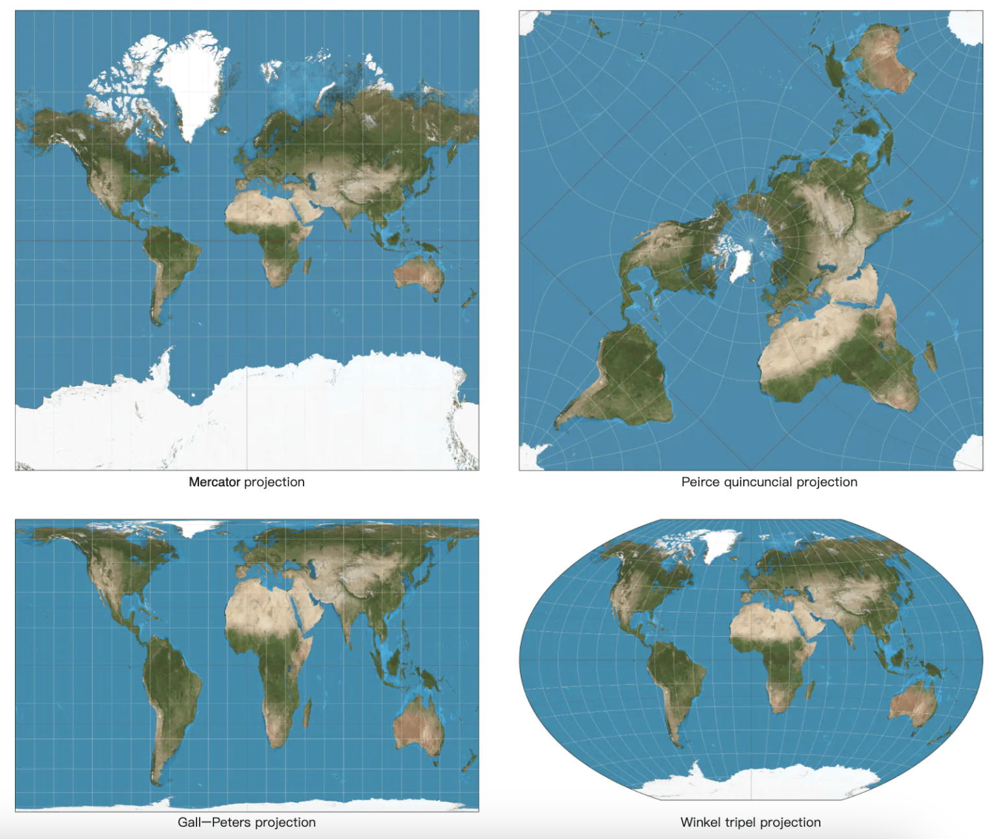
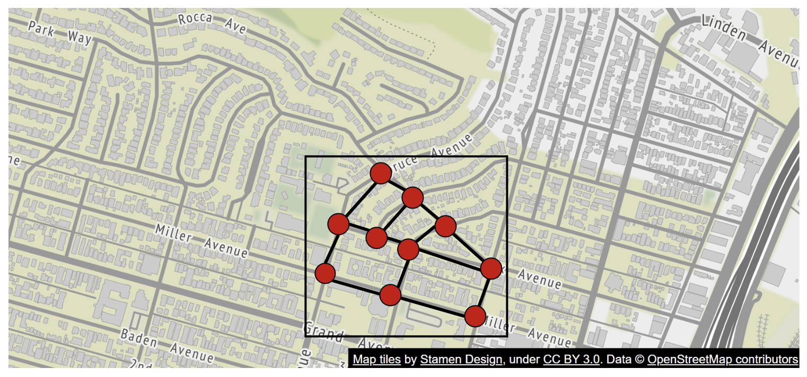
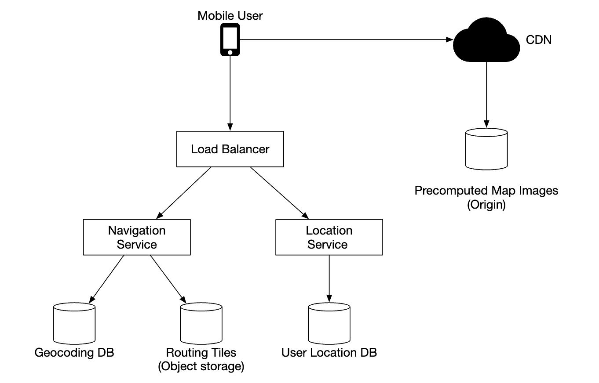
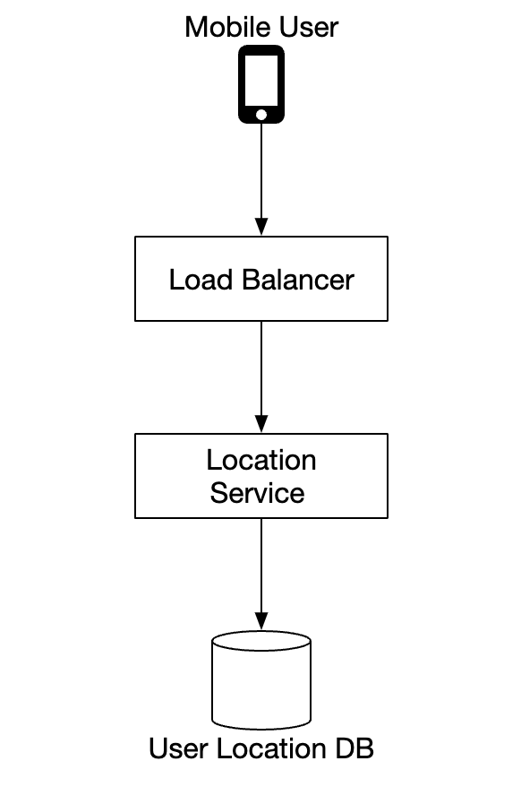
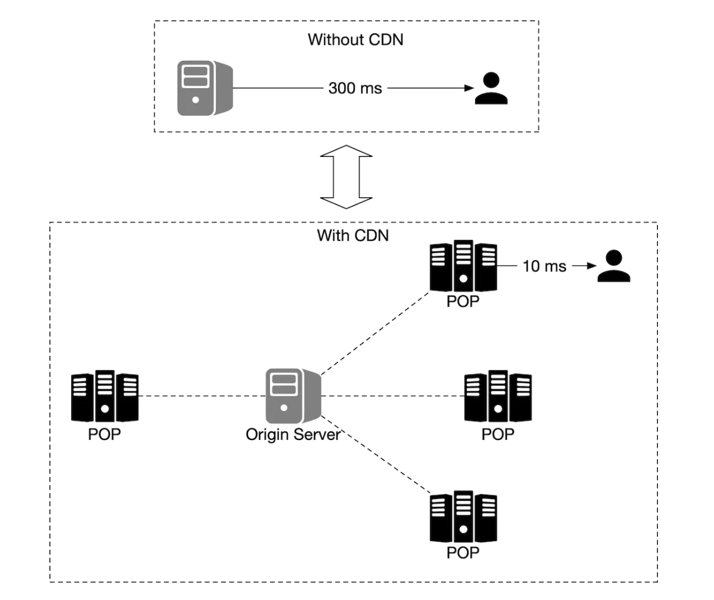
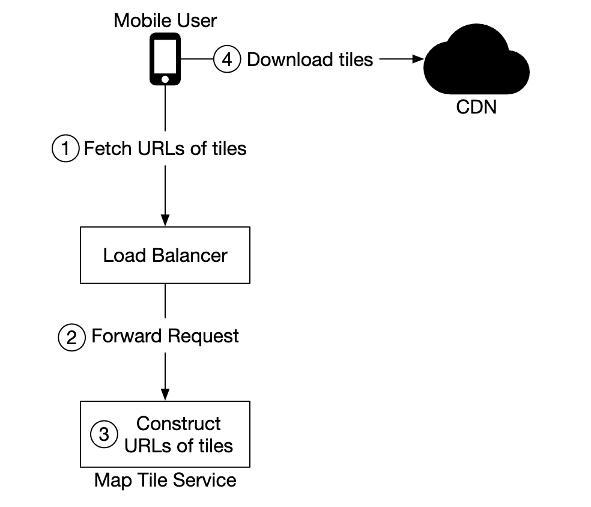
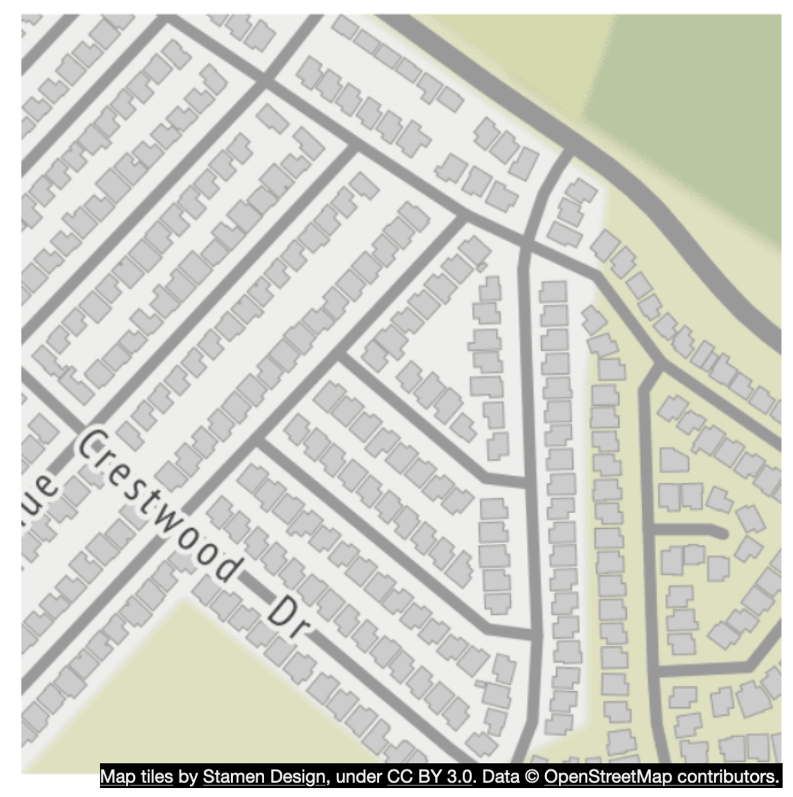
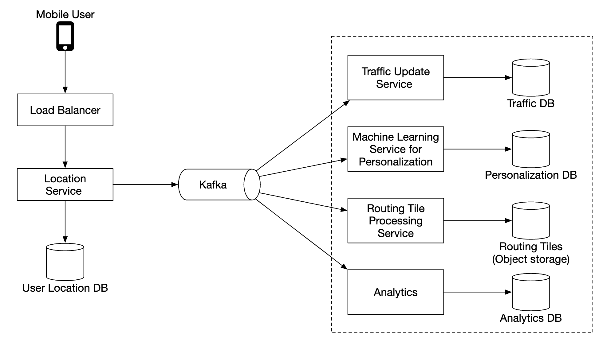
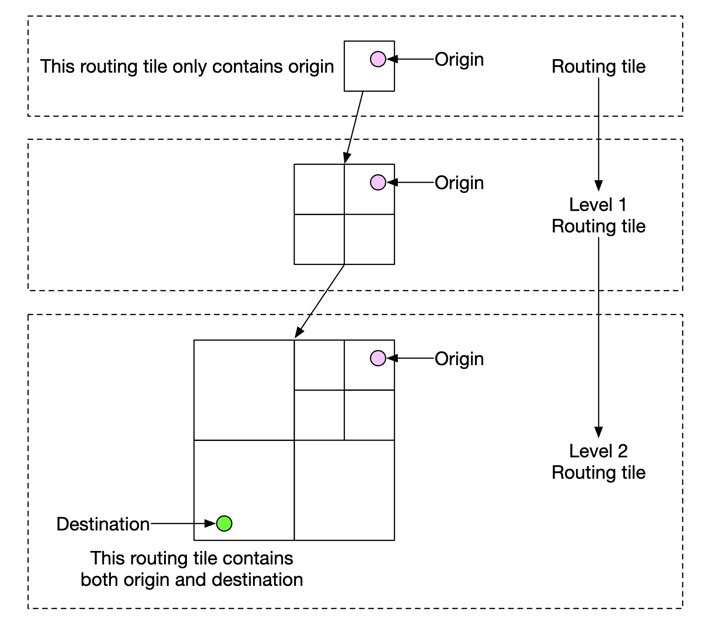
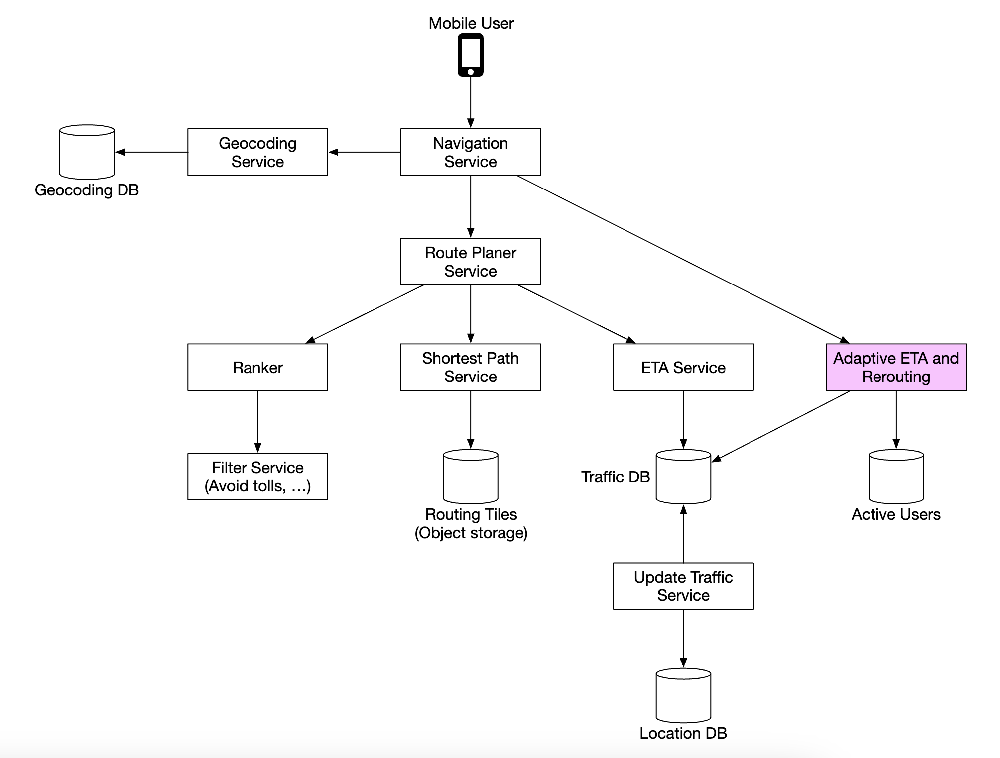

# 18. 设计 Google Maps

我们将设计一个简化版本的 Google Maps。

关于 Google Maps 的一些事实：

- 启动于 2005 年
- 提供各种服务：卫星影像、街道地图、实时交通状况、路线规划
- 到 2021 年，拥有 10 亿日活跃用户，全球覆盖率为 99%，每天更新 2500 万条实时位置信息

## 第一步：理解问题并确定设计范围

候选人和面试官之间的问答示例：

- **候选人**: 我们要处理多少日活跃用户？
- **面试官**: 10 亿 DAU
- **候选人**: 我们应该专注于哪些功能？
- **面试官**: 位置信息更新、导航、预计到达时间 (ETA)、地图渲染
- **候选人**: 路况数据有多大？我们可以访问吗？
- **面试官**: 我们从多个来源获得了路况数据，原始数据为 TB 级
- **候选人**: 我们需要考虑交通状况吗？
- **面试官**: 是的，考虑交通状况是必要的，以便提供准确的时间估算
- **候选人**: 那不同的出行方式（步行、骑行、驾车）呢？
- **面试官**: 我们应该支持这些
- **候选人**: 多站点的路线规划呢？
- **面试官**: 这部分我们不考虑，面试范围内不讨论
- **候选人**: 商业地点和照片呢？
- **面试官**: 好问题，但不需要考虑这些

我们将专注于三个关键功能：用户位置更新、导航服务（包括 ETA）、地图渲染。

### 非功能性需求

- 准确性：用户不应获得错误的导航路线
- 平滑导航：用户应该体验到平滑的地图渲染
- 数据和电池使用：客户端应尽可能少地使用数据和电池，对于移动设备尤为重要。
- 一般的可用性和可扩展性需求

### 粗略估算

对于存储，我们需要存储：

- 世界地图：估计为 ~70PB，考虑到所有需要存储的切片，并且对非常相似的切片（例如广阔的沙漠）进行压缩
- 元数据：大小可以忽略，因此我们不计算
- 路况信息：以（routing tiles）形式存储

估计的导航请求 QPS：

- 10 亿日活跃用户，每周使用 35 分钟 -> 每天 50 亿分钟。
- 假设 GPS 更新请求是批量处理的，得出 QPS 为 20 万；
- 峰值负载时 QPS 为 100 万。

---

在进入设计之前，有一些与地图相关的概念我们需要理解。

### 定位系统

地球是一个球体，围绕其轴线旋转。位置由纬度（指示你离赤道的距离）和经度（指示你离本初子午线的距离）来定义：


### 从 3D 到 2D

将 3D 坐标转换为 2D 平面的过程称为“地图投影”。

有不同的方法来实现这一点，每种方法都有其优缺点。几乎所有的方法都会扭曲实际的几何形状。



Google Maps 选择了 Mercator 投影的修改版，称为“Web Mercator”。

### 地理编码（Geocoding）

地理编码是将地址转换为地理坐标的过程。

反向过程称为“反向地理编码”。

实现这一过程的一种方式是使用插值：利用来自不同来源的数据（如 GIS）将街道网络映射到地理坐标空间。

### 地理哈希（Geohashing）

地理哈希是一种编码系统，它将一个地理区域编码成由字母和数字组成的字符串。

它将地球视为一个平坦的表面，并递归地将其划分为四个象限：


### 地图渲染

地图渲染通过切片进行，我们没有选择将整个地图作为一张大的自定义图像渲染，而是将世界分解成更小的切片。

客户端只下载相关的切片，并像拼接拼图一样进行渲染。

不同的缩放级别有不同的切片，客户端根据缩放级别选择合适的切片。

例如，缩小到全球视图时，只会下载一张 256x256 的切片，代表整个世界。

### 导航算法中的道路数据处理

在大多数路径规划算法中，道路被抽象成一个图（graph），交叉点表示为节点，道路表示为边：



大多数导航算法使用修改版的 Dijkstra 或 A\* 算法。

路径寻找性能对图的大小非常敏感，为了支持大规模应用，我们不能将整个世界表示为一个图并在其上运行算法。

相反，我们采用类似于切片的技术：将世界划分为越来越小的图。

路由切片（Routing Tiles）持有相邻切片的引用，算法可以在遍历相互连接的切片时，将更大的道路图拼接起来：


这种技术使我们能够显著减少内存带宽，只加载我们需要的切片来处理给定的起点/终点对。

然而，对于较长的路线，拼接小而详细的（routing tiles）仍然会消耗时间和内存。为了解决这个问题，我们使用具有不同详细程度的（routing tiles），并根据目的地选择适当详细程度的切片：


## 第二步：提出高层设计并获得认可



### 位置服务（Location service）



位置服务负责记录用户的位置信息更新：

- 每 `t` 秒发送一次位置更新
- 位置数据流可用于逐步改进服务，例如提供更准确的 ETA、监控交通数据、检测封闭道路、分析用户行为等

为了避免每次都向服务器发送位置更新，我们可以在客户端批量更新并发送批量数据：


尽管进行了优化，但对于像 Google Maps 这样规模的系统，负载仍然会很大。因此，我们可以使用像 Cassandra 这样的数据库，它对高频写入进行了优化。

我们还可以利用 Kafka 来高效处理位置更新流，以便进一步分析。

位置更新请求示例：

```
POST /v1/locations
参数
  locs: JSON 编码的 (纬度，经度，时间戳) 元组数组。
```

### 导航服务（Navigation service）

导航组件负责在合理的时间内找到 A 和 B 之间的快速路线（少量延迟是可以接受的）。路线不必是最快的，但准确性至关重要。

请求负载示例：

```
GET /v1/nav?origin=1355+market+street,SF&destination=Disneyland
```

响应示例：

```
{
  "distance": {"text":"0.2 mi", "value": 259},
  "duration": {"text": "1 min", "value": 83},
  "end_location": {"lat": 37.4038943, "Ing": -121.9410454},
  "html_instructions": "Head <b>northeast</b> on <b>Brandon St</b> toward <b>Lumin Way</b><div style=\"font-size:0.9em\">Restricted usage road</div>",
  "polyline": {"points": "_fhcFjbhgVuAwDsCal"},
  "start_location": {"lat": 37.4027165, "lng": -121.9435809},
  "geocoded_waypoints": [
    {
       "geocoder_status" : "OK",
       "partial_match" : true,
       "place_id" : "ChIJwZNMti1fawwRO2aVVVX2yKg",
       "types" : [ "locality", "political" ]
    },
    {
       "geocoder_status" : "OK",
       "partial_match" : true,
       "place_id" : "ChIJ3aPgQGtXawwRLYeiBMUi7bM",
       "types" : [ "locality", "political" ]
    }
  ],
  "travel_mode": "DRIVING"
}
```

交通变化和重新规划路径将在深入分析部分讨论。

### 地图渲染

在客户端存储整个地图数据集是不可行的，因为它的大小是 PB 级的。

这些数据需要根据客户端的位置和缩放级别按需从服务器获取。

何时应获取新切片：用户在缩放地图，或导航时向新切片前进时。

如何将地图切片提供给客户端？

- 可以动态构建，但这会给服务器带来巨大的负载，并且使缓存变得困难
- 地图切片可以根据地理哈希静态提供，客户端可以计算这些哈希。它们可以

被静态存储，并通过 CDN 提供


CDN 使得用户可以从最靠近用户的服务节点（POP）获取地图切片，以减少延迟：



决定地图切片的选项：

- 地图切片的地理哈希可以在客户端计算。如果是这种方式，我们应该长期支持这种地图切片计算方式，保证应用更新时的后向兼容，因为引导用户更新客户端是困难的。
- 另外，我们可以提供一个简单的 API，计算地图切片的 URL，并为客户端提供服务，代价是额外的 API 调用



## 第三步：设计深度分析

### 数据模型

首先，我们来讨论如何存储系统所处理的不同类型的数据。

#### 路由切片

初始的道路数据集来自不同的来源，随着位置更新数据的不断增加，数据会逐渐得到改进。

道路数据是非结构化的。我们有一个周期性的离线处理任务，将这些原始数据转换为我们应用程序需要的基于图的路由切片。

我们不需要使用数据库来存储这些切片，因为我们不需要任何数据库的功能。我们可以将它们存储在 S3 对象存储中，并进行积极的缓存。

我们还可以利用库将邻接列表有效地压缩成二进制文件。

#### 用户位置数据

用户位置数据对更新交通状况和进行各种其他分析非常有用。

我们可以使用 Cassandra 来存储这类数据，因为它的特点是写入频繁。

示例行：


#### 地理编码数据库

这个数据库存储经纬度对和地点之间的键值对。

我们可以使用 Redis，因为它具有快速的读取访问速度，而我们的读取频繁且写入不多。

#### 预计算的世界地图图像

如前所述，我们将预计算地图切片图像并将其存储在 CDN 中。



### 位置服务

接着，让我们专注于数据库设计，并详细说明如何存储用户位置数据。


我们可以使用 NoSQL 数据库来支持我们在位置更新上的重写负载。我们优先考虑可用性而非一致性，因为用户位置数据经常发生变化，容易过时。

我们将选择 Cassandra 作为我们的数据库选择，因为它很好地满足了我们的所有需求。

我们将存储的示例行：


- `user_id` 是分区键，用于快速访问特定用户的所有位置更新
- `timestamp` 是聚类键，用于按位置更新接收的时间对数据进行排序

我们还利用 Kafka 将位置更新流式传输到其他需要位置更新的服务：



### 渲染地图

地图切片存储在不同的缩放级别下，在最低缩放级别，整个世界由一个 256x256 的切片表示。

随着缩放级别的增加，地图切片的数量增加四倍：


我们可以使用的一种优化方法是，不通过网络发送整个图像信息，而是将切片表示为向量（路径和多边形），并让客户端动态渲染切片。

这将大大节省带宽。

### 导航服务

导航服务负责找到最快的路线：


让我们逐个查看这个子系统中的每个组件。

首先，我们有地理编码服务，它将地址解析为经纬度对的位置。

示例请求：

```
https://maps.googleapis.com/maps/api/geocode/json?address=1600+Amphitheatre+Parkway,+Mountain+View,+CA
```

示例响应：

```
{
   "results" : [
      {
         "formatted_address" : "1600 Amphitheatre Parkway, Mountain View, CA 94043, USA",
         "geometry" : {
            "location" : {
               "lat" : 37.4224764,
               "lng" : -122.0842499
            },
            "location_type" : "ROOFTOP",
            "viewport" : {
               "northeast" : {
                  "lat" : 37.4238253802915,
                  "lng" : -122.0829009197085
               },
               "southwest" : {
                  "lat" : 37.4211274197085,
                  "lng" : -122.0855988802915
               }
            }
         },
         "place_id" : "ChIJ2eUgeAK6j4ARbn5u_wAGqWA",
         "plus_code": {
            "compound_code": "CWC8+W5 Mountain View, California, United States",
            "global_code": "849VCWC8+W5"
         },
         "types" : [ "street_address" ]
      }
   ],
   "status" : "OK"
}
```

路线规划服务根据当前的交通状况计算建议路线，优化旅行时间。

最短路径服务运行一种变种的 A\* 算法，在对象存储中的路由切片上计算最优路径：

- 它接收源/目的地对，将其转换为经纬度对，并从这些对中推导出地理哈希，以确定路由切片
- 算法从初始路由切片开始，开始遍历直到找到一个到目的地切片的合理路径


ETA 服务被路线规划服务调用，以基于机器学习算法根据交通数据预测 ETA（预计到达时间）。

排序服务负责根据用户传递的过滤器对不同的路径进行排序，比如避免收费公路或高速公路等标志。

更新服务异步更新一些重要的数据库，以保持它们的最新状态。

### 改进 - 自适应 ETA 和重新规划路线

我们可以进行的一项改进是，根据新获取的交通数据自适应更新正在进行的路线。

一种实现方式是，通过存储用户正在导航的路线中的所有切片，将这些用户存储在数据库中。

数据可能如下所示：

```
user_1: r_1, r_2, r_3, …, r_k
user_2: r_4, r_6, r_9, …, r_n
user_3: r_2, r_8, r_9, …, r_m
...
user_n: r_2, r_10, r21, ..., r_l
```

如果某个切片发生交通事故，我们可以识别出所有经过该切片的用户，并重新规划他们的路线。

为了减少我们在数据库中存储的切片数量，我们可以改为存储起始路由切片和几个不同分辨率级别的路由切片，直到目的地切片也被包含在内：

```
user_1, r_1, super(r_1), super(super(r_1)), ...
```



通过这种方式，我们只需要检查用户的最终切片是否包含交通事故的切片，从而判断用户是否受到影响。

我们还可以跟踪正在导航的用户的所有可能路线，并在有更快的重新规划路径时通知他们。

### 传输协议

我们有几种选择，可以让我们主动从服务器向客户端推送数据：

- 移动推送通知不适用，因为负载有限，且不适用于 Web 应用
- WebSocket 通常比长轮询更好，因为它对服务器的计算负担较小
- 我们还可以使用服务器推送事件（SSE），但更倾向于使用 WebSocket，因为它支持双向通信，这在例如最后一公里配送功能中非常有用

## 第四步：总结

这是我们的最终设计：



我们可以提供的一个附加功能是多站点导航，这可以出售给像 Uber 或 Lyft 这样的企业客户，以确定访问一组位置的最优路径。
