# 19. 设计分布式消息队列

在本章中，我们将设计一个分布式消息队列。

消息队列的优势：

- **解耦** - 消除组件之间的紧耦合，使它们能够独立更新。
- **提高可扩展性** - 生产者和消费者可以根据流量独立扩展。
- **增加可用性** - 如果系统的一部分出现故障，其他部分仍然可以与队列交互。
- **更好的性能** - 生产者可以在不等待消费者确认的情况下生成消息。

一些流行的消息队列实现 - Kafka、RabbitMQ、RocketMQ、Apache Pulsar、ActiveMQ、ZeroMQ。

严格来说，Kafka 和 Pulsar 并不是消息队列，它们是事件流平台。然而，它们的功能有重叠，这使得消息队列与事件流平台之间的区别变得模糊。

在本章中，我们将构建一个支持更多高级功能的消息队列，例如长时间的数据保留、重复消息消费等。

## 第一步：理解问题并确定设计范围

消息队列应该支持一些基本功能——生产者生成消息，消费者消费消息。然而，关于性能、消息投递、数据保留等方面，有不同的考虑。

以下是候选人和面试官之间的一组潜在问题：

- **候选人**:消息的格式和平均大小是什么？是文本吗？
- **面试官**:消息是文本格式，通常只有几 KB。
- **候选人**:消息可以被重复消费吗？
- **面试官**:是的，消息可以被不同的消费者重复消费。这是一个额外的要求，传统的消息队列不支持。
- **候选人**:消息消费的顺序是否与生产顺序一致？
- **面试官**:是的，应该保持顺序保证。传统的消息队列不支持这个要求。
- **候选人**:数据保留的要求是什么？
- **面试官**:消息需要保留两周。这是一个额外的要求。
- **候选人**:我们希望支持多少生产者和消费者？
- **面试官**:越多越好。
- **候选人**:我们希望支持什么数据投递语义？最多一次、至少一次、精确一次？
- **面试官**:我们肯定希望支持至少一次。理想情况下，我们可以支持所有语义，并且可以配置。
- **候选人**:端到端延迟的目标吞吐量是什么？
- **面试官**:应该支持高吞吐量的用例，例如日志聚合，同时也支持低吞吐量的传统用例。

### 功能需求：

- 生产者将消息发送到消息队列
- 消费者从队列中消费消息
- 消息可以被消费一次或多次
- 历史数据可以被截断
- 消息大小在 KB 范围内
- 消息顺序需要保持
- 数据投递语义可配置 - 最多一次 / 至少一次 / 精确一次。

### 非功能性需求：

- 高吞吐量或低延迟，可根据用例进行配置
- 可扩展性 - 系统应为分布式，并支持突发消息量
- 持久化和耐久性 - 数据应持久化到磁盘，并在节点之间复制

传统的消息队列通常不支持数据保留，并且不提供顺序保证。这个要求大大简化了设计，我们将对此进行讨论。

## 第二步：提出高层次设计并获得认可

消息队列的关键组件：

- 生产者将消息发送到队列
- 消费者订阅队列并消费订阅的消息
- 消息队列是位于中间的服务，解耦生产者与消费者，使它们可以独立扩展。
- 生产者和消费者都是客户端，而消息队列是服务器。

### 消息模型

第一种消息模型是点对点模式，这是传统消息队列中常见的模式：

- 消息被发送到队列，并且只有一个消费者会消费该消息。
- 可以有多个消费者，但一条消息只会被消费一次。
- 一旦消息被确认消费，它就会从队列中删除。
- 在点对点模型中没有数据保留，但在我们的设计中有数据保留。

另一方面，发布-订阅模型在事件流平台中更为常见：

- 在这种模型中，消息与主题相关联。
- 消费者订阅某个主题，接收发送到该主题的所有消息。

### 主题、分区和代理

如果某个主题的数据量过大怎么办？一种扩展方法是将一个主题分割成多个分区（即分片）：

- 发送到某个主题的消息会均匀地分布到各个分区
- 托管分区的服务器称为代理（Brokers）
- 每个主题像队列一样使用 FIFO（先进先出）进行消息处理。消息顺序在分区内保持。
- 消息在分区中的位置称为偏移量（offset）。
- 每条生产的消息都会发送到特定的分区。分区键用于指定消息应该进入哪个分区。例如，可以使用`user_id`作为分区键，以保证同一用户的消息顺序。
- 每个消费者订阅一个或多个分区。当多个消费者处理相同的消息时，它们会组成一个消费者组。

### 消费者组

消费者组是一组消费者共同工作，从主题中消费消息：

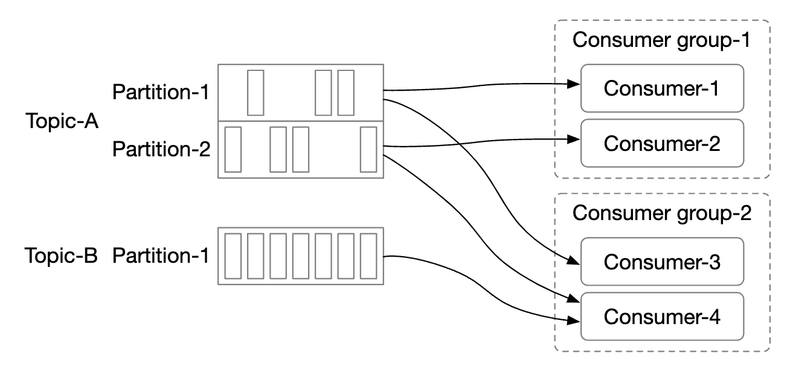

- 消息是按消费者组复制的（而不是按消费者复制）。
- 每个消费者组维护自己的偏移量。
- 消费者组并行读取消息可以提高吞吐量，但会影响顺序保证。
- 可以通过只允许消费者组中的一个消费者订阅一个分区来减轻这个问题。
- 这意味着，我们不能在一个组中有比分区更多的消费者。

### 高层次架构

- 客户端是生产者和消费者。生产者将消息推送到指定的主题。消费者组订阅主题中的消息。
- 代理持有多个分区。每个分区存储主题的消息子集。
- 数据存储在分区中存储消息。
- 状态存储用于存储消费者状态。
- 元数据存储存储配置和主题属性。
- 协调服务负责服务发现（哪些代理存活）和领导者选举（哪个代理是领导者，负责分配分区）。

## 第三步：设计深入分析

为了实现高吞吐量并保持较高的数据保留要求，我们做了一些重要的设计选择：

- 我们选择了基于磁盘的数据结构，利用现代硬盘（HDD）的特性和现代操作系统的磁盘缓存策略。
- 消息数据结构是不可变的，以避免额外的复制，这在高流量/高并发的系统中是需要避免的。
- 我们的写入设计采用批量写入，因为小型 I/O 操作是高吞吐量的敌人。

### 数据存储

为了找到最适合存储消息的数据存储方式，我们必须先检查消息的特性：

- 写多读少
- 没有更新/删除操作。在传统的消息队列中，有一个“删除”操作，因为消息不需要保留。
- 主要是顺序读取/写入模式。

我们的选择有哪些：

- 数据库 - 不是理想选择，因为典型的数据库无法很好地支持写多读多的系统。
- 写前日志（WAL） - 一个纯文本文件，只支持追加写入，非常适合硬盘（HDD）。我们将分区分割成段，以避免维护一个非常大的文件。
- 旧的段是只读的。写入操作只会在最新的段中接受。

WAL 文件在传统 HDD 上使用时非常高效。

有一个误解认为硬盘访问速度慢，但这很大程度上取决于访问模式。当访问模式是顺序的（如我们的情况），硬盘可以达到每秒几 MB 的写入/读取速度，足以满足我们的需求。我们还借助操作系统会积极将磁盘数据缓存到内存中的特点。

### 消息数据结构

重要的是，消息模式在生产者、队列和消费者之间必须保持一致，以避免额外的复制。这能使得处理更高效。

消息结构示例：

消息的键指定消息所属的分区。一个示例映射是 `hash(key) % numPartitions`。
为了更灵活，生产者可以覆盖默认键，以控制消息分配到哪个分区。

消息值是消息的有效载荷。它可以是明文或压缩的二进制块。

注：消息键与传统的键值存储不同，不需要唯一。允许有重复的键，甚至可以没有键。

其他消息文件：

- 主题：消息所属的主题
- 分区：消息所属的分区 ID
- 偏移量：消息在分区中的位置，可以通过`topic`、`partition`、`offset`来定位消息。
- 时间戳：消息存储的时间
- 大小：消息的大小
- CRC：校验和，用于确保消息的完整性

可以通过添加额外字段来支持更多功能，如消息过滤。

### 批量处理

批量处理对系统性能至关重要。我们在生产者、消费者和消息队列中都应用了批量处理。

它之所以关键，是因为：

- 它允许操作系统将消息组合在一起，摊销昂贵的网络往返成本
- 消息按顺序写入 WAL，这导致大量的顺序写入和磁盘缓存。

延迟和吞吐量之间存在权衡：

- 高批量处理导致高吞吐量和较高的延迟。
- 较少的批量处理导致较低的吞吐量和较低的延迟。

如果我们需要支持较低的延迟，因为该系统作为传统消息队列部署，可以通过调整使用更小的批量大小来优化系统。

如果针对吞吐量进行优化，我们可能需要为每个主题增加更多的分区，以补偿较慢的顺序磁盘写入吞吐量。

### 生产者流程

如果生产者想要将消息发送到某个分区，它应该连接到哪个代理？

一种选择是引入路由层，路由层将消息路由到正确的代理。如果启用了复制，那么正确的代理是领导者副本：

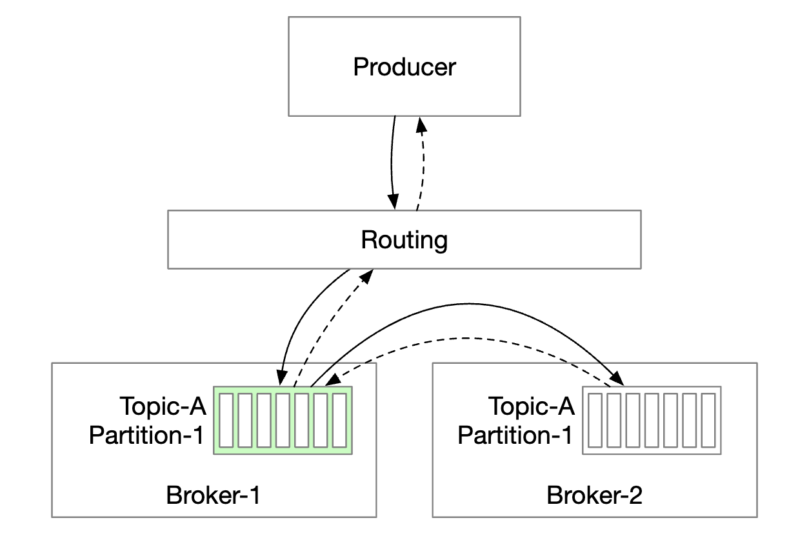

- 路由层从元数据存储读取复制计划并将其缓存到本地。
- 生产者将消息发送到路由层。
- 消息被转发到分区的领导者代理（例如代理 1）。
- 从领导者复制的副本拉取新消息。一旦收到足够的确认，领导者提交数据并响应生产者。

拥有副本的原因是为了实现容错。

这种方法有效，但也有一些缺点：

- 由于增加了一个额外的组件，网络跳数增加。
- 这种设计不支持消息批量处理。

为了缓解这些问题，我们可以将路由层嵌入到生产者中：

- 更少的网络跳数意味着较低的延迟。
- 生产者可以控制消息被路由到哪个分区。
- 缓冲区允许我们将消息批量存储在内存中，并在一个请求中发送更大的批量，从而提高吞吐量。

批量大小的选择是吞吐量和延迟之间的经典权衡。

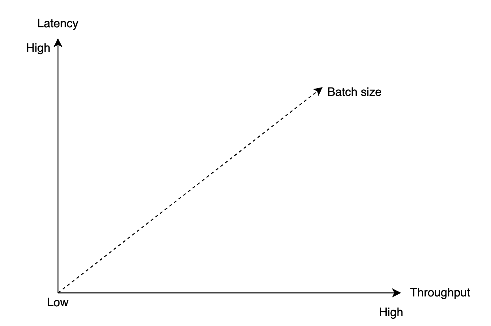

- 更大的批量大小会导致在提交批量之前更长的等待时间。
- 更小的批量大小会导致请求更快地发送，从而具有较低的延迟，但吞吐量较低。

### 消费者流程

消费者指定其在分区中的偏移量，并从该偏移量开始接收一批消息：

在设计消费者时，一个重要的考虑因素是是否使用推送模型还是拉取模型：

- 推送模型由于代理在接收消息时推送给消费者，因此具有较低的延迟。但是，如果消费速率落后于生产速率，消费者可能会被淹没。
- 处理具有不同处理能力的消费者比较困难，因为代理控制着消费速率。
- 拉取模型使消费者控制消费速率。如果消费速率较慢，消费者不会被淹没，并且我们可以扩展它以赶上。
- 拉取模型更适合批处理，因为在推送模型中，代理无法知道消费者能处理多少消息。
- 另一方面，在拉取模型中，消费者可以积极地抓取大批量的消息。
- 缺点是如果没有新消息，则会有更高的延迟和额外的网络调用。后者可以通过长轮询来缓解。

因此，大多数消息队列（包括我们）选择了拉取模型。

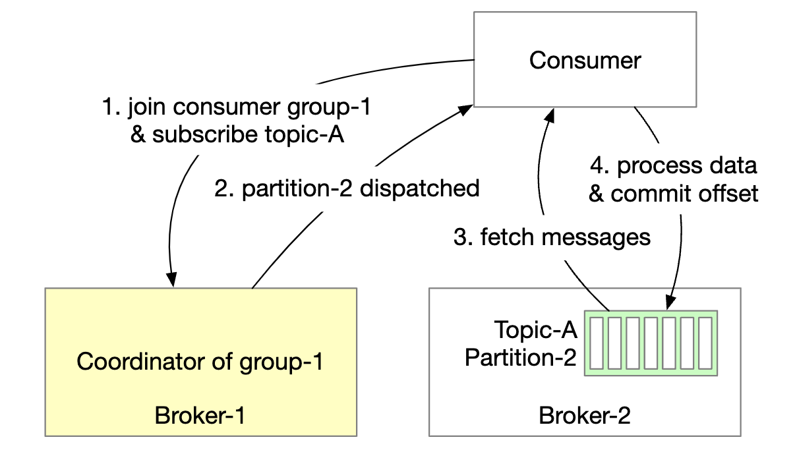

- 新消费者订阅主题 A 并加入组 1。
- 通过对组名进行哈希计算找到正确的代理节点。这样，组中的所有消费者都连接到相同的代理。
- 请注意，这个消费者组协调器与协调服务（如 ZooKeeper）不同。
- 协调器确认消费者已加入组并将分区 2 分配给该消费者。
- 有不同的分区分配策略 - 轮询、范围等。
- 消费者从最后一个偏移量开始拉取最新的消息。状态存储保持消费者的偏移量。
- 消费者处理消息并将偏移量提交给代理。操作的顺序影响消息投递语义。

### 消费者重新平衡

消费者重新平衡负责决定哪些消费者负责哪些分区。

这个过程发生在消费者加入/离开或者分区添加/删除时。

代理作为协调者，在协调重新平衡工作流中扮演着重要角色。

- 来自同一组的所有消费者都连接到相同的协调器。协调器通过对组名进行哈希计算找到。
- 当消费者列表发生变化时，协调器选择一个新的组领导者。
- 组的领导者计算新的分区调度计划，并将其报告给协调器，协调器再将其广播给其他消费者。

当协调器停止接收组内消费者的心跳时，会触发重新平衡：

让我们探索一下消费者加入组时发生的事情：

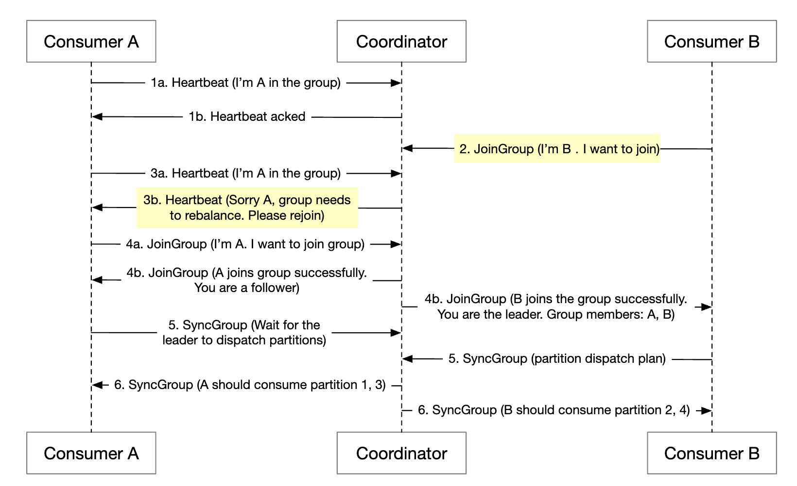

- 最初，只有消费者 A 在组中，它消费所有分区。
- 消费者 B 发送请求加入该组。
- 协调器通知所有组成员，它是时候被动地进行重新平衡了——响应心跳。
- 一旦所有消费者重新加入组，协调器选择一个领导者并通知其他成员选举结果。
- 领导者生成分区调度计划并将其发送给协调器，其他成员等待该调度计划。
- 消费者开始从新分配的分区消费。

这是消费者离开组时发生的事情：

- 消费者 A 和 B 在同一组。
- 消费者 B 请求离开该组。
- 当协调器接收到 A 的心跳时，它会通知他们进行重新平衡。
- 其余步骤相同。

当消费者长时间没有发送心跳时，过程也类似：

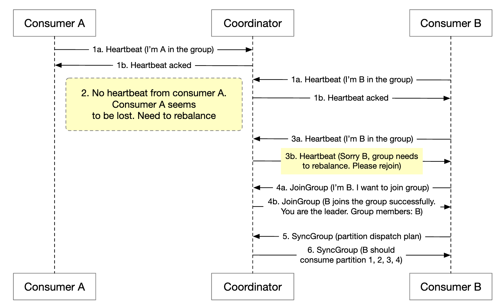

### 状态存储

状态存储用于存储分区和消费者之间的映射，以及分区的最后消费偏移量。

组 1 的偏移量为 6，意味着所有之前的消息都已被消费。如果消费者崩溃，新消费者将从该消息继续。

消费者状态的数据访问模式：

- 频繁的读/写操作，但数据量低。
- 数据频繁更新，但很少删除。
- 随机读/写。
- 数据一致性很重要。

考虑到这些需求，快速的 KV 存储，如 Zookeeper，非常适合。

### 元数据存储

元数据存储用于存储配置和主题属性——分区数量、保留周期、复制分布。

元数据变化不频繁，数据量较小，但对一致性要求很高。Zookeeper 是一个不错的选择。

### ZooKeeper

ZooKeeper 是构建分布式消息队列的关键组件。

它是一个层次化的键值存储，通常用于分布式配置、同步服务和命名注册表（即服务发现）。

通过这个变化，代理只需要维护消息的数据。元数据和状态存储则保存在 Zookeeper 中。

Zookeeper 还帮助进行代理副本的领导者选举。

### 复制

在分布式系统中，硬件问题是不可避免的。我们可以通过复制来解决这个问题，以实现高可用性。

- 每个分区在多个代理之间进行复制，但只有一个领导者副本。
- 生产者将消息发送到领导者副本。
- 追随者从领导者拉取复制的消息。
- 一旦足够的副本同步完成，领导者返回确认给生产者。
- 每个分区的副本分布被称为副本分布计划。
- 给定分区的领导者创建副本分布计划并将其保存在 Zookeeper 中。

### 同步副本

我们需要解决的一个问题是确保消息在领导者和追随者之间保持同步。

同步副本（ISR）是与领导者保持同步的分区副本。

`replica.lag.max.messages` 定义了副本滞后于领导者多少消息后被认为是同步的。

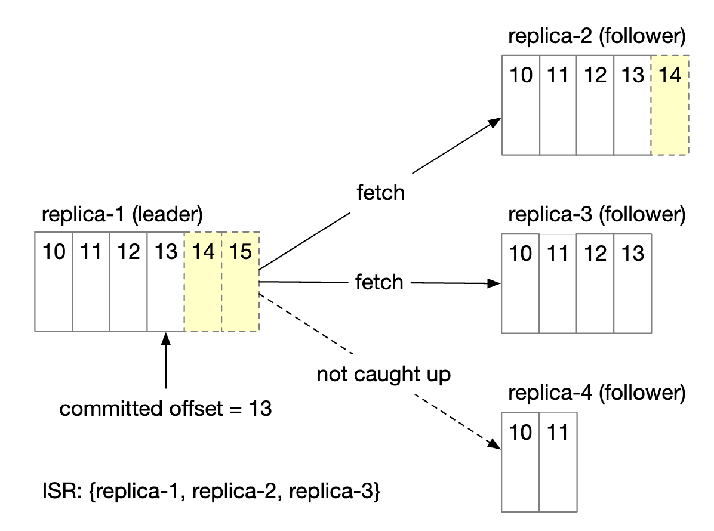

- 已提交的偏移量是 13。
- 两条新消息写入到领导者，但尚未提交。
- 一条消息在所有 ISR 副本同步该消息后才会被提交。
- 副本 2 和 3 完全追赶上领导者，因此它们在 ISR 中。
- 副本 4 落后，因此它暂时被移出 ISR。

ISR 反映了性能和耐久性之间的权衡。

- 为了避免生产者丢失消息，所有副本应在发送确认前保持同步。
- 但是，慢速副本将导致整个分区不可用。

确认处理是可配置的。

`ACK=all` 表示所有 ISR 副本必须同步消息。消息发送较慢，但消息的耐久性最高。

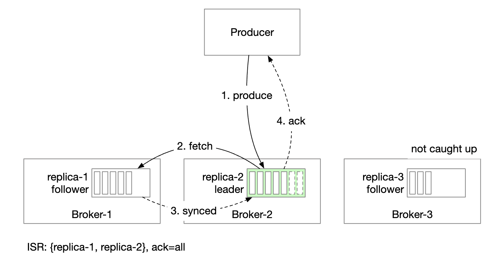

`ACK=1` 表示生产者在领导者接收到消息后收到确认。消息发送较快，但消息耐久性较低。

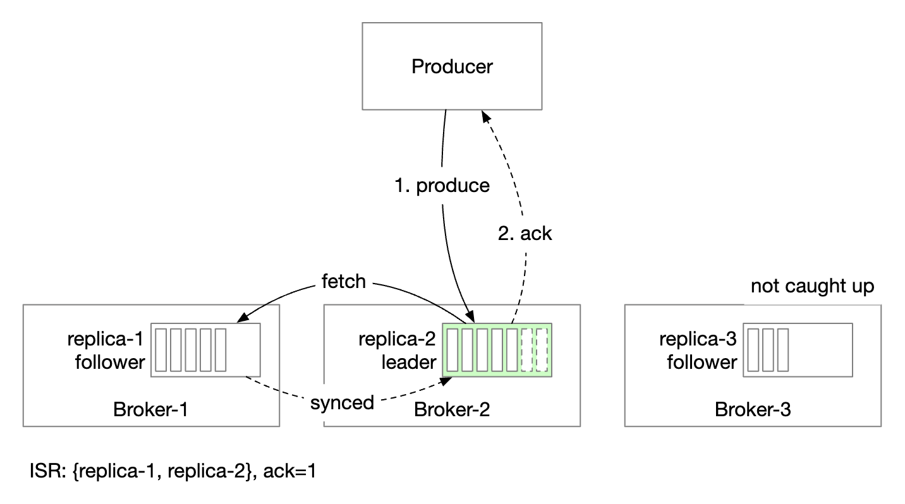

`ACK=0` 表示生产者发送消息时不等待领导者的任何确认。消息发送最快，但消息耐久性最低。

在消费者端，我们可以将所有消费者连接到分区的领导者，并让它们从中读取消息：

- 这是最简单的设计，操作最简便。
- 每个分区中的消息只会发送给组中的一个消费者，这限制了与领导者副本的连接数。
- 只要主题不是特别热门，与领导者副本的连接数通常不会很高。
- 我们可以通过增加分区和消费者的数量来扩展热门主题。
- 在某些场景下，可能会考虑让消费者从 ISR 中读取，例如如果它们位于不同的数据中心。

ISR 列表由领导者维护，领导者跟踪自己与每个副本之间的滞后。

### 可扩展性

让我们评估如何扩展系统的不同部分。

### 生产者

生产者比消费者要小得多。它的可扩展性可以通过添加/删除新的生产者实例轻松实现。

### 消费者

消费者组是相互隔离的，可以轻松地添加或移除消费者组。

重新平衡机制有助于在消费者被添加或从组中移除时，平滑地处理这种情况。

消费者组的重新平衡帮助我们实现了可扩展性和容错性。

### 代理

代理如何处理故障？

- 一旦代理发生故障，仍然有足够的副本来避免分区数据丢失。
- 选举出新的领导者，并且代理协调器重新分配之前由故障代理负责的分区到现有的副本。
- 现有副本接管新的分区，作为追随者，直到它们追赶上领导者并成为 ISR（同步副本）。

为了让代理具备容错能力，还需要考虑以下方面：

- 最小的 ISR 数量平衡了延迟和安全性。你可以根据需要进行微调。
- 如果一个分区的所有副本都在同一节点，那么这是一种资源浪费。副本应该分布在不同的代理上。
- 如果一个分区的所有副本都崩溃了，那么数据将永远丢失。将副本分布在不同的数据中心可以有所帮助，但会增加延迟。一种解决方案是使用[数据镜像](https://cwiki.apache.org/confluence/pages/viewpage.action?pageId=27846330)。

我们如何处理当新代理加入时副本的重新分配？

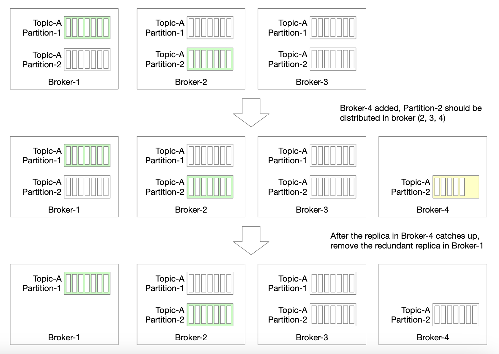

- 我们可以暂时允许更多副本存在，直到新代理赶上来。
- 一旦新代理赶上，我们可以移除不再需要的分区副本。

### 分区

每当添加一个新分区时，生产者会被通知并且消费者重新平衡会被触发。

从数据存储的角度来看，我们只能将新消息存储到新的分区，而不是尝试复制所有旧的消息：

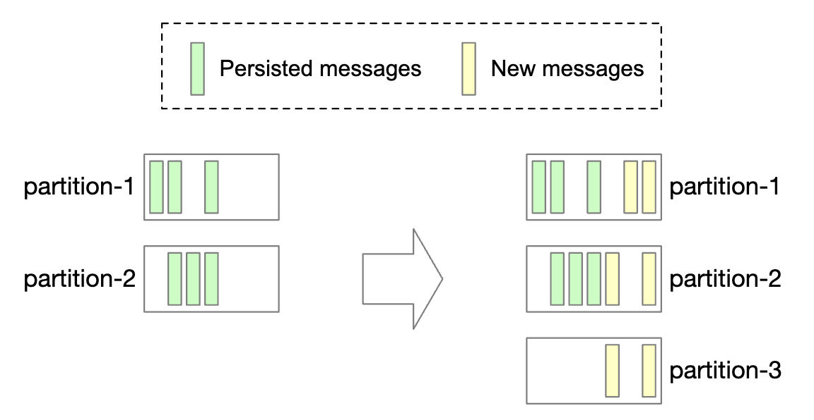

减少分区数量涉及的工作更多：

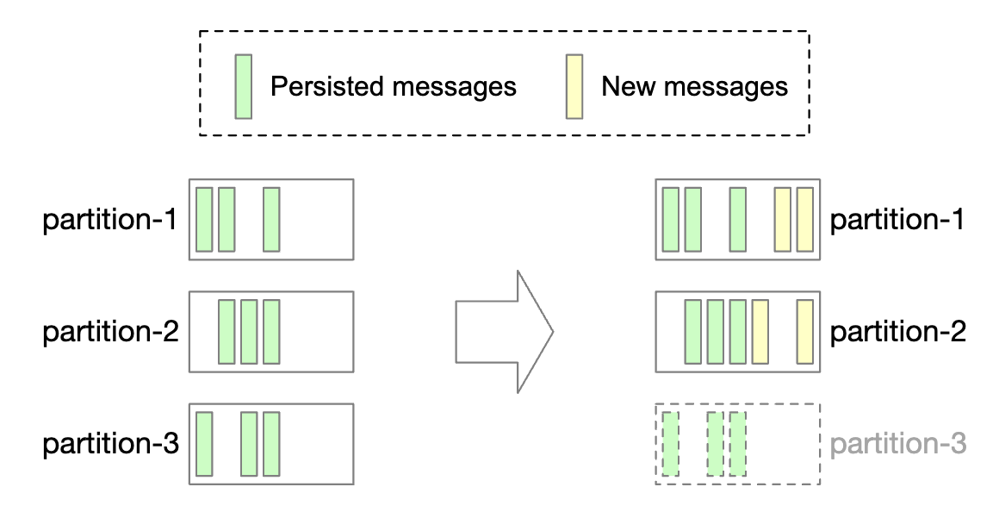

- 一旦一个分区被停用，新消息只会被接收至剩余的分区。
- 停用的分区不会立即删除，因为仍然可以从中消费消息。
- 一旦达到预定的保留周期，数据会被截断，释放存储空间。
- 在过渡期间，生产者只会将消息发送到活跃分区，但消费者会从所有分区读取消息。
- 一旦保留周期结束，消费者将进行重新平衡。

### 数据传递语义

让我们讨论不同的传递语义。

### 最多一次（At-most once）

有了这个保证，消息最多被传递一次，并且可能根本不会被传递。

- 生产者异步地将消息发送到一个主题。如果消息传递失败，则不进行重试。
- 消费者获取消息并立即提交偏移量。如果消费者在处理消息之前崩溃，则该消息不会被处理。

### 至少一次（At-least once）

消息可以被发送多次，并且没有消息应该被遗漏。

- 生产者以`ack=1`或`ack=all`的方式发送消息。如果出现任何问题，它会不断重试。
- 消费者在处理完消息后才会消费偏移量。
- 如果消费者在处理完消息但在提交偏移量之前崩溃，可能会导致消息被多次传递。
- 因此，这种语义适用于数据重复是可以接受的场景，或者可以进行去重的情况。

### 精确一次（Exactly once）

这是系统实现起来非常昂贵的保证，尽管它对用户来说是最友好的。

### 高级特性

让我们讨论一些高级特性，这些特性可能在面试中讨论。

### 消息过滤

一些消费者可能只想消费分区内的某种类型的消息。

这可以通过为每个消息子集构建独立的主题来实现，但如果系统有太多不同的使用场景，这可能会很昂贵。

- 在不同主题上存储相同的消息是资源的浪费。
- 生产者现在与消费者紧密耦合，因为它随着每个新消费者需求而变化。

我们可以通过消息过滤来解决这个问题。

- 一种简单的做法是将过滤工作放在消费者端，但这样会引入不必要的消费者流量。
- 另一种做法是给消息附加标签，消费者可以指定他们订阅的标签。
- 过滤也可以通过消息负载进行，但对于加密或序列化的消息，这可能具有挑战性且不安全。
- 对于更复杂的数学公式，代理可以实现一个语法解析器或脚本执行器，但这对消息队列来说可能是重负载。

### 延迟消息和定时消息

对于某些使用场景，我们可能希望延迟或定时发送消息。

例如，我们可能提交一个支付验证检查，30 分钟后触发消费者查看支付是否成功。

这可以通过将消息发送到代理的临时存储中，并在合适的时间将消息移到分区中来实现：

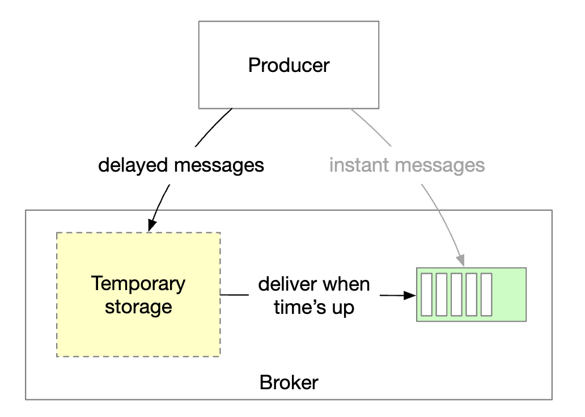

- 临时存储可以是一个或多个特殊的消息主题。
- 时间功能可以通过专用的延迟队列实现，或者使用[层级时间轮](http://www.cs.columbia.edu/~nahum/w6998/papers/sosp87-timing-wheels.pdf)。

## 第四步：总结

其他讨论点：

- 通信协议。重要的考虑因素包括支持所有使用场景和高数据量，并验证消息的完整性。流行的协议有 AMQP 和 Kafka 协议。
- 重试消费 - 如果我们不能立即处理消息，可以将其发送到一个专门的重试主题，稍后进行尝试。
- 历史数据归档 - 旧消息可以备份到高容量存储中，如 HDFS 或对象存储（如 S3）。
