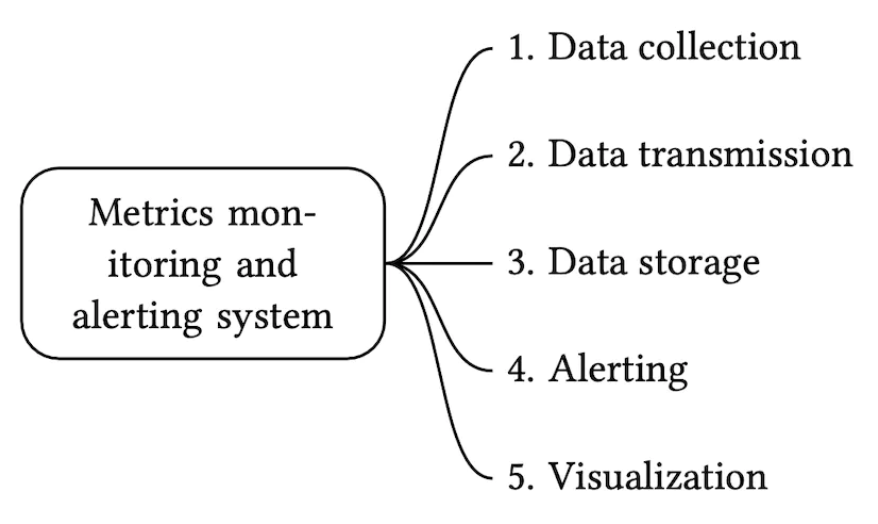
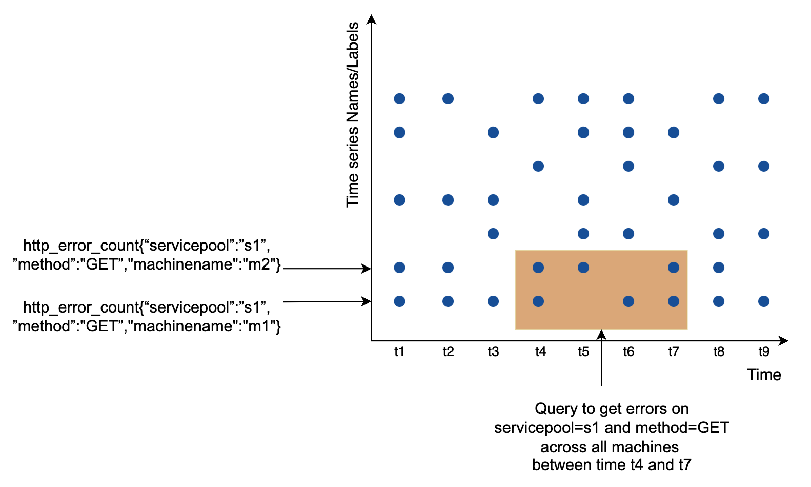
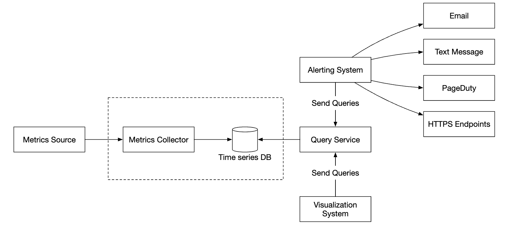
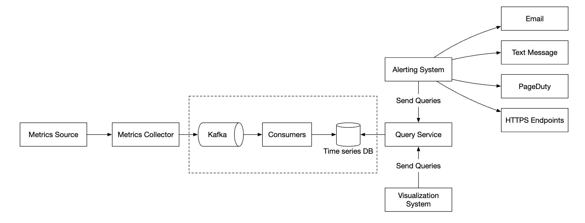
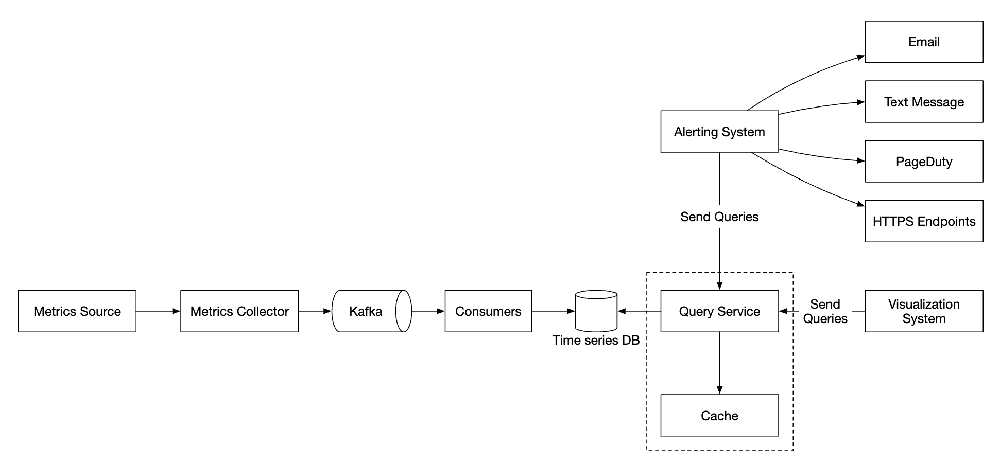
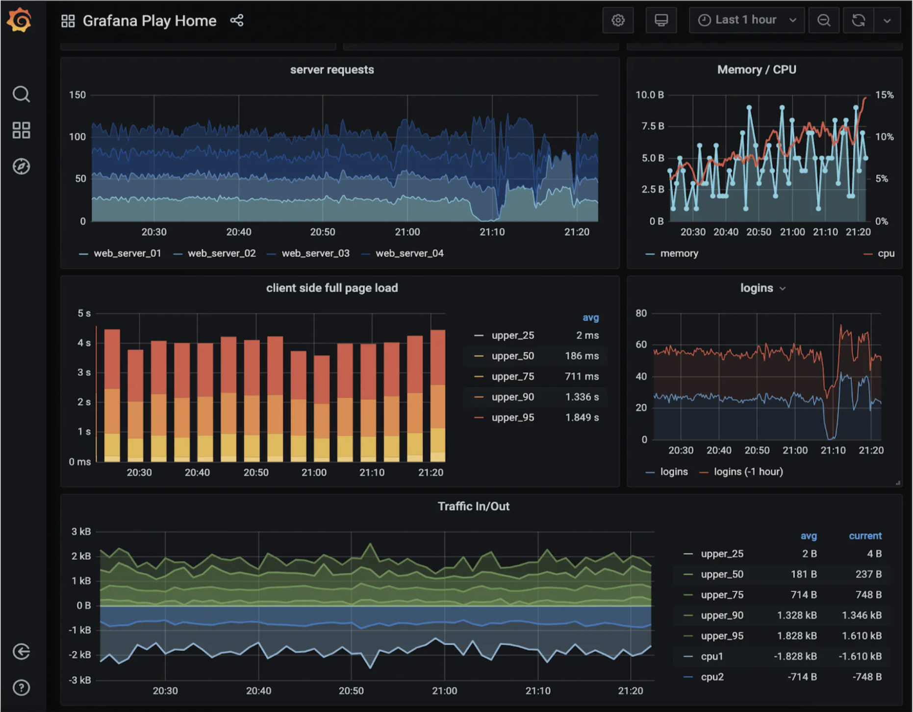

# 20. 设计指标监控与告警系统

我们需要设计一个高度可扩展的指标监控与告警系统，这对于确保高可用性和可靠性至关重要。

## 第一步：理解问题并确定设计范围

指标监控系统可以涵盖许多不同的内容——例如，当面试官只关注基础设施指标时，你不希望设计一个日志聚合系统。

让我们先尝试理解这个问题：

- **候选人**: 我们为谁构建这个系统？是为一家大型科技公司设计的内部监控系统，还是类似 DataDog 这样的 SaaS 服务？
- **面试官**: 我们只为内部使用构建。
- **候选人**: 我们想收集哪些指标？
- **面试官**: 操作系统的指标——CPU 负载、内存、数据磁盘空间。但也包括高层次的指标，如每秒请求数。业务指标不在范围内。
- **候选人**: 我们监控的基础设施的规模如何？
- **面试官**: 每天活跃用户数 1 亿，1000 个服务器池，每个池 100 台机器。
- **候选人**: 我们需要保存数据多久？
- **面试官**: 假设数据保留 1 年。
- **候选人**: 我们可以减少长期存储的指标数据分辨率吗？
- **面试官**: 对于新接收的指标，保存 7 天。将它们汇总为 1 分钟分辨率，保持 30 天。30 天后进一步汇总为 1 小时分辨率。
- **候选人**: 支持哪些告警渠道？
- **面试官**: 邮件、电话、PagerDuty 或 Webhooks。
- **候选人**: 我们需要收集错误或访问日志吗？
- **面试官**: 不需要。
- **候选人**: 我们需要支持分布式系统追踪吗？
- **面试官**: 不需要。

### 高层次需求和假设

被监控的基础设施是大规模的：

- 1 亿 DAU
- 1000 个服务器池 _ 100 台机器 _ 每台机器约 100 个指标 -> 大约 1000 万个指标
- 1 年的数据保留期
- 数据保留政策 - 原始数据保留 7 天，1 分钟分辨率数据保留 30 天，1 小时分辨率数据保留 1 年

可以监控的各种指标：

- CPU 负载
- 请求数量
- 内存使用
- 消息队列中的消息数量

### 非功能需求

- 可扩展性 - 系统应该具有可扩展性，以容纳更多的指标和告警
- 低延迟 - 系统需要对仪表盘和告警有低查询延迟
- 可靠性 - 系统应该高度可靠，避免错过关键告警
- 灵活性 - 系统应该能够轻松集成未来的新技术

哪些需求不在范围内？

- 日志监控 - ELK 堆栈非常适合这种用例
- 分布式系统追踪 - 这是指收集请求生命周期数据，随着请求在系统中的多个服务之间流动

## 第二步：提出高层次设计并获得批准

### 基础

指标监控和告警系统包含五个核心组件：



- 数据收集 - 从不同来源收集指标数据
- 数据传输 - 将数据从源传输到指标监控系统
- 数据存储 - 组织和存储传入的数据
- 告警 - 分析传入数据，检测异常并生成告警
- 可视化 - 以图表等形式呈现数据

### 数据模型

指标数据通常以时间序列的形式记录，其中包含一组带时间戳的值。该时间序列可以通过名称和可选的标签集进行标识。

示例 1 - 20:00 时，生产服务器实例 i631 的 CPU 负载是多少？


数据可以通过以下表格进行标识：


该时间序列通过指标名称、标签和特定时间点的数据进行标识。

示例 2 - 最近 10 分钟内，us-west 区域所有 Web 服务器的平均 CPU 负载是多少？

```
CPU.load host=webserver01,region=us-west 1613707265 50

CPU.load host=webserver01,region=us-west 1613707265 62

CPU.load host=webserver02,region=us-west 1613707265 43

CPU.load host=webserver02,region=us-west 1613707265 53

...

CPU.load host=webserver01,region=us-west 1613707265 76

CPU.load host=webserver01,region=us-west 1613707265 83
```

这是我们可能从存储中提取的数据，用于回答这个问题。可以通过对最后一列的值进行平均来计算 CPU 的平均负载。

上述格式称为行协议，许多流行的监控软件使用这种格式——例如 Prometheus、OpenTSDB。

每个时间序列包含的内容：


一种很好地可视化数据方式：



- x 轴是时间
- y 轴是你查询的维度——例如，指标名称、标签等。

数据访问模式是写入频繁且读取有波动，我们收集了大量的指标，但它们不经常访问，除非在发生例如持续事件时。

数据存储系统是该设计的核心。

- 不建议使用通用数据库来处理这个问题，尽管通过专家级调优可以达到良好的扩展性。
- 使用 NoSQL 数据库理论上可行，但很难设计出一个可扩展的架构来有效存储和查询时间序列数据。

有许多专门用于存储时间序列数据的数据库。它们中的许多支持自定义查询接口，可以有效查询时间序列数据。

- OpenTSDB 是一个分布式时间序列数据库，但它基于 Hadoop 和 HBase。如果没有相关基础设施，使用这种技术会比较困难。
- Twitter 使用 MetricsDB，而亚马逊提供 Timestream。
- 最受欢迎的时间序列数据库是 InfluxDB 和 Prometheus。
- 它们被设计用于存储大量的时间序列数据。它们都基于内存缓存 + 磁盘存储。

InfluxDB 的示例规模——在配置 8 核心和 32GB RAM 时，每秒写入超过 25 万次：


你不需要理解一个指标数据库的内部机制，因为这属于较为专业的知识。只有在简历中提到时，才可能会被问到。

在面试中，理解指标是时间序列数据，并且了解像 InfluxDB 这样的流行时间序列数据库就足够了。

时间序列数据库的一个优点是可以通过标签高效地聚合和分析大量的时间序列数据。
例如，InfluxDB 会为每个标签构建索引。

然而，关键是保持标签的基数低——即，不要使用过多的唯一标签。

### 高层次设计


- 指标来源 - 可以是应用服务器、SQL 数据库、消息队列等。
- 指标收集器 - 收集指标数据并写入时间序列数据库
- 时间序列数据库 - 以时间序列的形式存储指标数据。提供自定义查询接口来分析大量的指标数据。
- 查询服务 - 使从时间序列数据库中查询和检索数据变得容易。如果数据库的接口足够强大，可以完全由数据库接口代替。
- 告警系统 - 将告警通知发送到各种告警目的地。
- 可视化系统 - 以图形/图表的形式展示指标数据。

## 第三步：深入设计

让我们深入探讨系统中一些更有趣的部分。

### 指标收集

对于指标收集来说，偶尔的数据丢失并不致命。客户端可以采用“发送即忘”的方式，这在大多数情况下是可以接受的。


实现指标收集有两种方式——拉取（pull）和推送（push）。

以下是拉取模式的实现方式：


在这个方案中，指标收集器需要维护一份服务和指标端点的最新列表。我们可以使用 Zookeeper 或 etcd 来实现这一点——服务发现。

服务发现包含了关于何时、在哪里收集指标的配置信息：


以下是指标收集流程的详细解释：


- 指标收集器从服务发现获取配置元数据，包括拉取间隔、IP 地址、超时和重试参数。
- 指标收集器通过预定义的 HTTP 端点（例如`/metrics`）拉取指标数据，通常由客户端库实现。
- 或者，指标收集器可以在服务发现中注册一个变更事件通知，以便在服务端点发生变化时收到通知。
- 另一种选择是让指标收集器定期轮询指标端点的配置变化。

在我们的规模下，单一的指标收集器是不够的。必须有多个实例。然而，它们之间也必须有某种同步机制，以确保两个收集器不会重复收集相同的指标。

为此，我们可以将收集器和服务器放置在一致性哈希环上，并确保每个收集器只与一组服务器关联：


另一方面，在推送模式中，服务主动将它们的指标推送给指标收集器：


在这种方式中，通常会在服务实例旁边安装一个收集代理。代理从服务器收集指标，并将它们推送到指标收集器。


使用这种模式，我们可以在将指标发送给收集器之前对其进行聚合，从而减少收集器处理的数据量。

另一方面，指标收集器可能会拒绝接收推送请求，因为它可能无法处理如此大的负载。因此，必须将收集器放入负载均衡器后面的自动扩展组中。

那么，哪种方式更好呢？两种方法各有优劣，不同的系统采用不同的方法：

- Prometheus 使用拉取架构
- Amazon Cloud Watch 和 Graphite 使用推送架构

以下是拉取和推送模式的一些主要区别：

<!-- prettier-ignore -->
| 特性 | 拉取模式 | 推送模式 |
| --- | ------- | ---------- |
| 调试简便性 | 应用服务器上用于拉取指标的`/metrics`端点可以随时查看指标。你甚至可以在本地电脑上执行此操作。拉取胜。 | 如果指标收集器没有收到指标，问题可能由网络问题引起。|
| 健康检查 | 如果应用服务器没有响应拉取请求，可以迅速确定该应用服务器是否宕机。拉取胜。 | 如果指标收集器没有收到指标，问题可能由网络问题引起。|
| 短期作业 || 一些批处理作业可能是短期的，持续时间不足以进行拉取。推送胜。可以通过为拉取模型引入推送网关来解决这个问题。|
| 防火墙或复杂的网络设置 | 需要所有指标端点都可以访问，这在多个数据中心架构中可能是个问题。可能需要更复杂的网络基础设施。 | 如果指标收集器设置了负载均衡器并处于自动扩展组中，它就可以从任何地方接收数据。推送胜。  |
| 性能 | 拉取方法通常使用 TCP。 | 推送方法通常使用 UDP，这意味着推送方法可以提供低延迟的指标传输。反驳观点是，与发送指标负载相比，建立 TCP 连接的开销非常小。 |
| 数据真实性 | 被收集的应用服务器在配置文件中预先定义。收集到的指标数据保证是可靠的。 | 任何类型的客户端都可以将指标推送到指标收集器。可以通过白名单配置接收指标的服务器，或要求身份验证来解决这个问题。|

没有明显的最优解，大型组织可能需要支持两者，某些情况下，根本无法安装推送代理。

### 扩展指标传输管道



无论我们使用拉取还是推送模式，指标收集器都被配置在自动扩展组中。

然而，如果时间序列数据库出现故障，可能会丢失数据。为了缓解这一问题，我们可以配置一个队列机制：



- 指标收集器将指标数据推送到 Kafka
- 消费者或流处理服务（如 Apache Storm、Flink 或 Spark）处理数据并将其推送到时间序列数据库

这种方法有几个优点：

- Kafka 作为一个高可靠性和可扩展的分布式消息平台
- 它解耦了数据收集和数据处理
- 它通过将数据保存在 Kafka 中，避免了数据丢失

Kafka 可以为每个指标名称配置一个分区，以便消费者可以按指标名称聚合数据。为了扩展，我们还可以进一步按标签分区，并根据优先级或分类来决定先收集哪些指标。


使用 Kafka 的主要缺点是维护和操作的开销。一个替代方案是使用类似[Gorilla](https://www.vldb.org/pvldb/vol8/p1816-teller.pdf)的大规模数据摄取系统。可以认为，使用这种方法在排队方面和使用 Kafka 一样具备扩展性。

### 聚合发生的位置

指标可以在多个地方进行聚合，不同选择之间有权衡：

- 收集代理 - 客户端收集代理仅支持简单的聚合逻辑。例如，收集 1 分钟的计数并发送给指标收集器。
- 数据摄取管道 - 在写入数据库之前聚合数据，我们需要使用流处理引擎，如 Flink。这样可以减少写入量，但由于不存储原始数据，我们会失去数据精度。
- 查询端 - 我们可以在运行查询时通过可视化系统聚合数据。这样没有数据丢失，但查询可能会很慢，因为需要处理大量数据。

### 查询服务

将查询服务与时间序列数据库分离，使可视化和警报系统与数据库解耦，从而可以随时更换数据库。

我们可以在此处添加一个缓存层，以减少时间序列数据库的负载：



我们也可以完全避免添加查询服务，因为大多数可视化和警报系统都拥有强大的插件来与大多数时间序列数据库集成。如果选择了合适的时间序列数据库，可能不需要引入自己的缓存层。

大多数时间序列数据库不支持 SQL，因为 SQL 对于查询时间序列数据效率较低。以下是一个计算指数加权平均数的 SQL 查询示例：

```
select id,
       temp,
       avg(temp) over (partition by group_nr order by time_read) as rolling_avg
from (
  select id,
         temp,
         time_read,
         interval_group,
         id - row_number() over (partition by interval_group order by time_read) as group_nr
  from (
    select id,
    time_read,
    "epoch"::timestamp + "900 seconds"::interval * (extract(epoch from time_read)::int4 / 900) as interval_group,
    temp
    from readings
  ) t1
) t2
order by time_read;
```

这是 InfluxDB 使用的 Flux 查询语言中相同的查询：

```
from(db:"telegraf")
  |> range(start:-1h)
  |> filter(fn: (r) => r._measurement == "foo")
  |> exponentialMovingAverage(size:-10s)
```

### 存储层

选择时间序列数据库时非常重要。

根据 Facebook 发布的研究，约 85%的查询是针对过去 26 小时内的数据。

如果选择一款可以利用这一特性的数据库，可能会对系统性能产生显著影响。InfluxDB 就是一个这样的选项。

无论我们选择哪个数据库，都可以采取一些优化措施。

数据编码和压缩可以显著减少数据的存储大小。优秀的时间序列数据库通常会内置这些功能。


在上面的例子中，我们可以存储时间戳差值，而不是存储完整的时间戳。

另一种可以采用的技术是下采样——将高分辨率数据转换为低分辨率，以减少磁

盘占用。

我们可以将此技术应用于旧数据，并让数据科学家配置规则，例如：

- 7 天 - 不下采样
- 30 天 - 下采样到 1 分钟
- 1 年 - 下采样到 1 小时

例如，以下是一个 10 秒分辨率的指标表：

<!-- prettier-ignore -->
| metric | timestamp | hostname | Metric_value |
|--------|-----------|----------|--------------|
| cpu | 2021-10-24T19:00:00Z | host-a | 10 |
| cpu | 2021-10-24T19:00:10Z | host-a | 16 |
| cpu | 2021-10-24T19:00:20Z | host-a | 20 |
| cpu | 2021-10-24T19:00:30Z | host-a | 30 |
| cpu | 2021-10-24T19:00:40Z | host-a | 20 |
| cpu | 2021-10-24T19:00:50Z | host-a | 30 |

下采样到 30 秒分辨率：

<!-- prettier-ignore -->
| metric | timestamp | hostname | Metric_value (avg) |
|--------|-----------|----------|--------------------|
| cpu | 2021-10-24T19:00:00Z | host-a | 19 |
| cpu | 2021-10-24T19:00:30Z | host-a | 25 |

最后，我们还可以使用冷存储来存储不再使用的旧数据，冷存储的财务成本要低得多。

### 警报系统


配置加载到缓存服务器中。规则通常以 YAML 格式定义。以下是一个示例：

```
- name: instance_down
  rules:
  # 对任何超过5分钟不可达的实例发出警报。
  - alert: instance_down
    expr: up == 0
    for: 5m
    labels:
      severity: page
```

警报管理器从缓存中获取警报配置。根据配置规则，它还会在预定的时间间隔内调用查询服务。如果满足规则，则会创建警报事件。

警报管理器的其他职责包括：

- 过滤、合并和去重警报。例如，如果某个实例的警报被触发多次，则只生成一个警报事件。
- 访问控制——重要的是限制警报管理操作的权限。
- 重试——确保警报至少被传播一次。

警报存储是一个类似 Cassandra 的键值数据库，它保存所有警报的状态。确保警报至少触发一次。一旦警报被触发，它将发布到 Kafka。

最后，警报消费者从 Kafka 中拉取警报数据，并通过不同的渠道发送通知——电子邮件、短信、PagerDuty、Webhook 等。

在实际应用中，有许多现成的警报系统解决方案。很难证明自己开发一个系统是合适的。

### 可视化系统

可视化系统展示指标和警报信息。以下是使用 Grafana 构建的一个仪表板：



构建一个高质量的可视化系统非常困难。很难证明不使用现成的解决方案（如 Grafana）是明智的。

## 第四步：总结

这是我们的最终设计：


