# 21. 设计广告点击事件聚合

随着 Facebook、YouTube、TikTok 等平台的兴起，数字广告行业变得越来越庞大。

因此，追踪广告点击事件变得非常重要。本章将探讨如何在 Facebook/Google 规模上设计一个广告点击事件聚合系统。

数字广告有一个叫做实时竞价（RTB）的过程，在这个过程中，数字广告库存被买卖：


RTB 的速度非常重要，因为它通常发生在一秒钟之内。
数据准确性同样至关重要，因为它影响广告主的支付金额。

基于广告点击事件的聚合，广告主可以做出一些决策，例如调整目标受众和关键词。

## 第一步：理解问题并确定设计范围

- **候选人**: 输入数据的格式是什么？
- **面试官**: 每天 10 亿次广告点击，共有 200 万个广告。广告点击事件的数量每年增长 30%。
- **候选人**: 系统需要支持哪些最重要的查询？
- **面试官**: 需要考虑的主要查询包括：
  - 返回广告 X 在过去 Y 分钟内的点击次数
  - 返回过去 1 分钟内点击次数最多的前 100 个广告。两个参数应可配置。聚合每分钟进行一次。
  - 支持按`ip`、`user_id`、`country`等属性进行数据过滤。
- **候选人**: 我们需要担心边缘情况吗？我能想到的一些边缘情况包括：
  - 可能会有事件到达比预期晚
  - 可能会有重复事件
  - 系统的不同部分可能会出现故障，因此我们需要考虑系统恢复
- **面试官**: 这是一个很好的列表，请考虑这些情况。
- **候选人**: 延迟要求是什么？
- **面试官**: 广告点击聚合的端到端延迟为几分钟。对于 RTB，则要求低于一秒。广告点击聚合的延迟是可以接受的，因为这些数据通常用于计费和报告。

### 功能要求

- 聚合广告`ad_id`在过去 Y 分钟内的点击次数
- 每分钟返回点击次数最多的前 100 个`ad_id`
- 支持按不同属性进行聚合过滤
- 数据集的体量为 Facebook 或 Google 级别

### 非功能要求

- 聚合结果的正确性非常重要，因为它用于 RTB 和广告计费
- 正确处理延迟或重复事件
- 系统的鲁棒性——系统应能抵御部分故障
- 延迟——最多几分钟的端到端延迟

### 粗略估算

- 10 亿日活跃用户（DAU）
- 假设每个用户每天点击 1 个广告 -> 每天 10 亿次广告点击
- 广告点击 QPS = 10,000
- 峰值 QPS 是正常的 5 倍 = 50,000
- 单个广告点击占用 0.1KB 存储。每天存储需求为 100GB
- 每月存储需求 = 3TB

## 第二步：提出高层设计并获得认同

本节我们将讨论查询 API 设计、数据模型和高层设计。

### 查询 API 设计

API 是客户端与服务器之间的契约。在我们的案例中，客户端是仪表盘用户——数据科学家/分析师、广告主等。

以下是我们的功能需求：

- 聚合广告`ad_id`在过去 Y 分钟内的点击次数
- 返回过去 M 分钟内点击次数最多的前 N 个`ad_id`
- 支持按不同属性进行聚合过滤

我们需要两个端点来实现这些需求。可以通过查询参数进行过滤。

聚合广告`ad_id`在过去 M 分钟内的点击次数：

```
GET /v1/ads/{:ad_id}/aggregated_count
```

查询参数：

- from - 起始分钟。默认值为当前时间前 1 分钟
- to - 结束分钟。默认值为当前时间
- filter - 用于不同过滤策略的标识符。例如，001 表示“非美国点击”。

响应：

- ad_id - 广告标识符
- count - 起始和结束分钟之间的聚合次数

返回过去 M 分钟内点击次数最多的前 N 个广告：

```
GET /v1/ads/popular_ads
```

查询参数：

- count - 前 N 个点击最多的广告
- window - 聚合窗口大小（以分钟为单位）
- filter - 用于不同过滤策略的标识符

响应：

- 广告 ID 列表

### 数据模型

在我们的系统中，我们有原始数据和聚合数据。

原始数据如下所示：

```
[AdClickEvent] ad001, 2021-01-01 00:00:01, user 1, 207.148.22.22, USA
```

这是一个结构化的示例：

<!-- prettier-ignore -->
| ad_id | click_timestamp | user | ip | country |
|-------|-----------------|------|----|---------|
| ad001 | 2021-01-01 00:00:01 | user1 | 207.148.22.22 | USA |
| ad001 | 2021-01-01 00:00:02 | user1 | 207.148.22.22 | USA |
| ad002 | 2021-01-01 00:00:02 | user2 | 209.153.56.11 | USA |

这是聚合后的版本：

<!-- prettier-ignore -->
| ad_id | click_minute | filter_id | count |
|-------|--------------|-----------|-------|
| ad001 | 202101010000 | 0012 | 2 |
| ad001 | 202101010000 | 0023 | 3 |
| ad001 | 202101010001 | 0012 | 1 |
| ad001 | 202101010001 | 0023 | 6 |

`filter_id`帮助我们实现过滤需求。

<!-- prettier-ignore -->
| filter_id | region | IP | user_id |
|-----------|--------|-----|---------|
| 0012 | US | * | _ |
| 0013 | _ | 123.1.2.3 | _ |

为了支持快速返回过去 M 分钟内点击次数最多的前 N 个广告，我们还将维护以下结构：

<!-- prettier-ignore -->
| most_clicked_ads | | |
|--------------|--------------|--------------|
| window_size | integer | 聚合窗口大小（M）以分钟为单位 |
| update_time_minute | timestamp | 上次更新时间戳（以1分钟为单位） |
| most_clicked_ads | array | 广告ID的JSON格式列表 |

存储原始数据和存储聚合数据之间有哪些利弊？

- 原始数据允许使用完整的数据集，并支持数据过滤和重新计算
- 聚合数据允许我们拥有较小的数据集，并且查询更快
- 原始数据意味着需要更大的数据存储，并且查询较慢
- 聚合数据是衍生数据，因此存在一定的数据丢失

在我们的设计中，我们将结合这两种方法：

- 保留原始数据对于调试很有帮助。如果聚合出现了问题，我们可以发现错误并回填数据。
- 聚合数据也应该存储，以便更快的查询性能。
- 原始数据可以存储在冷存储中，以避免额外的存储成本。

在选择数据库时，有几个因素需要考虑：

- 数据的类型是什么？是关系型、文档型还是二进制大对象（BLOB）？
- 工作负载是以读取为主、写入为主还是两者都有？
- 是否需要事务支持？
- 查询是否依赖于 OLAP 函数，如 SUM 和 COUNT？

对于原始数据，我们可以看到平均 QPS 为 10k，峰值 QPS 为 50k，因此系统是写入密集型的。
另一方面，读取流量较低，因为原始数据主要作为备份，以防出现问题。

关系型数据库能够完成这个任务，但扩展写入操作会比较有挑战。
另一种选择是使用 Cassandra 或 InfluxDB，它们对重负载写入有更好的原生支持。

另一个选择是使用 Amazon S3 和列式数据格式（如 ORC、Parquet 或 AVRO）。由于这种设置不太熟悉，我们将选择 Cassandra。

对于聚合数据，工作负载既有读取也有写入，因为聚合数据经常被用来为仪表盘和警报提供支持。
它也是写入密集型的，因为数据是每分钟聚合并写入的。因此，我们在这里也会使用相同的数据存储（Cassandra）。

### 高层设计

这是我们系统的架构：


数据流作为一个无界数据流，输入和输出都如此。

为了避免同步的汇聚点（即消费者崩溃可能导致整个系统停滞），我们将利用异步处理，使用消息队列（Kafka）解耦消费者和生产者。

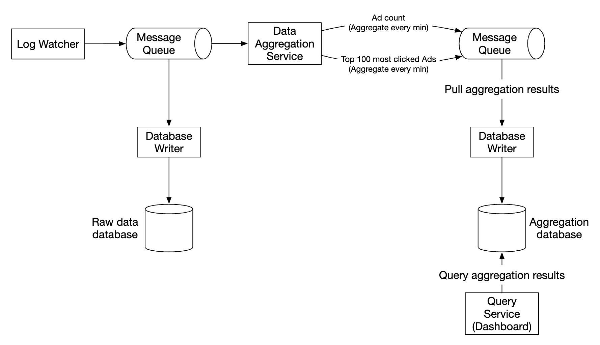

第一个消息队列存储广告点击事件数据：

<!-- prettier-ignore -->
| ad_id | click_timestamp | user_id | ip | country |
|-------|-----------------|---------|----|---------|

第二个消息队列包含每分钟聚合的广告点击计数：

<!-- prettier-ignore -->
| ad_id | click_minute | count |
|-------|--------------|-------|

以及每分钟聚合的点击次数

最多的前 N 个广告：

<!-- prettier-ignore -->
| update_time_minute | most_clicked_ads |
|--------------------|------------------|

第二个消息队列的存在是为了实现端到端精确一次的原子提交语义：

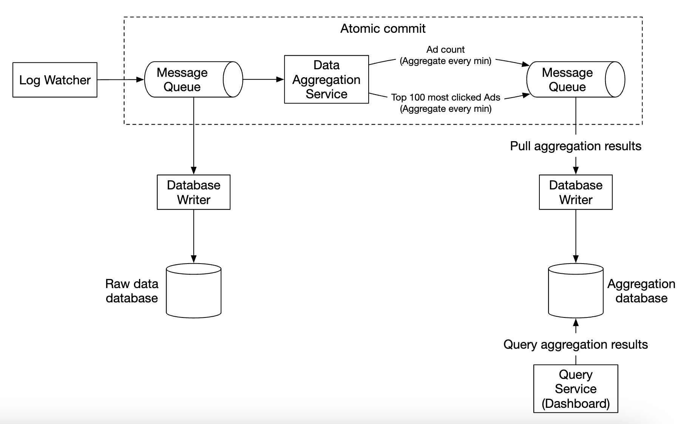

对于聚合服务，使用 MapReduce 框架是一个不错的选择：

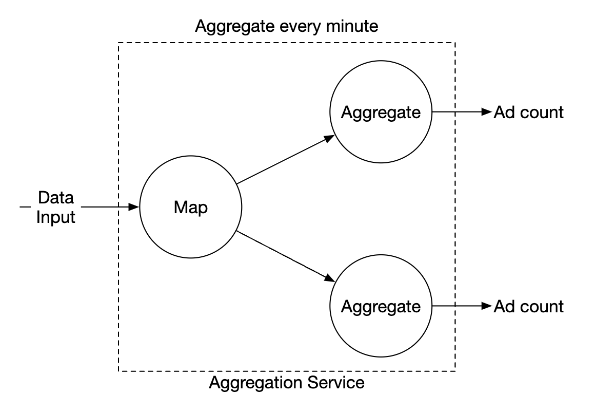

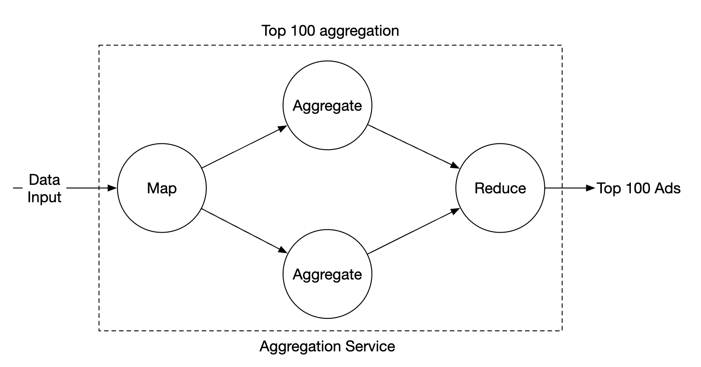

每个节点负责一个单独的任务，并将处理结果发送给下游节点。

Map 节点负责从数据源读取数据，然后进行过滤和转换。

例如，Map 节点可以根据`ad_id`将数据分配到不同的聚合节点：

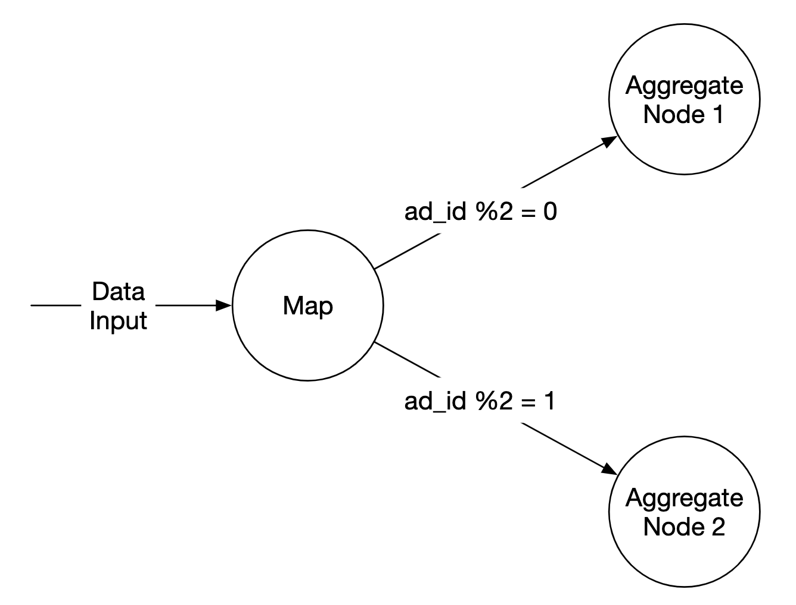

或者，我们可以将广告分布到 Kafka 分区中，让聚合节点直接在消费者组中进行订阅。
然而，Map 节点可以帮助我们在后续处理之前进行数据清洗或转换。

另一个原因是我们可能无法控制数据的生产方式，
因此与同一`ad_id`相关的事件可能会被发送到不同的分区。

聚合节点每分钟在内存中统计广告点击事件，按`ad_id`进行聚合。

Reduce 节点收集来自聚合节点的聚合结果，并生成最终结果：

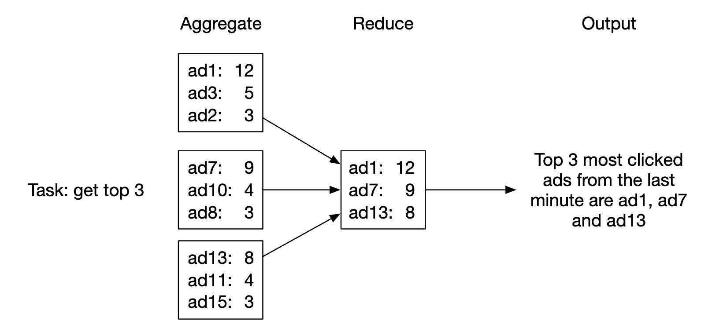

此 DAG 模型使用了 MapReduce 范式。它通过并行分布式计算将大数据转换为常规大小的数据。

在 DAG 模型中，临时数据存储在内存中，不同节点之间使用 TCP 或共享内存进行通信。

现在让我们探索一下这个模型如何帮助我们实现各种用例。

用例 1 - 聚合点击次数：

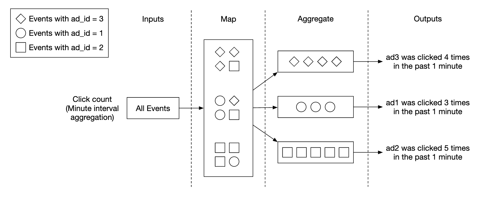

- 广告通过`ad_id % 3`进行分区

用例 2 - 返回点击次数最多的前 N 个广告：


- 在这个案例中，我们聚合了前 3 个广告，但这可以轻松扩展到前 N 个广告
- 每个节点维护一个堆数据结构，以便快速检索前 N 个广告

用例 3 - 数据过滤：
为了支持快速的数据过滤，我们可以预定义过滤标准，并基于此进行预聚合：

<!-- prettier-ignore -->
| ad_id | click_minute | country | count |
|-------|--------------|---------|-------|
| ad001 | 202101010001 | USA | 100 |
| ad001 | 202101010001 | GPB | 200 |
| ad001 | 202101010001 | others | 3000 |
| ad002 | 202101010001 | USA | 10 |
| ad002 | 202101010001 | GPB | 25 |
| ad002 | 202101010001 | others | 12 |

这种技术称为星型模式（star schema），广泛应用于数据仓库中。
过滤字段被称为维度。

这种方法的好处包括：

- 易于理解和构建
- 当前的聚合服务可以重用，以创建更多的维度
- 基于过滤条件访问数据非常快速，因为结果是预计算的

这种方法的一个限制是，它会创建更多的分区和记录，尤其是在有许多过滤条件时。

## 第三步：设计深入分析

让我们深入探讨一些更有趣的话题。

### 流处理 vs. 批处理

我们提出的高层架构是一种流处理系统。
以下是三种系统类型的比较：

|          | 在线系统（服务） | 批处理系统（离线系统）       | 流处理系统（近实时系统） |
| -------- | ---------------- | ---------------------------- | ------------------------ |
| 响应性   | 快速响应客户端   | 不需要响应客户端             | 不需要响应客户端         |
| 输入     | 用户请求         | 有限大小的有界输入，大量数据 | 输入没有边界（无限流）   |
| 输出     | 客户端响应       | 物化视图、聚合指标等         | 物化视图、聚合指标等     |
| 性能衡量 | 可用性、延迟     | 吞吐量                       | 吞吐量、延迟             |
| 示例     | 在线购物         | MapReduce                    | Flink [13]               |

在我们的设计中，我们结合使用了批处理和流处理。

我们使用流处理来处理到达的数据，并生成近实时的聚合结果。
另一方面，我们使用批处理来进行历史数据备份。

包含两个处理路径——批处理和流处理的系统称为 Lambda 架构。
其缺点是，你需要维护两个不同代码库的处理路径。

Kappa 架构是一种替代架构，它将批处理和流处理合并到一个处理路径中。
关键思想是使用单一的流处理引擎。

Lambda 架构：

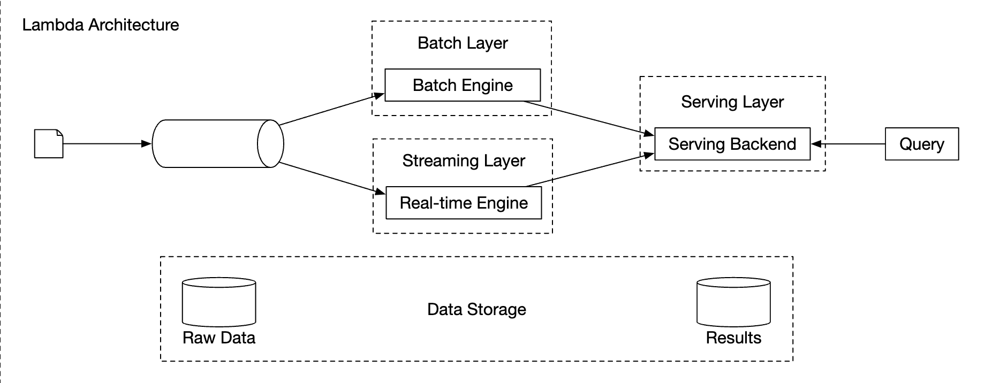

Kappa 架构：


我们的高层设计使用了 Kappa 架构，因为历史数据的重新处理也会通过聚合服务。

每当由于聚合逻辑中的重大错误需要重新计算聚合数据时，我们可以从存储的原始数据中重新计算聚合。

- 重新计算服务从原始存储中检索数据。这是一个批处理作业。
- 检索到的数据被发送到专门的聚合服务，这样实时处理聚合服务就不会受到影响。
- 聚合结果被发送到第二个消息队列，然后我们在聚合数据库中更新结果。

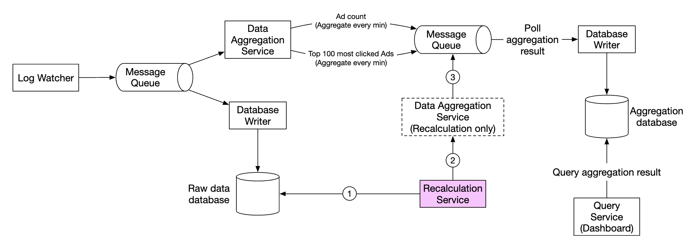

### 时间

我们需要时间戳来进行聚合。它可以在两个地方生成：

- 事件时间 - 广告点击发生的时间
- 处理时间 - 系统处理事件时的时间

由于使用了异步处理（消息队列）和网络延迟，事件时间和处理时间之间可能存在显著差异。

- 如果我们使用处理时间，聚合结果可能不准确。
- 如果我们使用事件时间，我们必须处理延迟事件。

没有完美的解决方案，我们需要权衡：
| | 优点 | 缺点 |
|-----------------|---------------------------------------|--------------------------------------------------------------------------------------|
| 事件时间 | 聚合结果更准确 | 客户端可能有错误的时间，或时间戳可能由恶意用户生成 |
| 处理时间 | 服务器时间戳更可靠 | 如果事件延迟，时间戳就不准确 |

由于数据准确性非常重要，我们将使用事件时间进行聚合。

为了缓解延迟事件的问题，可以利用一种叫做“水印”的技术。

在下面的示例中，事件 2 错过了需要聚合的时间窗口：


然而，如果我们故意扩展聚合窗口，就可以减少错过事件的可能性。
窗口扩展部分被称为“水印”：


- 短水印增加错过事件的可能性，但减少延迟。
- 长水印减少错过事件的可能性，但增加延迟。

无论水印的大小如何，总是有错过事件的可能性。但对于这些低概率事件进行优化是没有意义的。

我们可以通过做每日结束时的对账来解决这些不一致问题。

### 聚合窗口

有四种窗口函数：

- 固定窗口（Tumbling Window）
- 滑动窗口（Hopping Window）
- 滑动窗口（Sliding Window）
- 会话窗口（Session Window）

在我们的设计中，我们使用固定窗口（Tumbling Window）来进行广告点击聚合：


以及使用滑动窗口来进行前 N 个点击广告的 M 分钟聚合：


### 投递保证

由于我们正在聚合的数据将用于计费，数据准确性是优先考虑的。

因此，我们需要讨论：

- 如何避免处理重复事件
- 如何确保所有事件都已处理

我们可以使用三种投递保证——至多一次（at-most-once），至少一次（at-least-once）和精确一次（exactly-once）。

在大多数情况下，如果少量重复是可以接受的，至少一次（at-least-once）就足够了。
但在我们的系统中，这种情况不适用，因为即使是小的差异也可能导致数百万美元的差距。
因此，我们需要使用精确一次的投递语义。

### 数据去重

最常见的数据质量问题之一是重复数据。

重复数据可能来自多种来源：

- 客户端 - 客户端可能会多次发送相同的事件。带有恶意意图的重复事件最好由风险引擎处理。
- 服务器故障 - 聚合服务节点在聚合过程中崩溃，且上游服务未收到确认，因此事件被重新发送。

以下是由于未确认事件而发生数据重复的示例：


在这个示例中，偏移量 100 将被多次处理并发送到下游。

一种尝试缓解这种情况的方法是将最后看到的偏移量存储在 HDFS/S3 中，但这样有可能导致结果永远无法到达下游：

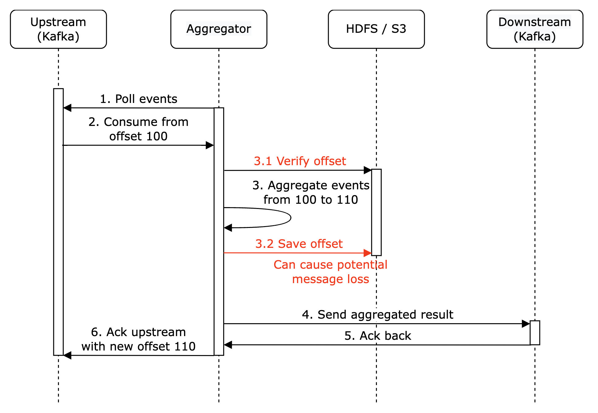

最终，我们可以在与下游交互时原子性地存储偏移量。为了实现这一点，我们需要实现分布式事务：

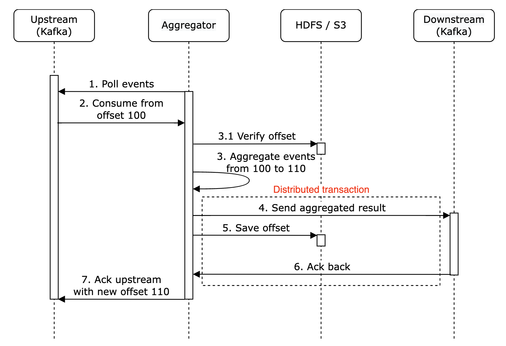

个人备注：另外，如果下游系统以幂等方式处理聚合结果，那么就不需要分布式事务。

### 扩展系统

让我们讨论一下系统如何在增长时进行扩展。

我们有三个独立的组件——消息队列、聚合服务和数据库。
由于它们是解耦的，我们可以独立扩展它们。

如何扩展消息队列：

- 我们不对生产者设置限制，因此它们可以轻松扩展。
- 消费者可以通过将其分配到消费者组并增加消费者数量来进行扩展。
- 为了使其有效，我们还需要确保提前创建足够的分区。
- 此外，当有成千上万的消费者时，消费者重平衡可能需要一些时间，因此建议在非高峰时段进行。
- 我们还可以考虑按地理位置对主题进行分区，例如 `topic_na`、`topic_eu` 等。

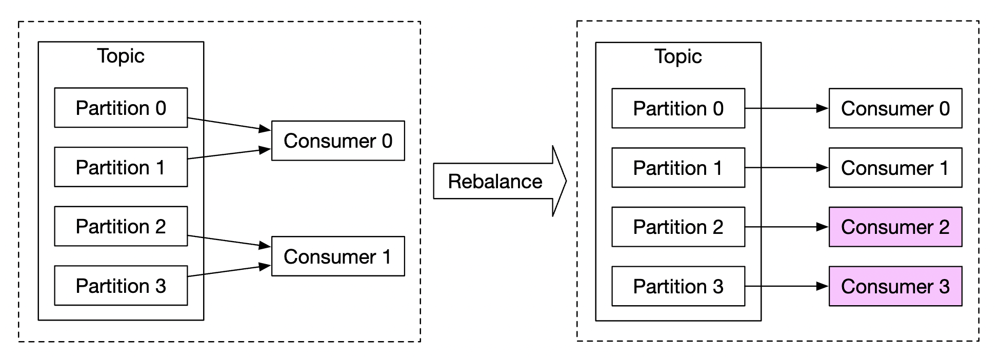

如何扩展聚合服务：

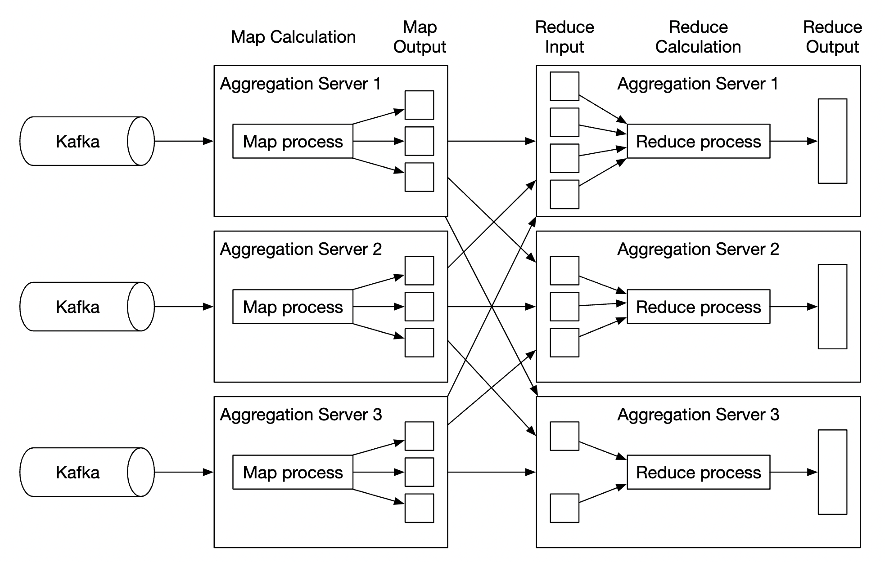

- Map-Reduce 节点可以通过增加更多节点轻松扩展。
- 聚合服务的吞吐量可以通过利用多线程进行扩展。
- 另外，我们可以利用 Apache YARN 等资源提供商来利用多进程。
- 选项 1 更简单，但选项 2 在实践中更常用，因为它更具可扩展性。
- 这是一个多线程示例：

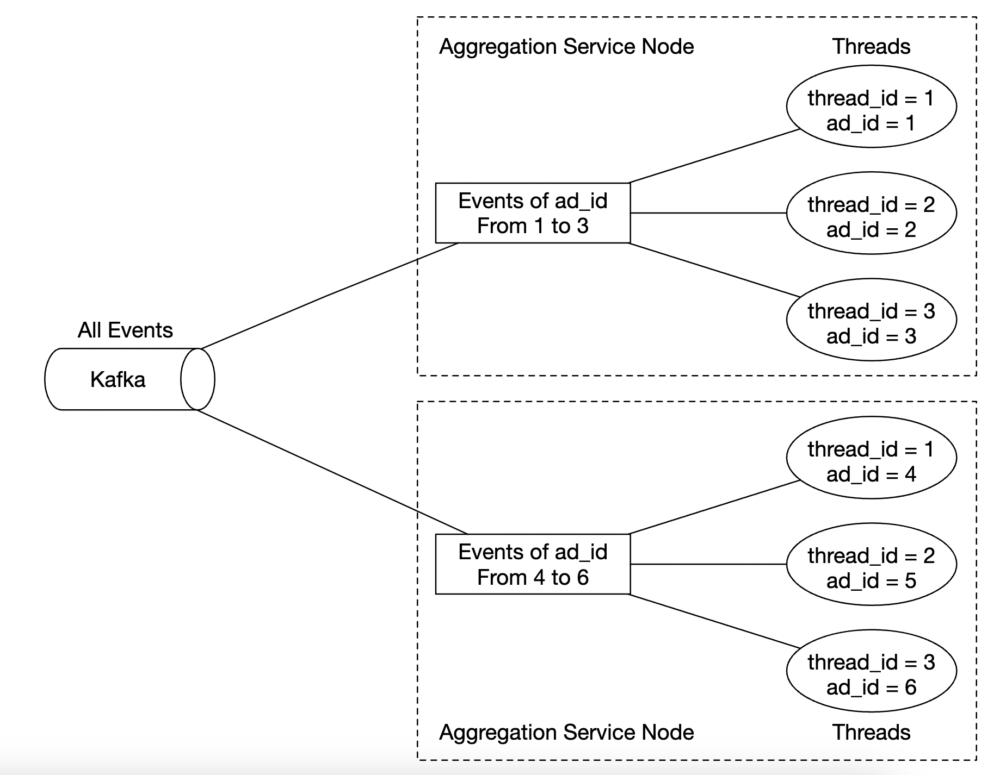

如何扩展数据库：

- 如果我们使用 Cassandra，它原生支持通过一致性哈希进行水平扩展。
- 如果向集群中添加新节点，数据会自动在所有（虚拟）节点之间重新平衡。
- 通过这种方法，无需手动（重新）分片。

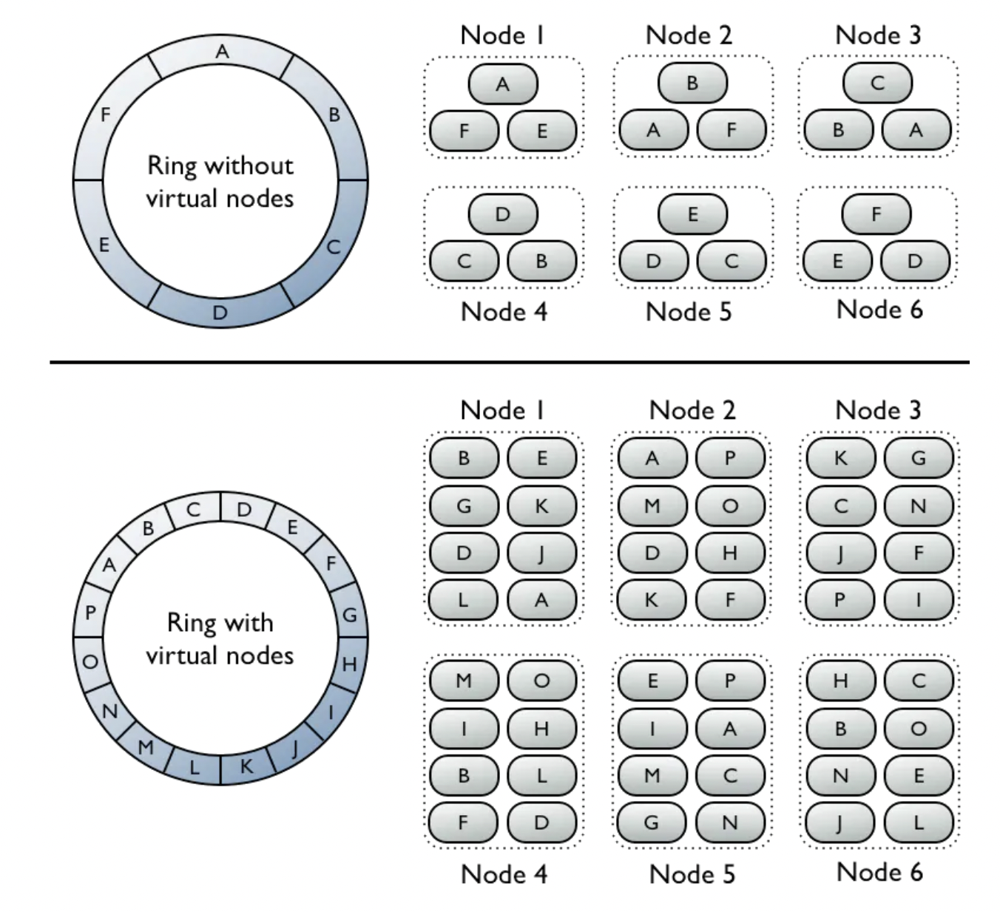

另一个需要考虑的扩展性问题是热点问题——如果某个广告比其他广告更受欢迎，吸引更多注意力怎么办？

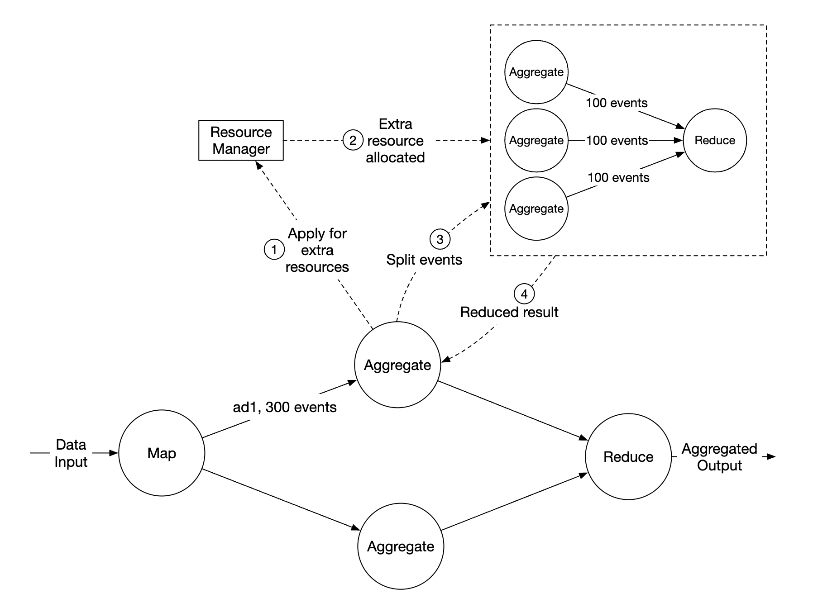

- 在上述示例中，聚合服务节点可以通过资源管理器申请额外资源。
- 资源管理器分配更多资源，因此原始节点不会过载。
- 原始节点将事件分为 3 组，每个聚合节点处理 100 个事件。
- 结果写回原始聚合节点。

另一种更复杂的处理热点问题的方法：

- 全局-局部聚合
- 分割独立聚合

### 故障容错

在聚合节点内，我们正在内存中处理数据。如果一个节点宕机，已处理的数据将丢失。

我们可以利用 Kafka 中的消费者偏移量来在其他节点接管时继续从中断处开始。
然而，由于我们正在聚合前 N 个广告，可能需要维护额外的中间状态。

我们可以在特定的分钟时进行快照，以便持续的聚合操作：


如果某个节点宕机，新节点可以读取最新的已提交的消费者偏移量和最新的快照，以继续执行任务：

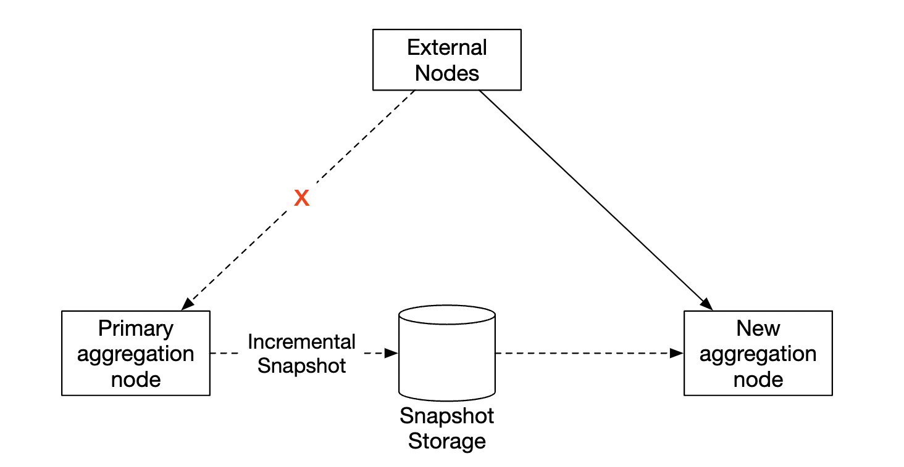

### 数据监控和正确性

由于我们正在聚合的数据对于计费至关重要，因此确保正确性非常重要，必须实施严格的监控。

我们可能需要监控的一些指标：

- 延迟 - 可以追踪不同事件的时间戳，以了解系统的端到端延迟。
- 消息队列大小 - 如果队列大小突然增加，我们需要增加更多的聚合节点。由于 Kafka 通过分布式提交日志实现，我们需要跟踪记录滞后指标。
- 聚合节点上的系统资源 - CPU、磁盘、JVM 等。

我们还需要实现一个对账流程，这是一个批处理作业，在每天结束时运行。
它从原始数据计算聚合结果，并与聚合数据库中实际存储的数据进行比较：

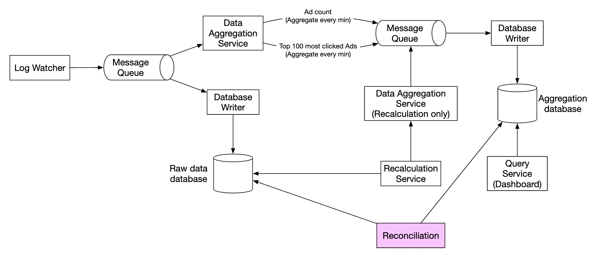

### 替代设计

在通用的系统设计面试中，你不需要了解大数据处理中的专门软件的内部原理。

解释思考过程并讨论权衡比了解具体工具更为重要，这也是本章涵盖通用解决方案的原因。

一个替代设计，利用现成的工具，是将广告点击数据存储在 Hive 中，并在其上构建 ElasticSearch 层，以加速查询。

聚合通常在 OLAP 数据库中进行，如 ClickHouse 或 Druid。

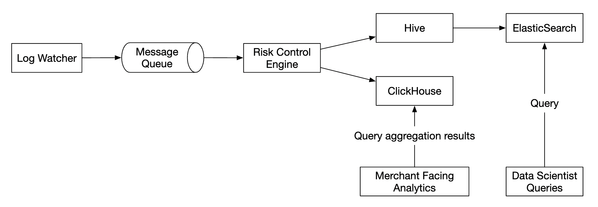

## 第四步：总结

我们覆盖的内容：

- 数据模型和 API 设计
- 使用 MapReduce 聚合广告点击事件
- 扩展消息队列、聚合服务和数据库
- 缓解热点问题
- 持续监控系统
- 使用对账确保正确性
- 故障容错

广告点击事件聚合是一个典型的大数据处理系统。

如果你事先了解相关技术，那么理解和设计它将变得更加容易：

- Apache Kafka
- Apache Spark
- Apache Flink
