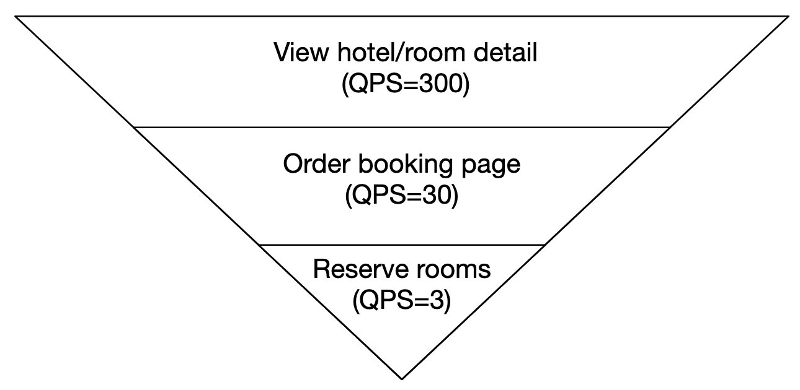
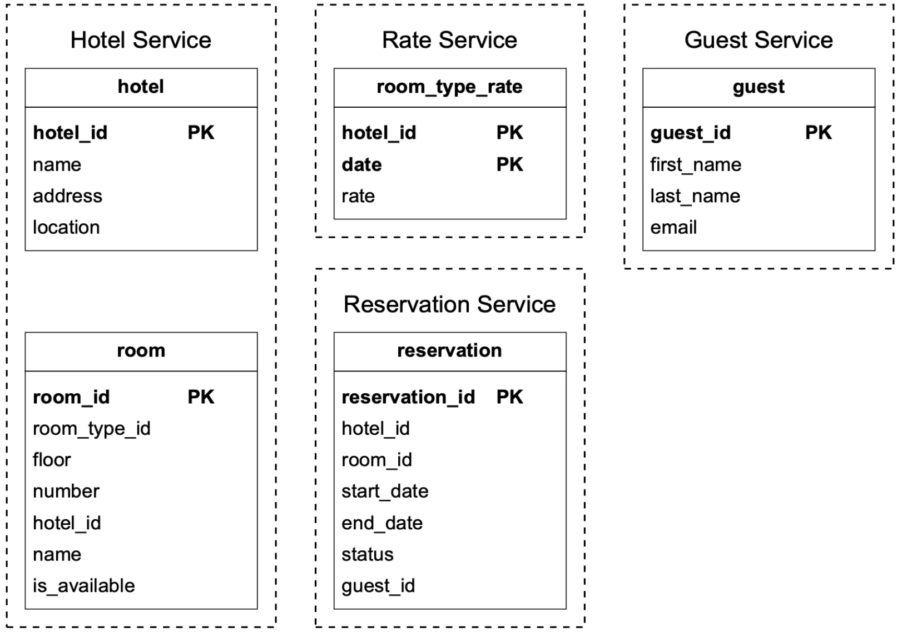
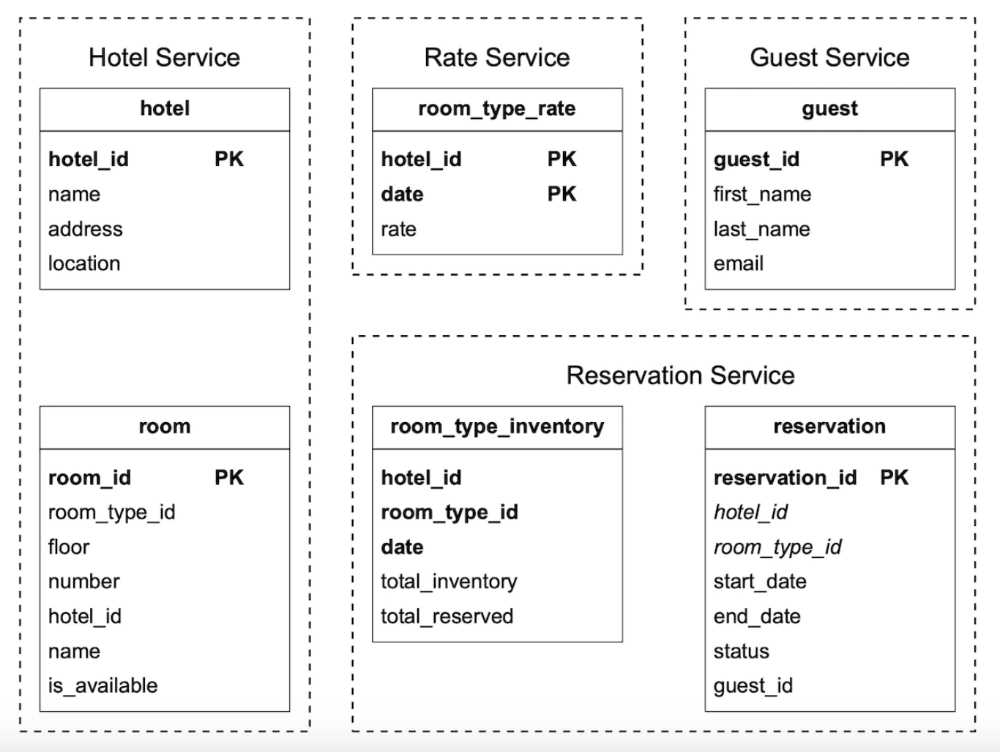
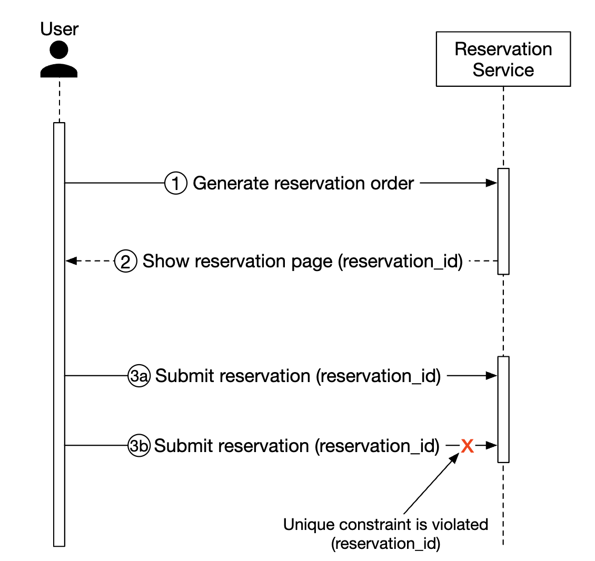
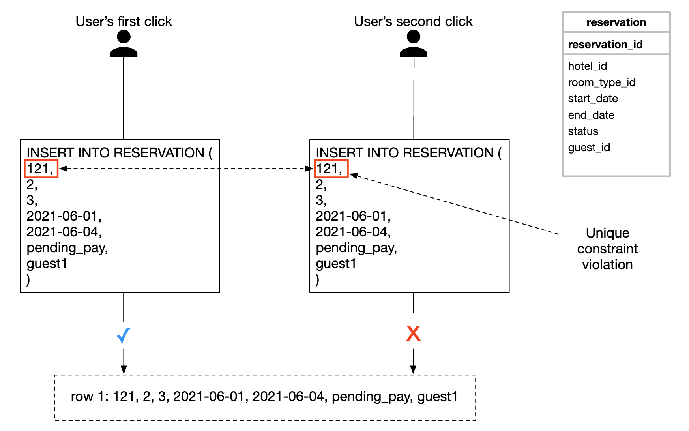
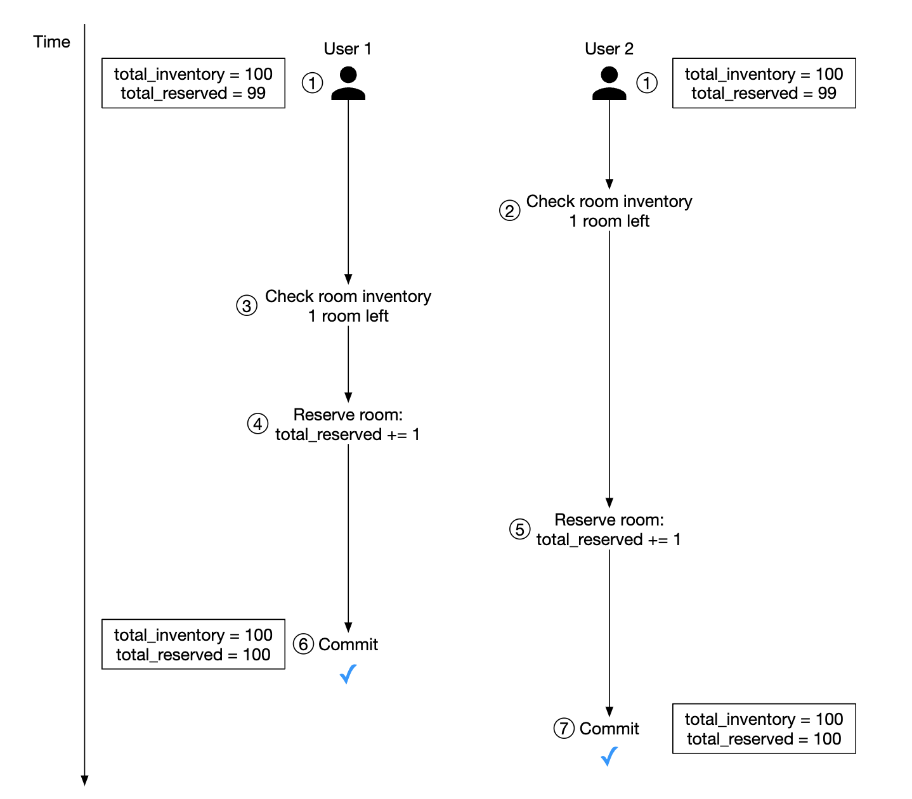
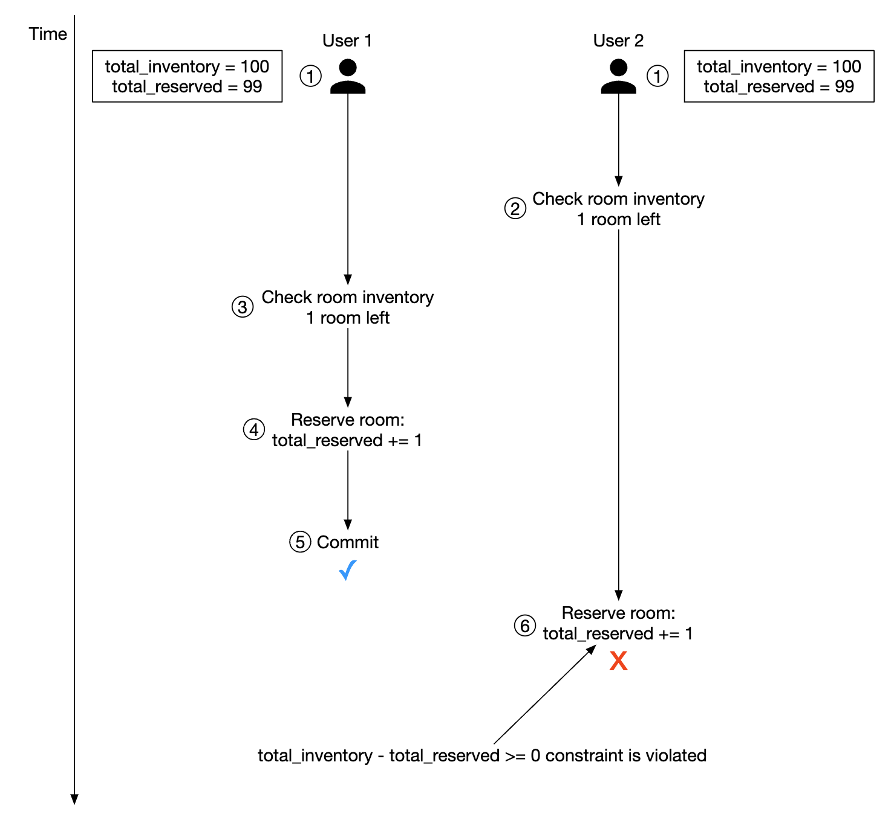
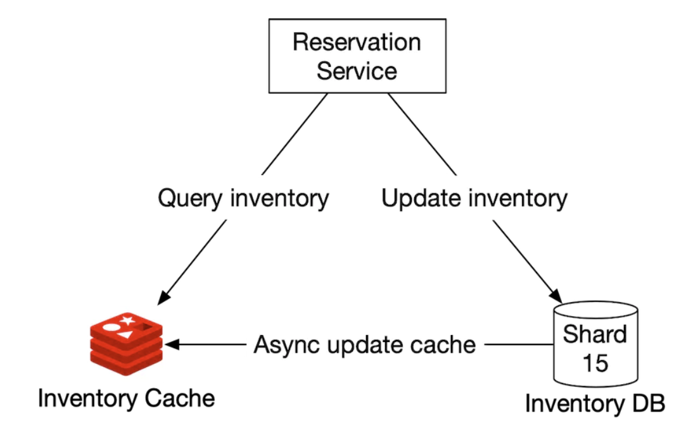
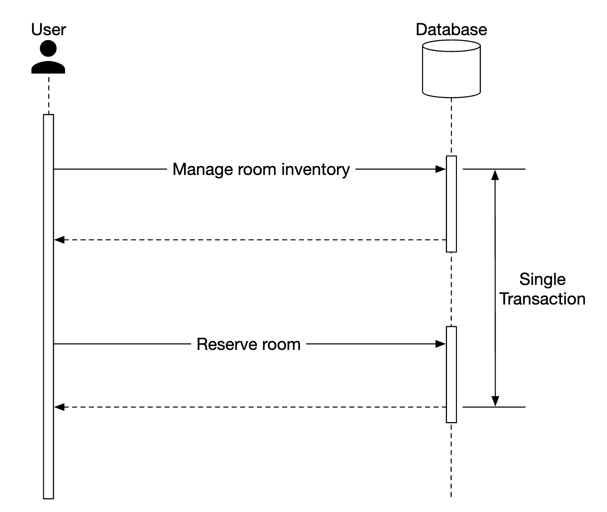
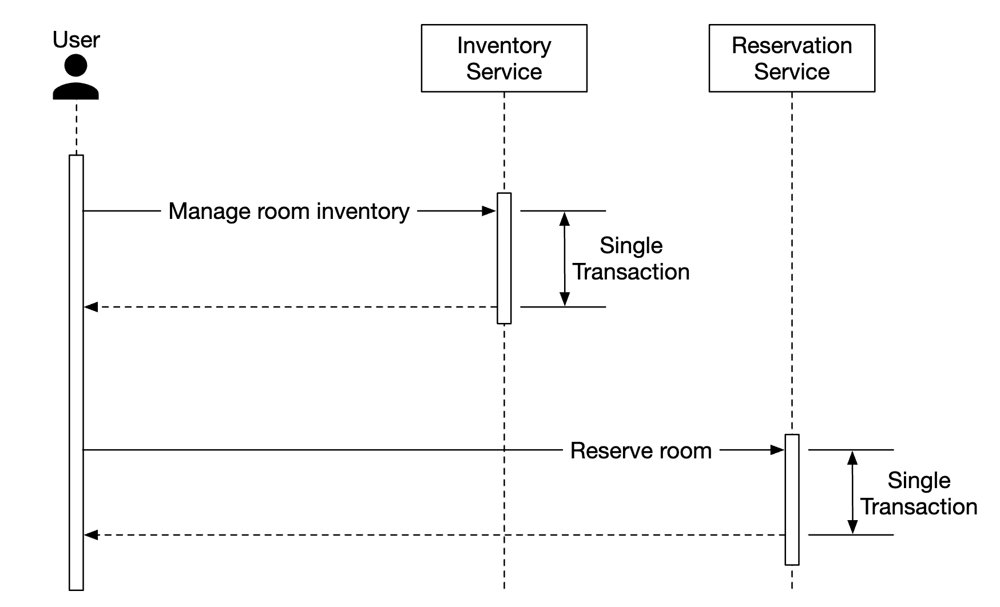

# 22. 设计酒店预订系统

在本章中，我们将设计一个酒店预订系统，类似于万豪国际（Marriott International）。

此设计也适用于其他类型的系统，如 Airbnb、航班预订、电影票预订等。

## 第一步：理解问题并确定设计范围

在开始设计系统之前，我们需要向面试官提出问题以明确设计的范围：

- **候选人**: 系统的规模是多少？
- **面试官**: 我们正在为一个拥有 5000 家酒店和 100 万个房间的酒店连锁构建一个网站。
- **候选人**: 客户是在预订时付款还是在到达酒店时付款？
- **面试官**: 客户在预订时全额付款。
- **候选人**: 客户是通过网站预订酒店房间吗？我们是否需要支持其他预订方式，如电话？
- **面试官**: 客户仅通过网站或应用程序进行预订。
- **候选人**: 客户可以取消预订吗？
- **面试官**: 可以。
- **候选人**: 还需要考虑其他事项吗？
- **面试官**: 是的，我们允许超额预订 10%。酒店会销售比实际房间数更多的房间。这是因为酒店预期客户会取消预订。
- **候选人**: 由于时间有限，我们将重点关注：展示与酒店相关的页面、酒店房间详情页面、预订房间、管理面板，支持超额预订。
- **面试官**: 听起来不错。
- **面试官**: 还有一件事——酒店价格经常变化。假设酒店房间的价格每天都会变化。
- **候选人**: 好的。

### 非功能性需求

- 支持高并发——在旅游旺季，可能有很多客户试图预订同一家酒店。
- 适度的延迟——当用户进行预订时，理想情况下系统应该具有较低的延迟，但如果系统处理需要几秒钟的时间也是可以接受的。

### 粗略估算

- 总共有 5000 家酒店和 100 万个房间
- 假设 70% 的房间被占用，平均入住时长为 3 天
- 估算每日预订量 - 100 万 \* 0.7 / 3 = ~24 万个预订/日
- 每秒预订量 - 24 万 / 10^5 秒 = ~3。平均每秒预订数（TPS）较低。

让我们估算每秒查询量（QPS）。假设用户进入预订页面有三个步骤，每个页面的转换率是 10%，
我们可以估算，如果有 3 个预订，那么必须有 30 次预订页面的访问和 300 次酒店房间详情页面的访问。



## 第二步：提出高层设计并获得认可

我们将探讨：API 设计、数据模型和高层设计。

### API 设计

这个 API 设计关注的是我们为了支持一个酒店预订系统所需的核心端点（使用 RESTful 实践）。

一个完善的系统需要一个更广泛的 API，支持根据多种标准搜索房间，但在这一节我们不会重点关注这些。
原因是这些并不是技术上有挑战性的内容，因此超出了本节的范围。

与酒店相关的 API：

- `GET /v1/hotels/{id}` - 获取酒店的详细信息
- `POST /v1/hotels` - 添加一个新酒店，仅对运营人员可用
- `PUT /v1/hotels/{id}` - 更新酒店信息，仅对运营人员可用
- `DELETE /v1/hotels/{id}` - 删除酒店，仅对运营人员可用

与房间相关的 API：

- `GET /v1/hotels/{id}/rooms/{id}` - 获取房间的详细信息
- `POST /v1/hotels/{id}/rooms` - 添加房间，仅对运营人员可用
- `PUT /v1/hotels/{id}/rooms/{id}` - 更新房间信息，仅对运营人员可用
- `DELETE /v1/hotels/{id}/rooms/{id}` - 删除房间，仅对运营人员可用

与预订相关的 API：

- `GET /v1/reservations` - 获取当前用户的预订历史
- `GET /v1/reservations/{id}` - 获取某个预订的详细信息
- `POST /v1/reservations` - 创建一个新预订
- `DELETE /v1/reservations/{id}` - 取消一个预订

这是一个示例请求，用于创建一个预订：

```
{
  "startDate":"2021-04-28",
  "endDate":"2021-04-30",
  "hotelID":"245",
  "roomID":"U12354673389",
  "reservationID":"13422445"
}
```

请注意，`reservationID` 是一个幂等性键，用于避免双重预订。详细信息请见[并发部分](./42_hotel_reservation_system.md)。

### 数据模型

在选择使用哪种数据库之前，让我们考虑一下我们的访问模式。

我们需要支持以下查询：

- 查看酒店的详细信息
- 查找给定日期范围内可用的房间类型
- 记录一个预订
- 查找某个预订或过去的预订历史

从我们的估算来看，系统的规模不大，但我们需要为流量激增做好准备。

基于这一点，我们选择了关系型数据库，因为：

- 关系型数据库适用于读多写少的系统。
- NoSQL 数据库通常针对写操作进行了优化，但我们知道我们不会有太多写操作，因为只有一小部分访问网站的用户会进行预订。
- 关系型数据库提供了 ACID 保证。这对于这种系统很重要，因为没有它们，我们无法防止诸如负余额、双重收费等问题。
- 关系型数据库可以轻松建模数据，因为结构非常清晰。

以下是我们的架构设计：



大多数字段不言自明。值得一提的是 `status` 字段，它表示某个房间的状态机：


该数据模型适用于像 Airbnb 这样的系统，但不适用于酒店，因为用户并不是预订特定的房间，而是预订一种房型。
他们预订的是房型，房间号是在预订时确定的。

这个不足将在[改进的数据模型](./42_hotel_reservation_system.md)部分得到解决。

### 高层设计

我们选择了微服务架构进行本设计，它在近年来得到了广泛的应用：


- 用户通过手机或电脑预订酒店房间
- 管理员执行诸如退款/取消支付等管理功能
- CDN 缓存静态资源，如 JS 包、图片、视频等
- 公共 API 网关 - 完全托管的服务，支持限流、身份验证等
- 内部 API - 仅对授权人员可见，通常由 VPN 保护
- 酒店服务 - 提供酒店和房间的详细信息。酒店和房间的数据是静态的，因此可以进行积极的缓存
- 价格服务 - 提供不同未来日期的房价。关于这个领域的一个有趣点是，价格取决于某天酒店的入住率
- 预订服务 - 接收预订请求并预订酒店房间，同时跟踪房间库存的变动（如预订、取消等）
- 支付服务 - 处理支付，并在成功支付后更新预订状态
- 酒店管理服务 - 仅对授权人员可用，允许执行某些管理功能，如查看和管理预订、酒店等

服务间的通信可以通过 RPC 框架（如 gRPC）来实现。

## 第三步：设计深入探讨

我们将深入探讨：

- 改进的数据模型
- 并发问题
- 可扩展性
- 解决微服务中的数据不一致问题

### 改进的数据模型

如前所述，我们需要修改我们的 API 和架构，以支持预订房型而非特定房间。

对于预订 API，我们不再预订 `roomID`，而是预订 `roomTypeID`：

```
POST /v1/reservations
{
  "startDate":"2021-04-28",
  "endDate":"2021-04-30",
  "hotelID":"245",
  "roomTypeID":"12354673389",
  "roomCount":"3",
  "reservationID":"13422445"
}
```

这是更新后的架构：



- room - 包含有关房间的信息
- room_type_rate - 包含给定房型的价格信息
- reservation - 记录客人的预订数据
- room_type_inventory - 存储关于酒店房间的库存数据

让我们来看看 `room_type_inventory` 表的列，因为这个表更加有趣：

- hotel_id - 酒店的 ID
- room_type_id - 房型的 ID
- date - 某一天的日期
- total_inventory - 总库存数，减去暂时从库存中移除的房间数
- total

\_reserved - 给定日期（hotel_id, room_type_id, date）的已预订房间数

有许多方式可以设计这个表，但使用 (hotel_id, room_type_id, date) 来表示每个房间，能够简化预订管理和查询。

表中的行通过每日的 CRON 作业进行预填充。

示例数据：
| hotel_id | room_type_id | date | total_inventory | total_reserved |
|----------|--------------|------------|-----------------|----------------|
| 211 | 1001 | 2021-06-01 | 100 | 80 |
| 211 | 1001 | 2021-06-02 | 100 | 82 |
| 211 | 1001 | 2021-06-03 | 100 | 86 |
| 211 | 1001 | ... | ... | |
| 211 | 1001 | 2023-05-31 | 100 | 0 |
| 211 | 1002 | 2021-06-01 | 200 | 16 |
| 2210 | 101 | 2021-06-01 | 30 | 23 |
| 2210 | 101 | 2021-06-02 | 30 | 25 |

示例 SQL 查询，检查房型的可用性：

```
SELECT date, total_inventory, total_reserved
FROM room_type_inventory
WHERE room_type_id = ${roomTypeId} AND hotel_id = ${hotelId}
AND date between ${startDate} and ${endDate}
```

如何使用这些数据检查指定数量房间的可用性（请注意我们支持超额预订）：

```
if (total_reserved + ${numberOfRoomsToReserve}) <= 110% * total_inventory
```

接下来我们估算一下存储量。

- 我们有 5000 家酒店
- 每家酒店有 20 种房型
- 5000 _ 20 _ 2（年）\* 365（天）= 7300 万行

7300 万行数据不算很多，单个数据库服务器就能处理。
然而，设置读复制（可能跨多个区域）以保证高可用性是有意义的。

后续问题——如果预订数据太大，无法存储在单个数据库中，该怎么办？

- 只存储当前和未来的预订数据。预订历史可以移到冷存储中。
- 数据库分片——我们可以通过 `hash(hotel_id) % servers_cnt` 来分片，因为我们在查询中总是选择 `hotel_id`。

### 并发问题

另一个需要解决的重要问题是双重预订。

我们需要解决两个问题：

- 同一用户点击了“预订”按钮两次
- 多个用户尝试同时预订同一个房间

下面是第一个问题的可视化示例：


解决这个问题有两种方法：

- 客户端处理 - 前端可以在点击“预订”按钮后禁用该按钮。然而，如果用户禁用了 JavaScript，他们将无法看到按钮变灰。
- 幂等 API - 向 API 添加一个幂等性键，使用户能够无论多少次调用端点，都能只执行一次操作：



以下是此流程的工作原理：

- 一旦你开始填写信息并进行预订，预订订单就会生成。该订单使用全局唯一标识符生成。
- 使用在前一步生成的`reservation_id`提交预订 1。
- 如果点击“完成预订”第二次，相同的`reservation_id`会被发送，后端检测到这是一个重复的预订。
- 通过对`reservation_id`列添加唯一约束来避免重复，这样就能防止在数据库中存储多个相同的记录。



如果多个用户进行相同的预订怎么办？



- 假设事务隔离级别不是可串行化的
- 用户 1 和用户 2 尝试同时预订同一个房间。
- 事务 1 检查是否有足够的房间——有
- 事务 2 检查是否有足够的房间——有
- 事务 2 预订房间并更新库存
- 事务 1 也预订了房间，因为它仍然看到有 99 个已预订房间，总共有 100 个房间。
- 两个事务都成功提交更改

这个问题可以通过某种锁机制来解决：

- 悲观锁
- 乐观锁
- 数据库约束

以下是我们用来预订房间的 SQL：

```
## 第一步：检查房间库存 {#step-1-check-room-inventory}
SELECT date, total_inventory, total_reserved
FROM room_type_inventory
WHERE room_type_id = ${roomTypeId} AND hotel_id = ${hotelId}
AND date between ${startDate} and ${endDate}

## 对于步骤 1 返回的每个条目 {#for-every-entry-returned-from-step-1}
if((total_reserved + ${numberOfRoomsToReserve}) > 110% * total_inventory) {
  Rollback
}

## 第二步：预订房间 {#step-2-reserve-rooms}
UPDATE room_type_inventory
SET total_reserved = total_reserved + ${numberOfRoomsToReserve}
WHERE room_type_id = ${roomTypeId}
AND date between ${startDate} and ${endDate}

Commit
```

### 选项 1：悲观锁

悲观锁通过在更新记录时对其加锁，防止同时更新。

这可以通过 MySQL 中的 `SELECT... FOR UPDATE` 查询来实现，该查询会锁定查询中选择的行，直到事务提交。


优点：

- 防止应用程序更新正在更改的数据
- 易于实现，避免通过串行化更新冲突。当存在大量数据竞争时，这种方式非常有用。

缺点：

- 当多个资源被锁定时，可能会发生死锁。
- 这种方法不具可扩展性——如果事务被锁定太久，可能会影响所有尝试访问该资源的其他事务。
- 当查询选择了大量资源并且事务持续时间较长时，影响会很大。

由于可扩展性问题，作者不推荐使用这种方法。

### 选项 2：乐观锁

乐观锁允许多个用户同时尝试更新一条记录。

有两种常见的实现方式——版本号和时间戳。推荐使用版本号，因为服务器时钟可能不准确。


- 向数据库表中添加一个新的 `version` 列
- 在用户修改数据库行之前，读取版本号
- 当用户更新行时，将版本号加 1 并写回数据库
- 数据库验证在版本号没有超过前一个时，阻止插入

乐观锁通常比悲观锁更快，因为我们并没有锁定数据库。
然而，当并发量很高时，它的性能往往会下降，因为这会导致大量回滚。

优点：

- 防止应用程序编辑过时的数据
- 我们不需要在数据库中获取锁
- 当数据竞争较低时，这种方法是首选，即很少发生更新冲突

缺点：

- 当数据竞争较高时，性能较差

乐观锁是我们系统的一个好选择，因为预订的 QPS 并不非常高。

### 选项 3：数据库约束

这种方法与乐观锁非常相似，但保护机制是通过数据库约束实现的：

```
CONSTRAINT `check_room_count` CHECK((`total_inventory - total_reserved` >= 0))
```



优点：

- 易于实现
- 当数据竞争较小的时候效果很好

缺点：

- 类似于乐观锁，当数据竞争较高时，性能较差
- 数据库约束不像应用代码那样容易进行版本控制
- 不是所有数据库都支持约束

由于实现简单，这是酒店预订系统的另一个好选择。

### 可扩展性

通常，酒店预订系统的负载不是很高。

然而，面试官可能会问你如何处理系统被用于更大、更受欢迎的旅行网站（例如 booking.com）的情况。在这种情况下，QPS 可能会增加 1000 倍。

当出现这种情况时，了解我们的瓶颈在哪里非常重要。所有服务都是无状态的，因此可以通过复制轻松扩展。

然而，数据库是有状态的，如何扩展就不那么明显了。

一种扩展方法是实现数据库分片——我们可以将数据分散到多个数据库中，每个数据库存储部分数据。

我们可以基于 `hotel_id` 来进行分片，因为所有查询都基于该字段进行筛选。
假设 QPS 为 30,000，将数据库分为 16 个分片后，每个分片处理 1875 QPS，这在单个 MySQL 集群的负载能力范围内。


我们还可以通过 Redis 利用缓存来存储房间库存和预订信息。我们可以设置 TTL，使得过期的数据会在过去的日期中过期。



我们存储库存的方式是基于 `hotel_id`、`room_type_id` 和 `date`：

```
key: hotelID_roomTypeID_{date}
value: 给定酒店 ID、房型 ID 和日期的可用房间数。
```

数据一致性是异步发生的，并通过使用 CDC 流机制进行管理——数据库的变化被读取并应用到一个单独的系统中。
Debezium 是一个流行的选项，用于将数据库变更同步到 Redis。

使用这种机制时，缓存和数据库可能在一段时间内不一致。
这对我们来说是可以接受的，因为数据库会防止我们进行无效的预订。

这可能会对 UI 产生一些问题，因为用户需要刷新页面才能看到“没有房间了”。
但是，如果一个人犹豫很久才做出预订决策，这种情况无论是否存在该问题都可能发生。

缓存的优点：

- 减少数据库负载
- 高性能，因为 Redis 在内存中管理数据

缓存的缺点：

- 在缓存和数据库之间维护数据一致性很难。我们需要考虑不一致性对用户体验的影响。

### 服务间的数据一致性

单体应用程序使我们能够使用共享的关系数据库来确保数据一致性。

在我们的微服务设计中，我们采用了混合方法，其中一些服务是独立的，但预订和库存 API 由同一服务处理。

这样做是因为我们希望利用关系数据库的 ACID 保证来确保一致性。

然而，面试官可能会质疑这种方法，因为它不是纯粹的微服务架构，在这种架构中，每个服务都有自己的数据库：


这可能会导致一致性问题。在单体服务器中，我们可以利用关系数据库的事务能力来实现原子操作：



然而，当操作跨越多个服务时，保证这种原子性会变得更加困难：



有一些著名的技术可以处理这些数据不一致问题：

- 两阶段提交 - 一种数据库协议，保证在多个节点上提交原子事务。
  但是，由于单个

节点的延迟可能导致所有节点阻塞操作，因此它的性能不高。

- Saga - 一系列本地事务，当工作流中的任何步骤失败时触发补偿事务。这是一种最终一致性的方法。

值得注意的是，解决微服务之间的数据不一致性是一个挑战性的问题，会增加系统的复杂性。
考虑到我们更务实的做法——将相关操作封装在同一个关系数据库中，是否值得付出这个代价，值得好好考虑。

## 第 4 步：总结

我们展示了一个酒店预订系统的设计。

以下是我们经历的步骤：

- 收集需求并进行初步计算，以了解系统的规模
- 在高层设计中展示了 API 设计、数据模型和系统架构
- 在深入探讨中，我们根据需求变化探讨了不同的数据库模式设计
- 我们讨论了竞态条件并提出了解决方案——悲观锁/乐观锁、数据库约束
- 讨论了通过数据库分片和缓存扩展系统的方法
- 最后，我们讨论了如何处理跨多个微服务的数据一致性问题
