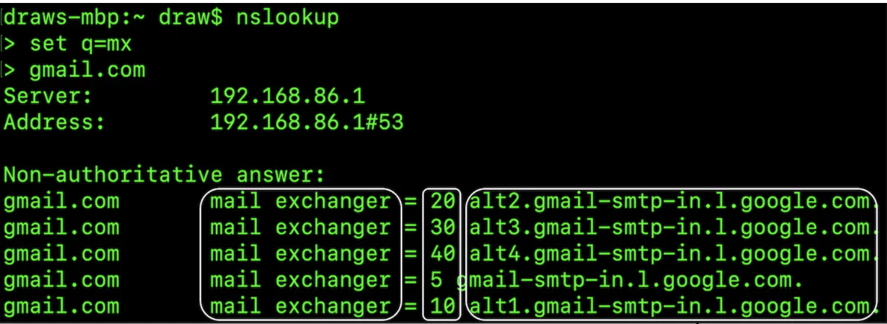
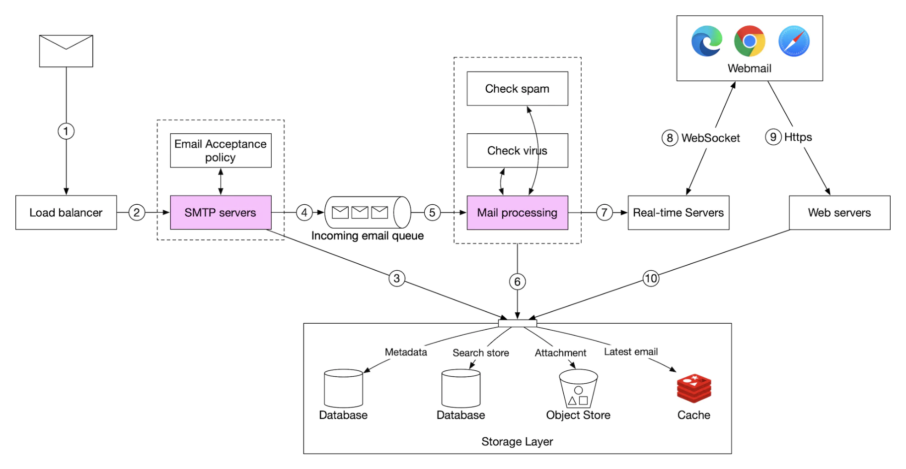
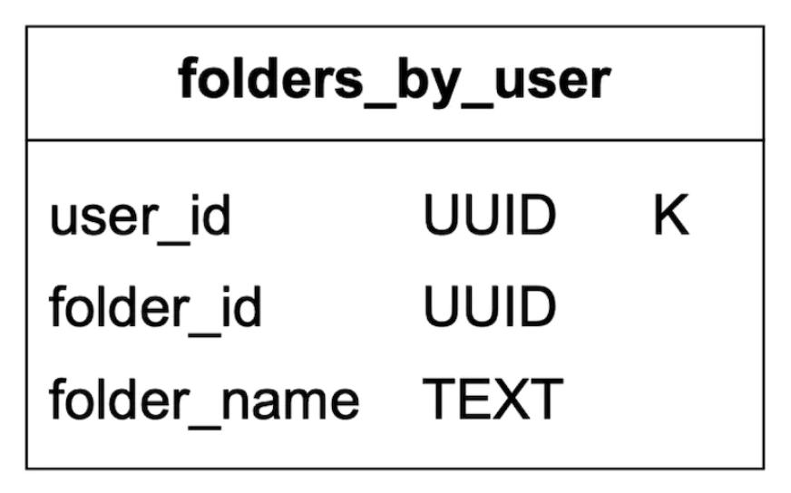
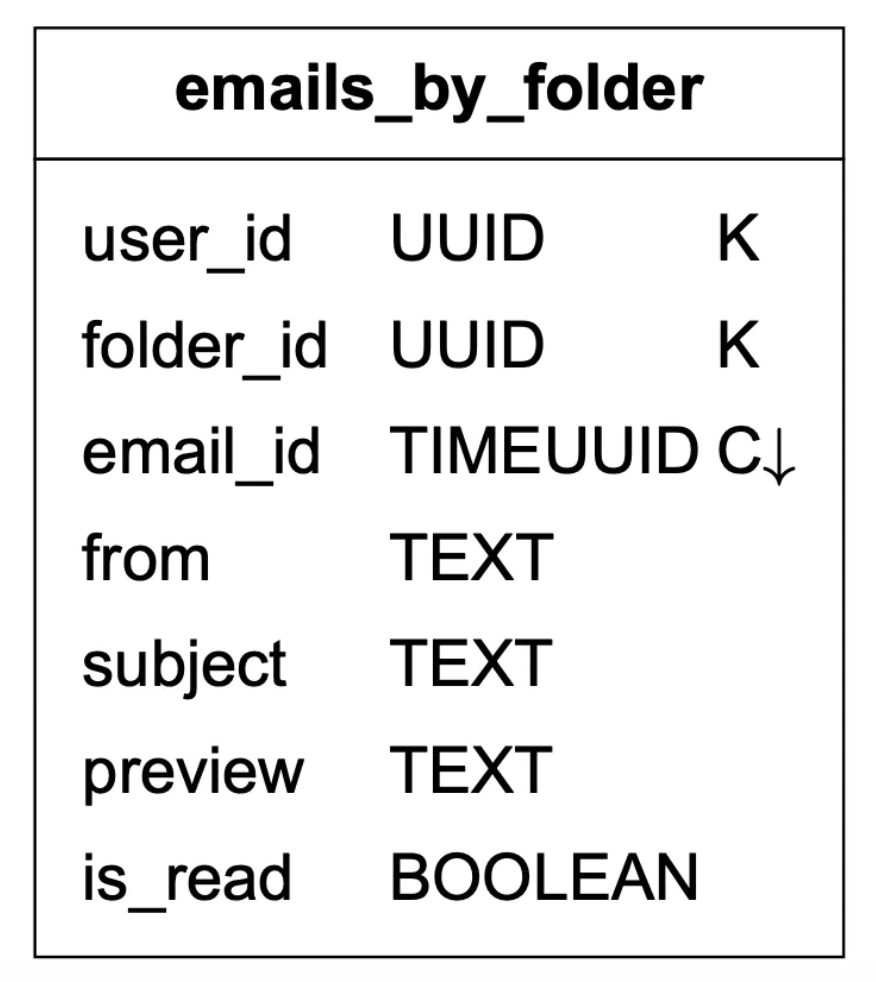
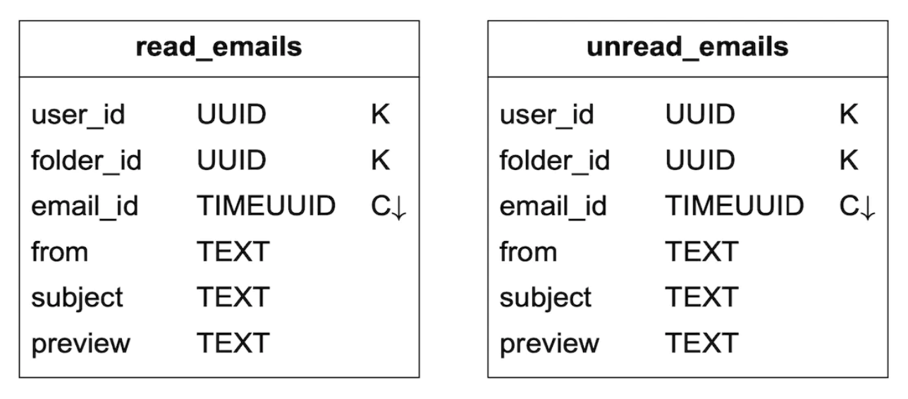
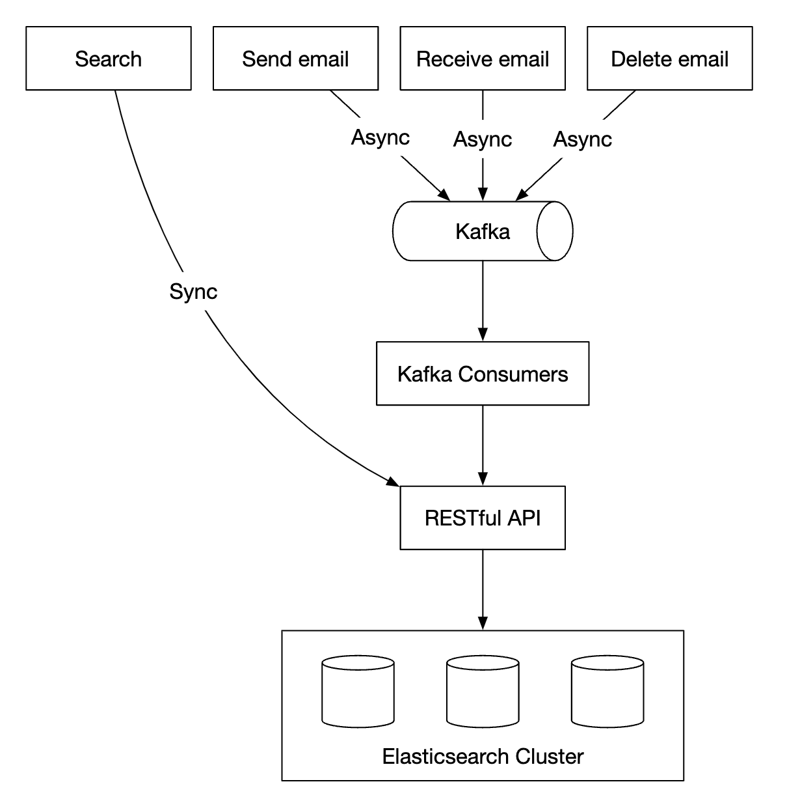
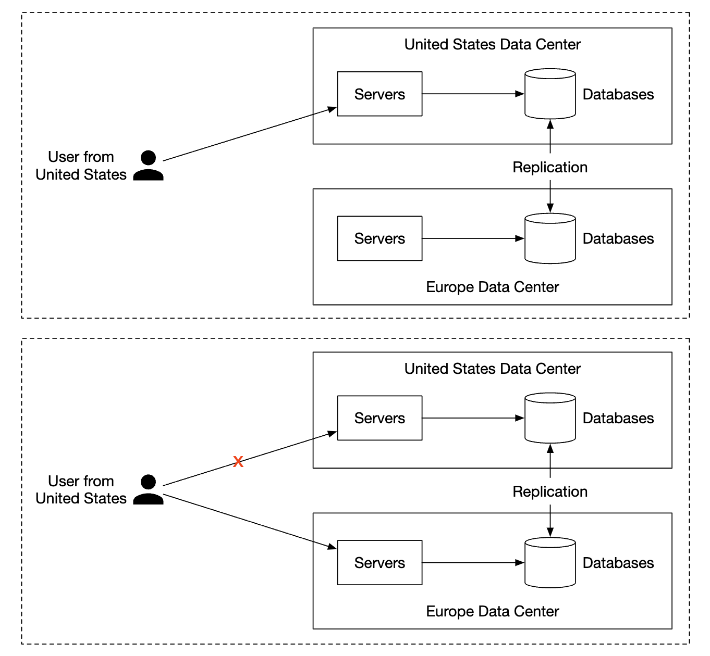

# 23. 设计分布式邮件服务

在这一章节，我们将设计一个分布式邮件服务，类似于 Gmail。

到 2020 年，Gmail 有 18 亿活跃用户，而 Outlook 则有 4 亿用户。

## 第一步：理解问题并确定设计范围

- **候选人**: 系统的用户数量是多少？
- **面试官**: 10 亿用户
- **候选人**: 我认为以下功能很重要——认证、发送/接收邮件、获取邮件、过滤邮件、搜索邮件、反垃圾邮件保护。
- **面试官**: 很好的列表。现在先不用担心认证。
- **候选人**: 用户如何连接到邮件服务器？
- **面试官**: 通常，邮件客户端通过 SMTP、POP、IMAP 连接，但在这个问题中我们将使用 HTTP。
- **候选人**: 邮件可以有附件吗？
- **面试官**: 是的。

### 非功能性要求

- 可靠性 - 我们不应该丢失数据。
- 可用性 - 我们应该使用复制来防止单点故障，也应能容忍部分系统故障。
- 可扩展性 - 随着用户基数的增长，我们的系统应该能够处理它们。
- 灵活性和可扩展性 - 系统应该灵活且易于扩展新功能。选择 HTTP 而不是 SMTP/其他邮件协议正是为了这个目的。

### 粗略估算

- 10 亿用户
- 假设每人每天发送 10 封邮件 -> 每秒 100k 封邮件。
- 假设每人每天接收 40 封邮件，每封邮件的元数据平均为 50KB -> 每年 730PB 的存储。
- 假设 20%的邮件有附件，平均大小为 500KB -> 每年 1460PB。

## 第二步：提出高层设计并获得认同

### 邮件协议知识 101

有几种协议用于发送和接收邮件：

- SMTP - 用于从一个服务器到另一个服务器发送邮件的标准协议。
- POP - 用于从远程邮件服务器接收和下载邮件到本地客户端的标准协议。一旦检索到，邮件会从远程服务器删除。
- IMAP - 类似于 POP，用于从远程服务器接收和下载邮件，但邮件保留在服务器端。
- HTTPS - 虽然不是邮件协议，但可以用于基于 Web 的邮件客户端。

除了邮件协议外，我们还需要为邮件服务器配置一些 DNS 记录——MX 记录：



邮件附件通过 Base64 编码发送，大多数邮件服务对附件的大小有 25MB 的限制。这是可配置的，并且在个人账户和企业账户中有所不同。

### 传统邮件服务器

传统邮件服务器在用户数量有限、连接到单个服务器时表现良好。


- Alice 登录她的 Outlook 邮箱并点击“发送”。邮件被发送到 Outlook 邮件服务器，通信通过 SMTP 进行。
- Outlook 服务器查询 DNS 以查找 gmail.com 的 MX 记录，并将邮件转发到其服务器，通信同样通过 SMTP 进行。
- Bob 通过 IMAP/POP 从他的 Gmail 服务器获取邮件。

在传统邮件服务器中，邮件通常存储在本地文件系统中。每封邮件都是一个单独的文件。


随着规模的增长，磁盘 I/O 成为瓶颈。此外，它无法满足我们对高可用性和可靠性的要求。磁盘可能会损坏，服务器也可能会宕机。

### 分布式邮件服务器

分布式邮件服务器旨在支持现代用例并解决现代的可扩展性问题。

这些服务器仍然可以支持 IMAP/POP 用于本地邮件客户端，并通过 SMTP 进行跨服务器的邮件交换。

但是，对于丰富的 Web 邮件客户端，通常使用基于 HTTP 的 RESTful API。

示例 API：

- `POST /v1/messages` - 发送邮件给收件人（To、Cc、Bcc 头）。
- `GET /v1/folders` - 返回一个邮箱帐户的所有文件夹
  示例响应：

```
[{id: string        唯一文件夹标识符。
  name: string      文件夹的名称。
                    根据RFC6154 [9]，默认文件夹可以是以下之一：
                    All, Archive, Drafts, Flagged, Junk, Sent,
                    和Trash。
  user_id: string   账户拥有者的引用
}]
```

- `GET /v1/folders/{:folder_id}/messages` - 返回文件夹下的所有邮件，带分页
- `GET /v1/messages/{:message_id}` - 获取某封邮件的所有信息
  示例响应：

```
{
  user_id: string                      // 账户拥有者的引用。
  from: {name: string, email: string}  // 发送者的<name, email>对
  to: [{name: string, email: string}]  // 收件人列表<name, email>对
  subject: string                      // 邮件的主题
  body: string                         // 邮件的正文
  is_read: boolean                     // 指示邮件是否已读
}
```

下面是分布式邮件服务器的高层设计：


- Webmail - 用户使用 Web 浏览器发送/接收邮件。
- Web 服务器 - 公共请求/响应服务，用于管理登录、注册、用户配置文件等。
- 实时服务器 - 用于实时推送新邮件更新给客户端。我们使用 WebSockets 进行实时通信，但对于不支持 WebSockets 的旧浏览器，回退为长轮询。
- 元数据数据库 - 存储邮件的元数据，如主题、正文、发件人、收件人等。
- 附件存储 - 对象存储（例如 Amazon S3），适合存储大文件。
- 分布式缓存 - 我们可以将最近的邮件缓存到 Redis 中，以改善用户体验。
- 搜索存储 - 分布式文档存储，用于支持全文搜索。

以下是邮件发送流程：


- 用户写邮件并点击“发送”。邮件发送到负载均衡器。
- 负载均衡器限制过多的邮件发送，并将请求路由到其中一台 Web 服务器。
- Web 服务器进行基本的邮件验证（例如邮件大小），如果发件人域名相同，则跳过发送流程，但会首先检查垃圾邮件。
- 如果基本验证通过，邮件被发送到消息队列（附件通过对象存储进行引用）。
- 如果基本验证失败，邮件被发送到错误队列。
- SMTP 出站工作者从出站队列拉取邮件，进行垃圾邮件/病毒检查，并路由到目标邮件服务器。
- 邮件被存储在“已发送邮件”文件夹中。

我们还需要监控出站消息队列的大小。队列增长过大可能表明存在问题：

- 收件人的邮件服务器不可用。我们可以在稍后时间重试发送邮件，使用指数退避。
- 消费者数量不足以处理负载，我们可能需要扩展消费者。

以下是邮件接收流程：



- 收到的邮件到达 SMTP 负载均衡器。邮件被分发到 SMTP 服务器，进行邮件接受策略处理（例如，直接丢弃无效邮件）。
- 如果邮件的附件过大，我们可以将其放入对象存储（如 S3）。
- 邮件处理工作者进行初步检查，之后将邮件转发到存储、缓存、对象存储和实时服务器。
- 离线用户将在重新上线后，通过 HTTP API 接收新邮件。

## 第三步：设计深度解析

现在让我们深入探讨一些组件。

### 元数据数据库

以下是邮件元数据的一些特性：

- 头部通常较小且频繁访问。
- 正文大小从小到大，但通常只读一次。
- 大多数邮件操作是针对单个用户的 —— 例如获取邮件、标记为已读、搜索。
- 数据的新鲜度影响数据的使用。用户通常只会查看最近的邮件。
- 数据具有高可靠性要求。数据丢失是不可接受的。

在 Gmail/Outlook 规模下，数据库通常是定制的，以减少每秒的输入/输出操作（IOPS）。

让我们考虑可用的数据库选项：

- 关系型数据库 - 我们可以为邮件头和正文构建索引，但这些数据库通常是为小数据块优化的。
- 分布式对象存储 - 这是备份存储的一个不错选择，但不能高效地支持搜索/标记已读等操作。
- NoSQL - Gmail 使用 Google BigTable，但它不是开源的。

基于上述分析，很少有现有的解决方案能完美地满足我们的需求。
在面试场合下，设计一个新的分布式数据库解决方案是不切实际的，但重要的是提到以下特性：

- 单个列可以是单个数字的 MB 大小
- 强一致性
- 旨在减少磁盘 I/O
- 高可用性和容错性
- 应该容易创建增量备份

为了对数据进行分区，我们可以使用`user_id`作为分区键，这样一个用户的数据将存储在单

个分片中。
这禁止我们将一封邮件共享给多个用户，但对于这次面试来说并不是一个要求。

让我们定义表：

- 主键由分区键（数据分布）和聚类键（排序数据）组成。
- 我们需要支持的查询 - 获取用户的所有文件夹，显示文件夹中的所有邮件，创建/获取/删除邮件，获取已读/未读邮件，获取会话线程（加分）。

以下是表格的图例：


这是文件夹表：



邮件表：



- email_id 是 timeuuid，它允许基于邮件创建时间戳进行排序。

附件存储在一个单独的表中，通过文件名进行标识：


支持获取已读/未读邮件在传统的关系型数据库中很容易实现，但在 Cassandra 中却不行，因为禁止在非分区/聚类键上进行过滤。
一种解决方案是将邮件表反规范化为已读/未读邮件表：



为了支持会话线程，我们可以包括一些头部信息，邮件客户端会解析并使用这些信息来重构会话线程：

```
{
  "headers" {
     "Message-Id": "<7BA04B2A-430C-4D12-8B57-862103C34501@gmail.com>",
     "In-Reply-To": "<CAEWTXuPfN=LzECjDJtgY9Vu03kgFvJnJUSHTt6TW@gmail.com>",
     "References": ["<7BA04B2A-430C-4D12-8B57-862103C34501@gmail.com>"]
  }
}
```

最后，我们将牺牲一致性来换取可用性，因为这是这个问题的硬性要求。

因此，在发生故障切换或网络分区时，受影响的用户将暂时无法进行同步/更新操作。

### 邮件可达性

设置一个服务器来发送电子邮件很容易，但由于垃圾邮件保护算法，要将邮件送达到接收者的收件箱却很困难。

如果我们只是设置一个新的邮件服务器并开始通过它发送邮件，邮件很可能会被分类到垃圾邮件文件夹中。

以下是我们可以采取的措施来防止这种情况发生：

- **使用专用 IP 地址** - 使用专用 IP 地址发送电子邮件，否则，接收方的邮件服务器将不会信任你。
- **邮件分类** - 避免从相同的服务器发送营销邮件，以防止更重要的邮件被分类为垃圾邮件。
- **逐步预热 IP 地址** - 慢慢地预热你的 IP 地址，以便与大型电子邮件提供商建立良好的声誉。预热一个新的 IP 地址通常需要 2 到 6 周。
- **快速封禁垃圾邮件发送者** - 以防止恶化你的声誉。
- **反馈处理** - 设置与互联网服务提供商（ISP）的反馈回路，跟踪投诉率，并快速封禁垃圾邮件账户。
- **邮件认证** - 使用常见技术来防范钓鱼邮件，如发件人策略框架（SPF）、域名密钥识别邮件（DKIM）等。

你不需要记住所有这些内容。只要知道，建立一个良好的邮件服务器需要大量的领域知识。

### 搜索

搜索包括基于邮件内容的全文搜索，或基于发件人、收件人、主题、未读状态等过滤条件的更高级查询。

邮件搜索的一个特点是它是本地化的，并且写操作比读操作更多，因为我们需要在每次操作时重新索引，但用户很少使用搜索标签。

让我们将谷歌搜索与邮件搜索进行比较：

|          | 范围           | 排序                         | 准确性                                 |
| -------- | -------------- | ---------------------------- | -------------------------------------- |
| 谷歌搜索 | 整个互联网     | 按相关性排序                 | 索引需要一些时间，因此结果不是即时的。 |
| 邮件搜索 | 用户自己的邮箱 | 按属性排序，例如时间、日期等 | 索引应该很快，结果也应该准确。         |

为了实现这种搜索功能，一种选择是使用 Elasticsearch 集群。我们可以使用`user_id`作为分区键，将数据分组到同一节点下：



变更操作是通过 Kafka 异步进行的，以将服务与重新索引流程解耦。实际上，搜索数据是同步进行的。

Elasticsearch 是最受欢迎的搜索引擎数据库之一，并且非常适合对邮件进行全文搜索。

另外，我们也可以尝试开发自定义搜索解决方案，以满足我们的特定需求。

设计这样的系统超出了范围。构建时的一个核心挑战是优化它以适应写密集型的工作负载。

为了实现这一目标，我们可以使用日志结构合并树（LSM）来构建磁盘上的索引数据。写入路径只针对顺序写优化。
这种技术在 Cassandra、BigTable 和 RocksDB 中都有应用。

其核心思想是将数据存储在内存中，直到达到预定的阈值，然后将数据合并到下一层（磁盘）：


两种方法之间的主要权衡：

- Elasticsearch 在一定程度上可以扩展，而自定义搜索引擎可以针对邮件用例进行微调，从而支持更大的扩展。
- Elasticsearch 是我们需要维护的一个独立服务，除了元数据存储之外。自定义解决方案可以作为数据存储本身。
- Elasticsearch 是一个现成的解决方案，而自定义搜索引擎则需要大量的工程努力来构建。

### 可扩展性和可用性

由于单个用户的操作不会与其他用户发生冲突，因此大多数组件可以独立扩展。

为了确保高可用性，我们还可以使用多数据中心（DC）设置，并在发生故障时进行主从切换：



## 第四步：总结

附加讨论点：

- **容错性** - 系统的许多部分可能会失败。值得探讨的是我们将如何处理节点故障。
- **合规性** - 根据欧洲的 GDPR 法规，个人身份信息（PII）需要以合理的方式存储。
- **安全性** - 邮件加密、钓鱼保护、安全浏览等。
- **优化** - 例如防止相同附件被不同用户多次发送重复。
