# 24. 设计类似 S3 的对象存储

在本章中，我们将设计一个类似于亚马逊 S3 的对象存储服务。

存储系统大致分为三类：

- 块存储
- 文件存储
- 对象存储

块存储是一种在 1960 年代出现的设备。硬盘（HDD）和固态硬盘（SSD）就是这种存储设备的例子。
这些设备通常是物理连接到服务器上的，尽管也可以通过高速网络协议将它们连接到网络上。
服务器可以格式化原始块并将其用作文件系统，或者直接将其交给服务器进行控制。

文件存储是建立在块存储之上的。它提供了更高层次的抽象，使得管理文件夹和文件变得更加容易。

对象存储为了高耐用性、大规模和低成本牺牲了性能。
它主要面向“冷”数据，广泛用于归档和备份。
没有层级目录结构，所有数据都以对象的形式存储在平面结构中。
与其他存储类型相比，它的速度较慢。大多数云服务提供商都有对象存储服务——如亚马逊 S3、谷歌 GCS 等。

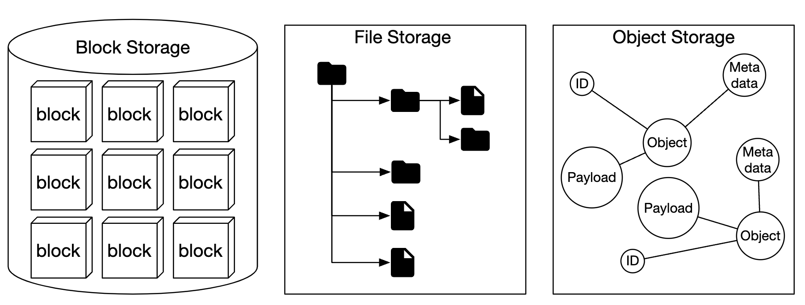

|          | 块存储               | 文件存储                    | 对象存储                 |
| -------- | -------------------- | --------------------------- | ------------------------ |
| 可变内容 | 是                   | 是                          | 否（有对象版本控制）     |
| 成本     | 高                   | 中到高                      | 低                       |
| 性能     | 中到高，非常高       | 中到高                      | 低到中                   |
| 一致性   | 强一致性             | 强一致性                    | 强一致性 [5]             |
| 数据访问 | SAS/iSCSI/FC         | 标准文件访问，CIFS/SMB，NFS | RESTful API              |
| 可扩展性 | 中等可扩展性         | 高可扩展性                  | 巨大可扩展性             |
| 适用场景 | 虚拟机（VM），数据库 | 通用文件系统访问            | 二进制数据，非结构化数据 |

一些与对象存储相关的术语：

- 桶（Bucket） - 存储对象的逻辑容器，名称是全球唯一的。
- 对象（Object） - 存储在桶中的单个数据单元，包含对象数据和元数据。
- 版本控制（Versioning） - 一种特性，可以在同一桶中保留对象的多个变体。
- 统一资源标识符（URI） - 每个资源通过 URI 唯一标识。
- 服务级别协议（SLA） - 服务提供商与客户之间的合同。

亚马逊 S3 标准 - 不常访问存储类（SLA）：

- 在多个可用区之间的耐用性为 99.999999999%
- 在整个可用区被销毁时，数据是有弹性的
- 设计目标为 99.9% 的可用性

## 第一步：理解问题并确定设计范围

- **候选人**: 应该包含哪些功能？
- **面试官**: 桶创建、对象上传/下载、版本控制、列出桶中的对象
- **候选人**: 典型的数据大小是多少？
- **面试官**: 我们需要高效地存储大量对象和小对象
- **候选人**: 一年存储多少数据？
- **面试官**: 100 PB
- **候选人**: 我们能否假设 6 个 9 的数据耐用性（99.9999%）和 4 个 9 的服务可用性（99.99%）？
- **面试官**: 是的，这听起来合理。

### 非功能性需求

- 100 PB 的数据
- 6 个 9 的数据耐用性
- 4 个 9 的服务可用性
- 存储效率：在保持高可靠性和性能的同时降低存储成本

### 粗略估算

对象存储可能在磁盘容量或每秒 I/O（IOPS）上有瓶颈。

假设：

- 20% 是小对象（小于 1MB），60% 是中型对象（1-64MB），20% 是大对象（大于 64MB）
- 一块硬盘（SATA，7200rpm）能够每秒执行 100-150 次随机寻址（100-150 IOPS）

根据这些假设，我们可以估算系统能够持久化的对象总数。

- 为了简化计算，我们使用每种对象类型的中位数大小：小对象 0.5MB，中型对象 32MB，大对象 200MB。
- 假设有 100PB 存储（10^11 MB），且 40% 的存储被使用，结果是 6.8 亿个对象。
- 如果假设元数据为 1KB，那么我们需要 0.68TB 的空间来存储元数据信息。

## 第二步：提出高层设计并获得认可

在深入设计之前，我们先来探讨对象存储的一些有趣特性：

- 对象不可变性 - 对象存储中的对象是不可变的（在其他存储系统中不是这样）。我们可以删除它们或替换它们，但不能更新它们。
- 键值存储 - 对象的 URI 是它的键，我们可以通过发出 HTTP 请求来获取其内容。
- 写一次，读多次 - 数据访问模式是一次写入，多次读取。根据 LinkedIn 的研究，95% 的操作是读取。
- 支持小对象和大对象。

对象存储的设计理念类似于 UNIX - 当我们保存一个文件时，它会在一个叫做 inode 的数据结构中创建文件名，并将文件数据存储在不同的磁盘位置。
inode 中包含一个文件块指针列表，这些指针指向磁盘上的不同位置。

在访问文件时，我们首先从 inode 中获取它的元数据，然后再获取文件内容。

对象存储的工作方式类似 - 元数据存储用于存储文件信息，但内容存储在磁盘上：

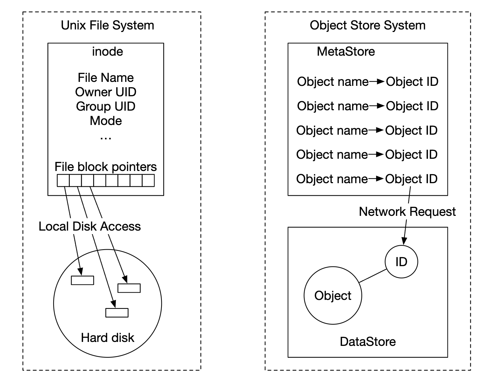

通过将元数据与文件内容分离，我们可以独立地扩展不同的存储：


### 高层设计


- 负载均衡器 - 将 API 请求分发到服务副本
- API 服务 - 无状态服务器，协调对元数据存储和对象存储的调用，以及身份和访问管理（IAM）服务的调用
- 身份和访问管理（IAM） - 集中的身份验证、授权和访问控制服务
- 数据存储 - 存储和检索实际数据，操作基于对象 ID（UUID）
- 元数据存储 - 存储对象元数据

### 上传对象

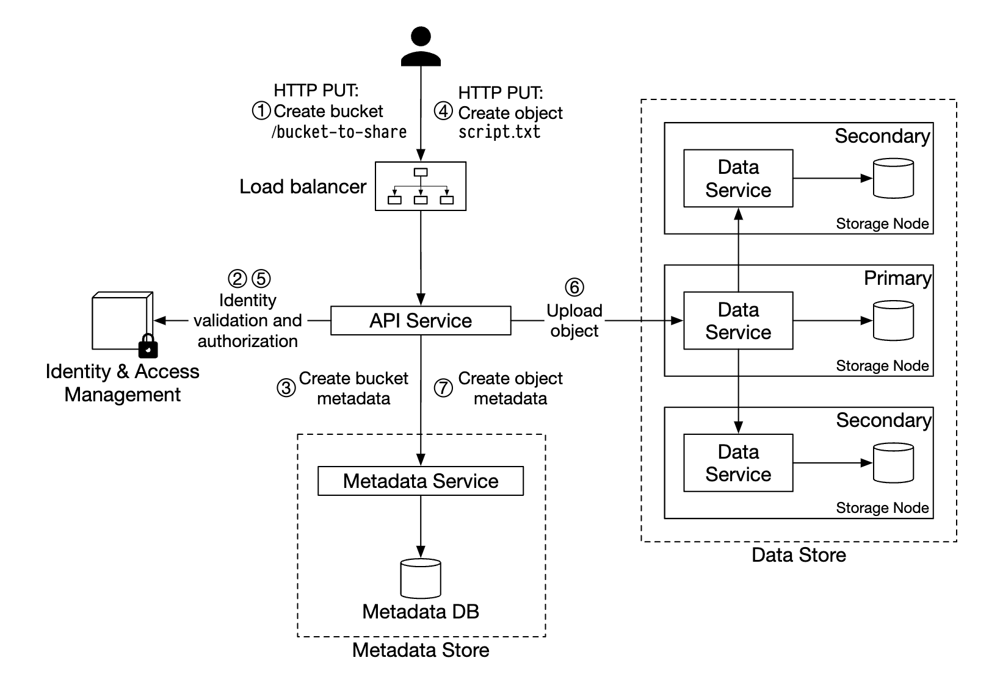

- 通过 HTTP PUT 请求创建一个名为“bucket-to-share”的桶
- API 服务调用 IAM 确保用户已授权并具有写权限
- API 服务调用元数据存储创建桶条目。创建成功后，返回成功响应。
- 桶创建后，发送 HTTP PUT 请求创建名为“script.txt”的对象
- API 服务验证用户身份并确保用户具有写权限
- 一旦验证通过，对象有效负载通过 HTTP PUT 发送到数据存储。数据存储持久化数据并返回一个 UUID。
- API 服务调用元数据存储创建一个新条目，包含 object_id、bucket_id 和 bucket_name 等其他元数据。

示例对象上传请求：

```
PUT /bucket-to-share/script.txt HTTP/1.1
Host: foo.s3example.org
Date: Sun, 12 Sept 2021 17:51:00 GMT
Authorization: authorization string
Content-Type: text/plain
Content-Length: 4567
x-amz-meta-author: Alex

[4567 字节的对象数据]
```

### 下载对象

桶没有目录层级结构，但我们可以通过连接桶名和对象名来创建一个逻辑层级结构，模拟文件夹结构。

获取对象的示例 GET 请求：

```
GET /bucket-to-share/script.txt HTTP/1.1
Host: foo.s3example.org
Date: Sun, 12 Sept 2021 18:30:01 GMT
Authorization: authorization string
```

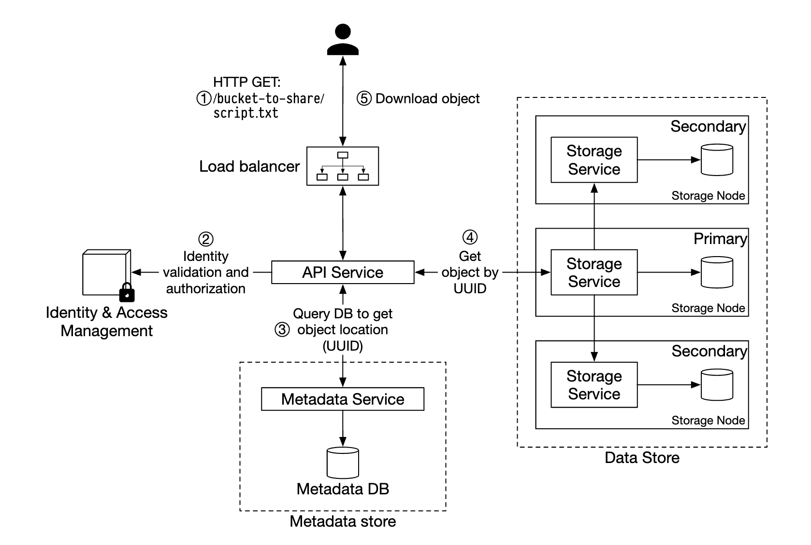

- 客户端向负载均衡器发送 HTTP GET 请求，即 `GET /bucket-to-share/script.txt`
- API 服务查询 IAM 以验证用户是否具有正确的权限来读取桶
- 验证通过后，从元数据存储中检索对象的 UUID
- 根据 UUID 从数据存储中检索对象有效负载，并返回给客户端

// Sprint 1

## 第三步：深入设计

### 数据存储

下面是 API 服务如何与数据存储交互的示意图：


数据存储的主要组件：


数据路由服务提供 RESTful 或 gRPC API 用于访问数据节点集群。
它是一个无状态服务，通过添加更多服务器来扩展。

它的主要职责是：

- 查询放置服务以获取最佳数据节点来存储数据
- 从数据节点读取数据并将其返回给 API 服务
- 将数据写入数据节点

放置服务决定哪些数据节点应存储对象。
它维护一个虚拟集群映射，确定集群的物理拓扑。


该服务还会向所有数据节点发送心跳，以确定它们是否应从虚拟集群中移除。

由于这是一个关键服务，建议维护一个由 5 或 7 个副本组成的集群，通过 Paxos 或 Raft 共识算法进行同步。
例如，7 节点集群可以容忍 3 个节点故障。

数据节点存储实际的对象数据。
通过将数据复制到多个数据节点来确保可靠性和耐用性。

每个数据节点上运行一个守护进程，该进程向放置服务发送心跳。

心跳包括：

- 数据节点管理多少块磁盘（HDD 或 SSD）？
- 每块磁盘上存储了多少数据？

### 数据持久化流程

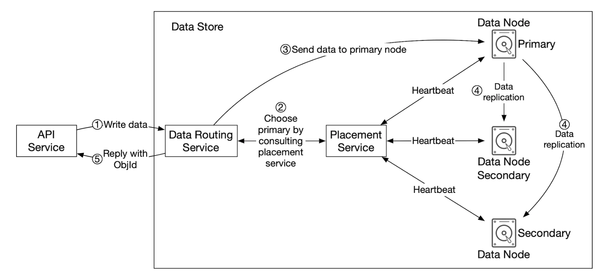

- API 服务将对象数据转发到数据存储
- 数据路由服务将数据发送到主数据节点
- 主数据节点将数据保存在本地，并将其复制到两个辅助数据节点。复制成功后，返回响应。
- 对象的 UUID 被返回给 API 服务。

注意事项：

- 给定对象 UUID，通过一致性哈希算法确定它的复制组。
- 在步骤 4 中，主数据节点在返回响应之前会复制对象数据。这种做法偏向于强一致性而不是较高的延迟。

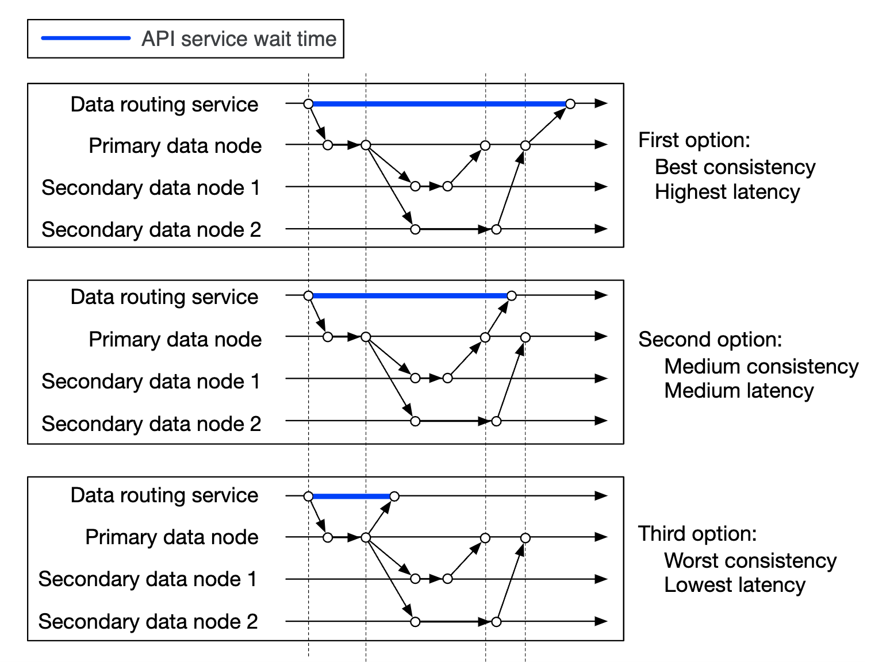

### 数据组织方式

一种简单的管理数据的方法是将每个对象存储在单独的文件中。

这种方式是可行的，但在文件系统中有许多小文件时，性能不好：

- HDD 上的数据块会浪费，因为每个文件都会使用整个块大小。典型的块大小为 4KB。
- 许多文件意味着许多 inode。操作系统不擅长处理过多的 inode，并且还有最大 inode 数量限制。

这些问题可以通过将许多小文件合并成更大的文件来解决，方法是使用预写日志（WAL）。一旦文件达到其容量（通常是几个 GB），就会创建一个新文件：

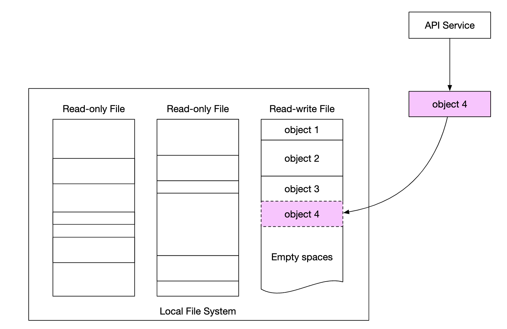

这种方法的缺点是对文件的写访问需要被序列化。多个核心访问同一个文件时必须等待彼此。
为了解决这个问题，我们可以将文件限制在特定的核心上，以避免锁竞争。

### 对象查找

为了支持在同一个文件中存储多个对象，我们需要维护一个表格，用来告知数据节点：

- `object_id`
- `filename` - 对象存储的位置
- `file_offset` - 对象开始的位置
- `object_size` - 对象的大小

我们可以将这个表格部署在基于文件的数据库（如 RocksDB）或传统的关系型数据库中。由于访问模式是低写高读，关系型数据库更加适合。

我们该如何部署它呢？
我们可以将数据库部署在集群中并单独进行扩展，所有数据节点可以访问它。

缺点：

- 我们需要积极地扩展集群以服务所有请求
- 数据节点与数据库集群之间存在额外的网络延迟

另一种选择是利用数据节点只对与其相关的数据感兴趣这一点，因此我们可以将关系型数据库部署在数据节点内部。

SQLite 是一个很好的选择，因为它是一个轻量级的基于文件的关系型数据库。

### 更新的数据持久化流程

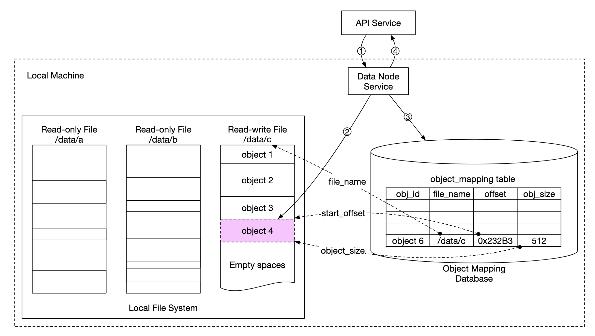

- API 服务发送请求保存新对象
- 数据节点服务将新对象附加到文件末尾，文件名为“/data/c”
- 对象的新记录插入到对象映射表中

### 持久性

数据持久性是我们设计中的一个重要要求。为了实现 6 个 nines 的耐用性，我们需要适当处理每一种故障情况。

首先要解决的问题是硬件故障。我们可以通过复制数据节点来最小化故障的概率。  
但除了这一点，我们还应该跨不同的故障域进行复制（跨机架、跨数据中心、独立网络等）。  
一个关键事件可能会导致同一故障域内的多个硬件故障：

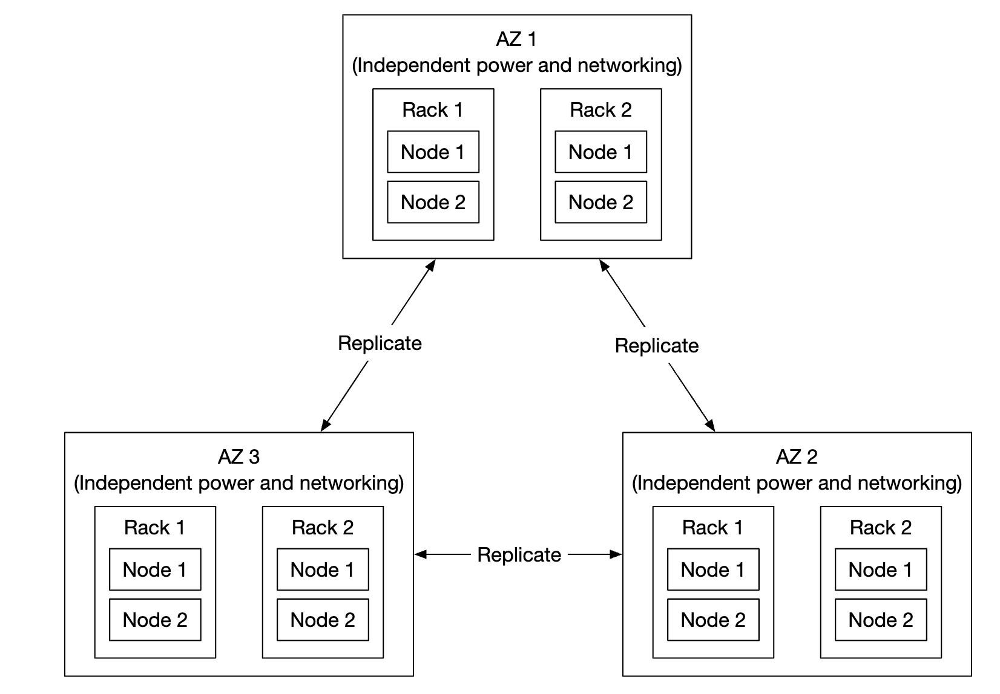

假设典型 HDD 的年故障率为 0.81%，通过创建三个副本，我们可以达到 6 个 nines 的耐用性。

以这种方式复制数据节点可以提供我们想要的耐用性，但我们也可以利用擦除编码来降低存储成本。

擦除编码使我们能够使用校验位，这允许我们在发生故障时重建丢失的位：

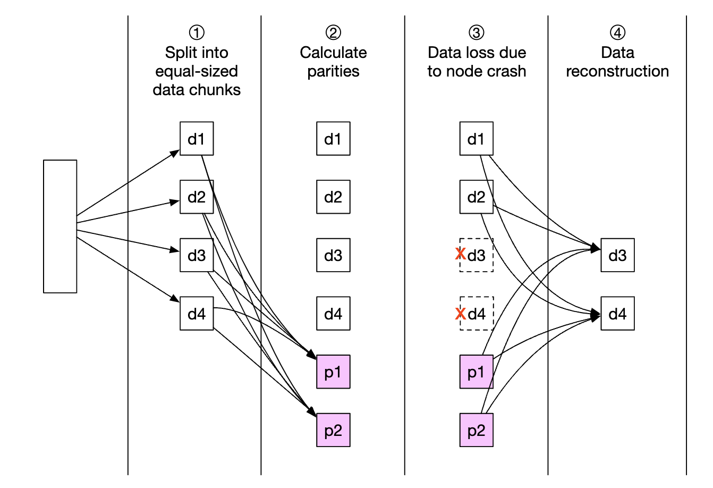

假设这些位是数据节点。如果其中两个节点宕机，我们可以使用剩下的四个节点来恢复数据。

有不同的擦除编码方案。在我们的情况下，我们可以使用 8+4 的擦除编码，跨不同的故障域分布，以最大化可靠性：

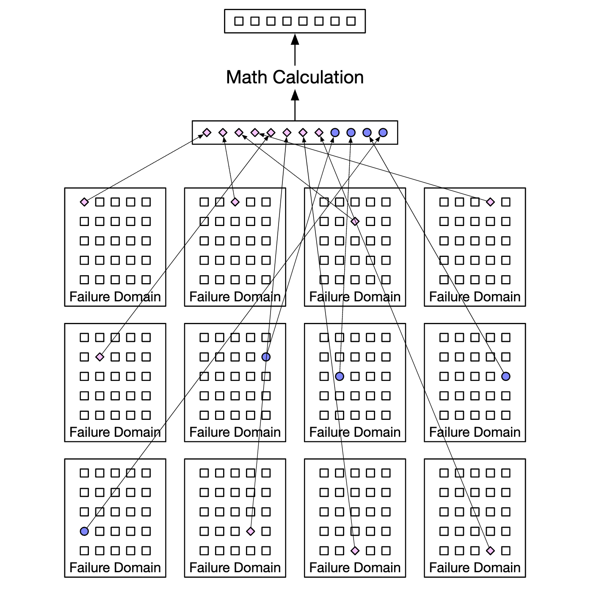

擦除编码使我们能够实现更低的存储成本（提高了 50%），但由于数据路由服务必须从多个位置收集数据，访问速度会受到影响：

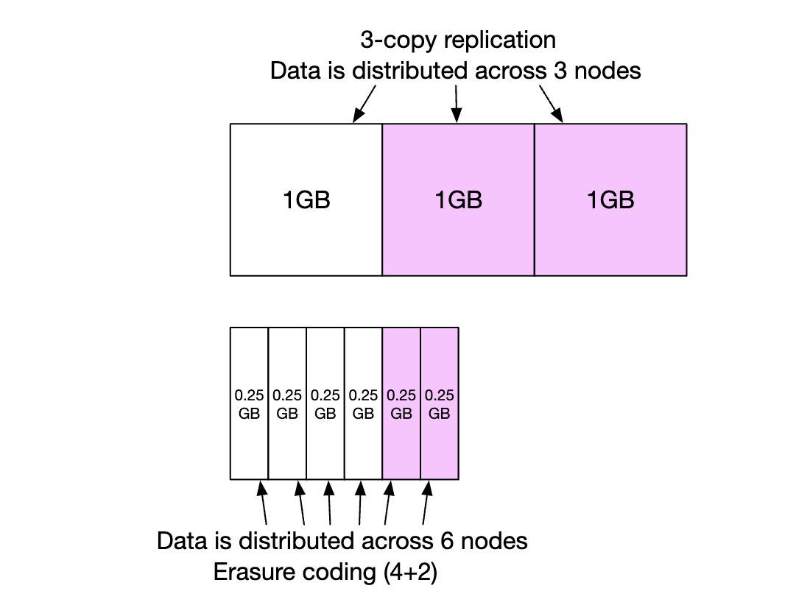

其他注意事项：

- 复制要求 200% 的存储开销（在 3 个副本的情况下），而擦除编码只需要 50%
- 擦除编码为我们提供 11 个 nines 的耐用性，而复制只能提供 6 个 nines
- 擦除编码需要更多的计算来计算和存储校验位

总的来说，复制对于低延迟敏感的应用更有用，而擦除编码则在存储成本效率和耐用性上更具吸引力。  
擦除编码的实现也要比复制复杂得多。

### 正确性验证

如果硬盘完全故障，故障是容易检测到的。但如果硬盘部分内存损坏，这就不那么直接了。

为了检测这种情况，我们可以使用校验和——文件内容的哈希值，能够验证文件的完整性。

在我们的系统中，我们将为每个文件和每个对象存储校验和：

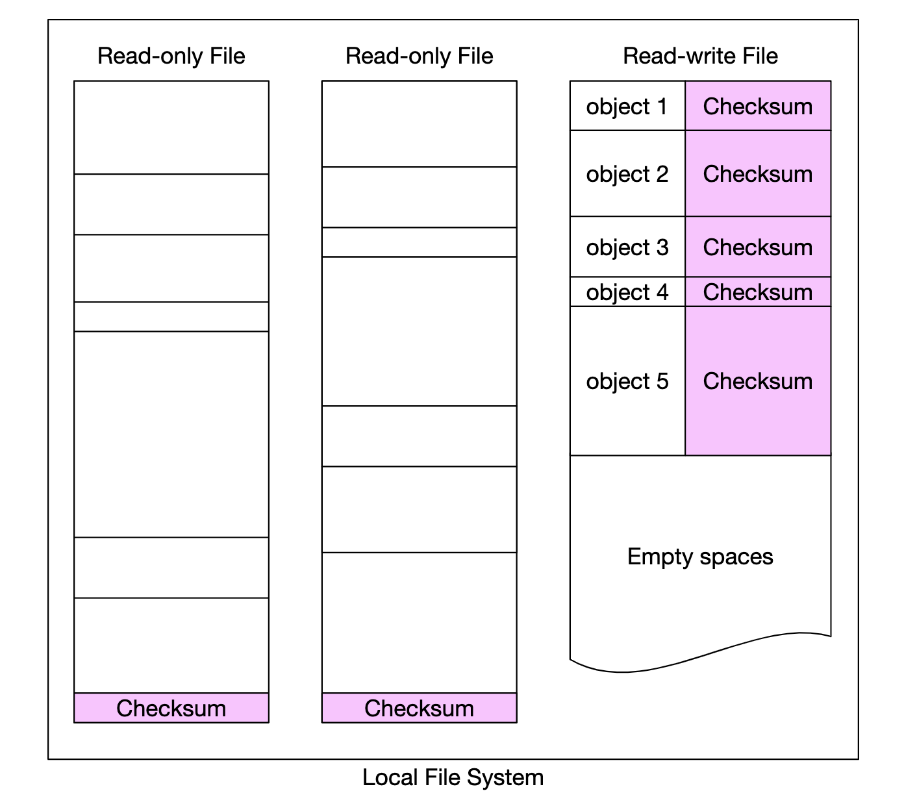

在擦除编码（8+4）的情况下，我们需要分别获取 8 个数据片段，并验证它们的校验和。

### 元数据数据模型

表格模式：

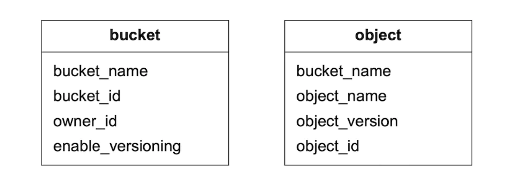

我们需要支持的查询：

- 通过名称查找对象 ID
- 基于名称插入/删除对象
- 列出具有相同前缀的桶中的对象

通常用户可以创建的桶数量有限，因此，桶表的大小较小，可以适配一个单独的数据库服务器。  
但我们仍然需要为读取吞吐量扩展服务器。

不过，对象表可能无法适应单个数据库服务器。因此，我们可以通过分片来扩展该表：

- 按 `bucket_id` 分片会导致热点问题，因为一个桶可能包含数十亿个对象
- 按 `bucket_id` 分片虽然可以更均匀地分配负载，但查询会变慢
- 我们选择按 `hash(bucket_name, object_name)` 分片，因为大部分查询都基于对象或桶名称。

即使使用这个分片方案，列出桶中的对象仍然会很慢。

### 在桶中列出对象

在单个数据库中，通过前缀列出对象（看起来像一个目录）可以像这样工作：

```
SELECT * FROM object WHERE bucket_id = "123" AND object_name LIKE `abc/%`
```

当数据库被分片时，完成这个查询会变得具有挑战性。为此，我们可以在每个分片上执行查询并在内存中聚合结果。  
但这样做使得分页变得困难，因为不同分片包含不同数量的结果，我们需要为每个分片维护单独的 limit/offset。

我们可以利用通常对象存储未优化列出对象的特点，因此我们可以牺牲列出性能。  
我们还可以为列出对象创建一个去规范化的表，按桶 ID 分片。  
这样一来，列出查询就会变得足够快速，因为它仅限于单个数据库实例。

### 对象版本控制

版本控制通过添加另一个 `object_version` 列来工作，该列类型为 TIMEUUID，允许我们按版本对记录进行排序。

每个新版本都会产生一个新的 `object_id`：


删除对象时，会创建一个新的版本，并使用特殊的 `object_id` 表示该对象已被删除。查询该对象时返回 404：


### 优化大文件的上传

上传大文件可以通过使用分片上传进行优化——将一个大文件拆分为多个块，独立上传：

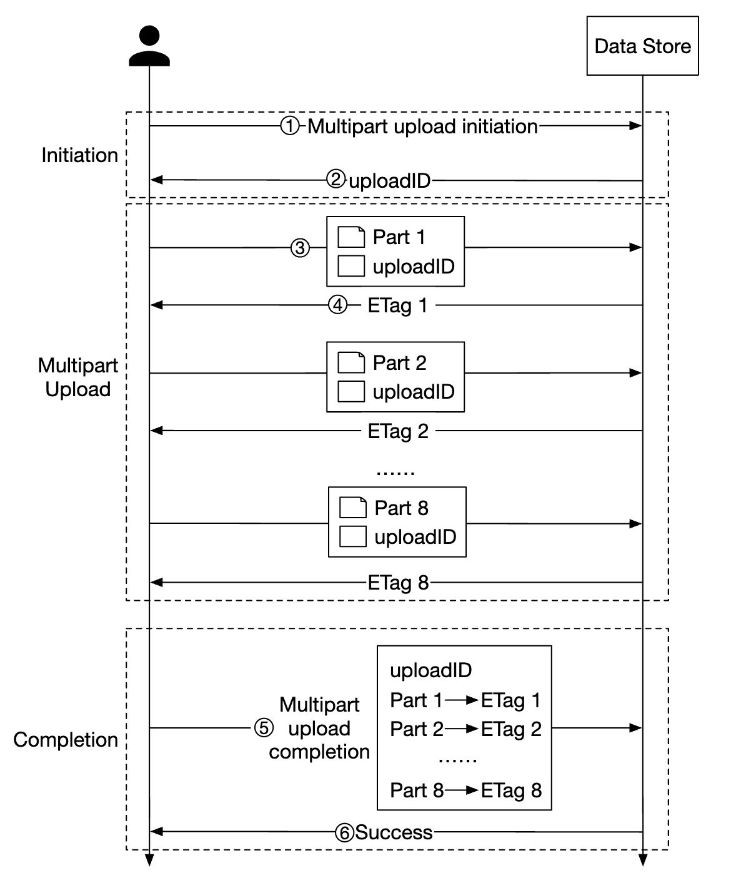

- 客户端调用服务以启动分片上传
- 数据存储返回一个上传 ID，用来唯一标识这次上传
- 客户端将大文件拆分为多个块，独立上传，每个块使用上传 ID
- 上传一个块时，数据存储返回一个 etag（MD5 校验和），标识该上传块
- 所有部分上传完成后，客户端发送完整的分片上传请求，包含上传 ID、部分号和所有 etag
- 数据存储从各个部分重新组装对象。此过程可能需要几分钟。完成后，成功响应将返回给客户端。

不再需要的旧部分可以在此时删除。我们可以引入一个垃圾回收器来处理它。

### 垃圾回收

垃圾回收是回收不再使用的存储空间的过程。数据变成垃圾的方式有几种：

- 延迟对象删除——对象标记为已删除，但实际上并没有被删除
- 孤立数据——例如上传中途失败，需要删除旧部分
- 损坏的数据——数据未通过校验和验证

垃圾回收器还负责回收副本中未使用的空间。  
在复制的情况下，数据会从主副本和副本中删除。在擦除编码（8+4）中，数据会从所有 12 个节点中删除。

为了便于删除，我们将使用称为“压缩”的过程：

- 垃圾回收器将未删除的对象从“data/b”复制到“data/d”
- 在复制完成后，使用数据库事务更新 `object_mapping` 表
- 为了避免创建过多小文件，压缩操作只在文件增长到某个阈值时执行

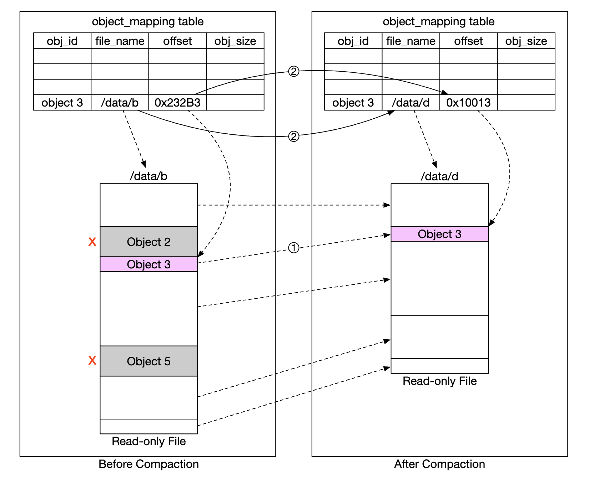

## 第 4 步：总结

我们涵盖的内容：

- 设计一个类似 S3 的对象存储
- 比较对象存储、块存储和文件存储的差异
- 讲解了在桶中上传、下载、列出、版本控制对象的过程
- 深入探讨了设计：数据存储和元数据存储、复制和擦除编码、分片上传、分片设计
