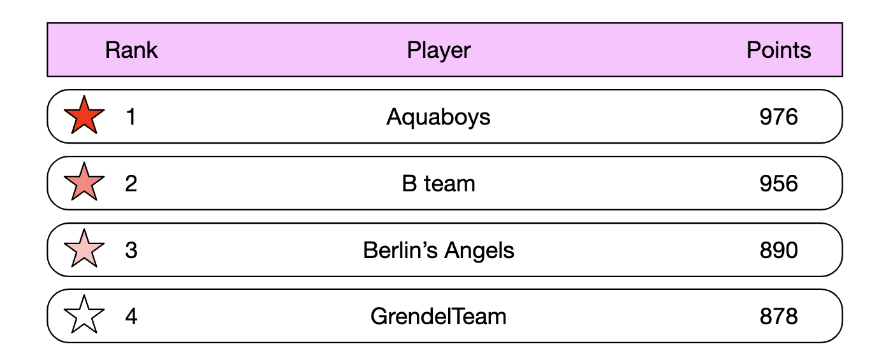
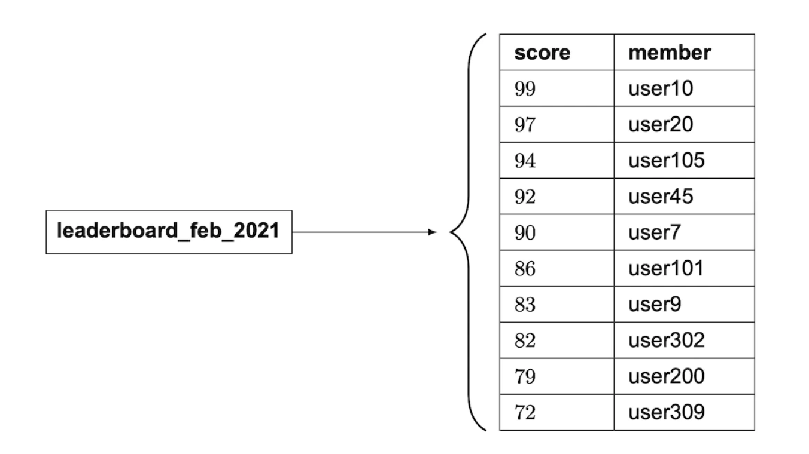
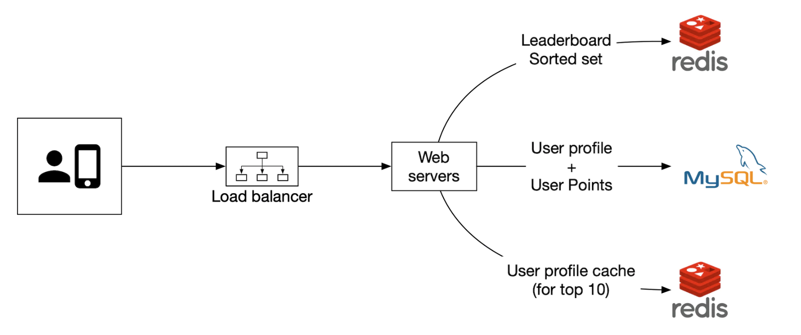
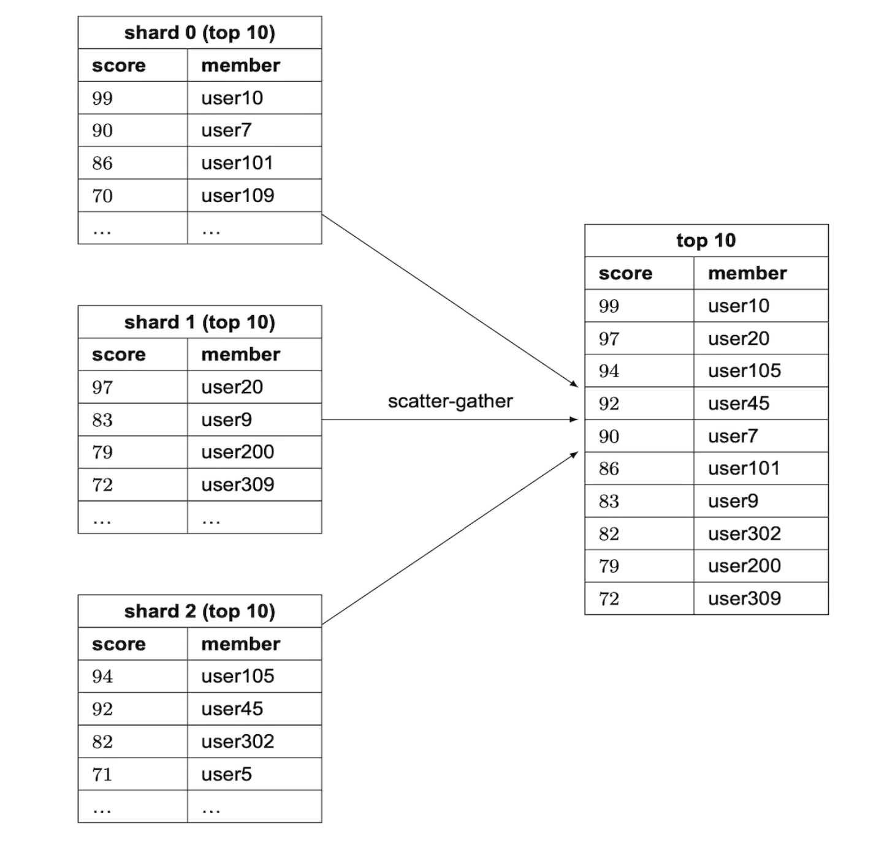
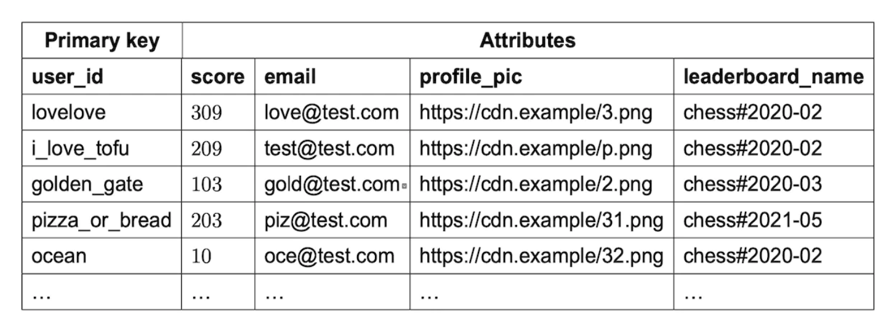

# 25. 设计实时游戏排行榜

我们将为一款在线手机游戏设计一个排行榜：



## 第一步：理解问题并确定设计范围

- **候选人**: 排行榜的得分是如何计算的？
- **面试官**: 用户每赢得一场比赛就获得 1 分。
- **候选人**: 排行榜中是否包括所有玩家？
- **面试官**: 是的。
- **候选人**: 排行榜是否与时间段相关？
- **面试官**: 每个月都会启动一个新的锦标赛，从而启动一个新的排行榜。
- **候选人**: 我们可以假设只关心排名前 10 的用户吗？
- **面试官**: 我们希望展示前 10 名用户，并显示特定用户的位置。如果时间允许，我们可以讨论如何展示特定用户周围的其他用户。
- **候选人**: 每个锦标赛有多少玩家？
- **面试官**: 500 万日活跃用户（DAU）和 2500 万月活跃用户（MAU）。
- **候选人**: 每个锦标赛期间平均有多少场比赛？
- **面试官**: 每个玩家每天平均玩 10 场比赛。
- **候选人**: 如果两名玩家得分相同，如何确定排名？
- **面试官**: 在这种情况下，他们的排名是相同的。如果时间允许，我们可以讨论如何打破平局。
- **候选人**: 排行榜需要实时更新吗？
- **面试官**: 是的，我们希望呈现实时结果，或者尽可能接近实时。展示批量结果历史是不允许的。

### 功能需求

- 显示排行榜前 10 名玩家
- 显示用户的具体排名
- 显示给定用户上下四名的玩家（附加功能）

### 非功能需求

- 实时更新得分
- 得分更新实时反映在排行榜上
- 一般的可扩展性、可用性和可靠性

### 粗略估算

假设游戏的日活跃用户数为 5000 万，如果玩家在 24 小时内的分布均匀，那么每秒约有 50 个用户在线。
然而，由于分布通常不均匀，我们可以估算峰值在线用户为每秒 250 个用户。

每秒查询量（QPS）对于用户得分的请求：假设每个玩家每天玩 10 场比赛，那么每秒得分请求数为 50 用户/s \* 10 = 500 QPS。峰值 QPS = 2500。

每秒查询量（QPS）用于获取前 10 名排行榜：假设用户平均每天查看一次排行榜，则 QPS 为 50。

## 第二步：提出高层设计并获得认可

### API 设计

我们需要的第一个 API 是更新用户得分的接口：

```
POST /v1/scores
```

该 API 接受两个参数：`user_id` 和用户通过赢得比赛获得的 `points`。

此 API 仅对游戏服务器可访问，而非最终用户客户端。

接下来的 API 用于获取排行榜前 10 名玩家：

```
GET /v1/scores
```

示例响应：

```
{
  "data": [
    {
      "user_id": "user_id1",
      "user_name": "alice",
      "rank": 1,
      "score": 12543
    },
    {
      "user_id": "user_id2",
      "user_name": "bob",
      "rank": 2,
      "score": 11500
    }
  ],
  ...
  "total": 10
}
```

你也可以获取特定用户的得分：

```
GET /v1/scores/{:user_id}
```

示例响应：

```
{
    "user_info": {
        "user_id": "user5",
        "score": 1000,
        "rank": 6,
    }
}
```

### 高层架构


- 当玩家赢得比赛时，客户端向游戏服务发送请求
- 游戏服务验证胜利是否有效，并调用排行榜服务更新玩家的得分
- 排行榜服务更新用户在排行榜存储中的得分
- 玩家调用排行榜服务获取排行榜数据，例如前 10 名玩家和特定玩家的排名

考虑的另一种设计是客户端直接在排行榜服务中更新他们的得分：


这种方式不安全，因为它容易受到中间人攻击。玩家可以通过设置代理来修改他们的得分。

另一个需要注意的点是，在服务器管理游戏逻辑的游戏中，客户端不需要显式调用服务器来记录他们的胜利。
服务器会基于游戏逻辑自动为他们处理这一过程。

另一个需要考虑的问题是，是否应在游戏服务器和排行榜服务之间添加消息队列。如果其他服务也对游戏结果感兴趣，消息队列会很有用，但在面试中并没有明确要求，因此不在设计中包含此部分：


### 数据模型

我们来讨论一下存储排行榜数据的选项——关系型数据库、Redis 和 NoSQL。

NoSQL 解决方案将在深入探讨部分讨论。

### 关系型数据库解决方案

如果规模不大，且用户不多，关系型数据库可以很好地满足需求。

我们可以从一个简单的排行榜表开始，为每个月创建一个表（个人备注：这种做法不太合理。你可以只添加一个 `month` 列，避免每个月都需要维护新表的麻烦）：


这里有一些额外的数据可以包含，但与我们要执行的查询无关，因此省略了。

当用户赢得 1 分时会发生什么？


如果用户尚未在表中存在，我们需要先插入他们：

```
INSERT INTO leaderboard (user_id, score) VALUES ('mary1934', 1);
```

在后续调用中，我们只需更新他们的得分：

```
UPDATE leaderboard set score=score + 1 where user_id='mary1934';
```

如何查找排行榜中的前几名玩家？


我们可以运行以下查询：

```
SELECT (@rownum := @rownum + 1) AS rank, user_id, score
FROM leaderboard
ORDER BY score DESC;
```

不过，这种做法性能较差，因为它会进行全表扫描以按得分排序所有记录。

我们可以通过在 `score` 上添加索引，并使用 `LIMIT` 操作来避免扫描所有记录，从而进行优化：

```
SELECT (@rownum := @rownum + 1) AS rank, user_id, score
FROM leaderboard
ORDER BY score DESC
LIMIT 10;
```

然而，如果用户不在排行榜的顶部，你想要找到他们的排名时，这种方法就不太适用了，扩展性较差。

### Redis 解决方案

我们希望找到一种解决方案，即使在数百万玩家的情况下也能良好运行，而不必依赖复杂的数据库查询。

Redis 是一个内存数据存储，它的速度非常快，因为它在内存中工作，并且具有适合我们需求的数据结构——有序集合（Sorted Set）。

有序集合是一种类似于编程语言中的集合的数据结构，允许你根据给定的标准保持数据结构的排序。
内部，它使用哈希表来维护键（user_id）和值（score）之间的映射，并使用跳表（skip list）将分数映射到按顺序排列的用户：



跳表是如何工作的？

- 它是一个链表，允许快速查找
- 它由一个排序的链表和多级索引组成


这种结构使我们能够在数据集足够大时快速搜索特定值。在下面的示例中（64 个节点），它需要遍历基本链表中的 62 个节点才能找到给定的值，而在跳表的情况下，只需要遍历 11 个节点：


有序集合比关系型数据库更高效，因为数据始终保持排序，代价是 O(logN)的添加和查找操作。

相比之下，以下是我们需要执行的嵌套查询，来查找给定用户在关系型数据库中的排名：

```
SELECT *,(SELECT COUNT(*) FROM leaderboard lb2
WHERE lb2.score >= lb1.score) RANK
FROM leaderboard lb1
WHERE lb1.user_id = {:user_id};
```

### 在 Redis 中操作我们的排行榜需要哪些操作？

- `ZADD` - 如果用户不存在，则将其插入集合。否则，更新分数。时间复杂度为 O(logN)。
- `ZINCRBY` - 按给定的增量增加用户的分数。如果用户不存在，分数从零开始。时间复杂度为 O(logN)。
- `ZRANGE/ZREVRANGE` - 获取一范围内按分数排序的用户。可以指定排序顺序（ASC/DESC）、偏移量和结果大小。时间复杂度为 O(logN+M)，其中 M 是结果大小。
- `ZRANK/ZREVRANK` - 获取给定用户的排名（按升序/降序）。时间复杂度为 O(logN)。

### 用户得分时会发生什么？

```
ZINCRBY leaderboard_feb_2021 1 'mary1934'
```

每个月都会创建一个新的排行榜，而旧的排行榜会被移到历史存储中。

### 用户查看前 10 名玩家时会发生什么？

```
ZREVRANGE leaderboard_feb_2021 0 9 WITHSCORES
```

示例结果：

```
[(user2,score2),(user1,score1),(user5,score5)...]
```

### 用户查看自己在排行榜中的位置时呢？


可以通过以下查询轻松实现，假设我们知道用户的排行榜位置：

```
ZREVRANGE leaderboard_feb_2021 357 365
```

用户的位置可以使用 `ZREVRANK <user-id>` 获取。

### 存储需求

让我们探讨一下存储需求：

- 假设最坏情况是所有 2500 万 MAU 在给定月份都参与了游戏
- 用户 ID 是 24 个字符的字符串，分数是 16 位整数，我们需要 26 字节 \* 2500 万 = ~650MB 的存储空间
- 即使由于跳表的开销我们将存储成本加倍，这仍然可以轻松适应现代 Redis 集群

另一个非功能性需求是支持每秒 2500 次更新。这完全在单个 Redis 服务器的能力范围内。

### 其他注意事项：

- 我们可以启动 Redis 副本，以防 Redis 服务器崩溃时丢失数据
- 我们仍然可以利用 Redis 的持久化机制，在发生崩溃时不丢失数据
- 我们需要在 MySQL 中使用两个支持表，以获取用户详细信息（如用户名、显示名称等）以及记录何时某个用户赢得了比赛
- MySQL 中的第二个表可以用于在发生基础设施故障时重建排行榜
- 作为小的性能优化，我们可以缓存前 10 名玩家的用户详细信息，因为这些信息将被频繁访问

## 第三步：设计深入探讨

### 使用云服务提供商与否

我们可以选择自己部署和管理服务，或者使用云服务提供商来管理这些服务。

如果我们选择自己管理服务，我们将使用 Redis 存储排行榜数据，使用 MySQL 存储用户资料，并且如果希望扩展数据库，可能还需要为用户资料设置缓存：



另外，我们可以使用云服务来管理许多服务。例如，我们可以使用 AWS API Gateway 将 API 请求路由到 AWS Lambda 函数：


AWS Lambda 使我们能够在不管理或配置服务器的情况下运行代码。它只在需要时运行，并且可以自动扩展。

用户得分示例：


用户检索排行榜示例：


Lambda 是一种无服务器架构的实现。我们不需要管理扩展和环境设置。

作者建议，如果我们从零开始构建游戏，最好采用这种方法。

### 扩展 Redis

对于 500 万 DAU 用户，我们从存储和 QPS 角度来看，单个 Redis 实例足以应对。

但是，如果我们假设用户基数增长 10 倍，达到 5 亿 DAU，那么我们将需要 65GB 的存储空间，QPS 则会增长到 25 万。

这种规模需要分片。

一种实现方法是按范围分区数据：


在这个示例中，我们将根据用户的分数进行分片。我们将在应用程序代码中维护用户 ID 和分片之间的映射。
我们可以通过 MySQL 或其他缓存来管理映射。

为了获取前 10 名玩家，我们可以查询分数最高的分片（`[900-1000]`）。

为了获取用户的排名，我们需要计算该用户所在分片内的排名，并加上其他分片中所有分数更高的用户数量。
后者是 O(1) 操作，因为每个分片的总记录可以通过 info keyspace 命令快速访问。

另外，我们可以使用 Redis 集群进行哈希分区。它是一个代理，将数据根据类似一致性哈希的方式分布到 Redis 节点上，但并不完全相同：


这种设置下，计算前 10 名玩家会比较复杂。我们需要获取每个分片的前 10 名玩家，并在应用程序中合并结果：



哈希分区有一些限制：

- 如果我们需要获取前 K 个用户，且 K 很大，延迟可能会增加，因为我们需要从所有分片获取大量数据
- 随着分区数量的增加，延迟也会增加
- 确定用户排名没有直接的办法

由于这些原因，作者倾向于使用固定分区来解决这个问题。

### 其他注意事项：

- 最佳实践是为写密集型的 Redis 节点分配两倍于所需的内存，以适应快照（如果需要）
- 我们可以使用 Redis-benchmark 工具来跟踪 Redis 设置的性能，并做出数据驱动的决策

### 替代方案：NoSQL

另一个需要考虑的替代方案是使用适合的 NoSQL 数据库，优化以下方面：

- 高写入负载
- 在同一分区内根据分数有效地排序项

DynamoDB、Cassandra 或 MongoDB 都是不错的选择。

在本章中，作者选择了使用 DynamoDB。它是一个完全托管的 NoSQL 数据库，提供可靠的性能和很好的可扩展性。
它还允许使用全局二级索引，当我们需要查询非主键字段时非常有用。


让我们从存储一个棋类游戏排行榜的表开始：



这种设计很好，但如果我们需要按分数查询，它的扩展性就不好。因此，我们可以将分数作为排序键：


这个设计的另一个问题是我们按月份进行分区。由于最新的月份将比其他月份访问频繁，这导致了热点分区。

我们可以使用一种称为写分片（write sharding）的技术，为每个键附加一个分区编号，计算方法为 `user_id % num_partitions`：


一个重要的权衡是我们应该使用多少分区：

- 分区越多，写入扩展性越高
- 但是，读取扩展性会受到影响，因为我们需要查询更多的分区来汇总结果

使用这种方法需要我们使用之前看到的“scatter-gather”技术，随着分区数量的增加，时间复杂度会增长：


为了做出关于分区数量的良好评估，我们需要进行一些基准测试。

这种 NoSQL 方法仍然有一个主要的缺点——很难计算用户的具体排名。

如果我们有足够的规模需要分片，那么我们可以告诉用户他们的“百分位数”分数。

一个定时任务可以定期运行，分析分数分布，并根据此确定用户的百分位数，例如：

```
第 10 百分位 = 分数 < 100
第 20 百分位 = 分数 < 500
...
第 90 百分位 = 分数 < 6500
```

## 第四步：总结

如果时间允许，还有其他一些讨论：

- 更快的检索 - 我们可以通过 Redis 哈希缓存用户对象，映射 `user_id -> user object`，这能加速检索，相比查询数据库更高效。
- 破除平局 - 当两名玩家的分数相同，我们可以通过他们的最后一场比赛来打破平局。
- 系统故障恢复 - 在大规模的 Redis 故障发生时，我们可以通过查看 MySQL 的 WAL 记录，并通过一个临时脚本重建排行榜。
