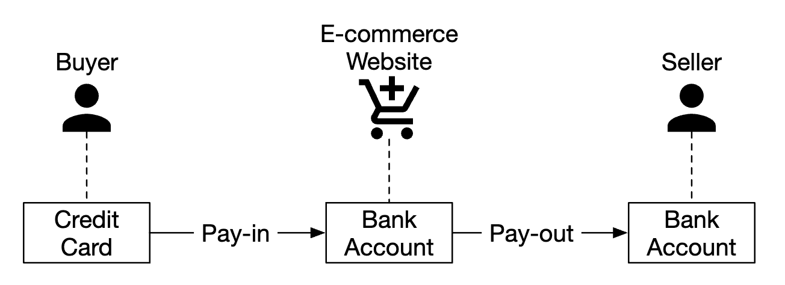
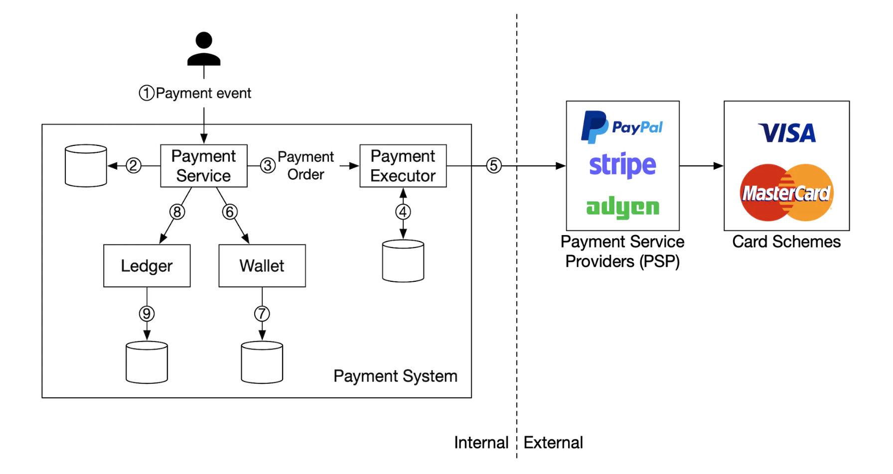
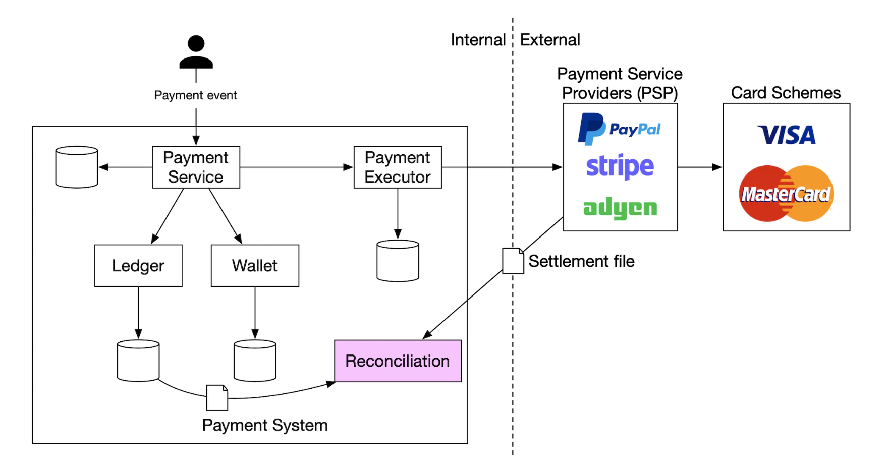
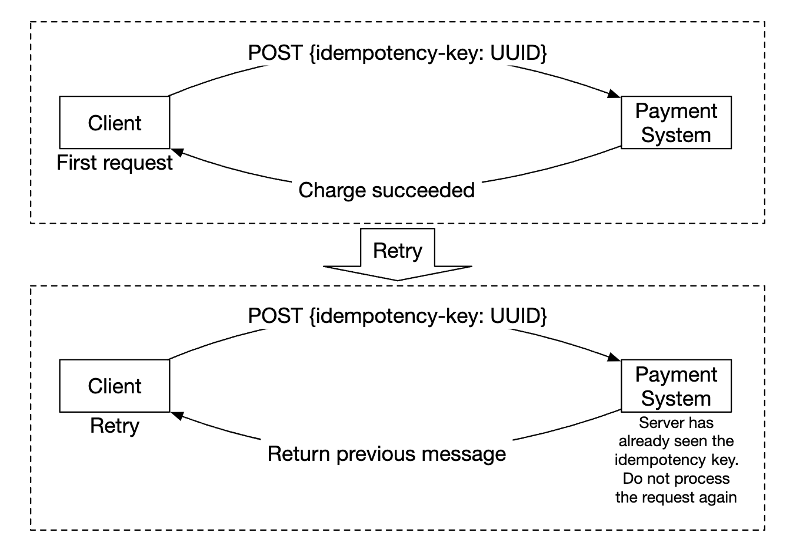

# 26. 设计支付系统

在本章中，我们将设计一个支付系统，它支撑着现代电子商务的所有运作。

支付系统用于结算金融交易，转移货币价值。

## 第一步：理解问题并确定设计范围

- **候选人**: 我们要构建什么类型的支付系统？
- **面试官**: 一个电商系统的支付后端，类似于 Amazon.com。它处理与资金流动相关的一切事务。
- **候选人**: 支持哪些支付方式？信用卡、PayPal、银行卡等？
- **面试官**: 系统应支持所有这些支付选项。面试中，我们可以假设只有信用卡支付。
- **候选人**: 我们是否自行处理信用卡操作？
- **面试官**: 不，我们使用像 Stripe、Braintree、Square 等第三方提供商。
- **候选人**: 我们是否在系统中存储信用卡数据？
- **面试官**: 由于合规要求，我们不会直接在系统中存储信用卡数据。我们依赖第三方支付处理方。
- **候选人**: 该应用程序是全球性的？我们需要支持不同的货币和国际支付吗？
- **面试官**: 该应用程序是全球性的，但在面试中我们假设只使用一种货币。
- **候选人**: 我们每天需要支持多少支付交易？
- **面试官**: 每天 100 万笔交易。
- **候选人**: 我们是否需要支持支付流程，比如每月向付款人支付款项？
- **面试官**: 是的，我们需要支持此功能。
- **候选人**: 还有什么我需要注意的吗？
- **面试官**: 我们需要支持与内部和外部系统的对账，以修正任何不一致之处。

### 功能需求

- 收款流程 - 支付系统代表商家接收来自客户的款项
- 支付流程 - 支付系统向全球的卖家发送款项

### 非功能性需求

- 可靠性和容错性。失败的支付需要谨慎处理。
- 需要设置内部和外部系统之间的对账机制。

### 粗略估算

系统需要处理每天 100 万笔交易，即每秒 10 笔交易。

这对于任何数据库系统来说并不算高吞吐量，因此并不是本次面试的重点。

## 第二步：提出高层次设计并获得认可

从高层次来看，系统中有三个参与资金流动的角色：



### 收款流程

以下是收款流程的高层次概述：



- 支付服务 - 接收支付事件并协调支付流程。它通常还会使用第三方提供商进行风险检查，以防止反洗钱（AML）违规或犯罪活动。
- 支付执行者 - 通过支付服务提供商（PSP）执行单笔支付订单。支付事件可能包含多个支付订单。
- 支付服务提供商（PSP） - 将款项从一个账户转移到另一个账户，例如，从买家的信用卡账户转到电商网站的银行账户。
- 信用卡组织 - 处理信用卡操作的组织，例如 Visa、MasterCard 等。
- 分类账 - 记录所有支付交易的财务记录。
- 钱包 - 记录所有商家的账户余额。

以下是一个收款流程示例：

- 用户点击“下单”并发送支付事件到支付服务。
- 支付服务将事件存储在其数据库中。
- 支付服务调用支付执行者来处理该支付事件中的所有支付订单。
- 支付执行者将支付订单存储在其数据库中。
- 支付执行者调用外部 PSP 来处理信用卡支付。
- 支付执行者处理完支付后，支付服务更新钱包以记录卖家拥有的款项。
- 钱包服务将更新的余额信息存储在其数据库中。
- 支付服务调用分类账记录所有资金流动。

### 支付服务 API

```
POST /v1/payments
{
  "buyer_info": {...},
  "checkout_id": "some_id",
  "credit_card_info": {...},
  "payment_orders": [{...}, {...}, {...}]
}
```

示例`payment_order`：

```
{
  "seller_account": "SELLER_IBAN",
  "amount": "3.15",
  "currency": "USD",
  "payment_order_id": "globally_unique_payment_id"
}
```

注意事项：

- `payment_order_id` 被转发给 PSP 以去重支付，即它是幂等性键。
- `amount` 字段是`string`，因为`double`不适合表示货币值。

```
GET /v1/payments/{:id}
```

此端点返回单个支付的执行状态，基于`payment_order_id`。

### 支付服务数据模型

我们需要维护两个表 - `payment_events` 和 `payment_orders`。

对于支付，性能通常不是一个重要因素。然而，强一致性很重要。

选择数据库时的其他考虑因素：

- 强大的数据库管理员市场，可以招聘数据库管理员来管理数据库
- 已被其他大型金融机构使用的证明记录
- 丰富的支持工具
- 传统 SQL 相比 NoSQL/NewSQL 更适合，因为它提供 ACID 保证

以下是 `payment_events` 表的内容：

- `checkout_id` - 字符串，主键
- `buyer_info` - 字符串（可能更合适的是使用外键链接到另一个表）
- `seller_info` - 字符串（同上）
- `credit_card_info` - 取决于卡提供商
- `is_payment_done` - 布尔值

以下是 `payment_orders` 表的内容：

- `payment_order_id` - 字符串，主键
- `buyer_account` - 字符串
- `amount` - 字符串
- `currency` - 字符串
- `checkout_id` - 字符串，外键
- `payment_order_status` - 枚举（`NOT_STARTED`、`EXECUTING`、`SUCCESS`、`FAILED`）
- `ledger_updated` - 布尔值
- `wallet_updated` - 布尔值

注意事项：

- 每个支付事件可能包含多个支付订单。
- 我们在收款流程中不需要 `seller_info`。它仅在支付流程中需要。
- `ledger_updated` 和 `wallet_updated` 在相应的服务调用时更新，用于记录支付结果。
- 支付状态转换由后台作业管理，后台作业检查未完成支付的更新，并在支付未在合理时间内处理时触发警报。

### 双重记账系统

双重记账机制是任何支付系统的核心。它通过始终将资金操作应用于两个账户来追踪资金流动，其中一个账户的余额增加（贷方），另一个账户的余额减少（借方）：

| 账户 | 借方 | 贷方 |
| ---- | ---- | ---- |
| 买方 | $1   |      |
| 卖方 |      | $1   |

所有交易条目的总和始终为零。这个机制提供了系统内所有资金流动的端到端可追溯性。

### 托管支付页面

为了避免存储信用卡信息并遵守各种严格的规定，大多数公司更倾向于利用由 PSP 提供的小部件，这些小部件会为你存储和处理信用卡支付：


### 支付流程

支付流程的组件与收款流程非常相似。

主要区别在于：

- 资金从电商网站的银行账户转移到商家的银行账户
- 我们可以使用第三方应付账款提供商，如 Tipalti
- 支付流程还需要处理大量的记账和合规要求

## 第三步：深入设计

本节关注于使系统更快、更稳健、更安全。

### PSP 集成

如果我们的系统可以直接连接到银行或信用卡组织，则可以直接进行支付，而不需要 PSP。
这种连接非常罕见，通常只有能够证明投资合理性的公司才会采用。

如果我们选择传统方式，PSP 可以通过以下两种方式集成：

- 通过 API，如果我们的支付系统可以收集支付信息
- 通过托管支付页面，以避免处理支付信息的规定

以下是托管支付页面工作流程：


- 用户点击浏览器中的“结账”按钮
- 客户端将支付订单信息传递给支付服务
- 在接收到支付订单信息后，支付服务向 PSP 发送支付注册请求。
- PSP 接收支付信息，如货币、金额、过期时间等，并获取一个用于幂等性目的的 UUID，通常是支付订单的 UUID。
- PSP 返回一个令牌，唯一标识该支付注册。该令牌存储在支付服务的数据库中。
- 存储令牌后，用户会被服务于 PSP 托管的支付页面。页面初始化时使用该令牌以及成功/失败的重定向 URL。
- 用户在 PSP 页面上填写支付信息，PSP 处理支付并返回支付状态。
- 用户随后被重定向回重定向 URL。例如，重定向 URL 为 `https://your-company.com/?tokenID=JIOUIQ123NSF&payResult=X324FSa`

- PSP 异步通过 webhook 调用我们的支付服务，通知后端支付结果。
- 支付服务根据收到的 webhook 记录支付结果。

### 对账

上一节解释了支付的正常路径。异常路径通过后台对账过程来检测并解决。

每晚，PSP 会发送结算文件，我们的系统使用该文件将外部系统的状态与我们内部系统的状态进行对比。



此过程也可用于检测分类账和钱包服务之间的内部不一致。

不匹配情况由财务团队手动处理。可以将不匹配情况处理为：

- 可分类的，即已知的不匹配情况，可以通过标准程序进行调整
- 可分类的，但无法自动处理。由财务团队手动调整
- 无法分类的。由财务团队手动调查并调整

### 处理支付处理延迟

有些情况下，支付可能需要几个小时才能完成，尽管通常只需要几秒钟。

这可能是由于以下原因：

- 支付被标记为高风险，需要人工审核
- 信用卡需要额外的保护措施，例如 3D 安全认证，需要持卡人提供额外信息来完成支付

这些情况的处理方式包括：

- 等待 PSP 发送 Webhook，告知支付已完成，或者如果 PSP 不提供 Webhook，则轮询其 API
- 显示“待处理”状态给用户，并提供一个页面，用户可以在该页面查看支付更新。支付完成后，我们还可以通过电子邮件通知他们

### 内部服务间的通信

服务间的通信模式有两种：同步和异步。

同步通信（即 HTTP）适用于小规模系统，但随着规模的增加，它会出现以下问题：

- 性能较差 - 请求响应周期较长，因为更多的服务参与到调用链中
- 失败隔离差 - 如果 PSP 或其他服务出现故障，用户将无法收到响应
- 紧耦合 - 发送方需要知道接收方
- 扩展性差 - 由于没有缓冲区，无法轻松应对突发流量的增加

异步通信可以分为两类。

单一接收者 - 多个接收者订阅同一主题，消息仅处理一次：


多个接收者 - 多个接收者订阅同一主题，但消息会转发给所有接收者：


后一种模型非常适合我们的支付系统，因为支付可以触发多个副作用，这些副作用由不同的服务处理。

简而言之，同步通信更简单，但不允许服务自主工作。异步通信则以可扩展性和弹性为代价，牺牲了简单性和一致性。

### 处理支付失败

每个支付系统都需要处理支付失败的情况。以下是我们将采用的一些机制：

- 跟踪支付状态 - 每当支付失败时，我们可以根据支付状态决定是否重试或退款。
- 重试队列 - 我们将重试的支付放入重试队列
- 死信队列 - 终止失败的支付会被推送到死信队列，在那里可以对失败的支付进行调试和检查。


### 精确一次交付

我们需要确保支付只被处理一次，以避免对客户进行双重收费。

当一个操作被执行“至少一次”和“最多一次”时，称该操作为精确一次。

为了实现至少一次的保证，我们将使用重试机制：


以下是一些常见的重试间隔策略：

- 立即重试 - 客户端在失败后立即发送另一个请求
- 固定间隔 - 等待固定时间后重试支付
- 增量间隔 - 每次重试之间逐步增加重试间隔
- 指数回退 - 每次重试之间的间隔加倍
- 取消 - 客户端取消请求。当错误是终止性错误或达到重试阈值时发生

作为经验法则，默认为指数回退重试策略。一个好的实践是，服务器通过`Retry-After`头指定重试间隔。

重试的一个问题是，服务器可能会重复处理支付：

- 客户端点击了“支付按钮”两次，因此被收取了两次费用
- 支付已被 PSP 成功处理，但下游服务（分类账、钱包）未处理。重试会导致 PSP 再次处理支付

为了解决双重支付问题，我们需要使用幂等性机制——一种操作多次应用时只处理一次的特性。

从 API 的角度来看，客户端可以多次调用，产生相同的结果。幂等性是通过请求中的特殊头（如`idempotency-key`，通常是一个 UUID）来管理的。



幂等性可以通过数据库的唯一键约束机制来实现：

- 服务器尝试在数据库中插入新行
- 由于唯一键约束冲突，插入失败
- 服务器检测到错误后，将现有对象返回给客户端

幂等性也应用在 PSP 端，使用前面讨论过的 nonce，PSP 会确保不会处理具有相同 nonce 的支付。

### 一致性

在支付生命周期中，有几个有状态的服务被调用——PSP、分类账、钱包、支付服务。

任何两种服务之间的通信都有可能失败。我们可以通过实现精确一次处理和对账来确保所有服务之间的最终数据一致性。

如果我们使用了复制，我们将不得不处理复制延迟，这可能导致用户观察到主数据库和副本数据库之间的数据不一致。

为了缓解这一问题，我们可以让所有读取和写入都来自主数据库，仅使用副本来进行冗余和故障转移。或者，我们可以利用共识算法，如 Paxos 或 Raft，确保副本始终同步。我们也可以使用基于共识的分布式数据库，如 YugabyteDB 或 CockroachDB。

### 支付安全

以下是我们可以使用的一些机制来确保支付安全：

- 请求/响应窃听 - 我们可以使用 HTTPS 来加密所有通信
- 数据篡改 - 强制加密和完整性监控
- 中间人攻击 - 使用 SSL 和证书钉扎
- 数据丢失 - 在多个地区复制数据并进行数据快照
- DDoS 攻击 - 实施流量限制和防火墙
- 卡片盗窃 - 使用令牌而不是存储真实的卡片信息
- PCI 合规性 - 处理品牌信用卡的组织需要遵循的安全标准
- 欺诈 - 地址验证、卡片验证值（CVV）、用户行为分析等

## 第四步：总结

其他讨论点：

- 监控与警报
- 调试工具 - 我们需要能够轻松理解为什么支付失败的工具
- 货币兑换 - 在设计国际支付系统时很重要
- 地理位置 - 不同地区可能有不同的支付方式
- 现金支付 - 在印度和巴西等地非常常见
- Google/Apple Pay 集成
