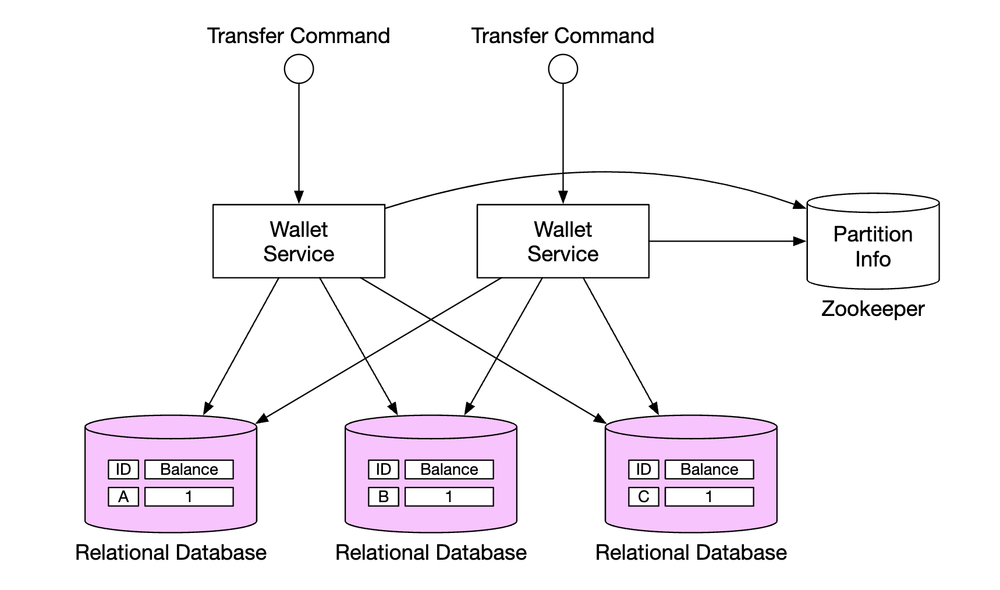
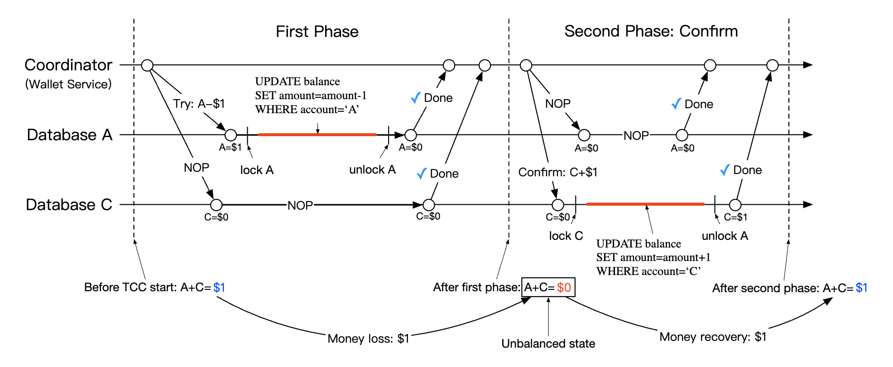
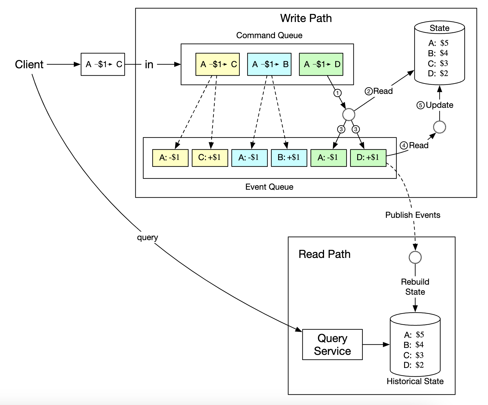
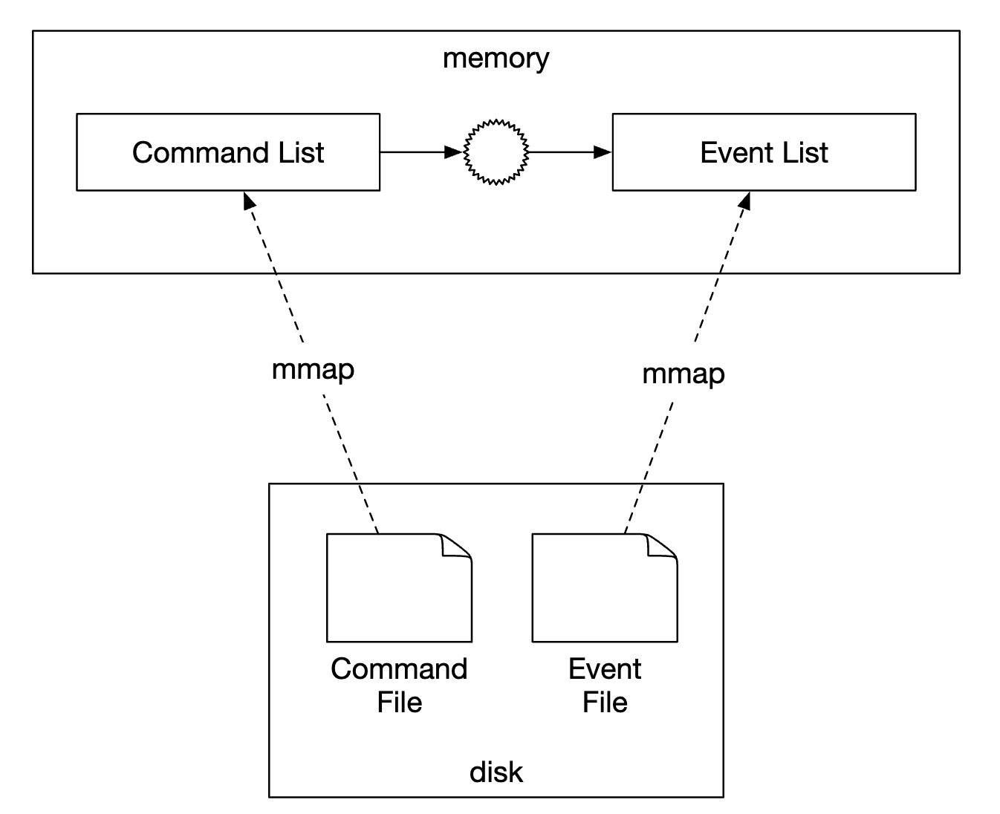

# 27. 设计数字钱包

支付平台通常提供钱包服务，允许客户在应用内存储资金，稍后可以提取这些资金。

您还可以使用它来支付商品和服务，或将钱转账给其他使用数字钱包服务的用户。这比通过传统支付通道进行支付可能更快且更便宜。


## 第一步：理解问题并确定设计范围

- **候选人**: 我们是否只关注数字钱包之间的转账？我们是否需要支持其他操作？
- **面试官**: 目前我们先集中在数字钱包之间的转账。
- **候选人**: 系统需要支持每秒多少笔交易？
- **面试官**: 假设是每秒 100 万笔交易（1mil TPS）。
- **候选人**: 数字钱包有严格的正确性要求。我们可以假设事务保证足够吗？
- **面试官**: 听起来不错。
- **候选人**: 我们需要证明正确性吗？
- **面试官**: 我们可以通过对账来做到这一点，但这只能发现不一致之处，而不能告诉我们不一致的根本原因。相反，我们希望能够从头开始重放数据，重建历史。
- **候选人**: 我们可以假设可用性要求是 99.99%吗？
- **面试官**: 是的。
- **候选人**: 我们需要考虑外汇吗？
- **面试官**: 不需要，这是超出范围的。

总结一下我们需要支持的内容：

- 支持两个账户之间的余额转账
- 支持 1 百万 TPS
- 可靠性为 99.99%
- 支持交易
- 支持可复现性

### 粗略估算

传统的关系型数据库在云端的部署可以支持大约 1000TPS。

为了达到 1 百万 TPS，我们需要 1000 个数据库节点。但如果每笔转账有两个步骤，我们实际上需要支持 200 万 TPS。

我们的一个设计目标是提高单个节点能处理的 TPS，从而减少数据库节点的数量。

| 每节点 TPS | 节点数量 |
| ---------- | -------- |
| 100        | 20,000   |
| 1,000      | 2,000    |
| 10,000     | 200      |

## 第二步：提出高级设计并获得认可

### API 设计

我们在面试中只需要支持一个端点：

```
POST /v1/wallet/balance_transfer - 从一个钱包转账余额到另一个钱包
```

请求参数：from_account、to_account、amount（使用字符串以避免丢失精度）、currency、transaction_id（幂等性键）。

示例响应：

```
{
    "status": "success",
    "transaction_id": "01589980-2664-11ec-9621-0242ac130002"
}
```

### 内存分片方案

我们的钱包应用为每个用户账户维护账户余额。

一个很好的数据结构是`map<user_id, balance>`，它可以使用内存中的 Redis 存储来实现。

由于单个 Redis 节点无法承受 100 万 TPS 的负载，我们需要将 Redis 集群分成多个节点。

示例分片算法：

```
String accountID = "A";
Int partitionNumber = 7;
Int myPartition = accountID.hashCode() % partitionNumber;
```

Zookeeper 可以用来存储分片数量和 Redis 节点地址，因为它是一个高可用的配置存储。

最后，钱包服务是一个无状态服务，负责执行转账操作。它可以轻松进行横向扩展：


虽然这个解决方案解决了可扩展性的问题，但它无法让我们执行原子级的余额转账。

### 分布式事务

处理事务的一种方法是使用两阶段提交协议（2PC），该协议建立在标准的分片关系型数据库之上：



以下是两阶段提交（2PC）协议的工作原理：


- 协调者（钱包服务）对多个数据库执行正常的读写操作。
- 当应用准备提交事务时，协调者要求所有数据库进行准备。
- 如果所有数据库回复“是”，协调者要求数据库提交事务。
- 否则，所有数据库都被要求中止事务。

2PC 方法的缺点：

- 由于锁竞争，性能较差
- 协调者是单点故障

### 使用尝试-确认/取消（TC/C）的分布式事务

TC/C 是 2PC 协议的一种变体，使用补偿事务：

- 协调者要求所有数据库为事务保留资源
- 协调者收集数据库的回复 - 如果是“是”，则要求数据库尝试确认。如果是“否”，则要求数据库尝试取消。

TC/C 和 2PC 之间的一个重要区别是，2PC 执行的是一个单一的事务，而 TC/C 有两个独立的事务。

TC/C 的工作方式分阶段如下：
| 阶段 | 操作 | A | C |
|-------|-------|-----|-----|
| 1 | 尝试 | 余额减少：-$1 | 什么都不做 |
| 2 | 确认 | 什么都不做 | 余额增加：+$1 |
| | 取消 | 余额增加：+$1 | 什么都不做 |

阶段 1 - 尝试：


- 协调者在 A 的数据库中启动本地事务，将 A 的余额减少 1 美元
- C 的数据库收到一个无操作（NOP）指令，不做任何事

阶段 2a - 确认：


- 如果两个数据库都回复“是”，则进入确认阶段。
- A 的数据库收到 NOP，而 C 的数据库被指示增加 C 的余额 1 美元（本地事务）

阶段 2b - 取消：


- 如果阶段 1 中的任何操作失败，则进入取消阶段。
- A 的数据库被指示增加 A 的余额 1 美元，C 的数据库收到 NOP。

以下是 2PC 和 TC/C 的比较：
| | 第一阶段 | 第二阶段：成功 | 第二阶段：失败 |
|-----------------|-----------------|---------------------|-----------------------|
| 2PC | 事务尚未完成 | 提交/取消所有事务 | 取消所有事务 |
| TC/C | 所有事务已完成 - 已提交或已取消 | 如有需要，执行新的事务 | 撤销已提交的事务 |

TC/C 也被称为通过补偿进行的分布式事务。高级操作在业务逻辑中处理。

TC/C 的其他特性：

- 与数据库无关，只要数据库支持事务
- 分布式事务的细节和复杂性需要在业务逻辑中处理

### TC/C 的故障模式

如果协调者在处理中断，它需要恢复其中间状态。
可以通过维护阶段状态表来实现这一点，这些表在数据库分片中进行原子更新：


该表包含什么内容：

- 分布式事务的 ID 和内容
- 尝试阶段的状态 - 未发送、已发送、收到回复
- 第二阶段的名称 - 确认或取消
- 第二阶段的状态
- 非顺序标志（稍后解释）

使用 TC/C 时的一个警告是，在分布式事务进行时，账户状态在短时间内会不一致：



只要我们始终从这种状态中恢复，并且用户不能利用中间状态进行操作（例如花费它），这种不一致是可以接受的。
这通过始终在增加余额之前执行扣款来保证。

| 尝试阶段选择   | 账户 A | 账户 C |
| -------------- | ------ | ------ |
| 选择 1         | -$1    | NOP    |
| 选择 2（无效） | NOP    | +$1    |
| 选择 3（无效） | -$1    | +$1    |

请注意，表中的选择 3 是无效的，因为我们无法保证跨不同数据库的事务的原子执行，除非依赖于 2PC。

一个需要处理的边缘情况是非顺序执行：


可能会发生数据库在接收到尝试操作之前，先接收到取消操作。这个边缘情况可以通过在阶段状态表中添加非顺序标志来处理。
当我们接收到尝试操作时，首先检查非顺序标志是否被设置，如果是，则返回失败。

### 使用 Saga 实现分布式事务

另一种流行的方法是使用 Saga，它是用于在微服务架构中实现分布式事务的标准。

它的工作原理如下：

- 所有操作按顺序执行。所有操作在各自的数据库中独立进行。
- 操作按顺序从第一个到最后一个执行。
- 当某个操作失败时，整个过程会开始回滚，直到最初的位置，并使用补偿操作来恢复。


我们如何协调工作流？有两种方法可供选择：

- 编排（Choreography） - 所有参与 Saga 的服务订阅相关事件并在 Saga 中执行各自的任务。
- 协调（Orchestration） - 一个单独的协调者指示所有服务按正确的顺序执行任务。

使用编排的挑战在于业务逻辑分散在多个服务中，并且它们之间是异步通信的。而协调方法能够很好地处理复杂性，因此通常在数字钱包系统中是首选的方法。

以下是 TC/C 和 Saga 的对比：

|                          | TC/C       | Saga           |
| ------------------------ | ---------- | -------------- |
| 补偿操作                 | 在取消阶段 | 在回滚阶段     |
| 中央协调                 | 是         | 是（协调模式） |
| 操作执行顺序             | 任意       | 线性           |
| 并行执行可能性           | 是         | 否（线性执行） |
| 可能会看到部分不一致状态 | 是         | 是             |
| 应用或数据库逻辑         | 应用       | 应用           |

主要区别在于 TC/C 是可并行的，因此我们的决策取决于延迟要求 - 如果需要实现低延迟，我们应该选择 TC/C 方法。

无论我们选择哪种方法，我们仍然需要支持审计和重放历史，以便从失败的状态中恢复。

### 事件溯源

在实际应用中，数字钱包应用可能会被审计，我们必须回答一些问题：

- 我们是否知道任何给定时刻的账户余额？
- 我们如何确保历史余额和当前余额是正确的？
- 如何证明在代码变更后系统逻辑仍然是正确的？

事件溯源是一种帮助我们回答这些问题的技术。

它包括四个概念：

- **命令**：来自现实世界的预期操作，例如将 1 美元从账户 A 转账到账户 B。由于需要全局顺序，命令被放入一个 FIFO 队列中。与事件不同，命令可能会失败，并且由于 IO 或无效状态等原因具有一定的随机性。
- **命令可以产生零个或多个事件**。
- **事件**：系统中发生的历史事实，例如“将 1 美元从 A 账户转账到 B 账户”。与命令不同，事件是已经发生在系统中的事实。
- **状态**：事件导致的系统状态变化。例如，账户和余额之间的键值存储。
- **状态机**：驱动事件溯源过程。它主要验证命令并应用事件以更新系统状态。状态机应该是确定性的，因此不应该读取外部 IO 或依赖随机性。


以下是事件溯源的动态视图：


对于我们的钱包服务，命令是余额转账请求。我们可以将它们放入 FIFO 队列，例如 Kafka：


这是完整的图景：


- 状态机从命令队列中读取命令。
- 从数据库中读取余额状态。
- 验证命令。如果有效，为每个账户生成两个事件。
- 读取下一个事件并应用，通过更新数据库中的余额（状态）。

使用事件溯源的主要优点是其可重现性。在此设计中，所有状态更新操作都作为不可变历史记录保存，记录所有余额变化。

通过重放事件，我们始终可以从头开始重建历史余额。
因为事件列表是不可变的，状态机是确定性的，我们可以保证成功重放任何中间状态。


通过依赖事件溯源，可以回答之前提到的所有审计相关问题：

- 我们是否知道任何给定时刻的账户余额？- 可以从开始重放事件，直到我们感兴趣的时间点。
- 我们如何确保历史和当前余额的正确性？- 通过从头开始重新计算所有事件来验证正确性。
- 如何证明在代码变更后系统逻辑仍然正确？- 我们可以使用不同版本的代码来处理事件，并验证它们的结果是否一致。

回答客户查询余额的问题可以通过 CQRS 架构来解决 - 可以有多个只读状态机，负责根据不可变事件列表查询历史状态：



## 第三步：深入设计

在本节中，我们将探讨一些性能优化，因为我们仍然需要扩展到 1 百万 TPS。

### 高性能事件溯源

我们将探讨的第一个优化是将命令和事件保存到本地磁盘存储，而不是像 Kafka 这样的外部存储。

这样可以避免网络延迟，而且由于我们仅进行追加操作，这对于硬盘（HDD）来说通常是快速的。

下一个优化是将最近的命令和事件缓存到内存中，以节省从磁盘加载它们的时间。

在低级别上，我们可以通过利用 mmap 命令来实现上述优化，它将数据存储在本地磁盘并缓存到内存中：



下一个优化是将状态存储到本地文件系统中，使用 SQLite（基于文件的本地关系数据库）。RocksDB 也是一个不错的选择。

对于我们的用途，我们将选择 RocksDB，因为它使用日志结构合并树（LSM），并优化了写操作。
通过缓存优化读取性能。


为了优化可重现性，我们可以定期将快照保存到磁盘，这样就不必每次从头开始重现给定的状态。我们可以将快照存储为分布式文件存储中的大型二进制文件，例如 HDFS：


### 可靠的高性能事件溯源

到目前为止做的所有优化都很好，但它们使我们的服务变得有状态。我们需要引入某种形式的复制，以确保可靠性。

在此之前，我们应该分析系统中哪些数据需要高可靠性：

- 状态和快照可以通过从事件列表重新生成来始终重新生成。因此，我们只需要确保事件列表的可靠性。
- 有人可能认为我们可以从命令列表重新生成事件列表，但这并不正确，因为命令是非确定性的。
- 结论是，我们只需要确保事件列表的高可靠性。

为了实现事件的高可靠性，我们需要将事件列表复制到多个节点。我们需要确保：

- 没有数据丢失。
- 日志文件中的数据相对顺序在副本中保持一致。

为了实现这一点，我们可以采用共识算法，例如 Raft。

在 Raft 中，有一个活跃的领导者和一些被动的追随者。如果领导者死亡，追随者中的一个将接管。
只要超过一半的节点正常运行，系统就会继续运行。


通过这种方式，所有节点根据事件列表更新状态。Raft 确保领导者和追随者拥有相同的事件列表。

### 分布式事件溯源

到目前为止，我们已经设计了一个高性能和可靠的单节点系统。

但我们仍然需要解决一些限制：

- 单个 Raft 组的容量有限。在某些时候，我们需要分片数据并实现分布式事务。
- 在 CQRS 架构中，请求/响应流是较慢的。客户端需要定期轮询系统，以了解钱包何时更新。

轮询不是实时的，因此用户可能需要等待一段时间才能知道余额的更新。此外，如果轮询频率过高，可能会对查询服务造成过载：


为了减轻系统负载，我们可以引入一个反向代理，代表用户发送命令并为他们轮询响应：


这可以减轻系统负载，因为我们可以通过单个请求为多个用户获取数据，但它仍然不能解决实时接收的需求。

我们可以做的最后一个更改是让只读状态机在更新可用时将响应推送回反向代理。这可以让用户感觉到更新是实时发生的：


最后，为了进一步扩展系统，我们可以将系统分片成多个 Raft 组，并使用 TC/C 或 Saga 在它们之上实现分布式事务：


以下是我们最终系统中余额转账请求的生命周期示例：

- 用户 A 向 Saga 协调器发送一个分布式事务，包含两个操作 - `A-1` 和 `C+1`。
- Saga 协调器在阶段状态表中创建一条记录，以追踪事务的状态。
- 协调器确定需要将命令发送到哪些分区。
- 分区 1 的 Raft 领导者接收 `A-1` 命令，验证它，将其转换为事件并在 Raft 组中的其他节点上复制。
- 事件结果同步到读取状态机，状态机将响应推送回协调器。
- 协调器创建一条记录，表示操作成功，并继续执行下一个操作 `C+1`。
- 下一个操作与第一个操作相似执行 - 确定分区，发送命令，执行，读取状态机推送响应。
- 协调器创建一条记录，表示操作 2 也成功，并最终通知客户端结果。

## 第四步：总结

以下是我们设计的演进过程：

- 我们从使用内存中的 Redis 开始。这个方法的问题是它不是持久化存储。
- 我们转向使用关系型数据库，并在其上使用 2PC、TC/C 或分布式 Saga 执行分布式事务。
- 接着，我们引入事件溯源，以便让所有操作可审计。
- 我们最初将数据存储到外部存储中，使用外部数据库和队列，但这种方法性能不佳。
- 我们继续将数据存储到本地文件存储中，利用追加操作的性能。我们还使用缓存来优化读取路径。
- 尽管前一种方法性能很好，但它不是持久的。因此，我们引入了 Raft 共识与复制，以避免单点故障。
- 我们还采用了 CQRS 和反向代理，代表我们的用户管理事务生命周期。
- 最后，我们将数据分片到多个 Raft 组中，并在其上使用分布式事务机制 - TC/C 或分布式 Saga 进行协调。
