# 28. 设计股票交易所

在这一章，我们将设计一个电子股票交易所。

其基本功能是高效地匹配买卖双方。

主要的股票交易所有纽约证券交易所（NYSE）、纳斯达克（NASDAQ）等。


## 第一步：理解问题并确定设计范围

- **候选人**: 我们将交易哪些证券？股票、期权还是期货？
- **面试官**: 为了简化起见，只交易股票。
- **候选人**: 支持哪些订单类型？下单、撤单、替换？限价单、市场单、条件单如何处理？
- **面试官**: 我们需要支持下单和撤单。订单类型只考虑限价单。
- **候选人**: 系统需要支持盘后交易吗？
- **面试官**: 不需要，只支持正常交易时间。
- **候选人**: 你能描述一下交易所的基本功能吗？
- **面试官**: 客户可以下单或撤单，并实时接收匹配的交易。他们应该能够实时查看订单簿。
- **候选人**: 交易所的规模如何？
- **面试官**: 数万名用户同时交易，约 100 种证券符号。每天数十亿个订单。我们还需要支持风险检查以确保合规性。
- **候选人**: 需要什么样的风险检查？
- **面试官**: 做简单的风险检查——例如限制用户每天只能交易 100 万股苹果股票。
- **候选人**: 用户钱包如何管理？
- **面试官**: 我们需要确保客户在下单之前有足够的资金。用于挂单的资金需要被暂时扣留，直到订单完成。

### 非功能性需求

面试官提到的规模表明我们要设计一个小到中型的交易所。
我们还需要确保灵活性，以支持未来更多的证券和用户。

其他非功能性需求：

- 可用性 - 至少 99.99%。停机时间可能会影响声誉。
- 容错性 - 需要容错能力和快速恢复机制，以限制生产事件的影响。
- 延迟 - 往返延迟应控制在毫秒级别，重点关注 99 百分位。如果 99 百分位延迟持续过高，会导致少数用户体验不佳。
- 安全性 - 我们需要有账户管理系统。为了法律合规，我们需要支持 KYC（了解你的客户）来验证用户身份。我们还应防范 DDoS 攻击以保护公共资源。

### 初步估算

- 100 个证券符号，每天 10 亿个订单
- 正常交易时间为 09:30 至 16:00（6.5 小时）
- 每秒查询次数（QPS） = 10 亿 / 6.5 / 3600 = 43000
- 峰值 QPS = 5 \* QPS = 215000
- 当市场开盘时，交易量显著增加

## 第二步：提出高层设计并获得批准

### 商业知识基础

让我们讨论一些与交易所相关的基本概念。

经纪人充当交易所与终端用户之间的中介 - 例如 Robinhood、Fidelity 等。

机构客户使用专业的交易软件进行大量交易。它们需要专门的处理。
例如，在大宗交易时进行订单拆分，以避免对市场造成影响。

订单类型：

- 限价单 - 以固定价格买入或卖出。可能无法立即找到匹配的对手单，或者可能部分匹配。
- 市价单 - 不指定价格。立即以当前市场价格执行。

价格：

- 买价（Bid） - 买方愿意买入股票的最高价格。
- 卖价（Ask） - 卖方愿意卖出股票的最低价格。

美国市场有三级报价 - L1、L2、L3。

L1 市场数据包含最佳买入/卖出价格和数量：

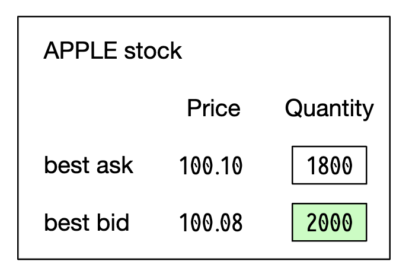

L2 包含更多的价格层次：


L3 显示每个价格层级的排队数量：

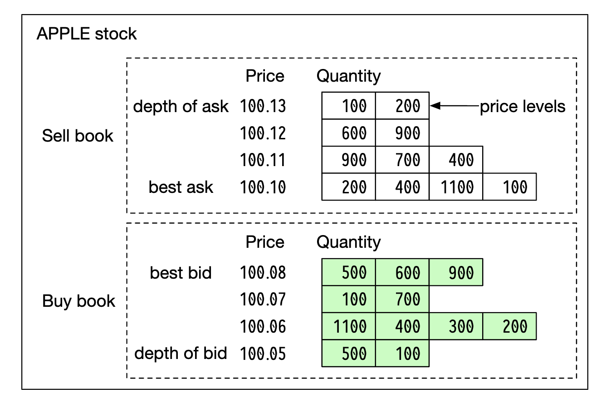

蜡烛图显示市场的开盘价和收盘价，以及给定区间内的最高价和最低价：


FIX 是用于交换证券交易信息的协议，大多数供应商都使用它。一个证券交易示例：

```
8=FIX.4.2 | 9=176 | 35=8 | 49=PHLX | 56=PERS | 52=20071123-05:30:00.000 | 11=ATOMNOCCC9990900 | 20=3 | 150=E | 39=E | 55=MSFT | 167=CS | 54=1 | 38=15 | 40=2 | 44=15 | 58=PHLX EQUITY TESTING | 59=0 | 47=C | 32=0 | 31=0 | 151=15 | 14=0 | 6=0 | 10=128 |
```

### 高层设计

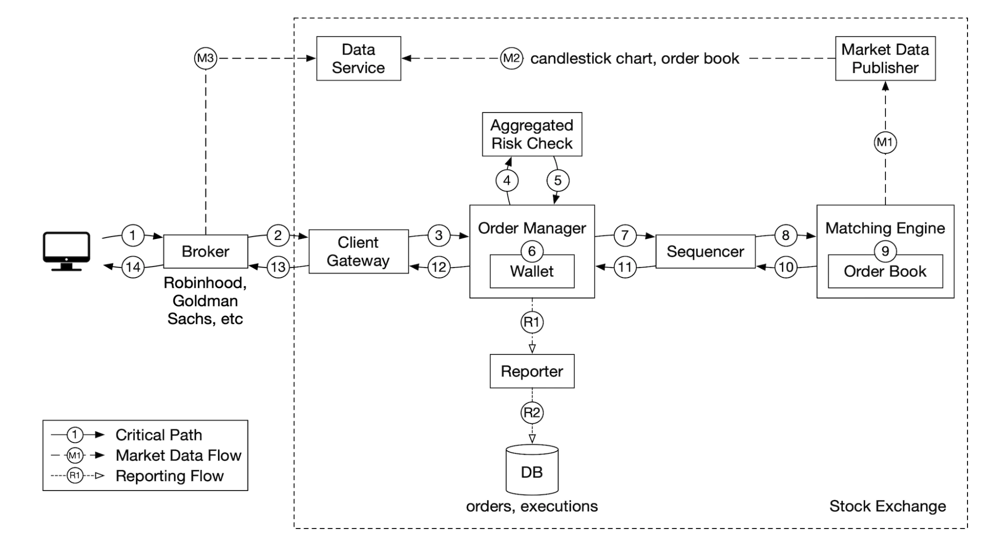

交易流程：

- 客户通过交易界面下单。
- 经纪人将订单发送到交易所。
- 订单通过客户端网关进入交易所，网关验证、限流、身份验证等。订单被转发到订单管理器。
- 订单管理器根据风险经理设置的规则执行风险检查。
- 风险检查通过后，订单管理器验证客户账户是否有足够的资金来执行该订单。
- 订单被发送到匹配引擎。当找到匹配时，匹配引擎会为买卖双方发出两个执行（称为“成交”）。两个订单按照确定的顺序排列。
- 执行结果返回给客户。

市场数据流（M1-M3）：

- 匹配引擎生成执行流，并发送到市场数据发布者。
- 市场数据发布者构建蜡烛图并将其发送到数据服务。
- 市场数据存储在专用存储中以供实时分析。经纪人连接到数据服务以获取及时的市场数据。

报告流（R1-R2）：

- 报告生成器收集订单和执行所需的所有字段，并将其写入数据库。
- 报告字段包括：client_id、价格、数量、订单类型、已执行数量、剩余数量。

交易流程在关键路径上，其他流程不在关键路径上，因此它们的延迟要求不同。

### 交易流程

交易流程在关键路径上，因此应该针对低延迟进行高度优化。

匹配引擎是核心部分，也叫做交叉引擎。主要职责包括：

- 维护每个证券的订单簿 - 即证券的买卖订单列表。
- 匹配买卖订单 - 匹配会产生两个执行（成交），分别对应买方和卖方。此功能必须快速且准确。
- 分发执行流作为市场数据。
- 匹配必须按确定的顺序生成。这是高可用性的基础。

接下来是顺序生成器 - 它是使匹配引擎具有确定性的关键组件，通过为每个进站订单和出站成交标记一个序列 ID。


我们为进站订单和出站成交标记序列 ID 的原因有几个：

- 时效性和公平性
- 快速恢复/重放
- 精确一次保证

从概念上讲，我们可以使用 Kafka 作为顺序生成器，因为它本质上是一个进站和出站的消息队列。然而，为了实现更低的延迟，我们将自己实现这个功能。

订单管理器管理订单的状态。它还与匹配引擎交互 - 发送订单并接收成交结果。

订单管理器的职责：

- 发送订单进行风险检查 - 例如验证用户的交易量是否少于 100 万股。
- 检查订单与用户钱包，并验证是否有足够的资金来执行该订单。
- 它将订单发送到顺序生成器，并传递到匹配引擎。为了减少带宽消耗，仅传递必要的订单信息给匹配引擎。
- 执行结果（成交）从顺序生成器返回，然后通过客户端网关发送给经纪人。

实现订单管理器的主要挑战是状态转换管理。事件溯源（Event Sourcing）是一种可行的解决方案（将在深度分析中讨论）。

最后，客户端网关接收来自用户的订单并将其发送到订单管理器。它的职责是：

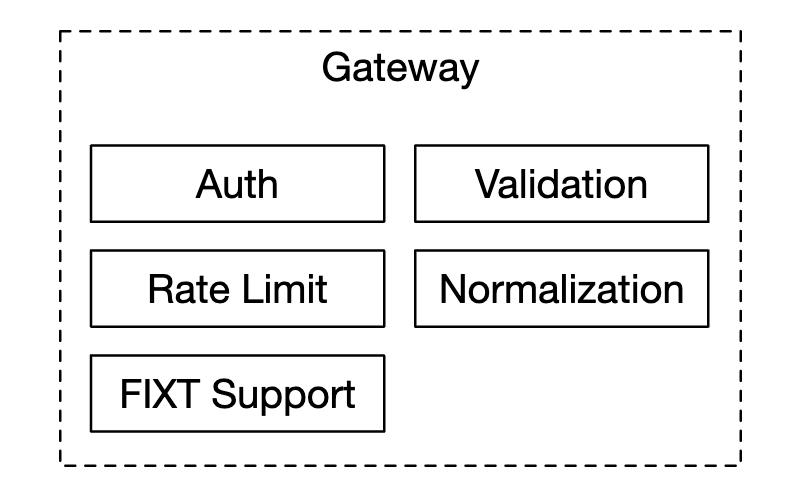

由于客户端网关在关键路径上，它应该保持轻量级。

不同客户可能有多个客户端网关。例如，colo 引擎是一个交易引擎服务器，由经纪人在交易所的数据中心租用：


### 市场数据流

市场数据发布者从匹配引擎接收执行流，并根据执行流构建订单簿/蜡烛图。

该数据发送到数据服务，数据服务负责将汇总的数据展示给订阅者：


### 报告流

报告生成器不在关键路径上，但它仍然是一个重要的组件。


它负责交易历史、税务报告、合规性报告、结算等。
报告流对延迟的要求不高。准确性和合规性更为重要。

### API 设计

客户通过经纪人与股票交易所互动，进行下单、查看成交、市场数据、下载历史数据进行分析等操作。

我们使用 RESTful API 实现客户端网关和经纪人之间的通信。

对于机构客户，我们使用专有协议以满足其低延迟要求。

创建订单：

```
POST /v1/order
```

参数：

- symbol - 股票符号。字符串
- side - 买入或卖出。字符串
- price - 限价单价格。长整型
- orderType - 限价单或市价单（在我们的设计中仅支持限价单）。字符串
- quantity - 订单数量。长整型

响应：

- id - 订单 ID。长整型
- creationTime - 订单的系统创建时间。长整型
- filledQuantity - 已成功执行的数量。长整型
- remainingQuantity - 尚未执行的数量。长整型
- status - 新建/已取消/已完成。字符串
- 其余属性与输入参数相同

获取成交：

```
GET /execution?symbol={:symbol}&orderId={:orderId}&startTime={:startTime}&endTime={:endTime}
```

参数：

- symbol - 股票符号。字符串
- orderId - 订单 ID。可选。字符串
- startTime - 查询起始时间（时间戳）。长整型
- endTime - 查询结束时间（时间戳）。长整型

响应：

- executions - 包含每个成交的数组（见下方属性）。数组
- id - 成交 ID。长整型
- orderId - 订单 ID。长整型
- symbol - 股票符号。字符串
- side - 买入或卖出。字符串
- price - 成交价格。长整型
- orderType - 限价单或市价单。字符串
- quantity - 已成交数量。长整型

获取订单簿：

```
GET /marketdata/orderBook/L2?symbol={:symbol}&depth={:depth}
```

参数：

- symbol - 股票符号。字符串
- depth - 订单簿的深度。整数

响应：

- bids - 包含价格和数量的数组。数组
- asks - 包含价格和数量的数组。数组

获取蜡烛图数据：

```
GET /marketdata/candles?symbol={:symbol}&resolution={:resolution}&startTime={:startTime}&endTime={:endTime}
```

参数：

- symbol - 股票符号。字符串
- resolution - 蜡烛图的时间窗口长度（秒）。长整型
- startTime - 窗口的起始时间（时间戳）。长整型
- endTime - 窗口的结束时间（时间戳）。长整型

响应：

- candles - 包含每根蜡烛图数据的数组（见下方属性）。数组
- open - 每根蜡烛图的开盘价。双精度浮点型
- close - 每根蜡烛图的收盘价。双精度浮点型
- high - 每根蜡烛图的最高价。双精度浮点型
- low - 每根蜡烛图的最低价。双精度浮点型

### 数据模型

我们的交易所中有三种主要的数据类型：

- 产品、订单、成交
- 订单簿
- 蜡烛图

### 产品、订单、成交

产品描述了交易符号的属性——产品类型、交易符号、UI 显示符号等。

这些数据变化不频繁，主要用于在 UI 中渲染。

订单代表一个买/卖的指令。成交是已匹配的结果。

以下是数据模型：

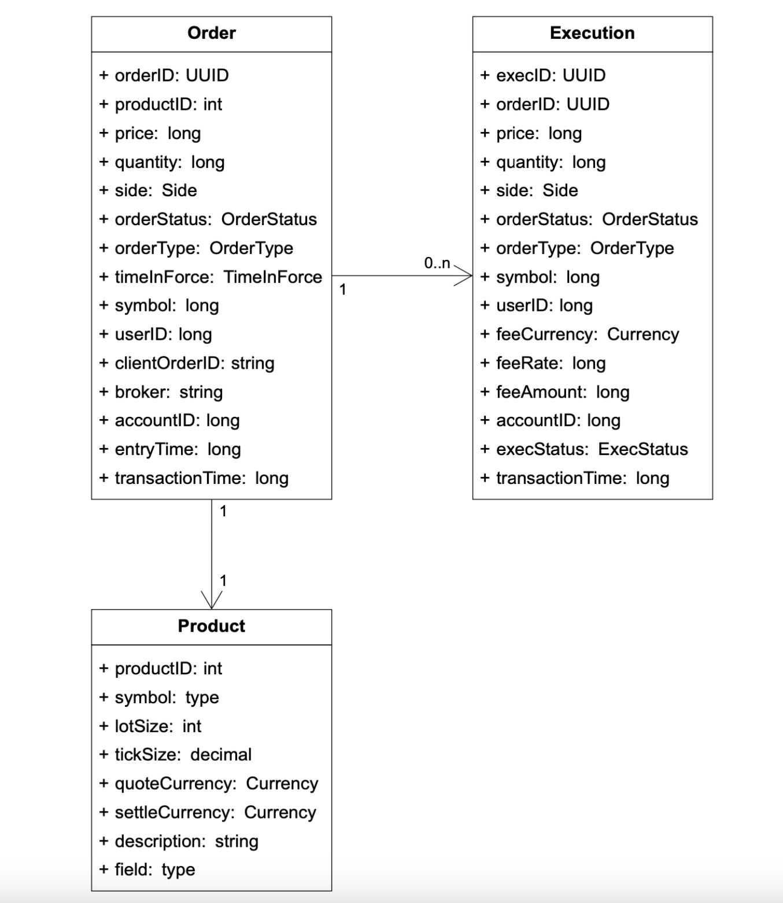

我们在三个流程中都遇到订单和成交：

- 在关键路径中，它们在内存中处理以确保高性能。它们被存储并从序列生成器恢复。
- 报告器将订单和成交写入数据库以供报告使用。
- 成交会转发到市场数据服务，以重建订单簿和蜡烛图。

### 订单簿

订单簿是按照价格等级组织的买/卖订单列表。

这个模型的高效数据结构需要满足以下要求：

- 常数查找时间——获取某个价格等级的成交量或在价格等级之间查询。
- 快速的添加/执行/撤单操作。
- 查询最佳买价/卖价。
- 迭代价格等级。

示例订单簿执行：

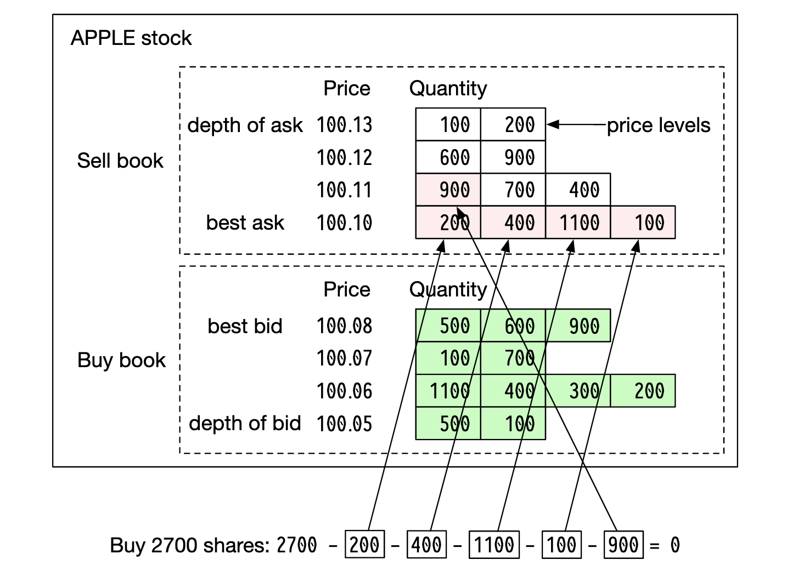

执行这个大订单后，价格上涨，因为买卖价差扩大。

订单簿实现的伪代码示例：

```
class PriceLevel{
    private Price limitPrice;
    private long totalVolume;
    private List<Order> orders;
}

class Book<Side> {
    private Side side;
    private Map<Price, PriceLevel> limitMap;
}

class OrderBook {
    private Book<Buy> buyBook;
    private Book<Sell> sellBook;
    private PriceLevel bestBid;
    private PriceLevel bestOffer;
    private Map<OrderID, Order> orderMap;
}
```

为了实现更高效的操作，我们可以使用双向链表而不是标准列表：

- 下新单的时间是 O(1)，因为我们将订单添加到链表尾部。
- 匹配订单的时间是 O(1)，因为我们从链表头部删除订单。
- 撤单意味着从订单簿中删除订单。我们利用 `orderMap` 实现 O(1) 查找和 O(1) 删除（因为 `Order` 中包含对列表前一个元素的引用）。

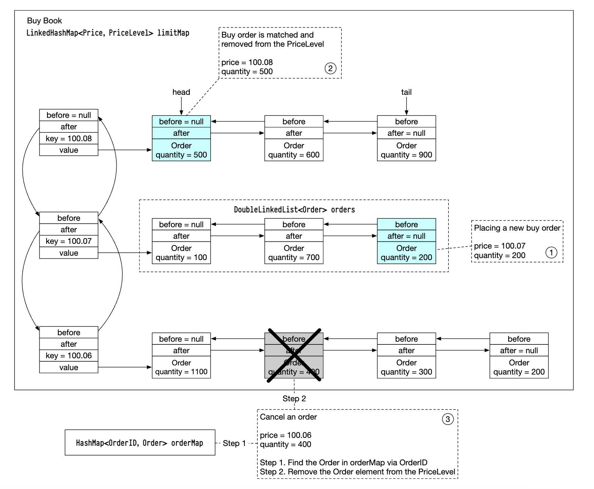

这个数据结构也用于市场数据服务中，以重建订单簿。

### 蜡烛图

蜡烛图数据通过市场数据服务在一个时间间隔内基于订单处理来计算：

```
class Candlestick {
    private long openPrice;
    private long closePrice;
    private long highPrice;
    private long lowPrice;
    private long volume;
    private long timestamp;
    private int interval;
}

class CandlestickChart {
    private LinkedList<Candlestick> sticks;
}
```

为避免过多占用内存，可以做一些优化：

- 使用预分配的环形缓冲区来存储蜡烛图数据，减少分配次数。
- 限制内存中蜡烛图的数量，剩余的持久化存储到磁盘。

我们将使用内存中的列式数据库（例如 KDB）进行实时分析。市场收盘后，数据将持久化到历史数据库中。

## 第三步：深入设计

现代交易所有一个有趣的特点——与大多数其他软件不同，它们通常将一切都运行在一个巨大的服务器上。

让我们深入探索这些细节。

### 性能

对于交易所来说，保持所有百分位的良好延迟至关重要。

我们如何降低延迟？

- 减少关键路径上的任务数量。
- 通过减少网络/磁盘使用和/或缩短任务执行时间来缩短每个任务的时间。

为了实现第一个目标，我们将关键路径上的所有多余职责去除，甚至日志记录也被移除以实现最佳延迟。

如果我们沿用原始设计，可能会有几个瓶颈——服务之间的网络延迟和序列生成器的磁盘使用。

通过这样的设计，我们可以实现几十毫秒的端到端延迟。我们希望达到的是几十微秒的延迟。

因此，我们将一切放到一台服务器上，进程之间通过 mmap 进行通信，作为事件存储：

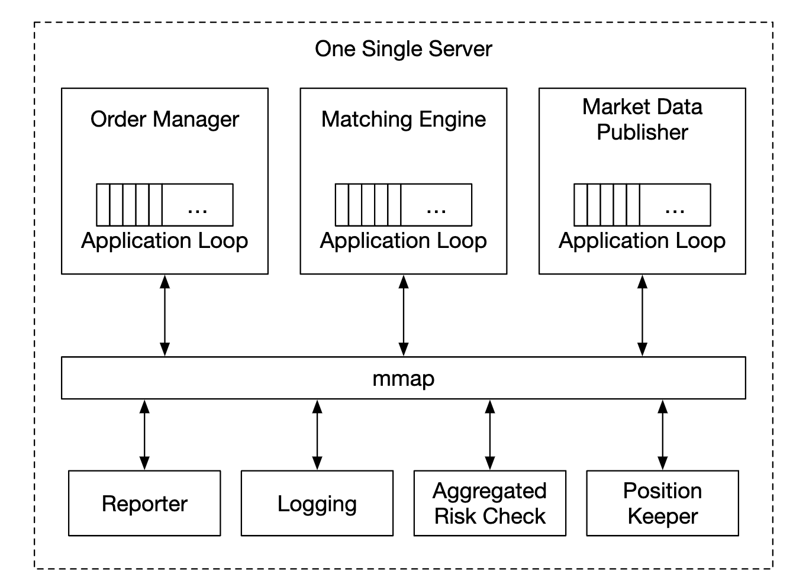

另一种优化方法是使用应用循环（一个执行关键任务的 while 循环），将其固定在同一个 CPU 上，以避免上下文切换：


使用应用循环的另一个副作用是没有锁争用——多个线程不再为争夺同一个资源而竞争。

现在让我们探索 mmap 的工作原理——它是一个 UNIX 系统调用，将磁盘上的文件映射到应用程序的内存中。

我们可以使用的一个技巧是将文件创建在 `/dev/shm` 中，代表“共享内存”。因此，我们完全不需要磁盘访问。

### 事件溯源

事件溯源在[数字钱包章节](./47_digital_wallet.md)中有详细讨论。可以参考其中的所有细节。

简而言之，事件溯源不是存储当前状态，而是存储不可变的状态转换：

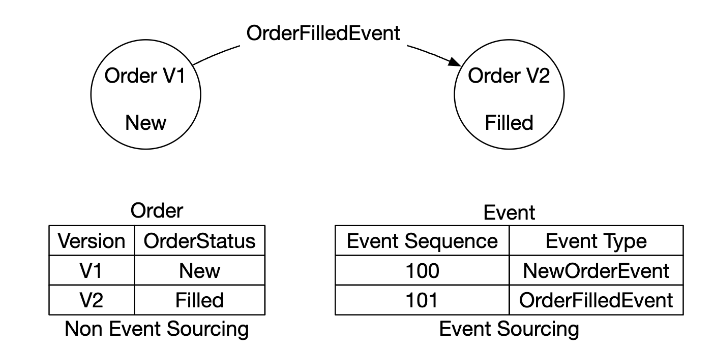

- 左侧 - 传统架构
- 右侧 - 事件源架构

到目前为止，我们的设计如下：


- 外部域通过 FIX 协议与我们的客户端网关交互
- 订单管理器接收新的订单事件，验证并将其添加到内部状态。订单随后被发送到匹配核心
- 如果订单被匹配，

`OrderFilledEvent` 会被生成并通过 mmap 发送

- 其他组件订阅事件存储并执行他们的处理任务

另一个优化 - 所有组件持有订单管理器的副本，这个副本作为库打包，以避免额外的订单管理调用。

在这个设计中，序列生成器不再是事件存储，而是成为一个单一的写入者，先对事件进行排序，然后将其转发到事件存储：

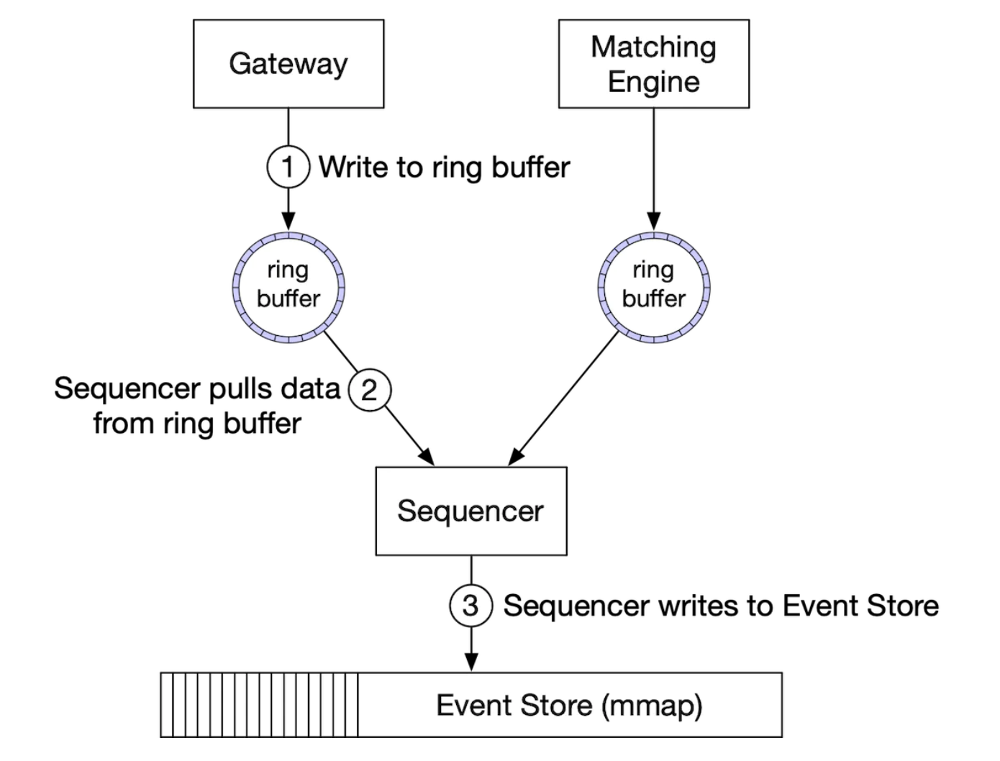

### 高可用性

我们的目标是 99.99% 的可用性——每天只有 8.64 秒的停机时间。

为了实现这一目标，我们必须识别交易所架构中的单点故障：

- 为关键服务（例如匹配引擎）设置备份实例，并保持待命
- 积极自动化故障检测，并将故障转移到备份实例

像客户端网关这样的无状态服务可以通过增加更多的服务器来水平扩展。

对于有状态组件，我们可以处理入站事件，但如果我们不是领导者，则无法发布出站事件：

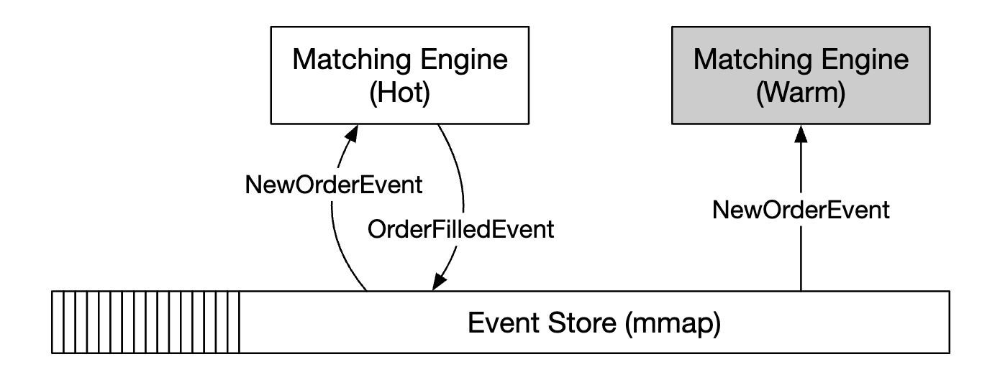

为了检测主副本故障，我们可以通过发送心跳信号来检测它是否不可用。

该机制仅在单台服务器的边界内工作。如果我们希望扩展它，可以将整个服务器设置为热备份/冷备份实例，发生故障时进行故障转移。

为了在多个副本之间复制事件存储，我们可以使用可靠的 UDP 进行更快速的通信。

### 故障容忍

如果即使热备份实例也发生故障怎么办？这是一个低概率事件，但我们应该为此做好准备。

大型技术公司通过将核心数据复制到多个城市的数据中心来解决这个问题，以应对自然灾害等情况。

需要考虑的问题：

- 如果主实例发生故障，我们如何以及何时进行故障转移？
- 如何在备份实例中选择领导者？
- 需要多长时间才能恢复（RTO - 恢复时间目标）？
- 需要恢复哪些功能？我们的系统在降级条件下能否继续运行？

如何应对这些问题：

- 系统可能由于错误（影响主副本和副本）而停机，我们可以使用混沌工程来发现这些边缘情况和灾难性后果。
- 起初，我们可以手动执行故障转移，直到我们收集足够的关于系统故障模式的信息。
- 可以使用领导者选举算法（如 Raft）来确定主副本故障时哪个副本成为领导者。

不同服务器间复制的示例：


领导者选举期间的术语示例：


有关 Raft 工作原理的详细信息，[请参阅这里](https://thesecretlivesofdata.com/raft/)

最后，我们还需要考虑数据丢失容忍度——我们能在数据丢失前丧失多少数据？  
这将决定我们备份数据的频率。

对于股票交易所来说，数据丢失是不可接受的，因此我们必须频繁备份数据，并依赖 Raft 的复制来减少数据丢失的概率。

### 匹配算法

稍微偏离一下，介绍一下匹配是如何通过伪代码工作的：

```
Context handleOrder(OrderBook orderBook, OrderEvent orderEvent) {
    if (orderEvent.getSequenceId() != nextSequence) {
        return Error(OUT_OF_ORDER, nextSequence);
    }

    if (!validateOrder(symbol, price, quantity)) {
        return ERROR(INVALID_ORDER, orderEvent);
    }

    Order order = createOrderFromEvent(orderEvent);
    switch (msgType):
        case NEW:
            return handleNew(orderBook, order);
        case CANCEL:
            return handleCancel(orderBook, order);
        default:
            return ERROR(INVALID_MSG_TYPE, msgType);

}

Context handleNew(OrderBook orderBook, Order order) {
    if (BUY.equals(order.side)) {
        return match(orderBook.sellBook, order);
    } else {
        return match(orderBook.buyBook, order);
    }
}

Context handleCancel(OrderBook orderBook, Order order) {
    if (!orderBook.orderMap.contains(order.orderId)) {
        return ERROR(CANNOT_CANCEL_ALREADY_MATCHED, order);
    }

    removeOrder(order);
    setOrderStatus(order, CANCELED);
    return SUCCESS(CANCEL_SUCCESS, order);
}

Context match(OrderBook book, Order order) {
    Quantity leavesQuantity = order.quantity - order.matchedQuantity;
    Iterator<Order> limitIter = book.limitMap.get(order.price).orders;
    while (limitIter.hasNext() && leavesQuantity > 0) {
        Quantity matched = min(limitIter.next.quantity, order.quantity);
        order.matchedQuantity += matched;
        leavesQuantity = order.quantity - order.matchedQuantity;
        remove(limitIter.next);
        generateMatchedFill();
    }
    return SUCCESS(MATCH_SUCCESS, order);
}
```

该匹配算法使用了 FIFO 算法来确定在某个价格等级下哪些订单进行匹配。

### 确定性

通过我们使用的序列生成器技术，功能性确定性得到了保证。

事件发生的实际时间并不重要：


延迟确定性是我们必须追踪的内容。我们可以基于监控 99 或 99.99 百分位的延迟来进行计算。

可能导致延迟峰值的因素包括垃圾回收事件，例如 Java 中的垃圾回收。

### 市场数据发布优化

市场数据发布器接收匹配引擎的匹配结果，并基于这些结果重建订单簿和蜡烛图。

由于我们没有无限的内存，我们只保存部分蜡烛图。客户端可以选择所需的粒度信息。更高的粒度可能需要更高的费用：

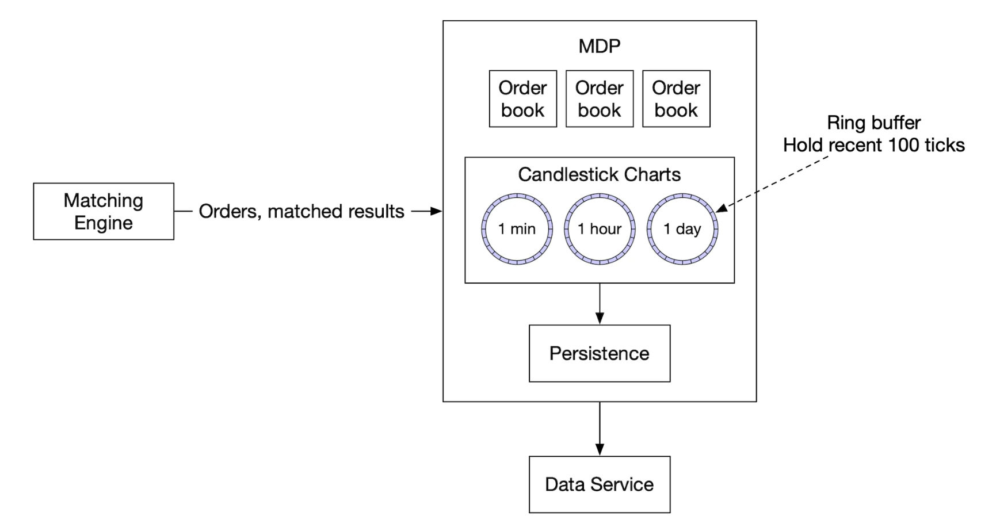

环形缓冲区（即圆形缓冲区）是一个固定大小的队列，队头连接到队尾。空间是预分配的，以避免分配。该数据结构也是无锁的。

优化环形缓冲区的另一种技术是填充，这可以确保序列号永远不会与其他内容处于同一个缓存行中。

### 市场数据的分发公平性和多播

我们需要确保所有订阅者在相同时间接收到数据，因为如果某一个订阅者比其他订阅者先接收到数据，这将给予他们至关重要的市场洞察力，他们可以利用这些洞察力来操纵市场。

为了实现这一点，我们可以在向订阅者发布数据时使用多播并采用可靠的 UDP 协议。

数据可以通过互联网有三种传输方式：

- 单播 - 一个源，一个目的地
- 广播 - 一个源到整个子网络
- 多播 - 一个源到不同子网络上的一组主机

理论上，通过使用多播，所有订阅者应该在相同的时间接收到数据。

然而，UDP 是不可靠的，数据可能无法到达每个订阅者。但它可以通过重传来增强可靠性。

### 服务器共址

交易所为经纪人提供了将服务器与交易所放置在同一数据中心的能力。

这大大降低了延迟，并且可以视为一种 VIP 服务。

### 网络安全

DDoS 攻击对交易所来说是一个挑战，因为有些服务是面向互联网的。以下是我们的应对选项：

- 将公共服务和数据与私有服务隔离，以确保 DDoS 攻击不会影响最重要的客户端
- 使用缓存层存储更新不频繁的数据
- 加强 URL 的抗 DDoS 能力，例如偏好使用 `https://my.website.com/data/recent` 而不是 `https://my.website.com/data?from=123&to=456`，因为前者更容易缓存
- 需要有效的白名单/黑名单机制
- 使用限速来减轻 DDoS 攻击的影响

## 第四步：总结

其他有趣的注意事项：

- 并非所有交易所都依赖于将所有内容放置在一台大服务器上，但有些交易所依然采用这种方式
- 现代交易所更多地依赖于云基础设施，并且使用自动化市场制造商（AMM）来避免维护订单簿
